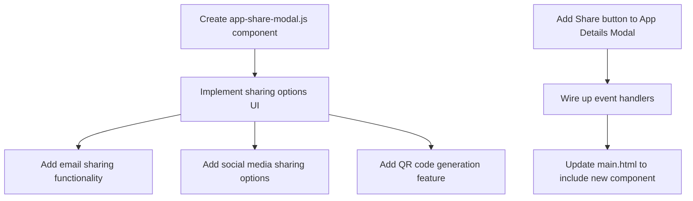
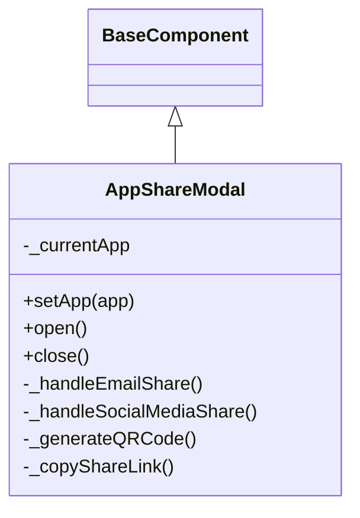

# App Sharing Implementation Plan

## Current Understanding

The Lahat app is an Electron-based desktop application that allows users to create, manage, and run mini apps. The existing codebase:

1. Uses web components for UI elements
2. Has a modal system for displaying app details
3. Already has app export functionality, which could be extended for sharing
4. Uses a component-based architecture with well-defined patterns

## Implementation Plan

### 1. Create a New Sharing Component

First, we'll create a new web component for the sharing UI:

### 2. Component Structure

The sharing component will be structured as follows:

### 3. Files to Create/Modify

1. **New Component**: `components/ui/modals/app-share-modal.js`
   - Create a new modal component with sharing options
   - Implement email, social media, and QR code sharing UI
   - Add event handlers for each sharing method

2. **Update Existing Component**: `components/ui/modals/app-details-modal.js`
   - Add a "Share App" button to the app details modal
   - Add event handler to open the share modal

3. **Update Main HTML**: `main.html`
   - Add the new share modal component to the page

4. **Update Index**: `components/index.js`
   - Export the new share modal component

### 4. Technical Details

#### Sharing Methods Implementation:

1. **Email Sharing**:
   - Generate a mailto: link with app details
   - Open default email client with pre-populated message

2. **Social Media Sharing**:
   - Implement sharing links for platforms like Twitter, Facebook, LinkedIn
   - Use Web Share API where available, fallback to direct links

3. **QR Code Generation**:
   - Add a QR code generation library (like qrcode.js)
   - Generate QR codes that contain app sharing information
   - Allow users to save the QR code as an image

#### Data Format for Sharing:

We'll need to define a format for the shared app information, potentially including:
- App name and description
- App version and creation date
- A unique identifier or download link (if applicable)

### 5. Immediate Implementation Steps

1. Create the `app-share-modal.js` component with basic structure
2. Add a "Share App" button to the app details modal
3. Update main.html to include the new component
4. Test the basic flow from app details to share modal

## Implementation Timeline

### Phase 1: Basic Structure (Day 1)
- Create the share modal component structure
- Add the share button to the app details modal
- Wire up basic event handling

### Phase 2: Core Sharing Features (Days 2-3)
- Implement email sharing functionality
- Implement basic social media sharing links
- Add clipboard copy feature for sharing links

### Phase 3: Advanced Features (Days 4-5)
- Implement QR code generation
- Add ability to save QR codes as images
- Refine UI and user experience

### Phase 4: Testing and Refinement (Days 6-7)
- Test sharing features across different platforms
- Fix any bugs or issues
- Document the new functionality

## Questions and Considerations

Before proceeding with implementation, we should consider:

1. Will shared apps need to be hosted somewhere, or will they be directly exchangeable between users?
2. Do we need to implement any backend services for app sharing?
3. Are there any security concerns with sharing apps that need to be addressed?
4. How will the sharing process work on different operating systems?