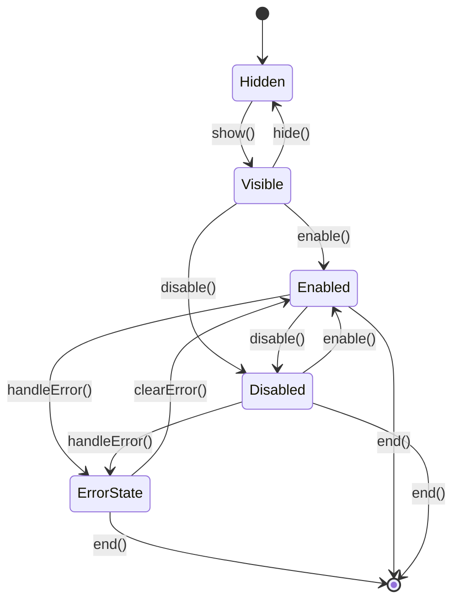

# Error Handling

This document describes the approach for handling errors within step components in the app creation process.

## Principles

The key principles for error handling in step components are:

1. **Internal Responsibility**: Steps should handle errors internally and not pass unhandled errors up the chain
2. **Graceful Degradation**: Steps should provide appropriate UI feedback and recovery mechanisms
3. **Escape Hatch Pattern**: For UI notifications outside the component, steps should emit notification events, not errors
4. **Clear Error States**: Steps should have explicit error states as part of their lifecycle

## Error State in the Step Lifecycle

Error states are an integral part of the step lifecycle:



## Error Handling Methods

The base step component should include the following error handling methods:

### `handleError(error)`

Sets the step into an error state and displays appropriate UI feedback.

- **Parameters**:
  - `error` (Error): The error that occurred
- **Behavior**:
  - Sets the step into an error state
  - Updates the UI to display the error
  - Optionally provides recovery mechanisms
- **Example**:
  ```javascript
  handleError(error) {
    this.classList.add('error');
    this.errorMessage = error.message;
    this.updateErrorUI();
    this.showRetryButton();
    
    // Log for debugging
    console.error(`Error in ${this.getHandle()}:`, error);
  }
  ```

### `clearError()`

Clears the error state and returns the step to its previous state.

- **Parameters**: None
- **Behavior**:
  - Removes the error state
  - Updates the UI to hide error messages
  - Restores the step to its previous state
- **Example**:
  ```javascript
  clearError() {
    this.classList.remove('error');
    this.errorMessage = null;
    this.updateErrorUI();
    this.hideRetryButton();
  }
  ```

### `updateErrorUI()`

Updates the UI to reflect the current error state.

- **Parameters**: None
- **Behavior**:
  - Shows or hides error messages
  - Updates error-related UI elements
- **Example**:
  ```javascript
  updateErrorUI() {
    const errorDisplay = this.shadowRoot.querySelector('.error-display');
    if (this.errorMessage) {
      errorDisplay.textContent = this.errorMessage;
      errorDisplay.classList.remove('hidden');
    } else {
      errorDisplay.classList.add('hidden');
    }
  }
  ```

## CSS for Error States

Steps should include CSS for error states:

```css
:host(.error) {
  /* Error state styling */
  border: 1px solid #f44336;
  background-color: #ffebee;
}

.error-display {
  color: #f44336;
  padding: 10px;
  margin: 10px 0;
  border-radius: var(--border-radius, 8px);
  background-color: rgba(244, 67, 54, 0.1);
}

.error-display.hidden {
  display: none;
}

.retry-button {
  background-color: #f44336;
  color: white;
  padding: 8px 16px;
  border: none;
  border-radius: var(--border-radius, 8px);
  cursor: pointer;
  margin-top: 10px;
}

.retry-button:hover {
  background-color: #d32f2f;
}
```

## Error Notification Pattern (Escape Hatch)

For cases where UI notifications need to be displayed outside the component:

```javascript
notifyError(message, level = 'error') {
  this.dispatchEvent(new CustomEvent('step-event', {
    bubbles: true,
    composed: true,
    detail: {
      action: 'show-notification',
      source: this.getHandle(),
      data: {
        type: level,
        message: message,
        duration: level === 'fatal' ? 0 : 5000 // 0 means no auto-dismiss
      }
    }
  }));
}
```

## Example: Handling API Errors

Here's an example of handling API errors in a step component:

```javascript
async generateContent() {
  try {
    // Show loading state
    this.setLoadingState();
    
    // Call API
    const result = await window.appCreationService.generateTitleAndDescription(this.userInput);
    
    // Handle success
    if (result.success) {
      this.handleSuccessfulGeneration(result);
    } else {
      throw new Error(result.error || 'Failed to generate content');
    }
  } catch (error) {
    // Handle error internally
    this.handleError(error);
    
    // Show retry button
    this.showRetryButton();
    
    // Notify for UI feedback if needed (escape hatch)
    this.notifyError('Content generation failed. Please try again.');
  } finally {
    // Clear loading state
    this.clearLoadingState();
  }
}

showRetryButton() {
  const retryButton = this.shadowRoot.querySelector('.retry-button');
  retryButton.classList.remove('hidden');
  retryButton.addEventListener('click', this.handleRetry.bind(this), { once: true });
}

handleRetry() {
  // Clear error state
  this.clearError();
  
  // Try again
  this.generateContent();
}
```

## Controller's Role in Error Handling

The controller's role in error handling is minimal:

```javascript
handleStepEvent(event) {
  const { action, source, data } = event.detail;
  
  // Handle notification requests (the escape hatch)
  if (action === 'show-notification') {
    this.showNotification(data.type, data.message, data.duration);
    return;
  }
  
  // Other event handling...
}

showNotification(type, message, duration) {
  // Show appropriate notification using a notification system
  const notificationSystem = document.querySelector('notification-system');
  if (notificationSystem) {
    notificationSystem.show(type, message, duration);
  } else {
    // Fallback to alert for fatal errors
    if (type === 'fatal') {
      alert(message);
    } else {
      console.warn(`Notification: [${type}] ${message}`);
    }
  }
}
```

## Benefits of This Approach

1. **Clear Responsibility**: Steps own their error states and recovery mechanisms
2. **Better User Experience**: Errors are handled at the appropriate level with contextual UI
3. **Maintainability**: Error handling logic stays with the component that knows how to handle it
4. **Flexibility**: Different steps can implement custom error handling appropriate to their function
5. **Debugging**: Errors are logged but handled gracefully

## Implementation in Base Step Component

The base step component should include these error handling methods:

```javascript
export class BaseStepComponent extends HTMLElement {
  constructor() {
    super();
    // Common initialization
    this.errorMessage = null;
  }
  
  // ... other lifecycle methods ...
  
  // Error handling methods
  handleError(error) {
    this.classList.add('error');
    this.errorMessage = error.message || 'An error occurred';
    this.updateErrorUI();
    
    // Log for debugging
    console.error(`Error in ${this.getHandle()}:`, error);
    
    // Dispatch event to notify that the step has encountered an error
    this.dispatchEvent(new CustomEvent('step-event', {
      bubbles: true,
      composed: true,
      detail: {
        action: 'step-error',
        source: this.getHandle(),
        data: { error }
      }
    }));
  }
  
  clearError() {
    this.classList.remove('error');
    this.errorMessage = null;
    this.updateErrorUI();
    
    // Dispatch event to notify that the error has been cleared
    this.dispatchEvent(new CustomEvent('step-event', {
      bubbles: true,
      composed: true,
      detail: {
        action: 'step-error-cleared',
        source: this.getHandle()
      }
    }));
  }
  
  updateErrorUI() {
    // Should be implemented by subclasses
    console.warn(`${this.getHandle()}: updateErrorUI() not implemented`);
  }
  
  notifyError(message, level = 'error') {
    this.dispatchEvent(new CustomEvent('step-event', {
      bubbles: true,
      composed: true,
      detail: {
        action: 'show-notification',
        source: this.getHandle(),
        data: {
          type: level,
          message: message,
          duration: level === 'fatal' ? 0 : 5000
        }
      }
    }));
  }
}
```

## Migration Considerations

When migrating existing steps to use this error handling approach:

1. Add error display elements to the component's shadow DOM
2. Implement the `updateErrorUI()` method to update these elements
3. Replace direct error throwing with internal error handling
4. Add retry mechanisms where appropriate
5. Use the notification pattern for UI feedback outside the component
