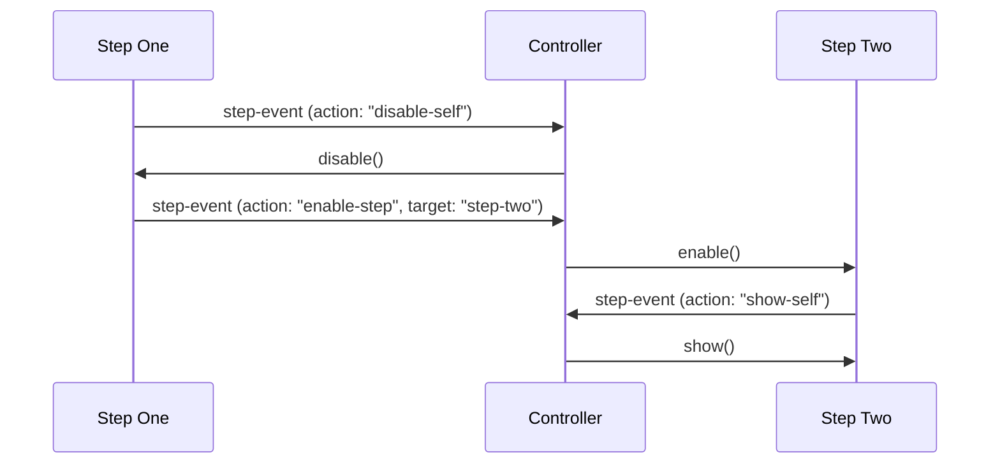

# Event-Based Communication

This document describes the event-based communication system for steps in the app creation process. This approach enables steps to communicate with each other and the controller without direct coupling.

## Overview

In the app creation process, steps should communicate via events rather than direct method calls. This approach:

1. Reduces coupling between components
2. Makes steps truly self-contained "black boxes"
3. Simplifies the controller by making it a simple event relay
4. Enables more flexible UI transitions



## Event Format

All step events should follow a standard format:

```javascript
new CustomEvent('step-event', {
  bubbles: true,
  composed: true,
  detail: {
    action: 'action-name',      // Required: The action to perform
    source: 'step-handle',      // Required: The handle of the source step
    target: 'target-handle',    // Optional: The handle of the target step (if applicable)
    data: { /* any data */ }    // Optional: Additional data for the action
  }
});
```

### Event Properties

- **action**: Describes what should happen (e.g., 'disable-self', 'enable-step', 'show-step')
- **source**: Identifies which step dispatched the event
- **target**: Identifies which step should receive the action (if applicable)
- **data**: Contains any additional data needed for the action

## Common Event Actions

### Self-Directed Actions

These actions are performed on the step that dispatched the event:

- **disable-self**: Disable the source step
- **enable-self**: Enable the source step
- **hide-self**: Hide the source step
- **show-self**: Show the source step
- **end-self**: End the source step

### Target-Directed Actions

These actions are performed on a target step:

- **disable-step**: Disable the target step
- **enable-step**: Enable the target step
- **hide-step**: Hide the target step
- **show-step**: Show the target step
- **start-step**: Start the target step with provided data

### Flow Control Actions

These actions control the overall flow of the app creation process:

- **next-step**: Move to the next step in the sequence
- **previous-step**: Move to the previous step in the sequence
- **complete-process**: Complete the entire process
- **cancel-process**: Cancel the entire process

## Example Events

### Moving from Step One to Step Two

```javascript
// Step One dispatches events to transition to Step Two
this.dispatchEvent(new CustomEvent('step-event', {
  bubbles: true,
  composed: true,
  detail: {
    action: 'disable-self',
    source: 'step-one'
  }
}));

this.dispatchEvent(new CustomEvent('step-event', {
  bubbles: true,
  composed: true,
  detail: {
    action: 'start-step',
    source: 'step-one',
    target: 'step-two',
    data: {
      userInput: this.userInput
    }
  }
}));
```

### Handling Errors

```javascript
// Step Two dispatches an error event
this.dispatchEvent(new CustomEvent('step-event', {
  bubbles: true,
  composed: true,
  detail: {
    action: 'error-occurred',
    source: 'step-two',
    data: {
      errorType: 'generation-failed',
      errorMessage: 'Failed to generate title and description'
    }
  }
}));
```

## Controller Implementation

The controller listens for all step events and routes them appropriately:

```javascript
constructor() {
  // Get step components
  this.steps = {
    'step-one': document.getElementById('step-1'),
    'step-two': document.getElementById('step-2'),
    'step-three': document.getElementById('step-3')
  };
  
  // Set up event listener for step events
  document.addEventListener('step-event', this.handleStepEvent.bind(this));
}

handleStepEvent(event) {
  const { action, source, target, data } = event.detail;
  
  // Handle self-directed actions
  if (action.endsWith('-self')) {
    const baseAction = action.replace('-self', '');
    const sourceStep = this.steps[source];
    
    if (sourceStep && typeof sourceStep[baseAction] === 'function') {
      sourceStep[baseAction](data);
    }
    return;
  }
  
  // Handle target-directed actions
  if (action.endsWith('-step') && target) {
    const baseAction = action.replace('-step', '');
    const targetStep = this.steps[target];
    
    if (targetStep && typeof targetStep[baseAction] === 'function') {
      targetStep[baseAction](data);
    }
    return;
  }
  
  // Handle flow control actions
  switch (action) {
    case 'next-step':
      this.moveToNextStep(source, data);
      break;
    case 'previous-step':
      this.moveToPreviousStep(source, data);
      break;
    case 'complete-process':
      this.completeProcess(data);
      break;
    case 'cancel-process':
      this.cancelProcess();
      break;
    case 'error-occurred':
      this.handleError(source, data);
      break;
  }
}
```

## Benefits of Event-Based Communication

1. **Decoupling**: Steps don't need to know about each other's implementation details
2. **Flexibility**: New steps can be added without modifying existing steps
3. **Testability**: Events can be easily mocked and tested
4. **Maintainability**: Changes to one step don't affect other steps
5. **Extensibility**: New event types can be added without breaking existing functionality

## Debugging Events

To aid in debugging, it's helpful to log all step events:

```javascript
document.addEventListener('step-event', (event) => {
  console.log('Step Event:', event.detail);
});
```

This provides visibility into the flow of events between steps and the controller.

## Migration Strategy

When migrating from direct method calls to event-based communication:

1. Identify all direct method calls between steps and the controller
2. Replace each method call with an appropriate event dispatch
3. Update the controller to listen for events and call the appropriate methods
4. Test each transition to ensure it works as expected

This approach allows for incremental migration, as you can convert one interaction at a time.
