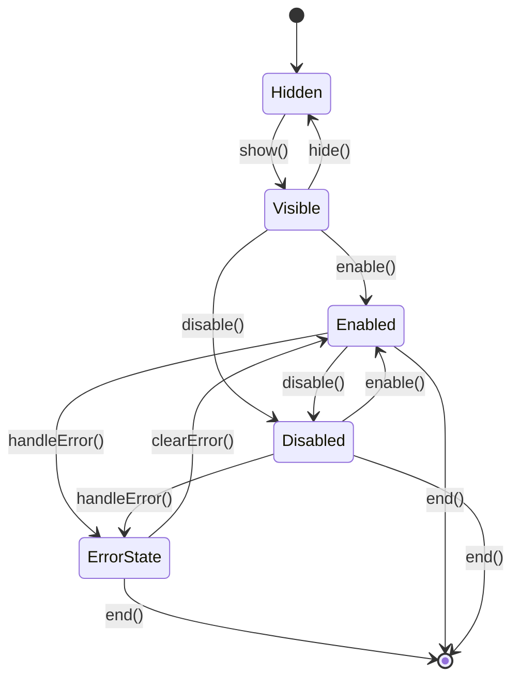

# Step Lifecycle Interface (Target Architecture)

This document defines the formal lifecycle interface for steps in the app creation process as part of the **target architecture**. **This represents the planned design, not the current implementation.**

Implementing this interface would ensure consistent behavior across all steps and enable more flexible UI transitions. The current implementation has a simpler lifecycle model - see the README.md file for details on the current implementation.

## Overview

Each step in the app creation process should implement a standard set of lifecycle methods that control its state and visibility. This approach allows for more sophisticated transitions between steps, such as disabling a step without hiding it completely.



## Lifecycle Methods

### `start(data)`

Initializes and activates the step with optional data from previous steps.

- **Parameters**:
  - `data` (Object): Optional data passed from previous steps
- **Behavior**:
  - Sets up the step's initial state
  - Makes the step visible and interactive
  - Initializes any UI elements with provided data
- **Example**:
  ```javascript
  start(data = {}) {
    this.show();
    this.enable();
    if (data.userInput) {
      this.inputField.value = data.userInput;
    }
  }
  ```

### `end()`

Finalizes and deactivates the step.

- **Parameters**: None
- **Behavior**:
  - Cleans up any resources used by the step
  - Typically hides the step
  - Optionally triggers events to notify other components
- **Example**:
  ```javascript
  end() {
    this.hide();
    this.dispatchEvent(new CustomEvent('step-ended', {
      bubbles: true,
      composed: true
    }));
  }
  ```

### `disable()`

Makes the step non-interactive but still visible.

- **Parameters**: None
- **Behavior**:
  - Disables all interactive elements (inputs, buttons, etc.)
  - Applies visual styling to indicate the disabled state
  - Maintains visibility
- **Example**:
  ```javascript
  disable() {
    this.classList.add('disabled');
    this.shadowRoot.querySelectorAll('input, button').forEach(el => {
      el.disabled = true;
    });
  }
  ```

### `enable()`

Makes the step interactive.

- **Parameters**: None
- **Behavior**:
  - Enables all interactive elements
  - Removes any disabled visual styling
- **Example**:
  ```javascript
  enable() {
    this.classList.remove('disabled');
    this.shadowRoot.querySelectorAll('input, button').forEach(el => {
      el.disabled = false;
    });
  }
  ```

### `hide()`

Makes the step invisible.

- **Parameters**: None
- **Behavior**:
  - Hides the step from view
  - Does not change the interactive state
- **Example**:
  ```javascript
  hide() {
    this.classList.add('hidden');
  }
  ```

### `show()`

Makes the step visible.

- **Parameters**: None
- **Behavior**:
  - Makes the step visible
  - Does not change the interactive state
- **Example**:
  ```javascript
  show() {
    this.classList.remove('hidden');
  }
  ```

### `getHandle()`

Returns a unique identifier for the step.

- **Parameters**: None
- **Returns**: String - A unique identifier for the step
- **Behavior**:
  - Provides a way to address the step in events
- **Example**:
  ```javascript
  getHandle() {
    return 'step-one';
  }
  ```

## Base Step Component

To simplify implementation, a base step component should be created that implements these lifecycle methods. All step components can then extend this base component.

```javascript
export class BaseStepComponent extends HTMLElement {
  constructor() {
    super();
    // Common initialization
    this.errorMessage = null;
  }
  
  // Lifecycle methods
  start(data = {}) {
    this.show();
    this.enable();
    
    // Dispatch event to notify that the step has started
    this.dispatchStepEvent('step-started', data);
  }
  
  end() {
    this.hide();
    
    // Dispatch event to notify that the step has ended
    this.dispatchStepEvent('step-ended');
  }
  
  disable() {
    this.classList.add('disabled');
    this.shadowRoot.querySelectorAll('input, button, select, textarea').forEach(el => {
      el.disabled = true;
    });
    
    // Dispatch event to notify that the step has been disabled
    this.dispatchStepEvent('step-disabled');
  }
  
  enable() {
    this.classList.remove('disabled');
    this.shadowRoot.querySelectorAll('input, button, select, textarea').forEach(el => {
      el.disabled = false;
    });
    
    // Dispatch event to notify that the step has been enabled
    this.dispatchStepEvent('step-enabled');
  }
  
  hide() {
    this.classList.add('hidden');
    
    // Dispatch event to notify that the step has been hidden
    this.dispatchStepEvent('step-hidden');
  }
  
  show() {
    this.classList.remove('hidden');
    
    // Dispatch event to notify that the step has been shown
    this.dispatchStepEvent('step-shown');
  }
  
  // Error handling methods
  handleError(error) {
    this.classList.add('error');
    this.errorMessage = error.message || 'An error occurred';
    this.updateErrorUI();
    
    // Log for debugging
    console.error(`Error in ${this.getHandle()}:`, error);
    
    // Dispatch event to notify that the step has encountered an error
    this.dispatchStepEvent('step-error', { error });
  }
  
  clearError() {
    this.classList.remove('error');
    this.errorMessage = null;
    this.updateErrorUI();
    
    // Dispatch event to notify that the error has been cleared
    this.dispatchStepEvent('step-error-cleared');
  }
  
  updateErrorUI() {
    // Should be implemented by subclasses
    console.warn(`${this.getHandle()}: updateErrorUI() not implemented`);
  }
  
  // Helper method for dispatching events
  dispatchStepEvent(action, data = {}, target = null) {
    this.dispatchEvent(new CustomEvent('step-event', {
      bubbles: true,
      composed: true,
      detail: {
        action,
        source: this.getHandle(),
        target,
        data
      }
    }));
  }
  
  // Notification method (escape hatch)
  notifyError(message, level = 'error') {
    this.dispatchStepEvent('show-notification', {
      type: level,
      message: message,
      duration: level === 'fatal' ? 0 : 5000
    });
  }
  
  getHandle() {
    // Should be overridden by subclasses
    throw new Error('getHandle() must be implemented by subclass');
  }
}
```

## CSS Considerations

Steps should include the following CSS to support the lifecycle states:

```css
:host {
  display: block;
}

:host(.hidden) {
  display: none;
}

:host(.disabled) {
  opacity: 0.7;
  pointer-events: none;
}

:host(.error) {
  /* Error state styling */
  border: 1px solid #f44336;
  background-color: #ffebee;
}

/* Optional: Add visual indicators for disabled state */
:host(.disabled) input,
:host(.disabled) button,
:host(.disabled) select,
:host(.disabled) textarea {
  cursor: not-allowed;
  background-color: #f5f5f5;
}

/* Error display elements */
.error-display {
  color: #f44336;
  padding: 10px;
  margin: 10px 0;
  border-radius: var(--border-radius, 8px);
  background-color: rgba(244, 67, 54, 0.1);
}

.error-display.hidden {
  display: none;
}

.retry-button {
  background-color: #f44336;
  color: white;
  padding: 8px 16px;
  border: none;
  border-radius: var(--border-radius, 8px);
  cursor: pointer;
  margin-top: 10px;
}

.retry-button:hover {
  background-color: #d32f2f;
}
```

## Benefits

Implementing this lifecycle interface provides several benefits:

1. **Consistency**: All steps behave in a predictable way
2. **Flexibility**: Steps can be in various states (visible but disabled, hidden, etc.)
3. **Reusability**: Common behavior is implemented once in the base component
4. **Maintainability**: Clear separation of concerns between state management and UI
5. **Testability**: Lifecycle methods can be easily tested in isolation
