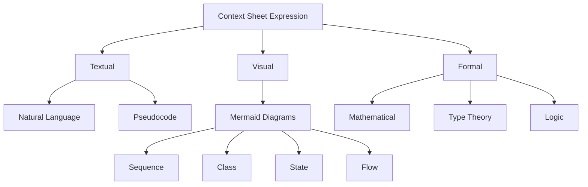
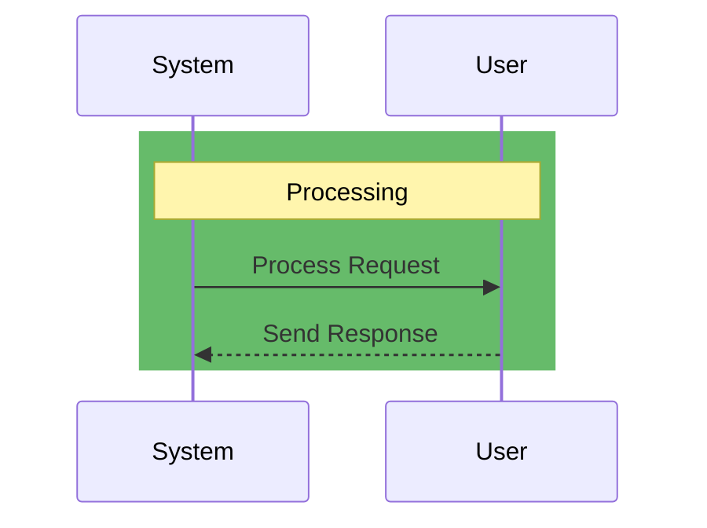
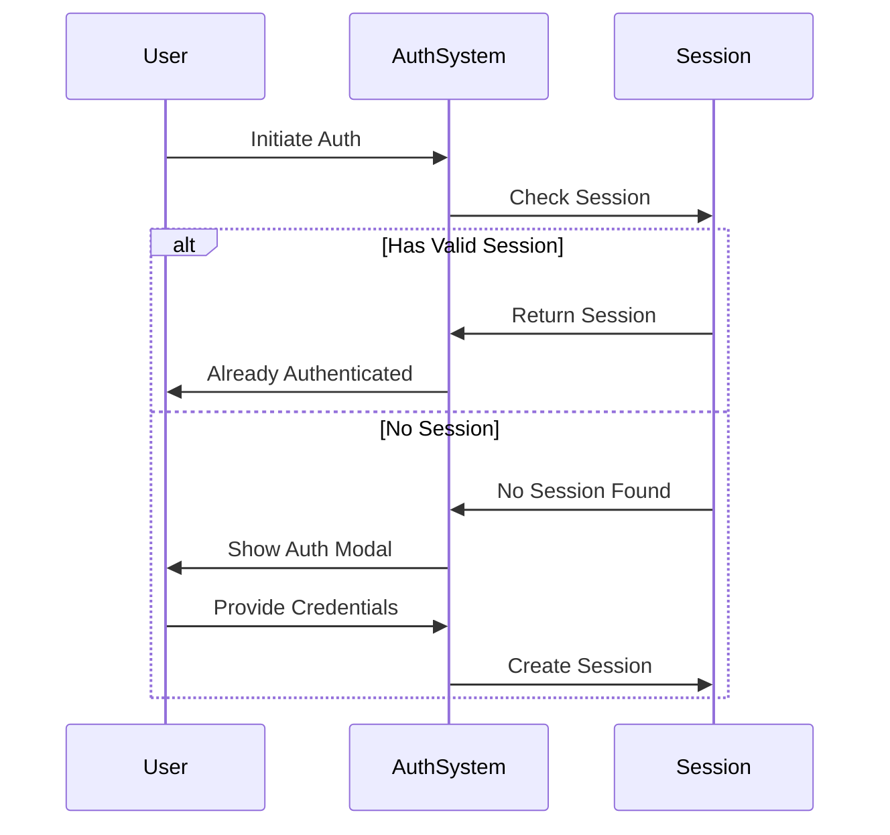
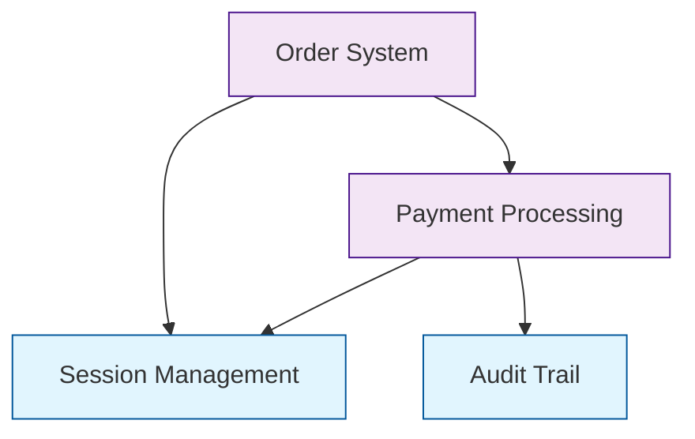
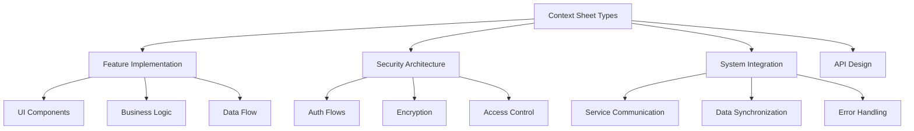
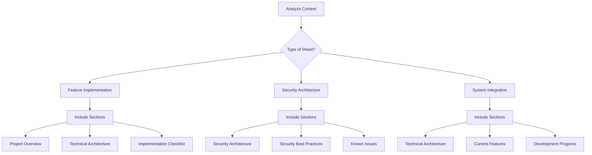

# Context Sheets: Programming Through Natural Language

Context sheets represent the next evolution in programming abstraction—using natural language as code. Just as we advanced from punch cards to assembly to high-level languages, context sheets let us describe system behavior in precise natural language. They serve as technology-independent specifications that can be translated into any implementation, much like how the JVM renders Java platform-independent.

---

## System Definition & Formal Foundations

At their core, context sheets combine formal specifications with natural language:

```z
ContextSheet ::= Requirements × Constraints × Implementation
Evolution    ::= Current → Natural → Platform-Independent
```

### Category Theory: System Evolution
```
Evolution :: Category where
  Objects = {NaturalLanguage, Implementation}
  Morphisms = {compile :: NL → Impl, verify :: Impl → NL}
  Laws = {
    identity: id_NL ∘ compile = compile
    composition: verify ∘ compile = id_NL
  }
```

This formal representation shows how context sheets form a categorical structure, where natural language specifications and implementations are connected through verified transformations.

---

## 📋 Guiding Principles

| Principle | Mathematical Definition | Natural Language Description |
|-----------|------------------------|----------------------------|
| KISS | `complexity(system) = min(∀ implementations)` | Keep It Simple: Maintain simplicity in both architecture and implementation |
| YAGNI | `features ⊆ requirements` | You Aren't Gonna Need It: Implement only what is needed, avoiding speculation |
| DRY | `∀ component • unique(implementation(component))` | Don't Repeat Yourself: Promote code reuse through well-designed components |
| Security First | `secure(component) ⇒ deployable(component)` | Prioritize security across all aspects—from authentication to data handling |
| Scalability | `capacity(t+1) > capacity(t)` | Architect systems to support future growth and evolution |

---

## 🌐 Language Freedom & Technology Independence

Context sheets embrace abstract specifications expressed through both natural language and formal constructs:

### Type Theory: Context Sheet Composition
```
ContextSheet = ∀α. Specification α where
  Specification α = 
    | Requirements of (α → Constraint)
    | Implementation of (∃β. α → β)
    | Composition of (α → α → α)
```

This formal structure supports:
- Pure behavioral specifications without implementation details
- System requirements and constraints expressed in their most natural form
- Abstract patterns that capture essential behaviors independent of technology
- Domain-specific language elements that define interfaces rather than implementations

### Abstract Specifications Example
```plaintext
The authentication system must maintain secure session state:

# Type-theoretic specification of session properties
Session :: Entity
Properties:
  - Immutable(history: EventChain)
  - Unique(identifier: SessionId)
  - TimeConstrained(lifetime: Duration)
  - Verifiable(state: SessionState)

# Logical specification of security requirements
SecurityInvariants:
  ∀ s ∈ Sessions:
    - Authenticated(s.user) ⇒ ValidCredentials(s.user)
    - Active(s) ⇒ WithinLifetime(s) ∧ NotRevoked(s)
    - Concurrent(s₁, s₂) ⇒ s₁.user ≠ s₂.user

# Required Operations
  - Create: Credentials → Result<Session, AuthError>
  - Validate: SessionId → Result<SessionState, ValidationError>
  - Terminate: SessionId → Result<void, TerminationError>
  - Refresh: SessionId → Result<Session, RefreshError>
```

---

## System Architecture & Visual Representations

Context sheets leverage both formal notations and visual diagrams to express system architecture:

### Component Interaction (Process Calculus)
```
System ≜ Auth | Session | Storage where
  Auth = (verify.success.Session + verify.fail.Auth)
  Session = (create.Storage + validate.Auth)
  Storage = (write.Session + read.Session)
```

### Visual Architecture


### Mermaid Sequence Diagram Coloring


The correct syntax for coloring sections in sequence diagrams is using `rect` with RGB values:
```
rect rgb(255, 167, 38)
    Note over A,B: Section Title
    A->>B: Action
    B-->>A: Response
end
```

Common RGB colors used in our documentation:
- Setup/Authentication: rgb(75, 158, 255)  [Blue]
- Core Processing: rgb(102, 187, 106)      [Green]
- State Management: rgb(255, 167, 38)      [Orange]
- Response Handling: rgb(255, 82, 82)      [Red]

### Authentication Flow


---

## Hierarchical Abstraction

Context sheets use a hierarchical structure to manage complexity:

### Abstract Algebra: System Properties
```
Properties = (Behaviors, ×, id) where
  - (Behaviors, ×) forms a monoid
  - ∀ b ∈ Behaviors: b × id = b = id × b
  - ∀ a,b,c ∈ Behaviors: (a × b) × c = a × (b × c)
```

This formal structure enables:
- **Top-Level Compressed Summary:** Essential semantics captured in abstract syntax tree form
- **Detailed Expansion Layers:** Each summary node expands into richer detail when needed
- **Progressive Refinement:** Abstract concepts refined into concrete implementations

---

## The Evolution of System Description

Context sheets support multiple levels of system description, each with increasing abstraction:

### Level 1: Mechanical Description
```typescript
interface AuthenticationModal with GenServer {
  async show(): Promise<void>
  handle_call({:verify, credentials}, from, state) ->
    Result<Session, AuthError>
}
```

### Level 2: Functional Description
```haskell
auth_flow =
  validate_credentials >=> 
  establish_session(User) :- 
    not(existing_session(User)),
    within_rate_limits(User) |>
  update_in([:permissions] conj new_capabilities)
```

### Level 3: Intentional Description
```prolog
System :: Trust -> Identity -> Rights
trusted_interaction(User, Asset) :-
  Proof: has_identity(User) ∧ owns_asset(User, Asset) →
  consume_once(session_token) ⊸ 
  SecurityEffect<validate_access(User, Asset)>
```

### Level 4: Meta Description
```haskell
evolve_system =
  fmap(analyze_patterns) >=>
  supervise([
    | {simple_extension} -> extend_capabilities
    | {breaking_change} -> plan_migration
    | Error e -> Left(incompatible_evolution)
  ])
```

---

## Abstract Specification Pattern

Context sheets follow the principle of abstract interfaces, combining formal and natural specifications:

### Modal Logic: System States
```
□(secure → deployed)  // Necessarily, if secure then deployed
◇(optimized)         // Possibly optimized
¬◇(compromised)      // Impossibly compromised
```

### Example: Abstract vs Concrete
```plaintext
# Abstract Specification (✓)
AuthenticationSystem:
  - Must verify user identity
  - Must maintain session state
  - Must enforce access control
  - Must handle concurrent requests
  - Must implement rate limiting
  - Must log security events

# Concrete Implementation (✗)
class JWTAuthSystem:
  - Uses JSON Web Tokens
  - Stores sessions in Redis
  - Uses Role-Based Access Control
  - Uses Node.js cluster for concurrency
  - Implements token bucket algorithm
  - Writes logs to ElasticSearch
```

---

## Context Sheet Dependencies

Dependencies are managed through a combination of formal rules and practical structures:

### Dependency Rules
1. **Child-to-Parent References:** Only children reference their parents
2. **Parent Independence:** Parent sheets remain unaware of children
3. **Interface-Based:** All references point to abstract interfaces

### Dependency Graph


### Example: Dependencies
```markdown
# payment_processing.md

## Dependencies
- [Session Management](../auth/session_management.md)
- [Audit Trail](../monitoring/audit_trail.md)

## Provided Interfaces
- Payment Processing Interface
- Transaction Validation Interface

## Required Behaviors
- Authenticate all transactions
- Log all attempts
- Validate payment methods
- Process refunds
```

---

## 📈 Progress Tracking Framework

Progress tracking combines formal state tracking with practical checkpoints:

### State Space
```
States = {
    ANALYZING  = { A ∪ B | A, B ∈ Branches },
    MERGING    = { resolve(conflicts) },
    VALIDATING = { assert(principles) },
    COMPLETE   = { deploy(result) }
}
```

### Todo List Structure
```plaintext
Progress:
  ☐ Component: Authentication System
    ✓ Define security requirements
    ☐ Design auth flow
      ✓ User registration flow
      ✓ Login flow
      ☐ Password reset flow
      ☐ 2FA implementation
    ☐ Session management
      ✓ Session creation
      ☐ Session validation
      ☐ Session expiration
    ☐ Access control
      ☐ Role definitions
      ☐ Permission matrix
      ☐ Access validation

Status:
  - Current Phase: Session Management
  - Completion: 40%
  - Blocking Items: None
  - Last Updated: 2024-02-21
```

### Quality Assertions
```prolog
valid_evolution(System) :-
    maintains(kiss_principle),
    preserves(security),
    satisfies(requirements),
    scales(implementation).
```

---

## Context Sheet Templates

Templates provide structure while maintaining flexibility:

### Template Types


### Available Sections

1. **Guiding Principles**
   - KISS (Keep It Simple, Stupid)
   - YAGNI (You Aren't Gonna Need It)
   - DRY (Don't Repeat Yourself)
   - Security First
   - Scalability

2. **Project Overview**
   - Purpose
   - Key Functionalities

3. **Technical Architecture**
   - Components
   - Security Features

4. **Implementation Checklist**
   - Task breakdown
   - Development steps

5. **Security Architecture**
   - Implementation details
   - Security measures

6. **Known Issues & Bugs**
   - Current limitations
   - Troubleshooting steps
   - Resolution status

### Section Selection Logic


---

## Additional Resources

- Extended Documentation
- Training Materials
- Tools & Utilities
- Community Support
