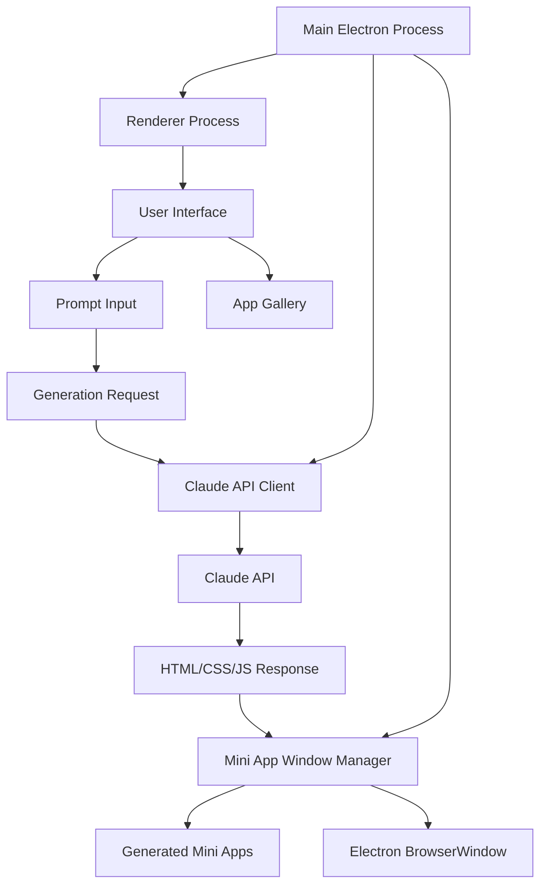
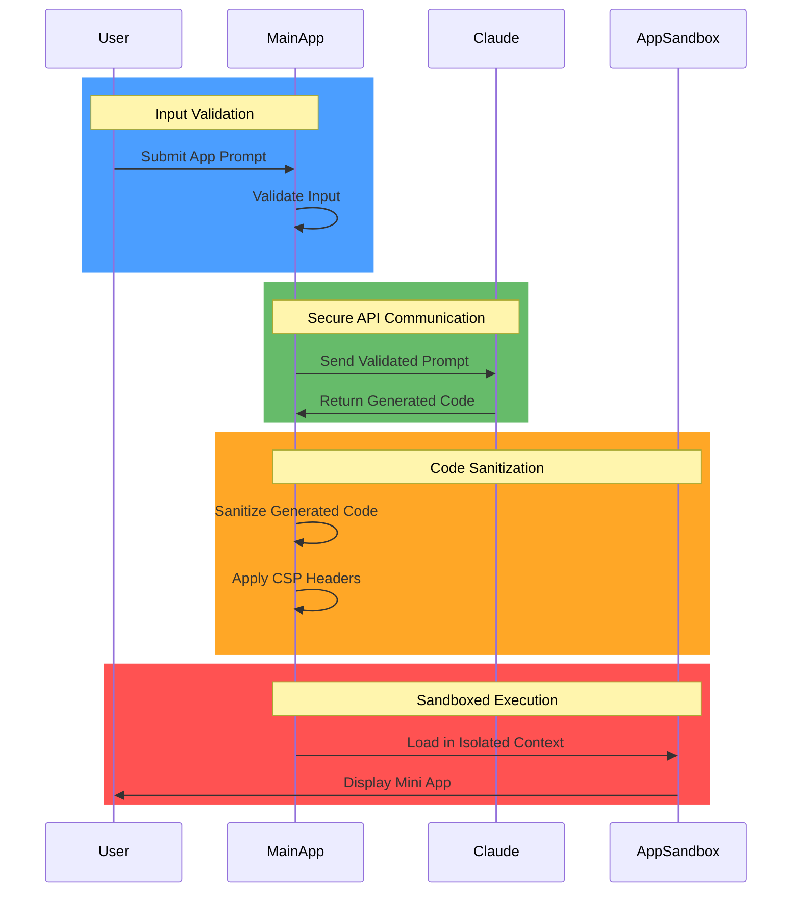

# Lahat: Overview

## Project Overview

- **Purpose:** Lahat is an Electron application that enables users to create self-contained mini desktop applications using natural language prompts processed by Claude AI.

- **Goals:** 
  - Simplify application creation through natural language descriptions
  - Generate functional, self-contained HTML/CSS/JS applications
  - Provide an intuitive interface for managing generated applications
  - Enable iterative refinement of applications through continued conversation

- **Target Audience:** 
  - Developers looking for rapid prototyping tools
  - Non-technical users who want to create simple applications without coding
  - Educators and students exploring AI-assisted development
  - Professionals who need quick, custom productivity tools

## Technical Architecture

- **Platform:** Electron with JavaScript, HTML, and CSS
- **Core Components:**
  - Main Electron Process: Manages application lifecycle and window creation
  - Claude API Client: Handles communication with Claude AI
  - Mini App Window Manager: Creates and manages windows for generated apps
  - App Storage: Saves generated applications for future use

For a detailed view of the mini app generation process, see the [Mini App Generation Sequence](mini_app_generation_sequence.md) document, which provides a comprehensive sequence diagram and explanation of the entire workflow.

## Current Features

- **API Key Management:**
  - Secure storage of Claude API key
  - Validation of API key on startup

- **App Generation:**
  - Natural language prompt input
  - Real-time streaming of Claude's response
  - Automatic creation of mini app windows
  - Storage of generated app code and metadata

- **App Management:**
  - List of previously generated apps
  - Opening, updating, and deleting saved apps
  - Exporting apps as standalone HTML files

- **Mini App Windows:**
  - Sandboxed execution environment
  - Native window controls
  - Secure IPC communication

## Security Architecture

- **Key Security Measures:**
  - Secure storage of API keys using electron-store
  - Content Security Policy for all windows
  - Sandboxed execution of generated mini apps
  - Context isolation and disabled nodeIntegration
  - Input validation and sanitization

## Implementation Status

- **Completed:**
  - Core application architecture
  - Claude API integration
  - Mini app generation and management
  - User interface for app creation and management
  - Security measures for sandboxed execution

- **In Progress:**
  - Enhanced error handling and recovery
  - Improved prompt engineering for better app generation
  - Performance optimizations

- **Planned:**
  - Templates and examples for common app types
  - Integration with local LLMs via Ollama
  - Enhanced customization options for generated apps
  - Collaborative features for team environments

## Natural Language Processing Strategy

- **Prompt Engineering:**
  - Structured system prompt for Claude
  - Clear instructions for generating self-contained HTML/CSS/JS
  - Guidelines for security, functionality, and user experience

- **Response Processing:**
  - Streaming response handling for real-time feedback
  - Parsing and validation of generated HTML
  - Storage of conversation context for iterative improvements

## Development Approach

- **Guiding Principles:**
  - **KISS:** Keep the application simple and focused on core functionality
  - **YAGNI:** Implement only what is needed, avoiding speculative features
  - **DRY:** Reuse code and components where possible
  - **Security First:** Prioritize security in all aspects of the application
  - **User-Centered:** Design for intuitive use and clear feedback

- **Development Workflow:**
  - Iterative development with regular testing
  - Context sheets for documentation and planning
  - Focus on maintainable, well-structured code

## Known Limitations

- **Generation Quality:**
  - Quality of generated apps depends on Claude's capabilities
  - Complex applications may require multiple iterations
  - Some edge cases may produce invalid or incomplete code

- **Performance:**
  - Generation process may take time for complex applications
  - API rate limits may affect usage during heavy use

- **Security:**
  - While sandboxed, generated code still runs locally
  - Users should review generated code before extensive use

## Future Directions

- **Enhanced Generation:**
  - Improved prompt engineering for better results
  - Support for more complex application types
  - Integration with component libraries

- **Collaboration:**
  - Sharing and importing generated apps
  - Team workspaces for collaborative development

- **Extensions:**
  - Plugin system for additional functionality
  - Integration with development workflows and tools
