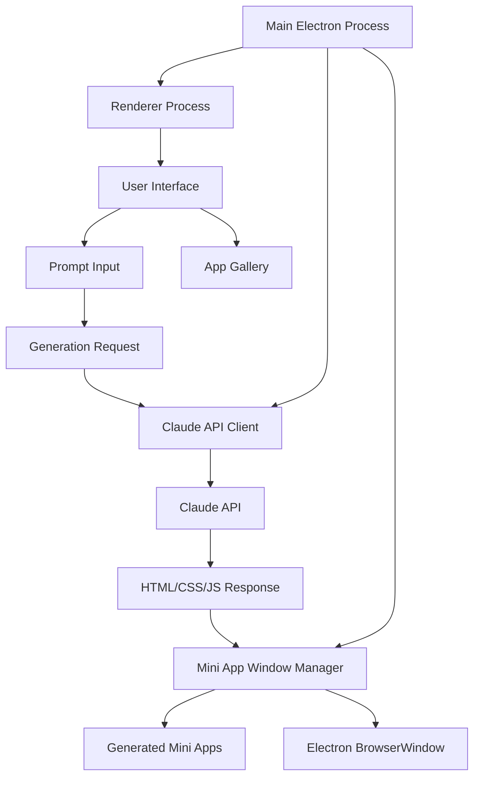

# Lahat: Documentation

<!-- SUMMARY -->
This repository contains documentation for the Lahat application, which enables users to create self-contained mini desktop applications using natural language prompts processed by Claude AI.
<!-- /SUMMARY -->

## Documentation Overview

The Lahat documentation has been reorganized into a structured format with separate folders for different aspects of the application:

- **Architecture**: Documents related to the system design and technical implementation
- **Development**: Documents related to the development process and implementation details
- **User Experience**: Documents related to the user interface and experience design
- **Changes**: Documents recording specific changes and implementations

For a complete index of all documentation, see the [Documentation Index](index.md).

## Using This Documentation

Each document includes a "RELATED DOCUMENTS" section that indicates which other documents provide helpful context:

```markdown
<!-- RELATED DOCUMENTS -->
related '../architecture/technical_architecture.md'
related './code_organization.md'
<!-- /RELATED DOCUMENTS -->
```

When reading a document, you may want to also review its related documents to gain additional context.

## Document Template

When creating new documentation, use the following template:

```markdown
# Document Title

<!-- SUMMARY -->
Brief summary of the document's content and purpose.
<!-- /SUMMARY -->

<!-- RELATED DOCUMENTS -->
related '../path/to/related/document.md'
related '../path/to/another/document.md'
<!-- /RELATED DOCUMENTS -->

## Section 1

Content for section 1...

## Section 2

Content for section 2...

## Conclusion

Concluding remarks...
```

## Project Overview

- **Purpose:** Lahat is an Electron application that enables users to create self-contained mini desktop applications using natural language prompts processed by Claude AI.

- **Goals:** 
  - Simplify application creation through natural language descriptions
  - Generate functional, self-contained HTML/CSS/JS applications
  - Provide an intuitive interface for managing generated applications
  - Enable iterative refinement of applications through continued conversation

- **Target Audience:** 
  - Developers looking for rapid prototyping tools
  - Non-technical users who want to create simple applications without coding
  - Educators and students exploring AI-assisted development
  - Professionals who need quick, custom productivity tools

## Technical Architecture



For a detailed view of the mini app generation process, see the [Mini App Generation Sequence](architecture/mini_app_generation_sequence.md) document, which provides a comprehensive sequence diagram and explanation of the entire workflow.

## Current Features

- **API Key Management:**
  - Secure storage of Claude API key
  - Validation of API key on startup

- **App Generation:**
  - Natural language prompt input
  - Real-time streaming of Claude's response
  - Automatic creation of mini app windows
  - Storage of generated app code and metadata

- **App Management:**
  - List of previously generated apps
  - Opening, updating, and deleting saved apps
  - Exporting apps as standalone HTML files

- **Mini App Windows:**
  - Sandboxed execution environment
  - Native window controls
  - Secure IPC communication

## Implementation Status

- **Completed:**
  - Core application architecture
  - Claude API integration
  - Mini app generation and management
  - User interface for app creation and management
  - Security measures for sandboxed execution
  - Window sheets architecture implementation
  - Main.js refactoring into modules
  - 2-step app creation wizard

- **In Progress:**
  - Enhanced error handling and recovery
  - Improved prompt engineering for better app generation
  - Performance optimizations

- **Planned:**
  - Templates and examples for common app types
  - Integration with local LLMs via Ollama
  - Enhanced customization options for generated apps
  - Collaborative features for team environments
