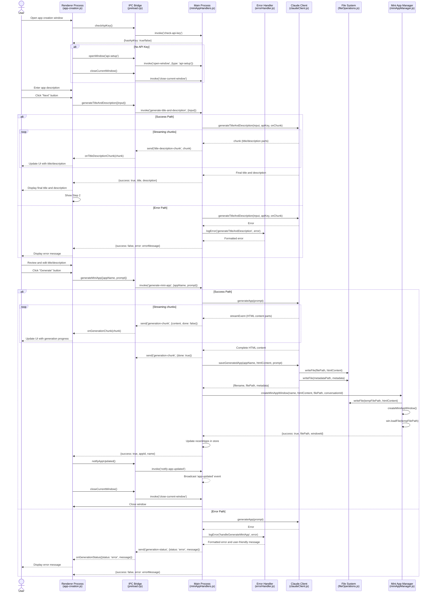

# Lahat: Mini App Generation Sequence

<!-- SUMMARY -->
This document details the sequence of operations that occur during the mini app generation process in Lahat, including the two-step workflow of title/description generation followed by app generation.
<!-- /SUMMARY -->

<!-- RELATED DOCUMENTS -->
related '../architecture/technical_architecture.md'
related '../development/code_organization.md'
related '../changes/20250305-code-cleanup-and-maintainability-improvements.md'
<!-- /RELATED DOCUMENTS -->

## Overview

This document details the sequence of operations that occur during the mini app generation process in Lahat. The mini app generation is a multi-step process that involves interaction between the user interface, the main Electron process, the Claude API, and various system components.

The process is divided into two main phases:
1. **Title and Description Generation**: The user provides an initial input, which is used to generate a title and description for the mini app.
2. **Mini App Generation**: Based on the title and description, the system generates the complete HTML/CSS/JavaScript code for the mini app.

## Sequence Diagram

The following sequence diagram illustrates the complete flow of the mini app generation process:



## Detailed Process Explanation

### 1. Initialization

When the app creation window is opened, the system first checks if a Claude API key is set:

```javascript
// From app-creation.js
async function initializeApp() {
  // Check if API key is set
  const { hasApiKey } = await window.electronAPI.checkApiKey();
  
  if (!hasApiKey) {
    // Open API setup window if API key is not set
    window.electronAPI.openWindow('api-setup');
    
    // Close this window
    window.electronAPI.closeCurrentWindow();
    return;
  }
  
  // Set up event listeners...
}
```

If no API key is set, the system redirects to the API setup window. Otherwise, it initializes the app creation interface.

### 2. Title and Description Generation

When the user enters a description and clicks the "Next" button, the system generates a title and description using Claude:

```javascript
// From app-creation.js
nextButton.addEventListener('click', async () => {
  currentInput = userInput.value.trim();
  
  if (!currentInput) {
    alert('Please enter what you would like to create.');
    return;
  }
  
  // Show loading indicator...
  
  try {
    // Generate title and description
    const result = await window.electronAPI.generateTitleAndDescription({
      input: currentInput
    });
    
    if (result.success) {
      // The UI has already been updated via chunks
      // Just store the final values
      currentTitle = result.title;
      currentDescription = result.description;
      
      // Display the user input
      userInputDisplay.textContent = currentInput;
      
      // Hide step 1, show step 2
      step1.classList.remove('active');
      step2.classList.add('active');
    } else {
      alert(`Error generating title and description: ${result.error}`);
    }
  } catch (error) {
    alert(`Error: ${error.message}`);
  } finally {
    // Hide loading indicator...
  }
});
```

The title and description generation is handled by the `titleDescriptionGenerator.js` module, which uses the Claude API to generate a title and description based on the user's input:

```javascript
// From titleDescriptionGenerator.js
export async function generateTitleAndDescription(input, apiKey, onChunk) {
  const anthropic = new Anthropic({
    apiKey: apiKey
  });
  
  const prompt = `Based on the following user input, provide:
1. A concise, creative, and descriptive title (2-5 words)
2. An expanded description paragraph

// ... prompt details ...

User input: "${input}"`;

  // Call Claude API with streaming enabled
  const response = await anthropic.messages.create({
    model: 'claude-3-7-sonnet-20250219',
    max_tokens: 1000,
    messages: [
      { role: 'user', content: prompt }
    ],
    stream: true
  });

  // Process the stream and extract title/description...
}
```

The results are streamed back to the UI in real-time, allowing the user to see the title and description as they are generated.

### 3. Mini App Generation

After reviewing and potentially editing the title and description, the user clicks the "Generate" button to create the mini app:

```javascript
// From app-creation.js
generateButton.addEventListener('click', async () => {
  // Show loading indicator...
  
  try {
    const result = await window.electronAPI.generateMiniApp({
      appName: currentTitle,
      prompt: currentDescription
    });
    
    if (result.success) {
      // Notify main window to refresh app list
      window.electronAPI.notifyAppUpdated();
      
      // Close this window after a short delay
      setTimeout(() => {
        window.electronAPI.closeCurrentWindow();
      }, 2000);
    } else {
      alert(`Error generating mini app: ${result.error}`);
    }
  } catch (error) {
    alert(`Error: ${error.message}`);
  } finally {
    // Hide loading indicator...
  }
});
```

The mini app generation is handled by the `miniAppHandlers.js` module, which uses the Claude API to generate the HTML/CSS/JavaScript code for the mini app:

```javascript
// From miniAppHandlers.js
async function handleGenerateMiniApp(event, { prompt, appName }) {
  try {
    const claudeClient = apiHandlers.getClaudeClient();
    if (!claudeClient) {
      return {
        success: false,
        error: 'Claude API key not set. Please set your API key in settings.'
      };
    }
    
    // Start streaming response
    event.sender.send('generation-status', {
      status: 'generating',
      message: 'Generating your mini app...'
    });
    
    const response = await claudeClient.generateApp(prompt);
    let htmlContent = '';
    
    // Stream the response
    for await (const streamEvent of response) {
      if (streamEvent.type === 'content_block_delta' && streamEvent.delta.type === 'text_delta') {
        htmlContent += streamEvent.delta.text || '';
        event.sender.send('generation-chunk', {
          content: streamEvent.delta.text || '',
          done: false
        });
      }
    }
    
    // Signal completion
    event.sender.send('generation-chunk', {
      done: true
    });
    
    // Save the generated app
    const savedApp = await claudeClient.saveGeneratedApp(
      appName || 'Mini App',
      htmlContent,
      prompt
    );
    
    // Create a window for the app
    const windowResult = await miniAppManager.createMiniAppWindow(
      savedApp.metadata.name,
      htmlContent,
      savedApp.filePath,
      savedApp.metadata.conversationId
    );
    
    if (!windowResult.success) {
      return {
        success: false,
        error: windowResult.error
      };
    }
    
    // Update recent apps list
    const recentApps = store.get('recentApps') || [];
    recentApps.unshift({
      id: savedApp.metadata.conversationId,
      name: savedApp.metadata.name,
      created: savedApp.metadata.created,
      filePath: savedApp.filePath
    });
    
    // Keep only the 10 most recent apps
    if (recentApps.length > 10) {
      recentApps.length = 10;
    }
    
    store.set('recentApps', recentApps);
    
    return { 
      success: true,
      appId: savedApp.metadata.conversationId,
      name: savedApp.metadata.name
    };
  } catch (error) {
    event.sender.send('generation-status', {
      status: 'error',
      message: `Error: ${error.message}`
    });
    
    return {
      success: false,
      error: error.message
    };
  }
}
```

The Claude client uses a system prompt to guide the generation of the mini app:

```javascript
// From claudeClient.js
this.systemPrompt = `You are an expert web developer specializing in creating self-contained mini applications using HTML, CSS, and JavaScript. When given a description of an application, you will generate a complete, functional implementation that can run in an Electron window.

IMPORTANT GUIDELINES:
1. Your response must be a SINGLE self-contained HTML file that includes all CSS and JavaScript.
2. All CSS must be in a <style> tag in the <head> section.
3. All JavaScript must be in a <script> tag at the end of the <body> section.
4. The application must be fully functional without any external dependencies or network requests.
5. Use modern JavaScript (ES6+) and CSS features.
6. Ensure the UI is clean, intuitive, and responsive.
7. Include appropriate error handling and user feedback.
8. Add comments to explain complex logic or functionality.
9. CRITICAL: You MUST include a transparent draggable region at the top of the window for the Electron app. Add this to your HTML body as the first element: <div style="height: 38px; width: 100%; position: fixed; top: 0; left: 0; -webkit-app-region: drag; z-index: 1000;"></div>
10. Make sure your content has enough top padding (at least 38px) to account for the draggable region.

RESPONSE FORMAT:
Your response must be a valid HTML document starting with <!DOCTYPE html> and containing all necessary elements. Do not include any explanations or markdown formatting outside the HTML code.`;
```

### 4. App Storage and Window Creation

Once the mini app is generated, it is saved to the file system and a new window is created to display it:

```javascript
// From claudeClient.js
async saveGeneratedApp(appName, htmlContent, prompt, conversationId = null) {
  // Create a safe filename from the app name
  const safeAppName = appName.replace(/[^a-z0-9]/gi, '_').toLowerCase();
  const timestamp = Date.now();
  const filename = `${safeAppName}_${timestamp}.html`;
  const filePath = path.join(this.appStoragePath, filename);
  
  console.log('Saving generated app to:', filePath);
  
  // Save the HTML content
  try {
    await fs.writeFile(filePath, htmlContent);
    
    // Save metadata
    const metadataPath = path.join(this.appStoragePath, `${filename}.meta.json`);
    const metadata = {
      name: appName,
      created: new Date().toISOString(),
      prompt,
      conversationId: conversationId || `conv_${timestamp}`,
      versions: [
        {
          timestamp,
          filePath: filename // Store just the filename, not the full path
        }
      ]
    };
    
    await fs.writeFile(metadataPath, JSON.stringify(metadata, null, 2));
    
    return {
      filename,
      filePath,
      metadata
    };
  } catch (error) {
    throw new Error(`Failed to save generated app: ${error.message}`);
  }
}
```

The mini app window is created by the `miniAppManager.js` module:

```javascript
// From miniAppManager.js
export async function createMiniAppWindow(appName, htmlContent, filePath, conversationId) {
  console.log('Creating mini app window:', { appName, filePath, conversationId });
  
  try {
    // Create a temporary file for the HTML content if no filePath is provided
    let tempFilePath = filePath;
    if (!tempFilePath) {
      const tempResult = await fileOperations.createTempFile(htmlContent);
      if (!tempResult.success) {
        return { 
          success: false, 
          error: tempResult.error 
        };
      }
      tempFilePath = tempResult.filePath;
    } else {
      // If filePath is provided, ensure the HTML content is written to it
      const writeResult = await fileOperations.writeFile(tempFilePath, htmlContent);
      if (!writeResult.success) {
        return { 
          success: false, 
          error: writeResult.error 
        };
      }
    }
    
    console.log('HTML content written to file:', tempFilePath);
    
    // Create the window using the window manager
    const win = windowManager.createMiniAppWindow(appName, htmlContent, filePath, conversationId);
    
    // Add event listeners for window events...
    
    try {
      console.log('Loading file into window:', tempFilePath);
      win.loadFile(tempFilePath);
      
      // Open DevTools for debugging
      if (process.env.NODE_ENV === 'development') {
        win.webContents.openDevTools({ mode: 'detach' });
      }
      
      // Add error event listener...
      
      // Ensure window is focused and visible
      win.focus();
      win.moveTop();
      
      console.log('File loaded successfully');
    } catch (error) {
      console.error('Error loading file into window:', error);
      win.close();
      return { 
        success: false, 
        error: `Error loading file: ${error.message}` 
      };
    }
    
    // Store the window reference
    if (conversationId) {
      console.log('Storing window reference for conversation:', conversationId);
      miniAppWindows.set(conversationId, {
        window: win,
        filePath: tempFilePath,
        name: appName
      });
    }
    
    return { 
      success: true, 
      filePath: tempFilePath,
      windowId: win.id
    };
  } catch (error) {
    console.error('Failed to create mini app window:', error);
    return { 
      success: false, 
      error: `Failed to create mini app window: ${error.message}` 
    };
  }
}
```

### 5. Completion and Cleanup

After the mini app is created and displayed, the app creation window is closed and the main window is notified to refresh its app list:

```javascript
// From app-creation.js
if (result.success) {
  // Notify main window to refresh app list
  window.electronAPI.notifyAppUpdated();
  
  // Close this window after a short delay
  setTimeout(() => {
    window.electronAPI.closeCurrentWindow();
  }, 2000);
}
```

## Key Components

### Renderer Process (app-creation.js)

The renderer process handles the user interface for the app creation window. It manages:
- User input collection
- UI state transitions between steps
- Progress indicators and feedback
- Communication with the main process via the IPC bridge

### IPC Bridge (preload.cjs)

The IPC bridge provides a secure way for the renderer process to communicate with the main process. It exposes methods for:
- Checking API key status
- Generating title and description
- Generating mini apps
- Window management
- Event listeners for streaming updates

### Main Process (miniAppHandlers.js)

The main process handles the core functionality of the application. It manages:
- IPC handlers for renderer requests
- Communication with the Claude API
- File system operations
- Window creation and management

### Claude Client (claudeClient.js)

The Claude client handles communication with the Claude API. It manages:
- API key and authentication
- Prompt engineering for title/description and app generation
- Streaming response handling
- Conversation history for iterative refinement

### Mini App Manager (miniAppManager.js)

The mini app manager handles the creation and management of mini app windows. It manages:
- Window creation with appropriate security settings
- File operations for mini app content
- Window lifecycle events
- Window reference tracking

### Error Handler (errorHandler.js)

The error handler provides centralized error handling and logging:
- Consistent error logging with context and severity levels
- Formatting errors for UI display
- Formatting errors for IPC responses
- User-friendly error messages

```javascript
// Example error handling in miniAppHandlers.js
try {
  // Generate mini app...
  return createSuccessResponse({ 
    appId: savedApp.metadata.conversationId,
    name: savedApp.metadata.name
  });
} catch (error) {
  ErrorHandler.logError('handleGenerateMiniApp', error);
  event.sender.send('generation-status', {
    status: 'error',
    message: ErrorHandler.getUserFriendlyMessage(error)
  });
  
  return createErrorResponse(error, 'generate-mini-app');
}
```

## Conclusion

The mini app generation process in Lahat is a sophisticated sequence of operations that spans multiple components and processes. The use of streaming responses provides real-time feedback to the user, while the modular architecture ensures separation of concerns and maintainability.

The sequence diagram and detailed explanations in this document provide a comprehensive overview of how the system works, from initial user input to the final mini app window creation. This understanding is essential for maintaining and extending the application's functionality.
