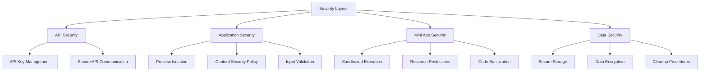

# Lahat: Security Architecture

<!-- SUMMARY -->
This document outlines the security architecture of Lahat, including the security layers, threat model, mitigation strategies, and best practices for ensuring safe generation and execution of mini applications.
<!-- /SUMMARY -->

<!-- RELATED DOCUMENTS -->
related '../architecture/technical_architecture.md'
related '../architecture/window_sheets_architecture.md'
related '../development/code_organization.md'
<!-- /RELATED DOCUMENTS -->

## Security Overview

Lahat is designed with security as a core principle, implementing multiple layers of protection to ensure the safe generation and execution of mini applications. This document outlines the security architecture, potential threats, and mitigation strategies employed throughout the application.



## Threat Model

### Potential Threats

1. **Malicious Generated Code**
   - Risk: Claude could potentially generate code that attempts to access system resources or execute harmful operations
   - Impact: System compromise, data theft, or damage to user's computer

2. **API Key Compromise**
   - Risk: Unauthorized access to the user's Claude API key
   - Impact: Unauthorized usage, potential financial impact from API usage charges

3. **Insecure Data Storage**
   - Risk: Sensitive data stored in an insecure manner
   - Impact: Exposure of API keys or user-generated content

4. **Cross-Process Attacks**
   - Risk: Malicious code in a mini app attempting to access the main process
   - Impact: Potential elevation of privileges and system access

5. **Injection Attacks**
   - Risk: Malicious input that could lead to code execution or data exposure
   - Impact: System compromise or data leakage

## Security Measures

### API Security

#### API Key Management

```javascript
// From store.js
const schema = {
  apiKey: {
    type: 'string'
  },
  // Other schema properties...
};

// From main.js
ipcMain.handle('set-api-key', async (event, apiKey) => {
  try {
    store.set('apiKey', apiKey);
    claudeClient = new ClaudeClient(apiKey);
    return { success: true };
  } catch (error) {
    return {
      success: false,
      error: error.message
    };
  }
});
```

- API keys are stored securely using electron-store, which encrypts sensitive data
- Keys are never exposed to the renderer process directly
- API key validation occurs in the main process
- Keys are never included in generated code or logs

#### Secure API Communication

- All communication with the Claude API uses HTTPS
- The Anthropic SDK handles secure authentication
- API requests are made only from the main process, never from renderer or mini app processes
- Error handling prevents leakage of sensitive information

### Application Security

#### Process Isolation

```javascript
// From main.js
function createMainWindow() {
  const win = new BrowserWindow({
    // Window properties...
    webPreferences: {
      nodeIntegration: false,
      contextIsolation: true,
      sandbox: false,
      preload: path.join(__dirname, 'preload.cjs'),
      // Disable DevTools in production
      devTools: process.env.NODE_ENV === 'development'
    }
  });
  // Window setup...
}
```

- The application follows Electron security best practices
- Context isolation is enabled to prevent prototype pollution
- Node integration is disabled in renderer processes
- Preload scripts provide a secure bridge for IPC communication
- DevTools are disabled in production builds

#### Content Security Policy

```html
<!-- From index.html -->
<meta http-equiv="Content-Security-Policy" 
      content="default-src 'self';
               script-src 'self';
               style-src 'self' 'unsafe-inline';
               connect-src 'self' https://api.lahat.nerdnest.engineering https://lahat.nerdnest.engineering https://*.clerk.accounts.dev;
               img-src 'self';
               font-src 'self';
               object-src 'none';
               base-uri 'none';
               form-action 'none';">
```

- Strict Content Security Policy (CSP) is applied to all windows
- Prevents execution of inline scripts (except for styles where needed)
- Restricts resource loading to the application itself
- Blocks potentially dangerous resource types
- Prevents form submissions and base URI manipulation

#### Input Validation

- All user inputs are validated before processing
- Prompt inputs are sanitized before sending to Claude
- Generated code is validated before execution
- Error handling prevents processing of invalid inputs

### Mini App Security

#### Sandboxed Execution

```javascript
// From main.js
function createMiniAppWindow(appName, htmlContent, filePath, conversationId) {
  const win = new BrowserWindow({
    // Window properties...
    webPreferences: {
      nodeIntegration: false,
      contextIsolation: true,
      sandbox: true, // Sandbox for security
      preload: path.join(__dirname, 'miniAppPreload.cjs'),
    }
  });
  // Window setup...
}
```

- Mini apps run in sandboxed BrowserWindows
- Sandbox mode is enabled to restrict capabilities
- Node integration is disabled to prevent access to Node.js APIs
- Context isolation prevents access to Electron or browser internals
- Custom preload script provides minimal required functionality

#### Resource Restrictions

- Mini apps cannot access the file system directly
- Network requests are restricted by CSP
- Access to system resources is blocked
- IPC communication is limited to specific, safe channels
- Window creation and manipulation is controlled

#### Code Sanitization

- Generated HTML is validated before execution
- Potentially dangerous patterns are detected and blocked
- Scripts are executed in a controlled environment
- Console logs are captured and monitored
- Error events are tracked and reported

### Data Security

#### Secure Storage

```javascript
// From claudeClient.js
this.appStoragePath = path.join(app.getPath('userData'), 'generated-apps');

async saveGeneratedApp(appName, htmlContent, prompt, conversationId = null) {
  // Create a safe filename from the app name
  const safeAppName = appName.replace(/[^a-z0-9]/gi, '_').toLowerCase();
  const timestamp = Date.now();
  const filename = `${safeAppName}_${timestamp}.html`;
  const filePath = path.join(this.appStoragePath, filename);
  
  // Save the HTML content
  try {
    await fs.writeFile(filePath, htmlContent);
    
    // Save metadata
    const metadataPath = path.join(this.appStoragePath, `${filename}.meta.json`);
    const metadata = {
      name: appName,
      created: new Date().toISOString(),
      prompt,
      conversationId: conversationId || `conv_${timestamp}`,
      versions: [
        {
          timestamp,
          filePath
        }
      ]
    };
    
    await fs.writeFile(metadataPath, JSON.stringify(metadata, null, 2));
    
    return {
      filename,
      filePath,
      metadata
    };
  } catch (error) {
    throw new Error(`Failed to save generated app: ${error.message}`);
  }
}
```

- Generated apps are stored in the user's application data directory
- File paths are sanitized to prevent directory traversal
- Metadata is stored separately from application code
- Access to stored data is restricted to the application

#### Data Encryption

- API keys are encrypted at rest using electron-store
- Sensitive data is never stored in plain text
- Communication channels are encrypted using HTTPS
- No sensitive data is stored in logs or temporary files

#### Cleanup Procedures

```javascript
// From main.js
win.on('closed', () => {
  if (conversationId) {
    miniAppWindows.delete(conversationId);
  }
  
  // Delete the temp file if it's not a saved app
  if (!filePath) {
    fs.unlink(tempFilePath).catch(() => {});
  }
});
```

- Temporary files are deleted when no longer needed
- Window references are cleaned up to prevent memory leaks
- Resources are properly released when windows are closed
- Deleted apps are completely removed from storage

## Security Best Practices

### For Developers

1. **Follow Electron Security Guidelines**
   - Keep contextIsolation enabled
   - Disable nodeIntegration in renderer processes
   - Use preload scripts for IPC communication
   - Apply strict Content Security Policy

2. **Secure API Usage**
   - Store API keys securely
   - Validate all inputs before sending to APIs
   - Handle errors gracefully without exposing sensitive information
   - Use the latest SDK versions

3. **Code Review and Testing**
   - Review all code changes for security implications
   - Test for common vulnerabilities (XSS, injection, etc.)
   - Validate generated code before execution
   - Monitor for unexpected behavior

### For Users

1. **API Key Management**
   - Keep your Claude API key secure
   - Do not share your API key with others
   - Regenerate your API key if you suspect it has been compromised
   - Use environment variables for API keys in development

2. **Generated Code Review**
   - Review generated code before extensive use
   - Be cautious with complex applications
   - Report any suspicious behavior
   - Understand that generated code runs locally on your machine

3. **Regular Updates**
   - Keep the application updated to the latest version
   - Update dependencies regularly
   - Monitor for security advisories
   - Apply security patches promptly

## Security Monitoring and Response

### Monitoring

- Console logs from mini apps are captured and monitored
- Error events are tracked and reported
- Resource usage is monitored to detect abnormal behavior
- API usage is tracked to detect unauthorized access

### Incident Response

- Security issues should be reported to the development team
- Critical vulnerabilities will be addressed with priority
- Updates will be released to address security issues
- Users will be notified of security-related updates

## Future Security Enhancements

1. **Enhanced Code Analysis**
   - Implement static analysis of generated code
   - Detect and block potentially harmful patterns
   - Provide security scoring for generated apps

2. **Improved Sandboxing**
   - Further restrict capabilities of mini apps
   - Implement resource usage limits
   - Enhance isolation between mini apps

3. **User Permissions**
   - Allow users to control permissions for mini apps
   - Implement permission prompts for sensitive operations
   - Provide detailed information about resource usage

4. **Security Auditing**
   - Implement security auditing and logging
   - Provide audit trails for sensitive operations
   - Enable detection of suspicious activity
