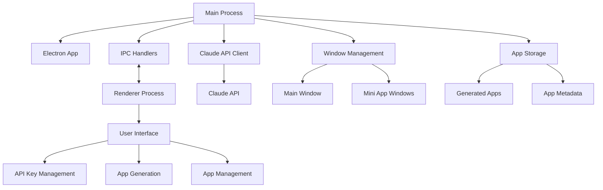
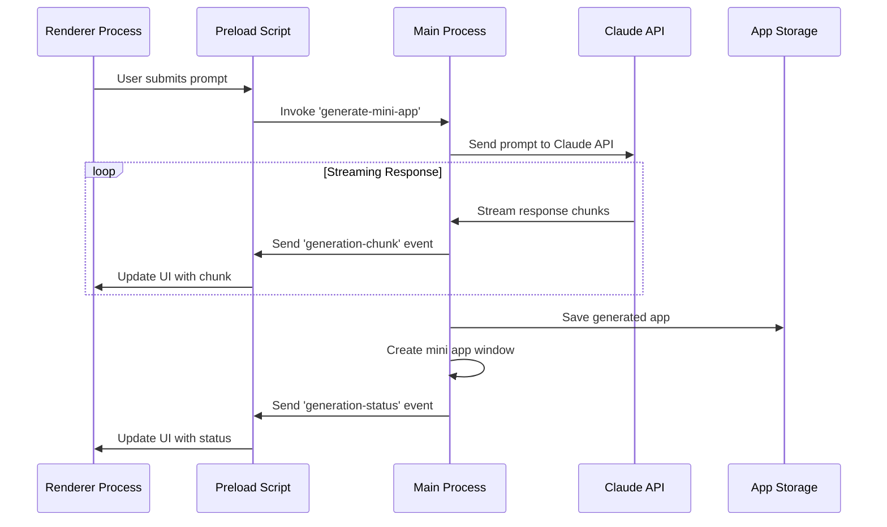

# Lahat: Technical Architecture

<!-- SUMMARY -->
This document describes the technical architecture of Lahat, including the main process, renderer process, Claude API integration, and window management system.
<!-- /SUMMARY -->

<!-- RELATED DOCUMENTS -->
related '../architecture/window_sheets_architecture.md'
related '../architecture/mini_app_generation_sequence.md'
related '../architecture/security.md'
related '../development/code_organization.md'
<!-- /RELATED DOCUMENTS -->

## System Architecture Overview

Lahat is built on Electron, providing a cross-platform desktop application that integrates with Claude AI to generate mini applications. The architecture follows a modular design with clear separation of concerns between the main process, renderer process, and generated mini apps.



## Core Components

### Main Process Components

1. **Electron App (`main.js`)**
   - Manages application lifecycle
   - Creates and manages windows
   - Handles IPC communication
   - Coordinates between components

2. **Claude API Client (`claudeClient.js`)**
   - Handles communication with Claude AI
   - Manages API key and authentication
   - Processes prompts and responses
   - Handles streaming responses
   - Manages conversation history

3. **App Storage (`store.js`)**
   - Manages persistent storage using electron-store
   - Stores API keys securely
   - Tracks recent apps and settings
   - Provides schema validation

4. **Window Management**
   - Creates and manages the main application window
   - Creates and manages mini app windows
   - Handles window lifecycle events
   - Implements security measures for windows

### Renderer Process Components

1. **User Interface (`index.html`, `renderer.js`, `styles.css`)**
   - Provides the main application interface
   - Handles user input and interactions
   - Displays generated apps and status
   - Manages application state

2. **Preload Scripts (`preload.cjs`, `miniAppPreload.cjs`)**
   - Provides secure bridge between renderer and main processes
   - Exposes limited API to renderer process
   - Implements context isolation
   - Captures console logs from mini apps

## Communication Flow

The application uses a multi-step process for mini app generation, with detailed communication between components. A simplified overview is shown below:



For a comprehensive view of the mini app generation process, including the two-step workflow (title/description generation followed by app generation), see the [Mini App Generation Sequence](mini_app_generation_sequence.md) document.

## Data Flow

1. **App Generation Flow**
   - User enters prompt in the main window
   - Prompt is sent to Claude API via the Claude client
   - Claude generates HTML/CSS/JS code
   - Code is streamed back to the application
   - Generated code is saved to the app storage
   - Mini app window is created with the generated code

2. **App Management Flow**
   - Application loads saved apps from storage
   - User can view, open, update, or delete apps
   - Opening an app creates a new window with the saved code
   - Updating an app sends a new prompt to Claude with conversation history
   - Deleting an app removes it from storage

## File Structure

```
/
├── main.js                 # Main process entry point
├── preload.cjs             # Preload script for main window
├── miniAppPreload.cjs      # Preload script for mini app windows
├── renderer.js             # Renderer process script
├── index.html              # Main window HTML
├── styles.css              # Application styles
├── claudeClient.js         # Claude API client
├── store.js                # Electron store configuration
├── context_sheets/         # Documentation
│   ├── README.md           # Context sheet documentation
│   ├── claude_mini_app_generator.md # Project overview
│   ├── development_roadmap.md # Development roadmap
│   ├── mini_app_generation_sequence.md # Detailed mini app generation process
│   ├── prompt_engineering.md # Prompt engineering strategies
│   ├── security.md         # Security architecture
│   ├── technical_architecture.md  # This file
│   └── user_experience.md  # User experience design
```

## Technical Implementation Details

### Claude API Integration

The application integrates with Claude AI using the Anthropic SDK:

```javascript
// From claudeClient.js
async generateApp(prompt, conversationId = null) {
  try {
    // Initialize messages with just the user prompt
    const messages = [
      { role: 'user', content: prompt }
    ];

    // If this is a continuation of a conversation, load previous messages
    if (conversationId) {
      const previousMessages = await this.loadConversation(conversationId);
      if (previousMessages && previousMessages.length > 0) {
        // Filter out any system messages from previous conversations
        const filteredMessages = previousMessages.filter(msg => msg.role !== 'system');
        messages.unshift(...filteredMessages);
      }
    }

    const response = await this.anthropic.messages.create({
      model: 'claude-3-7-sonnet-20250219', // Updated to latest model
      max_tokens: 64000, // Reduced to maximum allowed for this model
      system: this.systemPrompt, // System prompt as top-level parameter
      messages,
      stream: true
    });

    return response;
  } catch (error) {
    console.error('Claude API Error details:', error);
    throw new Error(`Claude API Error: ${error.message}`);
  }
}
```

### Mini App Window Creation

Mini app windows are created with specific security settings and positioning:

```javascript
// From main.js
function createMiniAppWindow(appName, htmlContent, filePath, conversationId) {
  // Get default window size from settings
  const { defaultWindowWidth, defaultWindowHeight } = store.get('settings');
  
  const win = new BrowserWindow({
    width: defaultWindowWidth,
    height: defaultWindowHeight,
    titleBarStyle: 'hiddenInset',
    title: appName,
    backgroundColor: '#ffffff',
    // Add specific position parameters to ensure window is visible
    x: 100,
    y: 100,
    webPreferences: {
      nodeIntegration: false,
      contextIsolation: true,
      sandbox: true, // Sandbox for security
      preload: path.join(__dirname, 'miniAppPreload.cjs'),
    }
  });

  // Create a temporary file for the HTML content
  const tempFilePath = filePath || path.join(app.getPath('temp'), `${Date.now()}.html`);
  
  // Save the HTML content to the file
  fs.writeFile(tempFilePath, htmlContent)
    .then(() => {
      // Load the file
      win.loadFile(tempFilePath);
      
      // Store the window reference
      if (conversationId) {
        miniAppWindows.set(conversationId, {
          window: win,
          filePath: tempFilePath,
          name: appName
        });
      }
      
      // Clean up when the window is closed
      win.on('closed', () => {
        if (conversationId) {
          miniAppWindows.delete(conversationId);
        }
        
        // Delete the temp file if it's not a saved app
        if (!filePath) {
          fs.unlink(tempFilePath).catch(() => {});
        }
      });
    })
    .catch(error => {
      console.error('Failed to create mini app window:', error);
      win.close();
    });

  return win;
}
```

### IPC Communication

The application uses IPC for secure communication between processes:

```javascript
// From preload.cjs
contextBridge.exposeInMainWorld(
  'electronAPI', 
  {
    // Mini app generation and management
    generateMiniApp: async (params) => {
      try {
        return await ipcRenderer.invoke('generate-mini-app', params);
      } catch (error) {
        console.error('Error generating mini app:', error);
        throw error;
      }
    },
    // Other IPC methods...
  }
);
```

### App Storage

The application uses electron-store for persistent storage:

```javascript
// From store.js
import Store from 'electron-store';

// Define the schema for our store
const schema = {
  apiKey: {
    type: 'string'
  },
  recentApps: {
    type: 'array',
    items: {
      type: 'object',
      properties: {
        id: { type: 'string' },
        name: { type: 'string' },
        created: { type: 'string' },
        filePath: { type: 'string' }
      }
    },
    default: []
  },
  settings: {
    type: 'object',
    properties: {
      defaultWindowWidth: { type: 'number', default: 800 },
      defaultWindowHeight: { type: 'number', default: 600 },
      theme: { type: 'string', enum: ['light', 'dark'], default: 'light' }
    },
    default: {
      defaultWindowWidth: 800,
      defaultWindowHeight: 600,
      theme: 'light'
    }
  }
};

// Create the store
const store = new Store({ schema });
```

## System Requirements

- **Operating System:** Windows, macOS, or Linux
- **Node.js:** v14.0.0 or higher
- **Electron:** v34.1.1 or higher
- **Dependencies:**
  - @anthropic-ai/sdk: ^0.38.0
  - electron-store: ^8.1.0

## Performance Considerations

1. **Response Streaming**
   - Claude's responses are streamed to provide real-time feedback
   - Chunks are processed and displayed incrementally
   - Progress indicators show generation status

2. **Window Management**
   - Windows are created on demand and cleaned up when closed
   - Resources are managed to prevent memory leaks
   - Temporary files are deleted when no longer needed
   - Windows are positioned at specific coordinates (x: 100, y: 100) to ensure visibility

3. **Error Handling**
   - Comprehensive error handling throughout the application
   - User-friendly error messages
   - Graceful degradation when services are unavailable

## Technical Debt and Improvement Opportunities

1. **Code Organization**
   - Further modularization of components
   - Separation of concerns for better maintainability
   - Consistent error handling patterns

2. **Testing**
   - Implementation of unit and integration tests
   - Automated testing for UI components
   - Test coverage for error scenarios

3. **Build and Deployment**
   - Streamlined build process
   - Automated releases
   - Platform-specific optimizations

4. **Planned Integrations**
   - Local LLM integration via Ollama (as mentioned in the development roadmap)
   - MCP (Model Context Protocol) support for extending mini app capabilities
