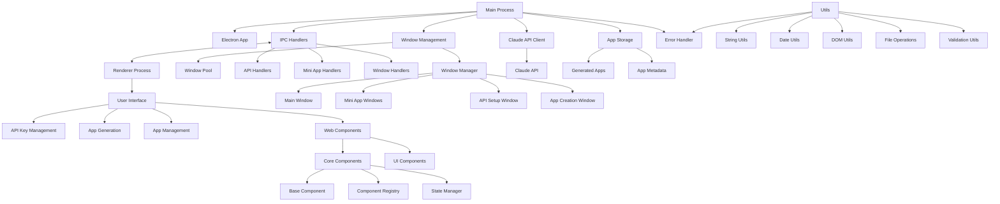
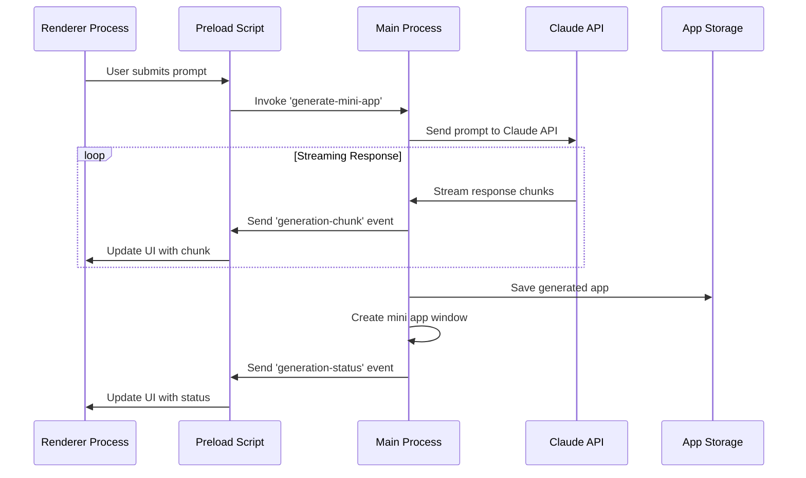

# Lahat: Technical Architecture

<!-- SUMMARY -->
This document describes the technical architecture of Lahat, including the main process, renderer process, Claude API integration, and window management system.
<!-- /SUMMARY -->

<!-- RELATED DOCUMENTS -->
related '../architecture/window_sheets_architecture.md'
related '../architecture/mini_app_generation_sequence.md'
related '../architecture/security.md'
related '../development/code_organization.md'
<!-- /RELATED DOCUMENTS -->

## System Architecture Overview

Lahat is built on Electron, providing a cross-platform desktop application that integrates with Claude AI to generate mini applications. The architecture follows a modular design with clear separation of concerns between the main process, renderer process, and generated mini apps.



## Core Components

### Main Process Components

1. **Electron App (`main.js`)**
   - Manages application lifecycle
   - Creates and manages windows
   - Handles IPC communication
   - Coordinates between components

2. **Claude API Client (`claudeClient.js`)**
   - Handles communication with Claude AI
   - Manages API key and authentication
   - Processes prompts and responses
   - Handles streaming responses
   - Manages conversation history

3. **App Storage (`store.js`)**
   - Manages persistent storage using electron-store
   - Stores API keys securely
   - Tracks recent apps and settings
   - Provides schema validation

4. **Window Management**
   - Creates and manages the main application window
   - Creates and manages mini app windows
   - Handles window lifecycle events
   - Implements security measures for windows

### Renderer Process Components

1. **User Interface (`index.html`, `renderer.js`, `styles.css`)**
   - Provides the main application interface
   - Handles user input and interactions
   - Displays generated apps and status
   - Manages application state

2. **Preload Scripts (`preload.cjs`, `miniAppPreload.cjs`)**
   - Provides secure bridge between renderer and main processes
   - Exposes limited API to renderer process
   - Implements context isolation
   - Captures console logs from mini apps

## Communication Flow

The application uses a multi-step process for mini app generation, with detailed communication between components. A simplified overview is shown below:



For a comprehensive view of the mini app generation process, including the two-step workflow (title/description generation followed by app generation), see the [Mini App Generation Sequence](mini_app_generation_sequence.md) document.

## Data Flow

1. **App Generation Flow**
   - User enters prompt in the main window
   - Prompt is sent to Claude API via the Claude client
   - Claude generates HTML/CSS/JS code
   - Code is streamed back to the application
   - Generated code is saved to the app storage
   - Mini app window is created with the generated code

2. **App Management Flow**
   - Application loads saved apps from storage
   - User can view, open, update, or delete apps
   - Opening an app creates a new window with the saved code
   - Updating an app sends a new prompt to Claude with conversation history
   - Deleting an app removes it from storage

## File Structure

The application follows a modular directory structure that organizes code by functionality:

```
/
├── main.js                 # Main process entry point
├── preload.cjs             # Preload script for main window
├── miniAppPreload.cjs      # Preload script for mini app windows
├── store.js                # Electron store configuration
├── claudeClient.js         # Claude API client
├── components/             # Web components
│   ├── core/               # Core component functionality
│   │   ├── base-component.js           # Base component class
│   │   ├── component-registry.js       # Component registration
│   │   ├── dynamic-loader.js           # Dynamic component loading
│   │   ├── state-manager.js            # State management
│   │   ├── utils.js                    # Component utilities
│   │   └── error-handling/             # Error handling components
│   ├── ui/                 # UI components
│   │   ├── cards/          # Card components
│   │   ├── containers/     # Container components
│   │   └── modals/         # Modal components
│   ├── main/               # Main window components
│   └── mini-app/           # Mini app components
├── modules/                # Application modules
│   ├── ipc/                # IPC communication
│   │   ├── index.js                    # IPC module entry point
│   │   ├── apiHandlers.js              # API-related IPC handlers
│   │   ├── ipcHandler.js               # IPC handler class
│   │   ├── ipcTypes.js                 # IPC channel definitions
│   │   ├── miniAppHandlers.js          # Mini app IPC handlers
│   │   └── windowHandlers.js           # Window IPC handlers
│   ├── windowManager/      # Window management
│   │   ├── index.js                    # Window manager entry point
│   │   ├── windowManager.js            # Window creation and management
│   │   ├── windowManager-web-components.js # Web component window manager
│   │   └── windowPool.js               # Window pooling
│   ├── utils/              # Utility functions
│   │   ├── index.js                    # Utils entry point
│   │   ├── dateUtils.js                # Date utilities
│   │   ├── domUtils.js                 # DOM utilities
│   │   ├── errorHandler.js             # Error handling
│   │   ├── fileOperations.js           # File operations
│   │   ├── stringUtils.js              # String utilities
│   │   ├── titleDescriptionGenerator.js # Title/description generation
│   │   └── validationUtils.js          # Validation utilities
│   └── miniAppManager.js   # Mini app management
├── renderers/              # Renderer process scripts
│   ├── main.js             # Main window renderer
│   ├── api-setup.js        # API setup window renderer
│   ├── app-creation.js     # App creation window renderer
│   └── main-web-components.js # Web components renderer
├── styles/                 # CSS styles
│   ├── main.css            # Main window styles
│   ├── api-setup.css       # API setup window styles
│   └── app-creation.css    # App creation window styles
├── index.html              # Main window HTML
├── api-setup.html          # API setup window HTML
├── app-creation.html       # App creation window HTML
└── context_sheets/         # Documentation
    ├── README.md           # Documentation index
    ├── architecture/       # Architecture documentation
    ├── development/        # Development documentation
    ├── user_experience/    # User experience documentation
    └── changes/            # Change documentation
```

## Technical Implementation Details

### Claude API Integration

The application integrates with Claude AI using the Anthropic SDK:

```javascript
// From claudeClient.js
async generateApp(prompt, conversationId = null) {
  try {
    // Initialize messages with just the user prompt
    const messages = [
      { role: 'user', content: prompt }
    ];

    // If this is a continuation of a conversation, load previous messages
    if (conversationId) {
      const previousMessages = await this.loadConversation(conversationId);
      if (previousMessages && previousMessages.length > 0) {
        // Filter out any system messages from previous conversations
        const filteredMessages = previousMessages.filter(msg => msg.role !== 'system');
        messages.unshift(...filteredMessages);
      }
    }

    const response = await this.anthropic.messages.create({
      model: 'claude-3-7-sonnet-20250219', // Updated to latest model
      max_tokens: 64000, // Reduced to maximum allowed for this model
      system: this.systemPrompt, // System prompt as top-level parameter
      messages,
      stream: true
    });

    return response;
  } catch (error) {
    console.error('Claude API Error details:', error);
    throw new Error(`Claude API Error: ${error.message}`);
  }
}
```

### Mini App Window Creation

Mini app windows are created with specific security settings and positioning:

```javascript
// From main.js
function createMiniAppWindow(appName, htmlContent, filePath, conversationId) {
  // Get default window size from settings
  const { defaultWindowWidth, defaultWindowHeight } = store.get('settings');
  
  const win = new BrowserWindow({
    width: defaultWindowWidth,
    height: defaultWindowHeight,
    titleBarStyle: 'hiddenInset',
    title: appName,
    backgroundColor: '#ffffff',
    // Add specific position parameters to ensure window is visible
    x: 100,
    y: 100,
    webPreferences: {
      nodeIntegration: false,
      contextIsolation: true,
      sandbox: true, // Sandbox for security
      preload: path.join(__dirname, 'miniAppPreload.cjs'),
    }
  });

  // Create a temporary file for the HTML content
  const tempFilePath = filePath || path.join(app.getPath('temp'), `${Date.now()}.html`);
  
  // Save the HTML content to the file
  fs.writeFile(tempFilePath, htmlContent)
    .then(() => {
      // Load the file
      win.loadFile(tempFilePath);
      
      // Store the window reference
      if (conversationId) {
        miniAppWindows.set(conversationId, {
          window: win,
          filePath: tempFilePath,
          name: appName
        });
      }
      
      // Clean up when the window is closed
      win.on('closed', () => {
        if (conversationId) {
          miniAppWindows.delete(conversationId);
        }
        
        // Delete the temp file if it's not a saved app
        if (!filePath) {
          fs.unlink(tempFilePath).catch(() => {});
        }
      });
    })
    .catch(error => {
      console.error('Failed to create mini app window:', error);
      win.close();
    });

  return win;
}
```

### IPC Communication

The application uses IPC for secure communication between processes:

```javascript
// From preload.cjs
contextBridge.exposeInMainWorld(
  'electronAPI', 
  {
    // Mini app generation and management
    generateMiniApp: async (params) => {
      try {
        return await ipcRenderer.invoke('generate-mini-app', params);
      } catch (error) {
        console.error('Error generating mini app:', error);
        throw error;
      }
    },
    // Other IPC methods...
  }
);
```

### App Storage

The application uses electron-store for persistent storage:

```javascript
// From store.js
import Store from 'electron-store';

// Define the schema for our store
const schema = {
  apiKey: {
    type: 'string'
  },
  recentApps: {
    type: 'array',
    items: {
      type: 'object',
      properties: {
        id: { type: 'string' },
        name: { type: 'string' },
        created: { type: 'string' },
        filePath: { type: 'string' }
      }
    },
    default: []
  },
  settings: {
    type: 'object',
    properties: {
      defaultWindowWidth: { type: 'number', default: 800 },
      defaultWindowHeight: { type: 'number', default: 600 },
      theme: { type: 'string', enum: ['light', 'dark'], default: 'light' }
    },
    default: {
      defaultWindowWidth: 800,
      defaultWindowHeight: 600,
      theme: 'light'
    }
  }
};

// Create the store
const store = new Store({ schema });
```

## System Requirements

- **Operating System:** Windows, macOS, or Linux
- **Node.js:** v14.0.0 or higher
- **Electron:** v34.1.1 or higher
- **Dependencies:**
  - @anthropic-ai/sdk: ^0.38.0
  - electron-store: ^8.1.0

## Performance Considerations

1. **Response Streaming**
   - Claude's responses are streamed to provide real-time feedback
   - Chunks are processed and displayed incrementally
   - Progress indicators show generation status

2. **Window Management**
   - Windows are created on demand and cleaned up when closed
   - Resources are managed to prevent memory leaks
   - Temporary files are deleted when no longer needed
   - Windows are positioned at specific coordinates (x: 100, y: 100) to ensure visibility

3. **Error Handling**
   - Comprehensive error handling throughout the application
   - User-friendly error messages
   - Graceful degradation when services are unavailable

## Recent Architectural Improvements

The application has undergone significant architectural improvements to enhance maintainability, reliability, and performance. These improvements include:

### 1. Enhanced Error Handling

A centralized error handling system has been implemented to provide consistent error reporting and logging across the application:

```javascript
// From modules/utils/errorHandler.js
export class ErrorHandler {
  static ERROR_LEVELS = {
    INFO: 'info',
    WARNING: 'warning',
    ERROR: 'error',
    FATAL: 'fatal'
  };
  
  static logError(context, error, level = ErrorHandler.ERROR_LEVELS.ERROR) {
    const timestamp = new Date().toISOString();
    console.error(`[${timestamp}] [${level.toUpperCase()}] [${context}]:`, error);
  }
  
  static formatErrorForUI(error) {
    // Format error for UI display
    return {
      message: error.message || 'An unknown error occurred',
      details: error.stack || ''
    };
  }
  
  static formatErrorForIPC(error, operation = '') {
    // Format error for IPC response
    return {
      success: false,
      error: error.message || 'An unknown error occurred',
      operation,
      timestamp: new Date().toISOString()
    };
  }
  
  static getUserFriendlyMessage(error) {
    // Map technical errors to user-friendly messages
    const errorMap = {
      'ENOTFOUND': 'Could not connect to the server. Please check your internet connection.',
      'ECONNREFUSED': 'Connection refused. The server may be down or unreachable.',
      'ETIMEDOUT': 'Connection timed out. Please try again later.',
      'UNAUTHORIZED': 'Authentication failed. Please check your API key.',
      'FORBIDDEN': 'Access denied. You do not have permission to perform this action.',
      'NOT_FOUND': 'The requested resource was not found.',
      'INTERNAL_SERVER_ERROR': 'The server encountered an error. Please try again later.'
    };
    
    // Extract error code from message or use the message itself
    const errorCode = error.code || error.message;
    
    return errorMap[errorCode] || error.message || 'An unknown error occurred';
  }
}
```

This error handler is used throughout the application to provide consistent error handling and reporting:

```javascript
// Example usage in an IPC handler
try {
  // Some code that might throw an error
  const result = await someAsyncOperation();
  return createSuccessResponse(result);
} catch (error) {
  ErrorHandler.logError('handleSomeOperation', error);
  return ErrorHandler.formatErrorForIPC(error, 'some-operation');
}
```

### 2. Utility Function Organization

Utility functions have been organized into specialized modules to make them easier to find and use:

```javascript
// From modules/utils/index.js
export * from './errorHandler.js';
export * from './stringUtils.js';
export * from './dateUtils.js';
export * from './validationUtils.js';
export * from './domUtils.js';
export * from './fileOperations.js';
```

Each utility module focuses on a specific type of functionality:

- **stringUtils.js**: String manipulation functions (truncation, slugification, etc.)
- **dateUtils.js**: Date formatting and manipulation functions
- **validationUtils.js**: Input validation functions
- **domUtils.js**: DOM manipulation functions (for renderer processes)
- **fileOperations.js**: File system operations
- **errorHandler.js**: Error handling functions

### 3. Component System Enhancements

The application now uses a web component-based architecture for the UI, with a base component class that provides common functionality:

```javascript
// From components/core/base-component.js
export class BaseComponent extends HTMLElement {
  constructor() {
    super();
    this.attachShadow({ mode: 'open' });
    this._connected = false;
    this._initialized = false;
    this._eventListeners = new Map();
  }
  
  // Lifecycle hooks
  connectedCallback() {
    this._connected = true;
    if (!this._initialized) {
      this._initialized = true;
      this.initialize();
    }
  }
  
  disconnectedCallback() {
    this._connected = false;
    this.cleanup();
  }
  
  attributeChangedCallback(name, oldValue, newValue) {
    if (oldValue !== newValue) {
      this.onAttributeChanged(name, oldValue, newValue);
    }
  }
  
  // Event handling
  addEventListener(element, type, listener, options = {}) {
    element.addEventListener(type, listener, options);
  }
  
  trackEventListener(element, type, listener, options = {}) {
    // Store reference to event listener for automatic cleanup
    if (!this._eventListeners.has(element)) {
      this._eventListeners.set(element, []);
    }
    
    this._eventListeners.get(element).push({ type, listener, options });
    element.addEventListener(type, listener, options);
  }
  
  // Rendering
  render(html, css) {
    const style = document.createElement('style');
    style.textContent = css;
    
    this.shadowRoot.innerHTML = '';
    this.shadowRoot.appendChild(style);
    
    const template = document.createElement('template');
    template.innerHTML = html;
    this.shadowRoot.appendChild(template.content.cloneNode(true));
    
    return this.shadowRoot;
  }
  
  // Methods to override
  initialize() {
    // Override in subclass
  }
  
  cleanup() {
    // Remove all tracked event listeners
    for (const [element, listeners] of this._eventListeners.entries()) {
      for (const { type, listener, options } of listeners) {
        element.removeEventListener(type, listener, options);
      }
    }
    
    this._eventListeners.clear();
  }
  
  onAttributeChanged(name, oldValue, newValue) {
    // Override in subclass
  }
}
```

A component registry has been added to provide a central place to register and retrieve components:

```javascript
// From components/core/component-registry.js
export class ComponentRegistry {
  constructor() {
    this.components = new Map();
    this.pendingRegistrations = new Map();
  }
  
  register(name, componentClass) {
    if (customElements.get(name)) {
      console.warn(`Component ${name} is already registered`);
      return;
    }
    
    try {
      customElements.define(name, componentClass);
      this.components.set(name, componentClass);
      
      // Resolve any pending promises waiting for this component
      if (this.pendingRegistrations.has(name)) {
        const resolvers = this.pendingRegistrations.get(name);
        resolvers.forEach(resolve => resolve(componentClass));
        this.pendingRegistrations.delete(name);
      }
    } catch (error) {
      console.error(`Failed to register component ${name}:`, error);
    }
  }
  
  get(name) {
    return this.components.get(name);
  }
  
  getAsync(name) {
    if (this.components.has(name)) {
      return Promise.resolve(this.components.get(name));
    }
    
    return new Promise(resolve => {
      if (!this.pendingRegistrations.has(name)) {
        this.pendingRegistrations.set(name, []);
      }
      
      this.pendingRegistrations.get(name).push(resolve);
    });
  }
}

// Create a singleton instance
export const registry = new ComponentRegistry();
```

### 4. State Management

A simple state management system has been implemented to make it easier to share and synchronize state between different parts of the application:

```javascript
// From components/core/state-manager.js
export class StateManager {
  constructor(initialState = {}) {
    this.state = { ...initialState };
    this.listeners = new Map();
    this.nextListenerId = 1;
  }
  
  get(key = null) {
    if (key === null) {
      return { ...this.state };
    }
    
    return this.state[key];
  }
  
  set(newState) {
    const oldState = { ...this.state };
    const changedKeys = [];
    
    // Update state and track changed keys
    Object.entries(newState).forEach(([key, value]) => {
      if (this.state[key] !== value) {
        this.state[key] = value;
        changedKeys.push(key);
      }
    });
    
    // If nothing changed, don't notify listeners
    if (changedKeys.length === 0) {
      return;
    }
    
    // Notify listeners
    this.listeners.forEach((listener) => {
      const { keys, callback } = listener;
      
      // If listener is interested in any of the changed keys, notify it
      if (keys === null || keys.some(key => changedKeys.includes(key))) {
        callback(this.state, oldState, changedKeys);
      }
    });
  }
  
  subscribe(keys, callback) {
    const id = this.nextListenerId++;
    this.listeners.set(id, { keys, callback });
    
    // Return unsubscribe function
    return () => {
      this.listeners.delete(id);
    };
  }
}

// Create a singleton instance
export const appState = new StateManager({
  apps: [],
  selectedAppId: null,
  isGenerating: false,
  theme: 'light'
});
```

### 5. Window Management

A window pool has been implemented to improve performance when opening multiple windows:

```javascript
// From modules/windowManager/windowPool.js
export class WindowPool {
  constructor(maxPoolSize = 5) {
    this.pools = new Map();
    this.maxPoolSize = maxPoolSize;
  }
  
  getWindow(type) {
    if (!this.pools.has(type)) {
      return null;
    }
    
    const pool = this.pools.get(type);
    if (pool.length === 0) {
      return null;
    }
    
    return pool.pop();
  }
  
  releaseWindow(type, window) {
    if (!this.pools.has(type)) {
      this.pools.set(type, []);
    }
    
    const pool = this.pools.get(type);
    
    // If the pool is full, destroy the window
    if (pool.length >= this.maxPoolSize) {
      window.destroy();
      return;
    }
    
    // Reset window state
    window.webContents.loadURL('about:blank');
    
    // Add to pool
    pool.push(window);
  }
  
  createOrGetWindow(type, createFn) {
    // Try to get a window from the pool
    const pooledWindow = this.getWindow(type);
    if (pooledWindow) {
      return pooledWindow;
    }
    
    // Create a new window
    return createFn();
  }
  
  clear(type = null) {
    if (type) {
      // Clear specific pool
      if (this.pools.has(type)) {
        const pool = this.pools.get(type);
        pool.forEach(window => window.destroy());
        this.pools.delete(type);
      }
    } else {
      // Clear all pools
      this.pools.forEach(pool => {
        pool.forEach(window => window.destroy());
      });
      this.pools.clear();
    }
  }
}

// Create a singleton instance
export const windowPool = new WindowPool();
```

### 6. IPC Communication

A standardized IPC communication layer has been implemented to make it easier to add new IPC handlers and maintain existing ones:

```javascript
// From modules/ipc/ipcTypes.js
export const IpcChannels = {
  // API related
  SET_API_KEY: 'set-api-key',
  CHECK_API_KEY: 'check-api-key',
  
  // Mini app related
  GENERATE_MINI_APP: 'generate-mini-app',
  GENERATE_TITLE_AND_DESCRIPTION: 'generate-title-and-description',
  OPEN_MINI_APP: 'open-mini-app',
  UPDATE_MINI_APP: 'update-mini-app',
  DELETE_MINI_APP: 'delete-mini-app',
  
  // Window related
  OPEN_WINDOW: 'open-window',
  CLOSE_CURRENT_WINDOW: 'close-current-window',
  GET_WINDOW_PARAMS: 'get-window-params',
  NOTIFY_APP_UPDATED: 'notify-app-updated'
};

export function createSuccessResponse(data = {}) {
  return {
    success: true,
    ...data,
    timestamp: new Date().toISOString()
  };
}

export function createErrorResponse(error, operation = '') {
  return {
    success: false,
    error: error.message || 'An unknown error occurred',
    operation,
    timestamp: new Date().toISOString()
  };
}
```

An IPC handler class has been added to provide a standardized way to register and manage IPC handlers:

```javascript
// From modules/ipc/ipcHandler.js
export class IpcHandler {
  constructor() {
    this.handlers = new Map();
  }
  
  register(channel, handler) {
    if (this.handlers.has(channel)) {
      console.warn(`Handler for channel ${channel} is already registered. Overwriting.`);
    }
    
    this.handlers.set(channel, handler);
    return this;
  }
  
  unregister(channel) {
    this.handlers.delete(channel);
    return this;
  }
  
  registerMultiple(handlers) {
    Object.entries(handlers).forEach(([channel, handler]) => {
      this.register(channel, handler);
    });
    return this;
  }
  
  getHandler(channel) {
    return this.handlers.get(channel);
  }
  
  hasHandler(channel) {
    return this.handlers.has(channel);
  }
  
  getAllChannels() {
    return Array.from(this.handlers.keys());
  }
}

// Create a singleton instance
export const ipcHandler = new IpcHandler();
```

## Technical Debt and Improvement Opportunities

1. **Code Organization**
   - Further modularization of components
   - Separation of concerns for better maintainability
   - Consistent error handling patterns

2. **Testing**
   - Implementation of unit and integration tests
   - Automated testing for UI components
   - Test coverage for error scenarios

3. **Build and Deployment**
   - Streamlined build process
   - Automated releases
   - Platform-specific optimizations

4. **Planned Integrations**
   - Local LLM integration via Ollama (as mentioned in the development roadmap)
   - MCP (Model Context Protocol) support for extending mini app capabilities
