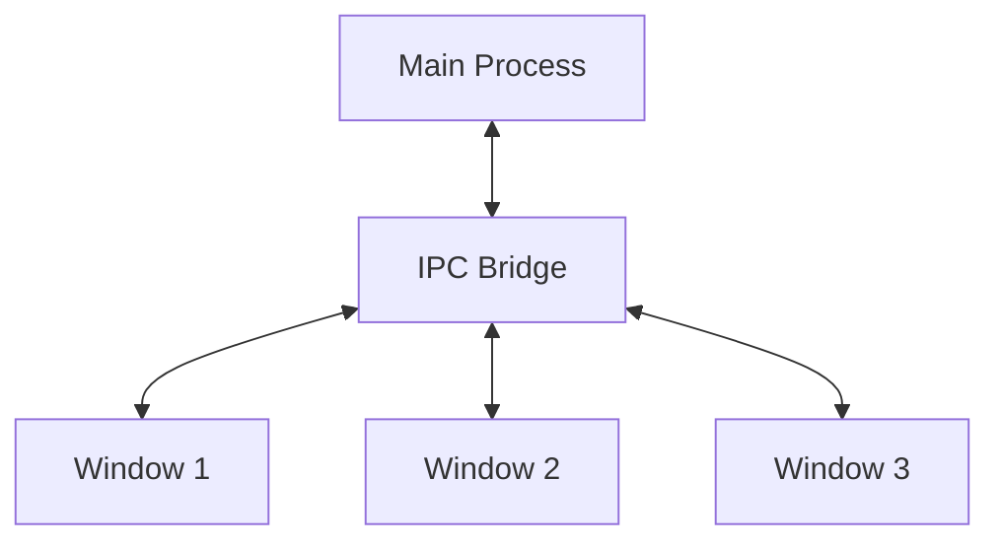

# Lahat: Window Sheets Architecture

<!-- SUMMARY -->
This document details the window sheets architecture that separates Lahat's UI into independent functional windows, including the window manager, window types, and communication patterns.
<!-- /SUMMARY -->

<!-- RELATED DOCUMENTS -->
related '../architecture/technical_architecture.md'
related '../development/code_organization.md'
<!-- /RELATED DOCUMENTS -->

## Overview

Lahat has transitioned from a monolithic UI to a window sheets architecture, where different functional areas are implemented as independent windows. This document outlines the architecture, components, and communication patterns of this approach.

## Architecture Components

### Window Manager

The window manager (`modules/windowManager/windowManager.js`) is responsible for:
- Creating and managing window instances
- Handling window lifecycle events
- Maintaining window state and configuration
- Providing a consistent API for window operations

### Window Types

1. **Main Window (App Gallery)**
   - Primary entry point for the application
   - Displays list of created mini apps
   - Provides access to app management functions
   - Launches other window types

2. **API Setup Sheet**
   - Handles Claude API key configuration
   - Validates API key with the Claude service
   - Stores API key securely

3. **App Creation Sheet**
   - Implements the 2-step app creation wizard
   - Handles title and description generation
   - Manages app generation process

4. **Mini App Windows**
   - Displays generated mini applications
   - Provides sandboxed execution environment
   - Implements window controls and management

## Communication Patterns

### IPC Communication

Windows communicate through Electron's IPC (Inter-Process Communication) system:



### Window Parameters

Windows can receive parameters during creation:

```javascript
// Example: Opening the app creation window
windowManager.createWindow('app-creation', {
  width: 800,
  height: 600,
  params: {
    initialPrompt: 'Create a calculator app'
  }
});
```

## Implementation Details

### Preload Scripts

Each window type uses a preload script to establish a secure bridge between the renderer process and the main process:

```javascript
// preload.cjs
const { contextBridge, ipcRenderer } = require('electron');

contextBridge.exposeInMainWorld(
  'electronAPI', 
  {
    openWindow: (type, params) => ipcRenderer.invoke('open-window', { type, params }),
    closeCurrentWindow: () => ipcRenderer.invoke('close-current-window'),
    getWindowParams: () => ipcRenderer.invoke('get-window-params'),
    // Other IPC methods...
  }
);
```

### Window Creation

Windows are created using the window manager:

```javascript
// modules/windowManager/windowManager.js
export function createWindow(type, options = {}) {
  const windowConfig = getWindowConfig(type, options);
  
  const win = new BrowserWindow({
    ...windowConfig,
    webPreferences: {
      nodeIntegration: false,
      contextIsolation: true,
      preload: path.join(__dirname, '../../preload.cjs')
    }
  });
  
  // Load the appropriate HTML file
  win.loadFile(`${type}.html`);
  
  // Store window parameters
  if (options.params) {
    windowParams.set(win.id, options.params);
  }
  
  // Set up event handlers
  win.on('closed', () => {
    windowParams.delete(win.id);
  });
  
  return win;
}
```

### Window State Management

The window manager tracks window state and parameters:

```javascript
// Window parameters storage
const windowParams = new Map();

// Get parameters for a specific window
export function getWindowParams(windowId) {
  return windowParams.get(windowId) || {};
}
```

## Security Considerations

The window sheets architecture enhances security through:

1. **Process Isolation** - Each window runs in its own renderer process
2. **Context Isolation** - Enabled for all windows to prevent prototype pollution
3. **Restricted API Access** - Windows only have access to explicitly exposed APIs
4. **Sandboxed Execution** - Mini app windows run in a sandboxed environment

## Benefits of Window Sheets Architecture

1. **Separation of Concerns** - Each window focuses on a specific functional area
2. **Improved Maintainability** - Smaller, focused components are easier to understand and modify
3. **Enhanced Extensibility** - New functionality can be added as new sheets without modifying existing code
4. **Better Resource Management** - Only load resources needed for active sheets
5. **Focused User Experience** - Each sheet addresses a specific task or workflow

## Future Improvements

1. **Customizable Workspace** - Allow users to arrange sheets according to their preferences
2. **Enhanced Collaboration** - Share specific sheets with other users
3. **Advanced Plugins** - Allow plugins to create their own sheets
4. **Progressive Disclosure** - Implement different levels of complexity in sheets
