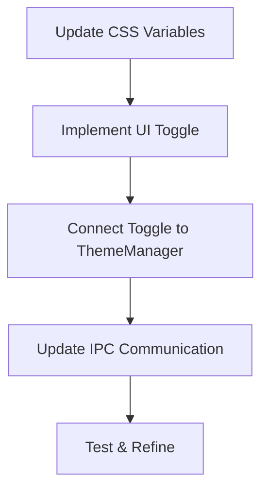
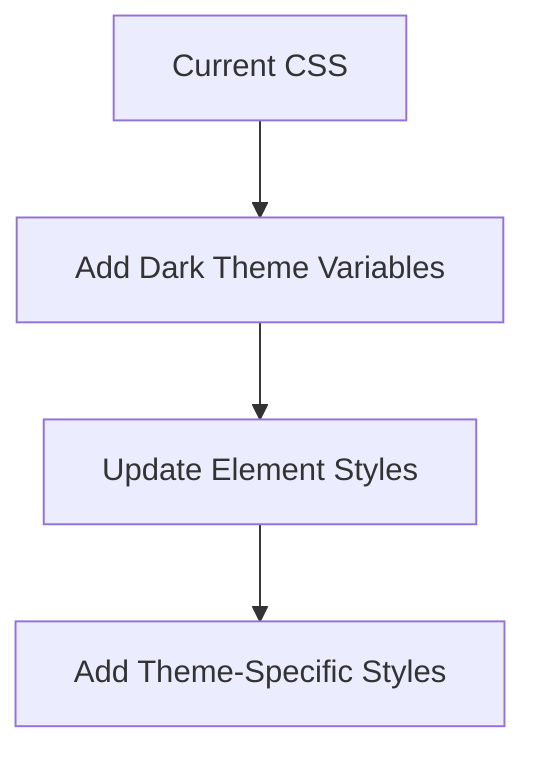
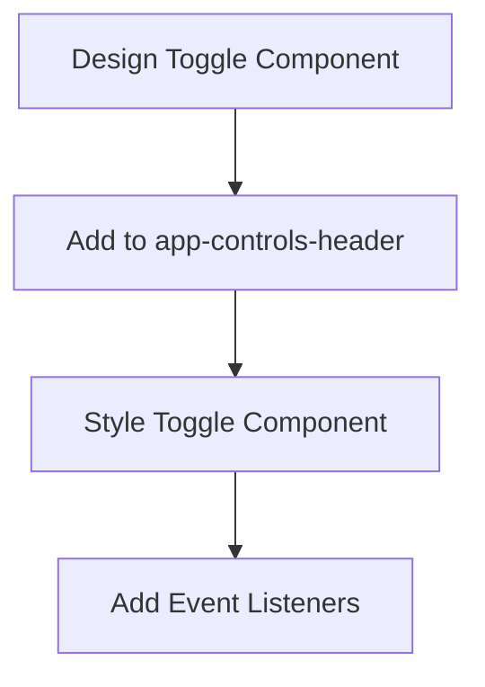
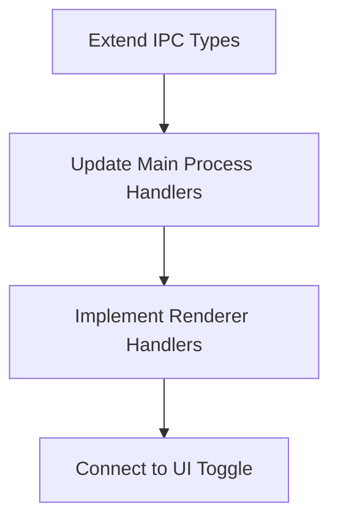
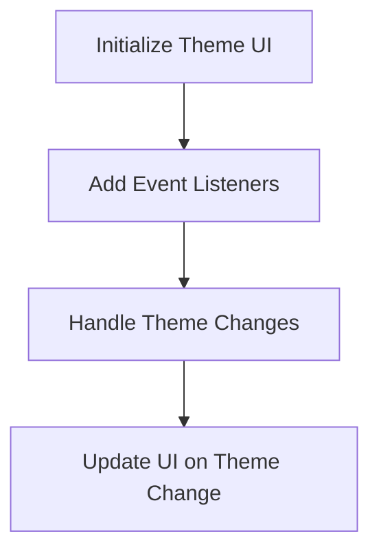

# Dark Mode Implementation Plan

<!-- SUMMARY -->
This document outlines the implementation plan for adding a dark mode feature to the Lahat application. The feature will include a simple toggle between light and dark modes in the app-controls-header area, and changes will apply immediately without requiring a restart. The implementation will focus on simplicity by only including a manual toggle without system theme integration for now.
<!-- /SUMMARY -->

<!-- RELATED DOCUMENTS -->
related '../architecture/technical_architecture.md'
related '../architecture/window_sheets_architecture.md'
related '../user_experience/user_experience.md'
<!-- /RELATED DOCUMENTS -->

## Overview

The dark mode implementation will provide users with the ability to switch between light and dark themes in the Lahat application. The existing ThemeManager class already has core functionality but needs UI integration and CSS updates. The implementation will focus on:

1. Updating CSS variables to support both light and dark themes
2. Adding a simple theme toggle in the app-controls-header
3. Connecting the UI to the ThemeManager
4. Ensuring immediate application of theme changes

This implementation will be kept simple by focusing only on a manual toggle without the system theme following option for now.



## 1. CSS Structure Updates

The current CSS uses variables for colors but needs dark theme variants:



### CSS Modifications

We'll modify `styles.css` to include dark theme variables:

```css
:root {
  /* Common variables */
  --border-radius: 8px;
  --shadow: 0 2px 10px rgba(0, 0, 0, 0.1);
  --drag-region-height: 38px;
  
  /* Light theme colors (default) */
  --primary-color: #4285f4;
  --primary-dark: #3367d6;
  --secondary-color: #34a853;
  --danger-color: #ea4335;
  --warning-color: #fbbc05;
  --light-gray: #f8f9fa;
  --medium-gray: #e0e0e0;
  --dark-gray: #5f6368;
  
  /* Background and text colors */
  --bg-color: #ffffff;
  --text-color: #202124;
  --card-bg-color: var(--light-gray);
  --modal-bg-color: white;
  --border-color: var(--medium-gray);
}

[data-theme="dark"] {
  /* Dark theme colors */
  --primary-color: #7baaf7;
  --primary-dark: #5c8df1;
  --secondary-color: #4cc669;
  --danger-color: #f16c6c;
  --warning-color: #fcd053;
  --light-gray: #2c2c2c;
  --medium-gray: #3e3e3e;
  --dark-gray: #b0b0b0;
  
  /* Background and text colors */
  --bg-color: #1e1e1e;
  --text-color: #e8eaed;
  --card-bg-color: #2d2d2d;
  --modal-bg-color: #2d2d2d;
  --border-color: #3e3e3e;
}
```

Update core element styles to use these variables:

```css
body {
  margin: 0;
  font-family: -apple-system, BlinkMacSystemFont, sans-serif;
  background: var(--bg-color);
  color: var(--text-color);
}

.window {
  max-width: 1200px;
  margin: 0 auto;
  background: var(--bg-color);
  height: 100vh;
  display: flex;
  flex-direction: column;
}

.section {
  background: var(--bg-color);
  border-radius: var(--border-radius);
  padding: 20px;
  box-shadow: var(--shadow);
}

.modal-content {
  background: var(--modal-bg-color);
  border-radius: var(--border-radius);
}
```

## 2. UI Toggle Component

We'll add a theme toggle to the app-controls-header:



### HTML Changes

In `main.html`, we'll add the toggle to the app-controls-header:

```html
<div class="app-controls-header">
  <h2>Lahat <span class="tagalog-text">ᜎᜑᜆ᜔</span></h2>
  <div class="app-controls">
    <!-- New theme toggle -->
    <div class="theme-toggle">
      <label class="toggle-switch">
        <input type="checkbox" id="theme-toggle">
        <span class="toggle-slider"></span>
      </label>
      <span id="theme-label">Light</span>
    </div>
    <!-- Existing buttons -->
    <button id="api-settings-button" class="secondary">API Settings</button>
    <button id="create-app-button" class="primary">Create New App</button>
    <!-- Other buttons -->
  </div>
</div>
```

### CSS for the Toggle

We'll add the following CSS to `styles.css` or `styles/main.css`:

```css
/* Theme Toggle */
.theme-toggle {
  display: flex;
  align-items: center;
  margin-right: 10px;
}

.toggle-switch {
  position: relative;
  display: inline-block;
  width: 40px;
  height: 20px;
  margin: 0 8px;
}

.toggle-switch input {
  opacity: 0;
  width: 0;
  height: 0;
}

.toggle-slider {
  position: absolute;
  cursor: pointer;
  top: 0;
  left: 0;
  right: 0;
  bottom: 0;
  background-color: var(--medium-gray);
  transition: .4s;
  border-radius: 20px;
}

.toggle-slider:before {
  position: absolute;
  content: "";
  height: 16px;
  width: 16px;
  left: 2px;
  bottom: 2px;
  background-color: white;
  transition: .4s;
  border-radius: 50%;
}

input:checked + .toggle-slider {
  background-color: var(--primary-color);
}

input:checked + .toggle-slider:before {
  transform: translateX(20px);
}
```

## 3. IPC Communication Updates

We need to update the IPC communication to handle theme changes:



### IPC Types Update

In `modules/ipc/ipcTypes.js`, add theme-related channels:

```javascript
export const IpcChannels = {
  // Existing channels...
  
  // Theme related
  GET_THEME_SETTINGS: 'get-theme-settings',
  SET_THEME: 'set-theme',
  THEME_CHANGED: 'theme-changed',
};
```

### Main Process Handlers

Add handlers to `modules/ipc/windowHandlers.js` or create a new file `modules/ipc/themeHandlers.js`:

```javascript
import themeManager from '../utils/themeManager.js';
import { ipcMain } from 'electron';

// Handle getting theme settings
async function handleGetThemeSettings() {
  return themeManager.getThemeSettings();
}

// Handle setting theme
async function handleSetTheme(event, { theme }) {
  themeManager.setTheme(theme);
  return { success: true };
}

// Register theme-related IPC handlers
export function registerThemeHandlers() {
  ipcMain.handle('get-theme-settings', handleGetThemeSettings);
  ipcMain.handle('set-theme', handleSetTheme);
}
```

### Preload Script Updates

Update `preload.cjs` to expose the new IPC methods:

```javascript
// Theme API
contextBridge.exposeInMainWorld('electronAPI', {
  // Existing API...
  
  // Theme API
  getThemeSettings: () => ipcRenderer.invoke('get-theme-settings'),
  setTheme: (theme) => ipcRenderer.invoke('set-theme', theme),
  onThemeChanged: (callback) => ipcRenderer.on('theme-changed', (event, settings) => callback(settings)),
});
```

## 4. Renderer Integration

Update `renderers/main.js` to handle theme toggling:



### Theme Initialization

Add to `renderers/main.js`:

```javascript
// Theme initialization
async function initializeTheme() {
  // Get current theme settings
  const themeSettings = await window.electronAPI.getThemeSettings();
  
  // Set initial UI state
  const themeToggle = document.getElementById('theme-toggle');
  const themeLabel = document.getElementById('theme-label');
  
  // Update toggle based on current theme
  themeToggle.checked = themeSettings.theme === 'dark';
  themeLabel.textContent = themeSettings.theme === 'dark' ? 'Dark' : 'Light';
  
  // Set up event listener for toggle
  themeToggle.addEventListener('change', async () => {
    const newTheme = themeToggle.checked ? 'dark' : 'light';
    themeLabel.textContent = newTheme === 'dark' ? 'Dark' : 'Light';
    await window.electronAPI.setTheme({ theme: newTheme });
  });
  
  // Listen for theme changes from main process
  window.electronAPI.onThemeChanged((settings) => {
    // Update UI when theme changes externally
    themeToggle.checked = settings.currentTheme === 'dark';
    themeLabel.textContent = settings.currentTheme === 'dark' ? 'Dark' : 'Light';
  });
}

// Add to initialization
function initializeApp() {
  // Existing initialization code...
  
  // Initialize theme
  initializeTheme();
}
```

## 5. Main Process Initialization

Update `main.js` to initialize the theme manager:

```javascript
// Initialize theme manager
import themeManager from './modules/utils/themeManager.js';
import { registerThemeHandlers } from './modules/ipc/themeHandlers.js';

// In app ready handler
app.whenReady().then(() => {
  // Initialize theme manager
  themeManager.initialize();
  
  // Register theme IPC handlers
  registerThemeHandlers();
  
  // Existing initialization code...
});
```

## 6. Testing and Refinements

Testing plan to ensure proper implementation:

1. Test theme toggle functionality:
   - Toggle between light and dark modes
   - Verify visual changes apply immediately
   - Check toggle state reflects current theme

2. Verify theme persistence:
   - Change theme, restart application
   - Confirm theme setting is preserved

3. Test UI components in both themes:
   - Check all UI elements for proper styling
   - Ensure proper contrast and readability
   - Verify text remains legible in both themes
   - Test modals and popups

4. Test multi-window behavior:
   - Verify theme changes apply to all application windows
   - Confirm theme toggle state is consistent across windows
   - Confirm mini apps remain unaffected as specified

## 7. Implementation Timeline

1. CSS Updates - 1 day
   - Update variables
   - Modify element styles

2. UI Toggle Component - 1 day
   - Add HTML for toggle
   - Style the component

3. IPC and Renderer Integration - 1 day
   - Update IPC handlers
   - Implement renderer logic

4. Testing and Refinements - 1 day
   - Test functionality
   - Make visual adjustments

Total estimated time: 4 days

## Conclusion

This implementation plan provides a simple yet effective approach to adding dark mode support to the Lahat application. The implementation builds on the existing ThemeManager class, extends the CSS variable system, and adds a user-friendly toggle in the app-controls-header area.

By focusing on just the manual toggle feature without system theme integration, we can deliver a clean, straightforward dark mode implementation that can be extended in the future if needed. The changes are designed to be minimal while providing a complete dark mode experience for users.