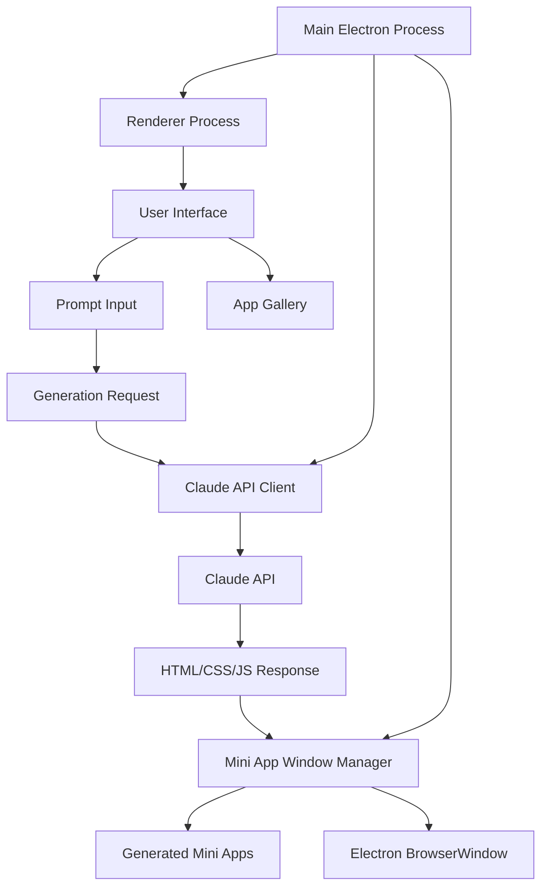
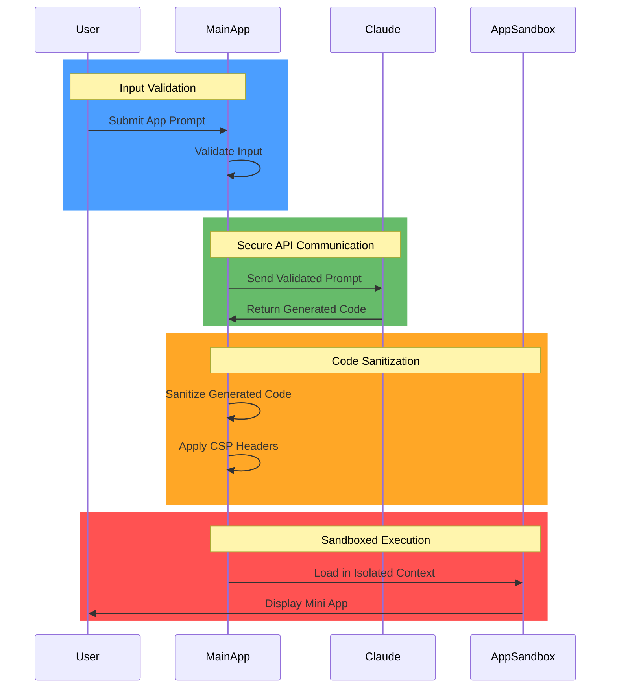

# Claude Mini App Generator

## Project Overview
- **Purpose:** Create an Electron application that integrates with Claude to generate mini desktop applications based on user prompts.
- **Goals:** Enable users to describe applications in natural language and have Claude generate self-contained HTML/CSS/JS files that can be served as Electron windows.
- **Target Audience:** Developers, prototypers, and non-technical users who want to quickly create simple applications without coding.

## Technical Architecture

- **Platform:** Electron with JavaScript, HTML, and CSS
- **Design:** 
  - Main application window for prompt input and app management
  - Dynamically created windows for each generated mini app
- **Components:**
  - Claude API Client: Handles communication with Claude AI
  - Mini App Window Manager: Creates and manages Electron windows for generated apps
  - App Storage: Saves generated applications for future use
- **Security:** 
  - Secure IPC communication with contextIsolation
  - Content Security Policy (CSP) for generated applications
  - Sandboxed execution of generated code

## Current Features
- **Prompt Interface:**
  - Text input area for describing the desired mini application
  - Submit button to send the prompt to Claude
  - Loading indicator during generation
- **App Generation:**
  - Claude processes the prompt and generates a self-contained HTML/CSS/JS file
  - System validates and sanitizes the generated code
  - Generated app is saved to local storage
- **App Management:**
  - List of previously generated apps
  - Ability to launch, edit, or delete saved apps
  - Export functionality for sharing generated apps
- **Mini App Windows:**
  - Separate Electron windows for each generated application
  - Native window controls (minimize, maximize, close)
  - Option to view source code of the generated app

## Security Architecture

- **Input Validation:**
  - Sanitize user prompts before sending to Claude
  - Implement rate limiting for API requests
- **Generated Code Security:**
  - Scan generated code for potentially harmful patterns
  - Apply strict Content Security Policy to generated apps
  - Run generated apps in sandboxed BrowserWindows
- **Data Protection:**
  - Encrypt stored app data
  - Implement secure IPC communication between processes
  - Prevent unauthorized access to system resources

## Implementation Checklist

- [ ] **Setup and Configuration**
  - [ ] Update project dependencies (add Claude API client)
  - [ ] Configure Claude API integration
  - [ ] Set up secure storage for generated apps

- [ ] **Main Application UI**
  - [ ] Design prompt input interface
  - [ ] Create app gallery/management UI
  - [ ] Implement loading and error states

- [ ] **Claude Integration**
  - [ ] Develop Claude API client
  - [ ] Create prompt engineering for app generation
  - [ ] Implement streaming response handling

- [ ] **Mini App Generation**
  - [ ] Design HTML/CSS/JS template structure
  - [ ] Implement code validation and sanitization
  - [ ] Create file saving mechanism

- [ ] **Window Management**
  - [ ] Develop mini app window creation logic
  - [ ] Implement window management features
  - [ ] Add source code viewer

- [ ] **Security Implementation**
  - [ ] Configure CSP for generated apps
  - [ ] Set up sandboxed execution environment
  - [ ] Implement input validation

- [ ] **Testing and Refinement**
  - [ ] Test with various app prompts
  - [ ] Optimize Claude prompt for better results
  - [ ] Refine UI/UX based on testing

## Natural Language Processing Strategy

- **Prompt Engineering:**
  - Design clear instructions for Claude to generate well-structured HTML/CSS/JS
  - Include examples and templates in the system prompt
  - Specify output format requirements

- **Response Processing:**
  - Parse Claude's response to extract HTML, CSS, and JavaScript
  - Handle edge cases and malformed responses
  - Provide feedback to improve future generations

- **Iterative Refinement:**
  - Allow users to refine generated apps through follow-up prompts
  - Maintain conversation context for improvements
  - Learn from successful generations to improve system prompt

## Development Progress

### Planned Phases

1. **Foundation (Phase 1)**
   - Basic Electron setup with Claude API integration
   - Simple prompt interface and response handling
   - Minimal viable app generation and display

2. **Core Functionality (Phase 2)**
   - Enhanced prompt engineering for better app generation
   - App storage and management features
   - Improved window management

3. **Refinement (Phase 3)**
   - Security enhancements and code sanitization
   - UI/UX improvements
   - Performance optimization

4. **Advanced Features (Phase 4)**
   - App templates and categories
   - Sharing and export functionality
   - Integration with development workflows

## Security Best Practices

- **For Generated Apps:**
  - Apply strict Content Security Policy
  - Disable potentially dangerous APIs
  - Run in isolated context with limited permissions

- **For Main Application:**
  - Keep contextIsolation enabled and nodeIntegration disabled
  - Validate all user inputs
  - Use secure IPC channels for process communication
  - Regularly audit and update dependencies

- **For API Communication:**
  - Secure API key storage
  - Implement rate limiting
  - Validate responses before processing

## Notes

- The quality of generated apps will depend heavily on Claude's capabilities and the effectiveness of prompt engineering
- Consider implementing templates or examples to guide Claude in generating better applications
- Focus on creating a simple, intuitive interface that makes app generation accessible to non-technical users
- The system should provide clear feedback when generation fails or produces unexpected results

## Known Issues & Limitations

- **Potential Challenges:**
  - Claude may generate invalid or incomplete HTML/CSS/JS
  - Security concerns with executing AI-generated code
  - Limited complexity of applications that can be generated

- **Mitigation Strategies:**
  - Implement robust validation and error handling
  - Create fallback templates for common failure cases
  - Provide clear documentation on system limitations

- **Future Considerations:**
  - Integration with more powerful AI models as they become available
  - Support for more complex application types
  - Addition of component libraries to enhance generated apps

**Commit Message:** "Initial context sheet for Claude Mini App Generator with architecture design and implementation plan."
