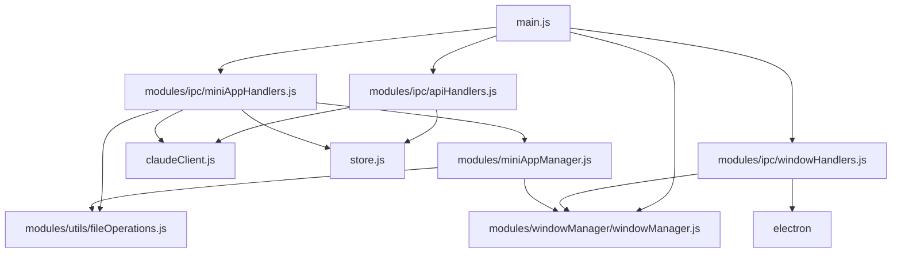

# Lahat: Code Organization

<!-- SUMMARY -->
This document describes the modular code organization of Lahat, including the module structure, responsibilities, and relationships between components.
<!-- /SUMMARY -->

<!-- RELATED DOCUMENTS -->
related '../architecture/technical_architecture.md'
related '../architecture/window_sheets_architecture.md'
<!-- /RELATED DOCUMENTS -->

## Module Structure

Lahat's codebase follows a modular organization pattern, with clear separation of concerns:



## Module Responsibilities

### 1. main.js (Simplified)

The main entry point for the Electron application, responsible for:
- Application lifecycle management
- Module initialization and coordination
- IPC handler registration
- Window creation and management

```javascript
// Simplified main.js structure
import { app, BrowserWindow, ipcMain } from 'electron';
import path from 'path';
import * as apiHandlers from './modules/ipc/apiHandlers.js';
import * as miniAppHandlers from './modules/ipc/miniAppHandlers.js';
import * as windowHandlers from './modules/ipc/windowHandlers.js';

// Initialize modules
apiHandlers.initializeClaudeClient();

// Register IPC handlers
apiHandlers.registerHandlers(ipcMain);
miniAppHandlers.registerHandlers(ipcMain);
windowHandlers.registerHandlers(ipcMain);

// Create main window when app is ready
app.whenReady().then(() => {
  createMainWindow();
});

// App lifecycle event handlers
app.on('window-all-closed', () => {
  if (process.platform !== 'darwin') {
    app.quit();
  }
});

app.on('activate', () => {
  if (BrowserWindow.getAllWindows().length === 0) {
    createMainWindow();
  }
});
```

### 2. modules/miniAppManager.js

Responsible for mini app window creation and management:
- Creating mini app windows
- Tracking window references
- Opening, updating, and deleting mini apps
- Managing mini app lifecycle

```javascript
// Key functions in miniAppManager.js
export async function createMiniAppWindow(appName, htmlContent, filePath, conversationId) {
  // Implementation...
}

export async function openMiniApp(appId, filePath, name) {
  // Implementation...
}

export function getMiniAppWindow(appId) {
  // Implementation...
}

export function closeMiniAppWindow(appId) {
  // Implementation...
}
```

### 3. modules/ipc/apiHandlers.js

Handles API-related IPC messages:
- API key management
- Claude client initialization
- API-related IPC handlers

```javascript
// Key functions in apiHandlers.js
export function initializeClaudeClient() {
  // Implementation...
}

export function registerHandlers(ipcMain) {
  ipcMain.handle('set-api-key', handleSetApiKey);
  ipcMain.handle('check-api-key', handleCheckApiKey);
  // Other API-related handlers...
}

async function handleSetApiKey(event, apiKey) {
  // Implementation...
}

async function handleCheckApiKey() {
  // Implementation...
}
```

### 4. modules/ipc/miniAppHandlers.js

Handles mini app-related IPC messages:
- Mini app generation
- Mini app management
- Mini app-related IPC handlers

```javascript
// Key functions in miniAppHandlers.js
export function registerHandlers(ipcMain) {
  ipcMain.handle('generate-mini-app', handleGenerateMiniApp);
  ipcMain.handle('generate-title-and-description', handleGenerateTitleAndDescription);
  ipcMain.handle('open-mini-app', handleOpenMiniApp);
  ipcMain.handle('update-mini-app', handleUpdateMiniApp);
  ipcMain.handle('delete-mini-app', handleDeleteMiniApp);
  // Other mini app-related handlers...
}

async function handleGenerateMiniApp(event, { appName, prompt }) {
  // Implementation...
}

async function handleGenerateTitleAndDescription(event, { input }) {
  // Implementation...
}
```

### 5. modules/ipc/windowHandlers.js

Handles window-related IPC messages:
- Window creation and management
- Window parameter management
- Inter-window communication

```javascript
// Key functions in windowHandlers.js
export function registerHandlers(ipcMain) {
  ipcMain.handle('open-window', handleOpenWindow);
  ipcMain.handle('close-current-window', handleCloseCurrentWindow);
  ipcMain.handle('get-window-params', handleGetWindowParams);
  ipcMain.handle('notify-app-updated', handleNotifyAppUpdated);
  // Other window-related handlers...
}

async function handleOpenWindow(event, { type, params }) {
  // Implementation...
}

async function handleCloseCurrentWindow(event) {
  // Implementation...
}
```

### 6. modules/windowManager/windowManager.js

Manages window creation and lifecycle:
- Creating windows with appropriate configuration
- Managing window state and parameters
- Handling window events

```javascript
// Key functions in windowManager.js
export function createWindow(type, options = {}) {
  // Implementation...
}

export function createMainWindow() {
  // Implementation...
}

export function createMiniAppWindow(name, htmlContent, filePath, conversationId) {
  // Implementation...
}

export function getWindowParams(windowId) {
  // Implementation...
}
```

### 7. modules/utils/fileOperations.js

Handles file system operations:
- Reading and writing files
- Creating temporary files
- Exporting mini apps

```javascript
// Key functions in fileOperations.js
export async function writeFile(filePath, content) {
  // Implementation...
}

export async function readFile(filePath) {
  // Implementation...
}

export async function createTempFile(content) {
  // Implementation...
}

export async function exportFile(sourceFilePath, defaultName) {
  // Implementation...
}
```

### 8. modules/utils/titleDescriptionGenerator.js

Handles title and description generation:
- Generating titles and descriptions using Claude
- Parsing and processing Claude's responses
- Streaming generation updates

```javascript
// Key functions in titleDescriptionGenerator.js
export async function generateTitleAndDescription(input, apiKey, onChunk) {
  // Implementation...
}
```

## Renderer Processes

The application includes several renderer processes for different window types:

### 1. renderers/main.js

Handles the main window UI:
- Displaying the app gallery
- Managing app selection and actions
- Handling API setup and app creation buttons

### 2. renderers/api-setup.js

Handles the API setup window UI:
- API key input and validation
- API key storage
- Status feedback

### 3. renderers/app-creation.js

Handles the app creation window UI:
- Multi-step app creation wizard
- Title and description generation
- App generation and preview

## Code Organization Benefits

The modular code organization provides several benefits:

1. **Separation of Concerns** - Each module has a clear, focused responsibility
2. **Reduced Coupling** - Modules interact through well-defined interfaces
3. **Improved Maintainability** - Changes to one module have minimal impact on others
4. **Enhanced Testability** - Modules can be tested in isolation
5. **Better Scalability** - New features can be added by creating new modules
6. **Clearer Code Navigation** - Developers can quickly find relevant code

## Coding Standards

The codebase follows these coding standards:

1. **ES Modules** - Using modern JavaScript module syntax
2. **Async/Await** - Using async/await for asynchronous operations
3. **Error Handling** - Comprehensive try/catch blocks for error handling
4. **Consistent Naming** - Clear, descriptive function and variable names
5. **JSDoc Comments** - Documentation for functions and complex code
6. **Functional Approach** - Pure functions where possible
7. **Explicit Dependencies** - Clear import statements showing dependencies

## Future Improvements

1. **Enhanced Modularity** - Further refine module boundaries
2. **Dependency Injection** - Implement dependency injection for better testability
3. **Event-Driven Architecture** - Move towards a more event-driven approach
4. **Automated Testing** - Add comprehensive unit and integration tests
5. **Code Splitting** - Optimize module loading for better performance
