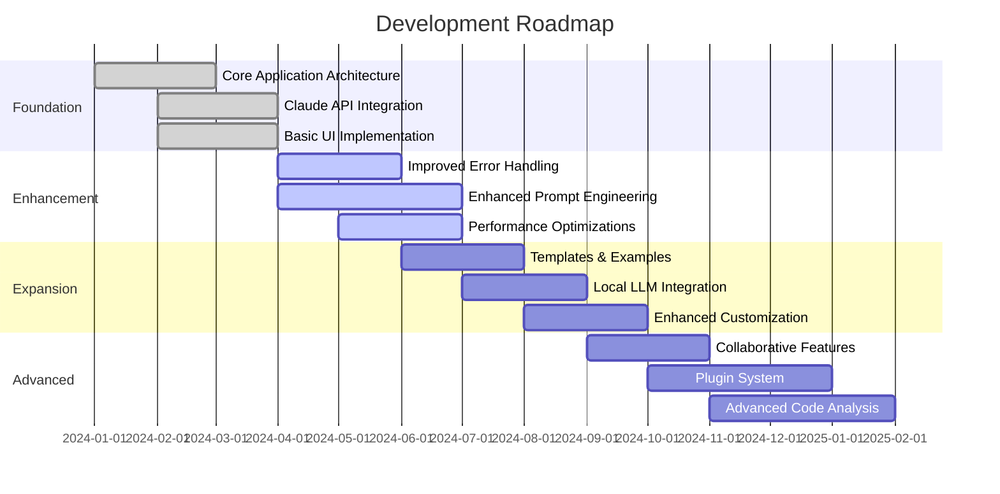
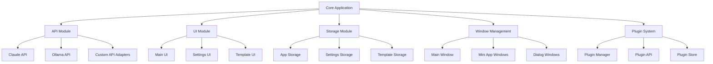
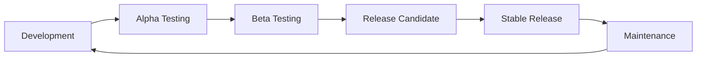

# Lahat: Development Roadmap

<!-- SUMMARY -->
This document outlines the development roadmap for Lahat, including current status, planned features, technical debt management, and architectural evolution plans.
<!-- /SUMMARY -->

<!-- RELATED DOCUMENTS -->
related '../architecture/technical_architecture.md'
related '../development/code_organization.md'
related '../user_experience/user_experience.md'
<!-- /RELATED DOCUMENTS -->

## Current Status and Future Vision

Lahat has established a solid foundation as a tool for creating self-contained mini desktop applications through natural language prompts. This roadmap outlines the planned development trajectory, prioritizing features that enhance usability, expand capabilities, and improve the overall quality of generated applications.

## Development Priorities

### Phase 1: Refinement (Current)

The current development phase focuses on refining the existing functionality, improving reliability, and enhancing the user experience.

#### 1.1 Improved Error Handling

- **Goal**: Create a more robust error handling system that provides clear feedback and recovery paths
- **Tasks**:
  - [ ] Implement comprehensive error catching throughout the application
  - [ ] Create user-friendly error messages with actionable information
  - [ ] Add recovery mechanisms for common failure scenarios
  - [ ] Implement logging for debugging and troubleshooting
- **Success Metrics**:
  - Reduction in unhandled exceptions
  - Improved user understanding of errors
  - Higher success rate for app generation

#### 1.2 Enhanced Prompt Engineering

- **Goal**: Improve the quality and consistency of generated applications through better prompt engineering
- **Tasks**:
  - [ ] Refine the system prompt for Claude to produce better HTML/CSS/JS
  - [ ] Add more specific guidelines for security and best practices
  - [ ] Implement prompt templates for common app types
  - [ ] Create a feedback loop to learn from successful generations
- **Success Metrics**:
  - Higher quality of generated code
  - Fewer iterations needed to achieve desired results
  - Increased complexity of applications that can be generated

#### 1.3 Performance Optimizations

- **Goal**: Improve application performance, particularly for large or complex mini apps
- **Tasks**:
  - [ ] Optimize streaming response handling
  - [ ] Implement more efficient storage and retrieval of apps
  - [ ] Reduce memory usage for mini app windows
  - [ ] Improve startup time and responsiveness
- **Success Metrics**:
  - Faster generation and loading times
  - Reduced memory footprint
  - Smoother user experience with complex applications

### Phase 2: Expansion (Next 3-6 Months)

The second phase will expand the capabilities of the application, adding new features and integration options.

#### 2.1 Templates and Examples

- **Goal**: Provide templates and examples to help users create better mini apps
- **Tasks**:
  - [ ] Create a library of template prompts for common app types
  - [ ] Implement a template selection interface
  - [ ] Add example apps that users can explore and modify
  - [ ] Create documentation on effective prompt writing
- **Success Metrics**:
  - Increased success rate for first-time users
  - Broader range of apps being created
  - Reduced time from idea to working application

#### 2.2 Local LLM Integration

- **Goal**: Add support for local LLMs via Ollama for offline use and reduced API costs
- **Tasks**:
  - [ ] Enhance the existing Ollama integration for app generation
  - [ ] Create model selection interface
  - [ ] Optimize prompts for different models
  - [ ] Implement fallback mechanisms between local and cloud models
- **Success Metrics**:
  - Successful generation of apps using local models
  - Reduced dependency on cloud API
  - Comparable quality between local and cloud-generated apps

#### 2.3 Enhanced Customization

- **Goal**: Provide more options for customizing the appearance and behavior of generated apps
- **Tasks**:
  - [ ] Implement theme selection for generated apps
  - [ ] Add options for window size and behavior
  - [ ] Create customization interface for common settings
  - [ ] Allow saving of user preferences
- **Success Metrics**:
  - Increased user satisfaction with app appearance
  - More consistent look and feel across generated apps
  - Higher retention of user preferences

### Phase 3: Advanced Features (6-12 Months)

The third phase will introduce advanced features that significantly expand the capabilities and use cases of the application.

#### 3.1 Collaborative Features

- **Goal**: Enable sharing and collaborative development of mini apps
- **Tasks**:
  - [ ] Implement app export/import functionality
  - [ ] Create sharing mechanisms (e.g., via files or links)
  - [ ] Add collaborative editing features
  - [ ] Implement version history and comparison
- **Success Metrics**:
  - Increased sharing of generated apps
  - Successful collaborative improvement of apps
  - Growth of user community

#### 3.2 Plugin System

- **Goal**: Create an extensible plugin system to add new capabilities to the application
- **Tasks**:
  - [ ] Design plugin architecture with security in mind
  - [ ] Implement plugin loading and management
  - [ ] Create API for plugins to interact with the application
  - [ ] Develop sample plugins for common use cases
- **Success Metrics**:
  - Successful integration of third-party plugins
  - Expanded capabilities without compromising security
  - Growth of plugin ecosystem

#### 3.3 Advanced Code Analysis

- **Goal**: Implement code analysis tools to improve the quality and security of generated apps
- **Tasks**:
  - [ ] Add static analysis of generated code
  - [ ] Implement security scanning for potential vulnerabilities
  - [ ] Create code quality metrics and suggestions
  - [ ] Add automated testing of generated apps
- **Success Metrics**:
  - Reduction in security vulnerabilities
  - Improved code quality and maintainability
  - Higher success rate for complex applications

#### 3.4 MCP Integration

- **Goal**: Implement Model Context Protocol (MCP) support to extend mini app capabilities with external tools and services
- **Tasks**:
  - [ ] Add MCP server support to the application
  - [ ] Create interfaces for connecting to external tools and APIs
  - [ ] Implement security measures for MCP connections
  - [ ] Develop documentation for creating custom MCP tools
- **Success Metrics**:
  - Successful integration with external services
  - Enhanced capabilities of generated mini apps
  - User adoption of MCP-enabled features

## Technical Debt Management

Alongside new feature development, the following technical debt items will be addressed:

### Code Organization

- Refactor components for better separation of concerns
- Improve modularity and reusability
- Standardize error handling patterns
- Enhance documentation and comments

### Testing Infrastructure

- Implement unit testing framework
- Add integration tests for critical paths
- Create automated UI tests
- Establish continuous integration pipeline

### Build and Deployment

- Streamline build process
- Create automated release workflow
- Implement update mechanism
- Add platform-specific optimizations

## Architectural Evolution

As the application evolves, the following architectural changes are planned:

### Modular Architecture

- Move from monolithic design to modular architecture
- Implement clear interfaces between components
- Enable easier extension and maintenance
- Support plugin system and third-party integrations

### Enhanced Security Model

- Implement more granular permissions for mini apps
- Add user-controlled security settings
- Enhance sandboxing and isolation
- Implement code signing for plugins

### Improved Data Management

- Implement structured database for app storage
- Add search and filtering capabilities
- Support cloud synchronization (optional)
- Implement backup and restore functionality

## User Feedback Integration

The development roadmap will be continuously refined based on user feedback:

- Regular user surveys to identify pain points and desired features
- Analysis of usage patterns to identify areas for improvement
- Prioritization of features based on user impact
- Beta testing program for early feedback on new features

## Release Strategy

- **Development**: Internal development and testing
- **Alpha Testing**: Limited testing with internal users
- **Beta Testing**: Broader testing with selected external users
- **Release Candidate**: Final testing before release
- **Stable Release**: Public release
- **Maintenance**: Bug fixes and minor improvements

## Success Metrics

The success of the development roadmap will be measured by:

- **User Adoption**: Growth in active users
- **User Satisfaction**: Feedback scores and retention rates
- **App Quality**: Complexity and functionality of generated apps
- **Performance**: Generation time, resource usage, and reliability
- **Community Growth**: Sharing, collaboration, and plugin development

## Conclusion

The Lahat development roadmap outlines a path from the current foundation to a comprehensive platform for creating, sharing, and collaborating on mini desktop applications. By focusing on user needs, quality improvements, and strategic expansion of capabilities, the application will evolve to support a wider range of use cases while maintaining its core simplicity and accessibility.
