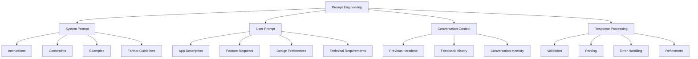

# Lahat: Prompt Engineering

## Prompt Engineering Overview

Lahat relies heavily on effective prompt engineering to produce high-quality, functional mini applications. This document outlines the prompt engineering strategies, system prompt design, and best practices for optimizing Claude's ability to generate self-contained HTML/CSS/JS applications.



## System Prompt Design

The system prompt is a critical component that guides Claude in generating appropriate mini applications. It establishes the constraints, expectations, and format for the generated code.

### Current System Prompt

```javascript
// From claudeClient.js
this.systemPrompt = `You are an expert web developer specializing in creating self-contained mini applications using HTML, CSS, and JavaScript. When given a description of an application, you will generate a complete, functional implementation that can run in an Electron window.

IMPORTANT GUIDELINES:
1. Your response must be a SINGLE self-contained HTML file that includes all CSS and JavaScript.
2. All CSS must be in a <style> tag in the <head> section.
3. All JavaScript must be in a <script> tag at the end of the <body> section.
4. The application must be fully functional without any external dependencies or network requests.
5. Use modern JavaScript (ES6+) and CSS features.
6. Ensure the UI is clean, intuitive, and responsive.
7. Include appropriate error handling and user feedback.
8. Add comments to explain complex logic or functionality.

RESPONSE FORMAT:
Your response must be a valid HTML document starting with <!DOCTYPE html> and containing all necessary elements. Do not include any explanations or markdown formatting outside the HTML code.

EXAMPLE OUTPUT:
<!DOCTYPE html>
<html lang="en">
<head>
  <meta charset="UTF-8">
  <meta name="viewport" content="width=device-width, initial-scale=1.0">
  <title>Mini Application</title>
  <style>
    /* CSS styles here */
  </style>
</head>
<body>
  <!-- HTML content here -->
  <script>
    // JavaScript code here
  </script>
</body>
</html>`;
```

### System Prompt Components

1. **Role Definition**
   - Establishes Claude as an expert web developer
   - Sets expectations for high-quality, professional output
   - Creates a clear context for the task

2. **Guidelines**
   - Specific technical requirements (single HTML file, CSS in head, JS at end of body)
   - Quality standards (clean UI, error handling, comments)
   - Constraints (no external dependencies or network requests)
   - Modern technology expectations (ES6+, modern CSS)

3. **Response Format**
   - Clear specification of expected output format
   - Explicit instruction to avoid explanations outside the code
   - Emphasis on valid HTML document structure

4. **Example Output**
   - Template showing the expected structure
   - Placeholders for CSS and JavaScript
   - Demonstrates proper HTML document organization

## User Prompt Strategies

The user prompt is the specific request for a mini application. The quality and clarity of this prompt significantly impact the generated result.

### Effective Prompt Components

1. **Clear Purpose Statement**
   - Define what the app should do in simple terms
   - Establish the primary functionality and goals
   - Example: "Create a pomodoro timer app that helps users manage work sessions and breaks"

2. **Feature Specification**
   - List specific features the app should include
   - Prioritize features from most to least important
   - Example: "The timer should have start, pause, and reset buttons, and should alert the user when a session ends"

3. **UI/UX Description**
   - Describe the desired visual appearance and layout
   - Specify any particular design elements or themes
   - Example: "Use a clean, minimalist design with a circular progress indicator and a dark color scheme"

4. **Technical Requirements**
   - Specify any particular technical approaches or constraints
   - Mention any specific libraries or techniques to use or avoid
   - Example: "Store settings in localStorage so they persist between sessions"

5. **Edge Cases and Error Handling**
   - Identify potential issues and how they should be handled
   - Specify validation requirements for user inputs
   - Example: "Validate that timer duration inputs are positive numbers and provide user feedback for invalid inputs"

### Example User Prompts

#### Basic Prompt

```
Create a simple calculator app with basic arithmetic operations (addition, subtraction, multiplication, division). It should have a clean, modern interface with large buttons and a display area for input and results.
```

#### Detailed Prompt

```
Create a task management app with the following features:
1. Add new tasks with a title, description, and due date
2. Mark tasks as complete
3. Delete tasks
4. Filter tasks by status (all, active, completed)
5. Sort tasks by due date
6. Store tasks in localStorage so they persist between sessions

The UI should have:
- A form at the top for adding new tasks
- A list of tasks below the form
- Each task should show its title, due date, and a checkbox for completion
- Filter and sort controls above the task list
- A clean, responsive design that works well on different screen sizes
- Use a light color scheme with accent colors for important elements

Include appropriate error handling for form inputs and provide user feedback for actions like adding or completing tasks.
```

#### Iterative Prompt

```
Update the task management app to add the following features:
1. Add priority levels (low, medium, high) to tasks
2. Allow editing existing tasks
3. Add categories or tags to tasks
4. Include a search function to find tasks by title or description
5. Add a dark mode toggle

Also, improve the UI by:
- Adding color coding for different priority levels
- Showing overdue tasks with a visual indicator
- Making the design more compact to show more tasks at once
- Adding confirmation dialogs for delete actions
```

## Conversation Context Management

The application maintains conversation context to enable iterative refinement of generated apps.

### Implementation

```javascript
// From claudeClient.js
async generateApp(prompt, conversationId = null) {
  try {
    // Initialize messages with just the user prompt
    const messages = [
      { role: 'user', content: prompt }
    ];

    // If this is a continuation of a conversation, load previous messages
    if (conversationId) {
      const previousMessages = await this.loadConversation(conversationId);
      if (previousMessages && previousMessages.length > 0) {
        // Filter out any system messages from previous conversations
        const filteredMessages = previousMessages.filter(msg => msg.role !== 'system');
        messages.unshift(...filteredMessages);
      }
    }

    const response = await this.anthropic.messages.create({
      model: 'claude-3-7-sonnet-20250219', // Updated to latest model
      max_tokens: 64000, // Reduced to maximum allowed for this model
      system: this.systemPrompt, // System prompt as top-level parameter
      messages,
      stream: true
    });

    return response;
  } catch (error) {
    console.error('Claude API Error details:', error);
    throw new Error(`Claude API Error: ${error.message}`);
  }
}
```

### Conversation Management Strategies

1. **Message History**
   - Previous user prompts and Claude responses are stored
   - History is loaded when updating an existing app
   - System prompt remains consistent across conversations

2. **Iterative Refinement**
   - Users can build on previous versions with new instructions
   - Claude maintains context of previous requirements
   - Updates can focus on specific changes or additions

3. **Conversation Storage**
   - Conversations are stored with metadata
   - Each version of an app is tracked
   - Prompts and responses are preserved for context

## Response Processing

The application processes Claude's responses to ensure they meet requirements and can be displayed properly.

### Streaming Response Handling

```javascript
// From main.js
for await (const streamEvent of response) {
  if (streamEvent.type === 'content_block_delta' && streamEvent.delta.type === 'text_delta') {
    htmlContent += streamEvent.delta.text || '';
    event.sender.send('generation-chunk', {
      content: streamEvent.delta.text || '',
      done: false
    });
  }
}
```

### Validation and Error Handling

- Responses are validated to ensure they contain valid HTML
- Error handling for incomplete or malformed responses
- Feedback to users when generation fails or produces unexpected results

## Prompt Engineering Best Practices

### For System Prompt Improvements

1. **Clear Constraints**
   - Be explicit about technical limitations
   - Specify security requirements clearly
   - Define expected output format precisely

2. **Comprehensive Examples**
   - Include more detailed examples for common app types
   - Demonstrate best practices in example code
   - Show proper error handling and accessibility features

3. **Progressive Enhancement**
   - Start with core functionality requirements
   - Add design and UX guidelines
   - Include advanced features and edge cases

### For User Prompts

1. **Be Specific**
   - Clearly describe the desired functionality
   - Specify UI/UX preferences
   - Mention any technical requirements

2. **Prioritize Features**
   - List features in order of importance
   - Distinguish between must-have and nice-to-have features
   - Focus on core functionality first

3. **Provide Context**
   - Explain the purpose and target users of the app
   - Describe the problem the app is solving
   - Mention any specific use cases or scenarios

4. **Iterative Approach**
   - Start with a simple version and refine
   - Focus on one aspect at a time when updating
   - Build on previous versions rather than starting over

## Model Selection and Parameters

The application uses specific Claude models and parameters to optimize generation quality.

### Model Selection

```javascript
// From claudeClient.js
const response = await this.anthropic.messages.create({
  model: 'claude-3-7-sonnet-20250219', // Updated to latest model
  max_tokens: 64000, // Reduced to maximum allowed for this model
  system: this.systemPrompt, // System prompt as top-level parameter
  messages,
  stream: true
});
```

### Parameter Optimization

- **Model**: Using the latest Claude model for best performance
- **Max Tokens**: Set to 64,000 to allow for complex applications
- **Streaming**: Enabled for real-time feedback
- **Temperature**: Default (not explicitly set) for balanced creativity and consistency

## Future Prompt Engineering Improvements

### Enhanced System Prompt

- Add more specific guidelines for accessibility
- Include security best practices
- Provide more detailed examples for common app types
- Add guidelines for performance optimization

### Template System

- Create specialized templates for different app types
- Develop a template selection interface
- Allow users to create and save custom templates
- Include examples and best practices in templates

### Feedback Loop

- Analyze successful generations to improve prompts
- Identify common failure patterns
- Implement automated feedback collection
- Use feedback to refine system prompt

### Advanced Techniques

- Implement few-shot learning with multiple examples
- Develop specialized prompts for different app categories
- Create a prompt builder interface for users
- Implement prompt validation and suggestions

## Measuring Prompt Effectiveness

### Success Metrics

- **Generation Success Rate**: Percentage of prompts that produce valid, functional apps
- **Iteration Count**: Number of updates needed to achieve desired result
- **Code Quality**: Metrics for generated code quality and best practices adherence
- **User Satisfaction**: Feedback on generated apps meeting requirements

### Evaluation Methods

- Automated validation of generated HTML/CSS/JS
- User feedback collection after app generation
- Analysis of common failure patterns
- Comparative testing of different prompt strategies
