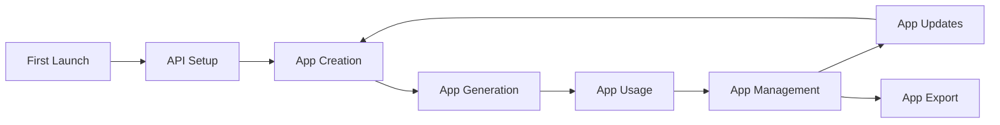
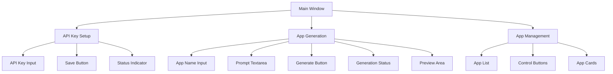
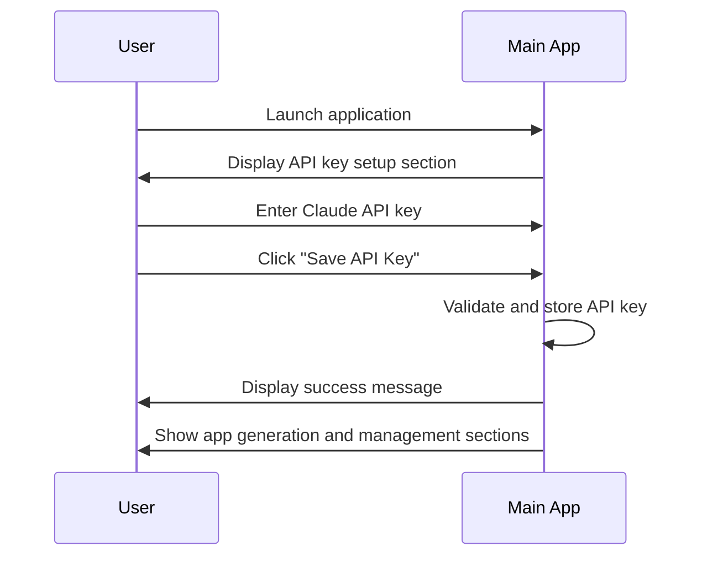
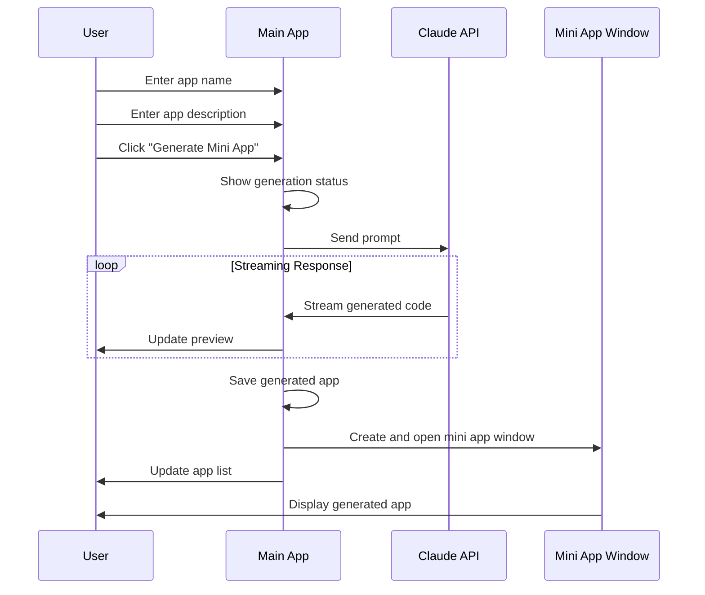
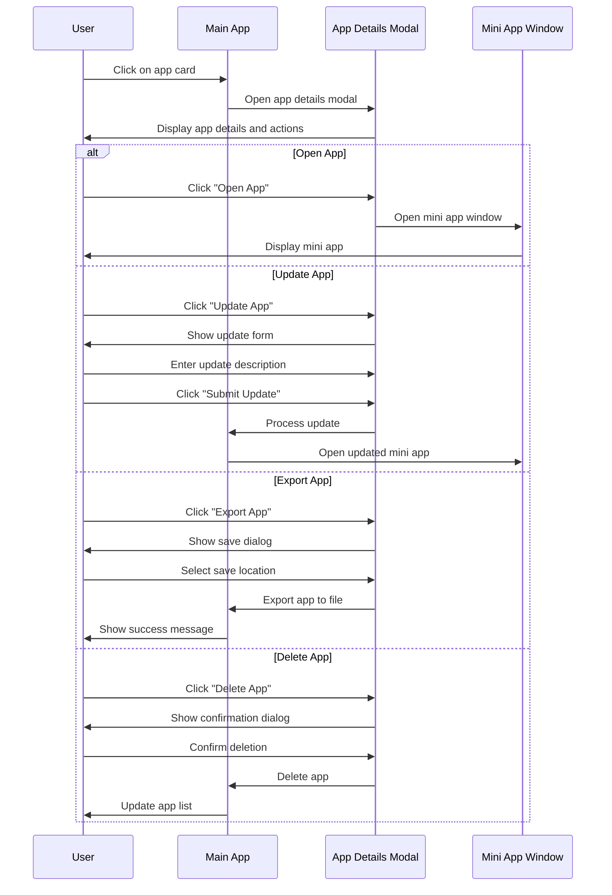

# Claude Mini App Generator: User Experience

## User Journey Overview

The Claude Mini App Generator provides a streamlined experience for creating, managing, and using mini desktop applications through natural language prompts. This document outlines the user experience flow, interface components, and interaction patterns.

## User Interface Components

### Main Application Window

The main application window is divided into three primary sections:

1. **API Key Setup Section**
   - Input field for Claude API key
   - Save button
   - Status indicator

2. **App Generation Section**
   - App name input field
   - Prompt textarea for describing the desired app
   - Generate button
   - Generation status indicator and preview

3. **App Management Section**
   - List of previously generated apps
   - Refresh and directory access buttons
   - App cards with basic information

### App Details Modal

When a user clicks on an app card, a modal dialog appears with detailed information and actions:

- App name and creation date
- Version information
- Action buttons:
  - Open App
  - Update App
  - Export App
  - Delete App
- Update form (when updating)

### Mini App Windows

Generated mini apps open in separate windows with:

- Native window controls (minimize, maximize, close)
- Custom title based on the app name
- Self-contained HTML/CSS/JS content
- Sandboxed execution environment

## User Flows

### First-Time Setup

1. User launches the application for the first time
2. The API key setup section is prominently displayed
3. User enters their Claude API key
4. User clicks "Save API Key"
5. The application validates and stores the API key
6. On success, the app generation and management sections become visible

### Creating a Mini App

1. User enters a name for the mini app
2. User describes the desired app in the prompt textarea
3. User clicks "Generate Mini App"
4. The application shows a loading indicator and begins streaming the response
5. As Claude generates the code, it appears in the preview area
6. Once generation is complete, the app is saved and opened in a new window
7. The app list is updated to include the new app

### Managing Existing Apps

1. User clicks on an app card in the app list
2. The app details modal opens with information about the selected app
3. User can choose from several actions:
   - **Open App**: Opens the app in a new window
   - **Update App**: Shows a form to describe desired changes
   - **Export App**: Allows saving the app as a standalone HTML file
   - **Delete App**: Removes the app after confirmation

## Interaction Patterns

### Real-Time Feedback

- **Generation Status**: Clear indicators show when generation is in progress
- **Streaming Preview**: Generated code appears in real-time as Claude produces it
- **Error Messages**: Descriptive error messages help users understand and resolve issues
- **Success Confirmations**: Clear confirmations for successful actions

### Progressive Disclosure

- **API Key Setup**: Initially focused on API setup before showing other sections
- **App Details**: Basic information on cards, detailed information in modal
- **Update Form**: Hidden until explicitly requested
- **Confirmation Dialogs**: Used for destructive actions like deletion

### Responsive Design

- **Flexible Layout**: Adapts to different window sizes
- **Scrollable Sections**: Allow for viewing large amounts of content
- **Grid Layout**: App cards arranged in a responsive grid
- **Modal Dialogs**: Centered and properly sized for readability

## Visual Design Elements

### Color Scheme

- **Primary Color**: #4285f4 (Google Blue)
- **Secondary Color**: #34a853 (Google Green)
- **Danger Color**: #ea4335 (Google Red)
- **Warning Color**: #fbbc05 (Google Yellow)
- **Light Gray**: #f8f9fa (Background)
- **Medium Gray**: #e0e0e0 (Borders)
- **Dark Gray**: #5f6368 (Text)

### Typography

- System fonts for optimal performance and native feel
- Clear hierarchy with different sizes for headings and body text
- Consistent spacing and alignment

### UI Components

- **Cards**: Used for app list items
- **Buttons**: Clear, actionable buttons with hover states
- **Input Fields**: Consistent styling with focus states
- **Modal Dialogs**: Clean, focused overlays for detailed actions
- **Loading Indicators**: Spinner animation for processes in progress

## Accessibility Considerations

- **Keyboard Navigation**: All functions accessible via keyboard
- **Focus States**: Clear visual indicators for focused elements
- **Color Contrast**: Sufficient contrast for text readability
- **Error Messaging**: Clear error states and recovery paths
- **Screen Reader Support**: Semantic HTML for assistive technology

## Error Handling

### Common Error Scenarios

1. **API Key Issues**
   - Invalid API key
   - API key not set
   - API rate limits exceeded

2. **Generation Failures**
   - Network connectivity issues
   - Claude API errors
   - Invalid or ambiguous prompts

3. **App Management Issues**
   - File system access problems
   - Permission issues
   - Corrupted app files

### Error Recovery Paths

- **Clear Error Messages**: Specific, actionable error messages
- **Retry Options**: Ability to retry failed operations
- **Fallback Behaviors**: Graceful degradation when services are unavailable
- **Help Resources**: Links to troubleshooting information

## User Feedback Collection

- **Error Reporting**: Mechanism for reporting issues
- **Feature Requests**: Channel for suggesting improvements
- **Usage Analytics**: Anonymous usage data to improve the application
- **Satisfaction Metrics**: Feedback on generated apps

## Future UX Improvements

### Planned Enhancements

1. **Guided Onboarding**
   - Interactive tutorial for first-time users
   - Example prompts and templates
   - Best practices for effective prompts

2. **Enhanced Preview**
   - Live preview of generated apps
   - Syntax highlighting for code preview
   - Ability to make manual edits before saving

3. **Collaboration Features**
   - Sharing generated apps with others
   - Collaborative editing and refinement
   - Version history and comparison

4. **Advanced Management**
   - Categorization and tagging of apps
   - Search and filtering capabilities
   - Batch operations for multiple apps

5. **Customization Options**
   - Themes and appearance settings
   - Default window size preferences
   - Custom templates for generation
