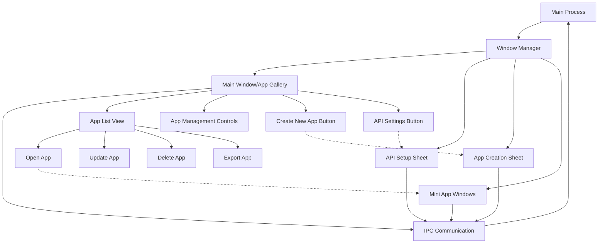

# UI Revision Plan: Splitting Lahat into Independent Window Sheets

<!-- SUMMARY -->
This document outlines the plan for transitioning Lahat from a monolithic UI to a window sheets architecture, including the benefits, implementation approach, and technical considerations.
<!-- /SUMMARY -->

<!-- RELATED DOCUMENTS -->
related '../architecture/window_sheets_architecture.md'
related '../user_experience/user_experience.md'
related '../development/code_organization.md'
<!-- /RELATED DOCUMENTS -->

## Current Architecture Overview

Currently, Lahat uses a monolithic UI approach where all functionality is contained within a single main window:
- API key setup
- App creation form
- App management/listing
- Generation preview

The main process (`main.js`) already has the capability to create separate windows for mini apps, but the core application UI is contained in a single window.

## Reasons for Splitting into Window Sheets

### Architectural Benefits

1. **Separation of Concerns**
   - Each functional area becomes an independent module with clear boundaries
   - Reduces coupling between different parts of the application
   - Enables parallel development of different features

2. **Improved Maintainability**
   - Smaller, focused components are easier to understand and modify
   - Changes to one sheet won't affect others
   - Simplified state management within each sheet

3. **Enhanced Extensibility**
   - New functionality can be added as new sheets without modifying existing code
   - Easier to implement plugin architecture in the future
   - Facilitates the planned modular architecture mentioned in the development roadmap

4. **Better Resource Management**
   - Only load resources needed for active sheets
   - Reduced memory footprint when not all functionality is needed
   - Potential performance improvements for complex operations

### UI/UX Benefits

1. **Focused User Experience**
   - Each sheet addresses a specific task or workflow
   - Reduced cognitive load by showing only relevant controls
   - Clearer user journey through the application

2. **Improved Workflow**
   - Users can arrange sheets according to their workflow
   - Multiple sheets can be visible simultaneously (e.g., app list and creation form)
   - Better multitasking capabilities

3. **Modern Interface Paradigm**
   - Aligns with modern desktop application design patterns
   - Similar to design systems used by professional applications
   - More intuitive for users familiar with productivity software

4. **Enhanced Visual Hierarchy**
   - Clearer distinction between different functional areas
   - Better use of screen real estate
   - More room for future UI enhancements

## Implementation Approach

### 1. Window Sheet Architecture

- Create a window manager module to handle creation and lifecycle of all sheets
- Implement consistent styling and behavior across sheets
- Establish clear communication patterns between sheets

### 2. Sheet Types and Responsibilities

#### Main Window (App Gallery)
- Grid or list view of all created mini apps
- Sorting and filtering options
- App management actions (open, update, delete, export)
- Quick access buttons to create new apps and manage API settings
- No header with app name and description

#### Claude API Setup Sheet
- API key input and validation
- Connection status
- API settings management
- Clean interface without header

#### Create a Mini App Sheet
- App name input
- Prompt textarea
- Generation controls
- Preview area
- Clean interface without header

### 3. Inter-Sheet Communication

- Use IPC for communication between sheets and the main process
- Implement a pub/sub pattern for event-based communication
- Create a shared state mechanism for data that needs to be accessible across sheets
- Ensure proper synchronization of state changes

### 4. UI Component Strategy

- Create reusable UI components shared across sheets
- Implement consistent styling and interaction patterns
- Design responsive layouts that work well at different window sizes
- Ensure accessibility across all sheets

## Implementation Phases

### Phase 1: Architecture Setup

1. Create window manager module
2. Define sheet creation and management functions
3. Establish IPC communication patterns
4. Set up shared styling and components

### Phase 2: Sheet Implementation

1. Extract API setup functionality to its own sheet
2. Create app creation sheet with all necessary controls
3. Redesign main window as the app gallery
4. Remove headers from all windows for a cleaner interface

### Phase 3: Integration and Refinement

1. Connect all sheets through IPC communication
2. Implement state synchronization
3. Add navigation between sheets
4. Refine UI and interactions

### Phase 4: Testing and Optimization

1. Test all workflows across sheets
2. Optimize performance and resource usage
3. Refine user experience based on testing
4. Implement any missing features

## Technical Considerations

### Window Management

- Use Electron's `BrowserWindow` with appropriate options for each sheet
- Implement proper window positioning and sizing
- Handle window focus, blur, and close events
- Save and restore window positions and states

### State Management

- Determine which state needs to be shared across sheets
- Implement efficient state synchronization mechanisms
- Handle race conditions and concurrency issues
- Ensure proper cleanup when sheets are closed

### Preload Scripts

- Create specific preload scripts for each sheet type
- Expose only necessary APIs to each sheet
- Maintain security through context isolation
- Implement proper error handling

### Styling and Theming

- Create a shared styling system across sheets
- Implement consistent theming
- Ensure proper scaling and responsiveness
- Maintain accessibility standards

## Potential Challenges and Solutions

### Challenge: State Synchronization
**Solution**: Implement a central state manager in the main process that sheets can subscribe to for updates.

### Challenge: Window Management Complexity
**Solution**: Create a dedicated window manager module with clear APIs for creating, positioning, and managing sheets.

### Challenge: User Experience Continuity
**Solution**: Design consistent navigation patterns and visual cues to help users understand the relationship between sheets.

### Challenge: Performance Impact
**Solution**: Optimize resource loading and implement lazy initialization of sheets only when needed.

## Migration Strategy

1. **Incremental Approach**
   - Start with extracting one functional area to a sheet
   - Test thoroughly before moving to the next area
   - Maintain backward compatibility during transition

2. **Feature Flagging**
   - Implement feature flags to enable/disable sheet-based UI
   - Allow users to choose between monolithic and sheet-based UI during transition
   - Gather feedback to refine the implementation

3. **Data Migration**
   - Ensure all user data and settings are preserved
   - Update storage mechanisms if needed
   - Provide fallback mechanisms for accessing data

## Success Metrics

- **User Efficiency**: Measure time to complete common tasks
- **User Satisfaction**: Gather feedback on the new UI approach
- **Technical Performance**: Monitor memory usage and responsiveness
- **Code Quality**: Assess maintainability and extensibility improvements
- **Bug Reduction**: Track issues related to UI and state management

## Future Possibilities

Once the sheet-based architecture is implemented, several new features become more feasible:

1. **Customizable Workspace**
   - Allow users to arrange sheets according to their preferences
   - Save and restore workspace layouts
   - Create task-specific workspace configurations

2. **Enhanced Collaboration**
   - Share specific sheets with other users
   - Implement real-time collaboration on app creation
   - Enable commenting and feedback on specific aspects

3. **Advanced Plugins**
   - Allow plugins to create their own sheets
   - Enable deeper integration with external tools
   - Create a more extensible platform

4. **Progressive Disclosure**
   - Implement different levels of complexity in sheets
   - Create simplified views for beginners
   - Provide advanced options for power users

## Conclusion

Splitting the Lahat application into independent window sheets represents a significant architectural and UI improvement. This approach aligns with the application's development roadmap, particularly the goal of moving toward a more modular architecture. The sheet-based UI will provide a more focused, efficient user experience while making the codebase more maintainable and extensible.

The implementation will require careful planning and incremental development, but the benefits in terms of user experience, code quality, and future extensibility make this a worthwhile investment. By following the outlined approach, we can ensure a smooth transition to this new architecture while maintaining and enhancing the core functionality that makes Lahat valuable to users.
