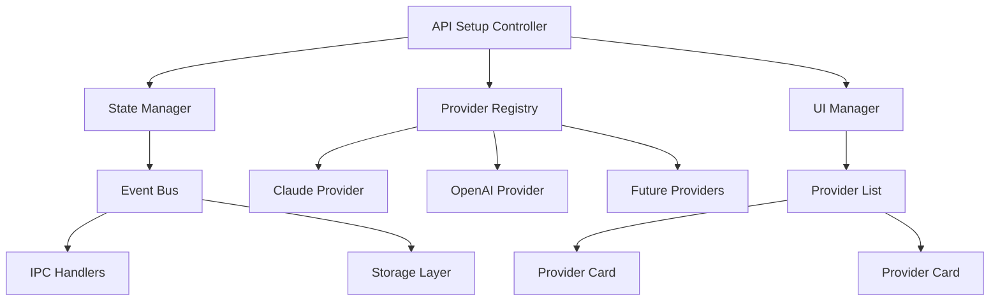
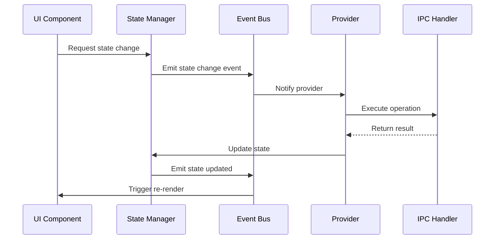

# API Setup Component Architecture Redesign

## Executive Summary

This document outlines the complete redesign of the API Setup component to address critical reliability issues and create a more maintainable, extensible architecture. The current implementation suffers from state synchronization problems, monolithic design, and poor error handling that leads to user-facing bugs like "API keys showing as present after clearing and restart."

This redesign will completely replace the existing implementation with a modern, modular architecture.

## Table of Contents

1. [Problem Analysis](#problem-analysis)
2. [New Architecture Overview](#new-architecture-overview)
3. [Component Structure](#component-structure)
4. [State Management](#state-management)
5. [Provider System](#provider-system)
6. [Implementation Details](#implementation-details)
7. [Migration Strategy](#migration-strategy)
8. [Testing Strategy](#testing-strategy)
9. [Future Extensibility](#future-extensibility)
10. [Implementation Timeline](#implementation-timeline)

## Problem Analysis

### Current Implementation Issues

#### 1. State Synchronization Problems
- **Root Cause**: UI state is not properly synchronized with backend storage
- **Symptoms**: 
  - API keys appear set after clearing and restarting
  - Race conditions between UI updates and IPC calls
  - Inconsistent status messages
- **Technical Details**: 
  - `initializeApp()` function has timing issues
  - Multiple `setTimeout()` calls used as band-aids
  - No single source of truth for component state

#### 2. Monolithic Architecture
- **Current Structure**: Single 300+ line file (`renderers/api-setup.js`)
- **Problems**:
  - Duplicated code patterns for each API provider
  - No separation of concerns
  - Hard to extend for new providers
  - Difficult to test individual components

#### 3. Brittle State Management
- **Issues**:
  - Ad-hoc DOM manipulation instead of reactive updates
  - Status messages that change multiple times causing confusion
  - Button enable/disable logic scattered throughout code
  - No proper loading state management

#### 4. Poor Error Handling
- **Problems**:
  - Inconsistent error states
  - No unified error display system
  - Error recovery mechanisms are unreliable

## New Architecture Overview

### Design Principles

1. **KISS (Keep It Simple, Stupid)**: Simple, focused components with clear responsibilities
2. **YAGNI (You Aren't Gonna Need It)**: Build only what's needed now, design for easy extension
3. **Separation of Concerns**: Clear boundaries between UI, state, and business logic
4. **Reactive State Management**: Single source of truth driving all UI updates
5. **Configuration-Driven**: Easy to add new providers without code changes

### High-Level Architecture



## Component Structure

### File Organization

```
api-setup/
├── core/
│   ├── ApiProvider.js           # Abstract base provider class
│   ├── StateManager.js          # Centralized state management
│   ├── EventBus.js              # Component communication
│   └── ConfigManager.js         # Provider configuration management
├── providers/
│   ├── ClaudeProvider.js        # Claude-specific implementation
│   ├── OpenAIProvider.js        # OpenAI-specific implementation
│   └── ProviderRegistry.js      # Dynamic provider registration
├── ui/
│   ├── ProviderCard.js          # Reusable provider UI component
│   ├── ProviderList.js          # Main container component
│   ├── StatusManager.js         # Unified status/feedback system
│   └── LoadingManager.js        # Loading state management
├── config/
│   └── providers.json           # Provider configuration
├── styles/
│   └── api-setup.css            # Component-specific styles
├── api-setup.html               # Main HTML file
└── api-setup.js                 # Main controller
```

### Component Responsibilities

#### Core Components

**ApiProvider.js** (Abstract Base Class)
```javascript
class ApiProvider {
  constructor(config) {
    this.id = config.id;
    this.name = config.name;
    this.config = config;
  }
  
  // Abstract methods to be implemented by subclasses
  async validateKey(key) { throw new Error('Must implement validateKey'); }
  async testConnection() { throw new Error('Must implement testConnection'); }
  async saveKey(key) { throw new Error('Must implement saveKey'); }
  async loadKey() { throw new Error('Must implement loadKey'); }
  async deleteKey() { throw new Error('Must implement deleteKey'); }
  
  // Common functionality
  maskKey(key) { /* ... */ }
  getHelpUrl() { /* ... */ }
}
```

**StateManager.js** (Centralized State)
```javascript
class StateManager {
  constructor() {
    this.state = {
      providers: new Map(),
      loading: new Set(),
      errors: new Map(),
      initialized: false
    };
    this.listeners = new Set();
  }
  
  // State mutation methods
  setProviderState(providerId, state) { /* ... */ }
  setLoading(providerId, isLoading) { /* ... */ }
  setError(providerId, error) { /* ... */ }
  
  // State access methods
  getProviderState(providerId) { /* ... */ }
  isLoading(providerId) { /* ... */ }
  getError(providerId) { /* ... */ }
  
  // Subscription methods
  subscribe(listener) { /* ... */ }
  unsubscribe(listener) { /* ... */ }
  notify() { /* ... */ }
}
```

**EventBus.js** (Component Communication)
```javascript
class EventBus {
  constructor() {
    this.events = new Map();
  }
  
  on(event, callback) { /* ... */ }
  off(event, callback) { /* ... */ }
  emit(event, data) { /* ... */ }
  
  // Predefined events
  static EVENTS = {
    PROVIDER_KEY_SAVED: 'provider:key:saved',
    PROVIDER_KEY_DELETED: 'provider:key:deleted',
    PROVIDER_TEST_STARTED: 'provider:test:started',
    PROVIDER_TEST_COMPLETED: 'provider:test:completed',
    STATE_CHANGED: 'state:changed'
  };
}
```

#### Provider Implementations

**ClaudeProvider.js**
```javascript
class ClaudeProvider extends ApiProvider {
  constructor() {
    super({
      id: 'claude',
      name: 'Claude API',
      description: 'Required for generating mini apps with Claude AI',
      keyPattern: /^sk-ant-[a-zA-Z0-9\-_]+$/,
      helpUrl: 'https://console.anthropic.com/',
      color: '#FF6B35',
      icon: 'claude-icon.svg'
    });
  }
  
  async validateKey(key) {
    return this.config.keyPattern.test(key);
  }
  
  async testConnection() {
    // Implementation using existing IPC handlers
    return await window.electronAPI.checkApiKey();
  }
  
  async saveKey(key) {
    return await window.electronAPI.setApiKey(key);
  }
  
  async loadKey() {
    const result = await window.electronAPI.checkApiKey();
    return result.hasApiKey;
  }
  
  async deleteKey() {
    return await window.electronAPI.setApiKey('');
  }
}
```

#### UI Components

**ProviderCard.js** (Reusable Provider UI)
```javascript
class ProviderCard {
  constructor(provider, stateManager, eventBus) {
    this.provider = provider;
    this.stateManager = stateManager;
    this.eventBus = eventBus;
    this.element = null;
  }
  
  render() {
    const state = this.stateManager.getProviderState(this.provider.id);
    
    return `
      <div class="provider-card" data-provider="${this.provider.id}">
        <div class="provider-header">
          <div class="provider-info">
            
            <div class="provider-details">
              <h3>${this.provider.name}</h3>
              <p>${this.provider.config.description}</p>
            </div>
          </div>
          <div class="provider-toggle">
            <label class="toggle-switch">
              <input type="checkbox" ${state.enabled ? 'checked' : ''}>
              <span class="toggle-slider"></span>
            </label>
          </div>
        </div>
        
        ${state.enabled ? this.renderConfigSection(state) : ''}
      </div>
    `;
  }
  
  renderConfigSection(state) {
    if (state.hasKey) {
      return this.renderConfiguredState(state);
    } else {
      return this.renderSetupState(state);
    }
  }
  
  // Event handlers and lifecycle methods
  bindEvents() { /* ... */ }
  update() { /* ... */ }
  destroy() { /* ... */ }
}
```

## State Management

### State Structure

```javascript
const STATE_SCHEMA = {
  providers: {
    [providerId]: {
      enabled: boolean,
      hasKey: boolean,
      keyMasked: string,
      lastTested: timestamp,
      testResult: 'success' | 'error' | null,
      isSecurelyStored: boolean
    }
  },
  loading: Set<providerId>,
  errors: {
    [providerId]: {
      message: string,
      type: 'validation' | 'network' | 'storage',
      timestamp: number
    }
  },
  initialized: boolean
};
```

### State Flow



### Reactive Updates

All UI components subscribe to state changes and automatically re-render when their relevant state changes. This eliminates the race conditions and synchronization issues present in the current implementation.

## Provider System

### Configuration-Driven Providers

**providers.json**
```json
{
  "claude": {
    "id": "claude",
    "name": "Claude API",
    "description": "Required for generating mini apps with Claude AI",
    "keyPattern": "^sk-ant-[a-zA-Z0-9\\-_]+$",
    "helpUrl": "https://console.anthropic.com/",
    "color": "#FF6B35",
    "icon": "assets/icons/claude.svg",
    "priority": 1,
    "required": true
  },
  "openai": {
    "id": "openai",
    "name": "OpenAI API",
    "description": "Required for generating app logos with DALL-E 3",
    "keyPattern": "^sk-[a-zA-Z0-9\\-_]+$",
    "helpUrl": "https://platform.openai.com/api-keys",
    "color": "#10A37F",
    "icon": "assets/icons/openai.svg",
    "priority": 2,
    "required": false
  }
}
```

### Provider Registry

```javascript
class ProviderRegistry {
  constructor() {
    this.providers = new Map();
    this.config = null;
  }
  
  async loadConfig() {
    const response = await fetch('./config/providers.json');
    this.config = await response.json();
  }
  
  registerProvider(provider) {
    this.providers.set(provider.id, provider);
  }
  
  getProvider(id) {
    return this.providers.get(id);
  }
  
  getAllProviders() {
    return Array.from(this.providers.values())
      .sort((a, b) => a.config.priority - b.config.priority);
  }
  
  getRequiredProviders() {
    return this.getAllProviders().filter(p => p.config.required);
  }
}
```

## Implementation Details

### Initialization Flow

```javascript
class ApiSetupController {
  constructor() {
    this.stateManager = new StateManager();
    this.eventBus = new EventBus();
    this.providerRegistry = new ProviderRegistry();
    this.uiManager = new UIManager();
  }
  
  async initialize() {
    try {
      // 1. Load provider configuration
      await this.providerRegistry.loadConfig();
      
      // 2. Register providers
      this.registerProviders();
      
      // 3. Initialize state from storage
      await this.initializeState();
      
      // 4. Setup event listeners
      this.setupEventListeners();
      
      // 5. Render UI
      this.uiManager.render();
      
      // 6. Mark as initialized
      this.stateManager.setInitialized(true);
      
    } catch (error) {
      this.handleInitializationError(error);
    }
  }
  
  registerProviders() {
    // Register Claude provider
    this.providerRegistry.registerProvider(new ClaudeProvider());
    
    // Register OpenAI provider
    this.providerRegistry.registerProvider(new OpenAIProvider());
  }
  
  async initializeState() {
    const providers = this.providerRegistry.getAllProviders();
    
    for (const provider of providers) {
      try {
        const hasKey = await provider.loadKey();
        this.stateManager.setProviderState(provider.id, {
          enabled: hasKey, // Auto-enable if key exists
          hasKey,
          keyMasked: hasKey ? provider.maskKey('dummy') : '',
          lastTested: null,
          testResult: null,
          isSecurelyStored: hasKey
        });
      } catch (error) {
        this.stateManager.setError(provider.id, {
          message: `Failed to load ${provider.name} configuration`,
          type: 'storage',
          timestamp: Date.now()
        });
      }
    }
  }
}
```

### Error Handling Strategy

```javascript
class ErrorHandler {
  static handleProviderError(providerId, error, context) {
    const errorInfo = {
      message: this.getErrorMessage(error),
      type: this.getErrorType(error, context),
      timestamp: Date.now(),
      context
    };
    
    // Log error for debugging
    console.error(`Provider ${providerId} error:`, error);
    
    // Update state
    stateManager.setError(providerId, errorInfo);
    
    // Show user-friendly message
    this.showUserError(providerId, errorInfo);
  }
  
  static getErrorMessage(error) {
    if (error.code === 'NETWORK_ERROR') {
      return 'Network connection failed. Please check your internet connection.';
    }
    if (error.code === 'INVALID_KEY') {
      return 'Invalid API key format. Please check your key and try again.';
    }
    if (error.code === 'UNAUTHORIZED') {
      return 'API key is invalid or expired. Please update your key.';
    }
    return error.message || 'An unexpected error occurred.';
  }
}
```

### Loading State Management

```javascript
class LoadingManager {
  constructor(stateManager, eventBus) {
    this.stateManager = stateManager;
    this.eventBus = eventBus;
  }
  
  startLoading(providerId, operation) {
    this.stateManager.setLoading(providerId, true);
    this.updateUI(providerId, operation);
  }
  
  stopLoading(providerId) {
    this.stateManager.setLoading(providerId, false);
    this.updateUI(providerId, null);
  }
  
  updateUI(providerId, operation) {
    const card = document.querySelector(`[data-provider="${providerId}"]`);
    if (card) {
      const button = card.querySelector('.action-button');
      if (button) {
        button.disabled = this.stateManager.isLoading(providerId);
        button.textContent = operation || button.dataset.originalText;
      }
    }
  }
}
```

## Migration Strategy

### Complete Replacement Approach

Instead of running V1 and V2 in parallel, this redesign will completely replace the existing implementation:

#### Phase 1: Implementation (Weeks 1-4)
- Build new modular architecture from scratch
- Implement all components following the new design
- Maintain compatibility with existing IPC handlers and storage

#### Phase 2: Testing & Validation (Week 5)
- Comprehensive testing of new implementation
- Validate that all existing functionality works
- Ensure no data loss during transition

#### Phase 3: Deployment (Week 6)
- Replace old files with new implementation
- Update any references in main application
- Monitor for issues and provide immediate fixes

### File Replacement Plan

**Files to Replace:**
- `api-setup.html` → New modular HTML structure
- `renderers/api-setup.js` → New `api-setup.js` controller
- `styles/api-setup.css` → Updated styles for new UI

**Files to Add:**
- `api-setup/core/` directory with all core components
- `api-setup/providers/` directory with provider implementations
- `api-setup/ui/` directory with UI components
- `api-setup/config/providers.json` configuration file

### Data Compatibility

```javascript
class MigrationManager {
  static async validateExistingData() {
    // Ensure new implementation can read existing API keys
    const claudeResult = await window.electronAPI.checkApiKey();
    const openaiResult = await window.electronAPI.checkOpenAIApiKey();
    
    return {
      claudeCompatible: claudeResult !== undefined,
      openaiCompatible: openaiResult !== undefined
    };
  }
}
```

## Testing Strategy

### Unit Tests
```javascript
// Example test for StateManager
describe('StateManager', () => {
  let stateManager;
  
  beforeEach(() => {
    stateManager = new StateManager();
  });
  
  test('should update provider state correctly', () => {
    const providerId = 'claude';
    const state = { enabled: true, hasKey: false };
    
    stateManager.setProviderState(providerId, state);
    
    expect(stateManager.getProviderState(providerId)).toEqual(state);
  });
  
  test('should notify listeners on state change', () => {
    const listener = jest.fn();
    stateManager.subscribe(listener);
    
    stateManager.setProviderState('claude', { enabled: true });
    
    expect(listener).toHaveBeenCalled();
  });
});
```

### Integration Tests
- Test provider registration and initialization
- Test state synchronization with IPC handlers
- Test error handling and recovery

### E2E Tests
- Test complete user workflows
- Test app restart scenarios (critical for fixing the "ghost API key" bug)
- Test error conditions

## Future Extensibility

### Adding New Providers

To add a new provider (e.g., Gemini):

1. **Add configuration** to `providers.json`:
```json
{
  "gemini": {
    "id": "gemini",
    "name": "Google Gemini",
    "description": "Google's AI model for advanced text generation",
    "keyPattern": "^AIza[0-9A-Za-z\\-_]{35}$",
    "helpUrl": "https://makersuite.google.com/app/apikey",
    "color": "#4285F4",
    "icon": "assets/icons/gemini.svg",
    "priority": 3,
    "required": false
  }
}
```

2. **Create provider class**:
```javascript
class GeminiProvider extends ApiProvider {
  constructor() {
    super(PROVIDER_CONFIG.gemini);
  }
  
  async validateKey(key) {
    return this.config.keyPattern.test(key);
  }
  
  // Implement other required methods...
}
```

3. **Register in controller**:
```javascript
registerProviders() {
  this.providerRegistry.registerProvider(new ClaudeProvider());
  this.providerRegistry.registerProvider(new OpenAIProvider());
  this.providerRegistry.registerProvider(new GeminiProvider()); // Add this line
}
```

### Plugin System (Future)
The architecture supports a future plugin system where providers can be loaded dynamically:

```javascript
class PluginLoader {
  static async loadProvider(pluginPath) {
    const module = await import(pluginPath);
    const provider = new module.default();
    providerRegistry.registerProvider(provider);
  }
}
```

## Implementation Timeline

### Week 1: Core Infrastructure
- [ ] Implement StateManager
- [ ] Implement EventBus
- [ ] Create ApiProvider base class
- [ ] Setup project structure

### Week 2: Provider System
- [ ] Implement ClaudeProvider
- [ ] Implement OpenAIProvider
- [ ] Create ProviderRegistry
- [ ] Setup configuration system

### Week 3: UI Components
- [ ] Implement ProviderCard
- [ ] Implement ProviderList
- [ ] Create StatusManager
- [ ] Implement LoadingManager

### Week 4: Integration & Testing
- [ ] Integrate all components
- [ ] Write unit tests
- [ ] Perform integration testing
- [ ] User acceptance testing

### Week 5: Validation & Deployment
- [ ] Validate compatibility with existing data
- [ ] Replace old implementation
- [ ] Monitor for issues
- [ ] Performance optimization

### Week 6: Cleanup & Documentation
- [ ] Remove old files
- [ ] Update documentation
- [ ] Code review and refinement
- [ ] Final testing

## Success Metrics

### Reliability Improvements
- [ ] Zero "ghost API key" incidents
- [ ] 100% state synchronization accuracy
- [ ] < 100ms UI response time for all operations

### Code Quality
- [ ] 90%+ test coverage
- [ ] Zero code duplication between providers
- [ ] < 50 lines per component method

### User Experience
- [ ] Clear loading states for all operations
- [ ] Consistent error messaging
- [ ] Intuitive provider management

## Conclusion

This complete redesign addresses all identified issues in the current implementation while providing a solid foundation for future growth. The modular, configuration-driven approach ensures maintainability and extensibility while the reactive state management eliminates the reliability issues that plague the current system.

The implementation follows KISS and YAGNI principles, building only what's needed now while designing for easy extension. The clear separation of concerns and comprehensive testing strategy ensure long-term maintainability.

By completely replacing the existing implementation rather than running parallel versions, we eliminate technical debt and ensure a clean, modern codebase that will serve as the foundation for future API provider integrations.
