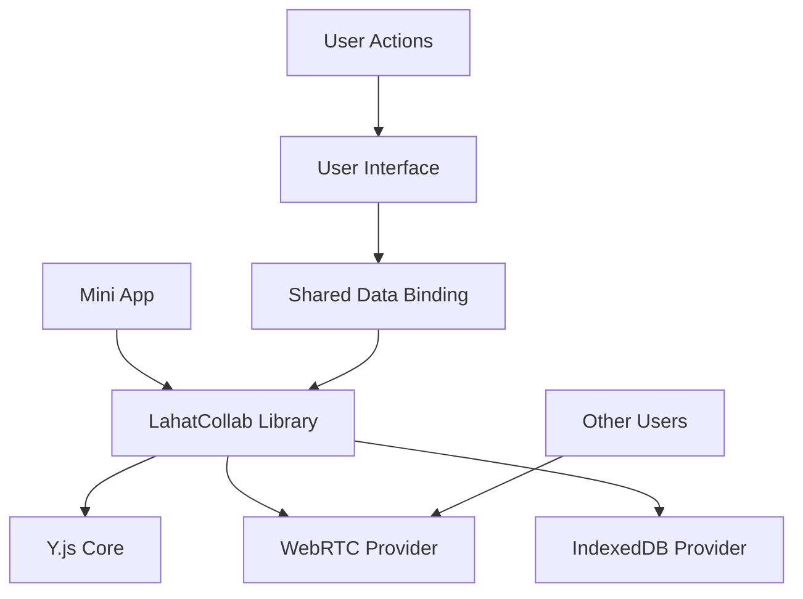
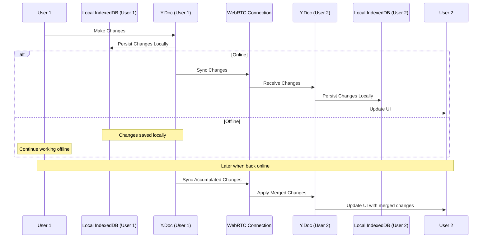

# Lahat Collaboration Framework

**Version:** 1.0.0  
**Date:** 2025-05-23

This document provides comprehensive documentation for implementing and using the collaboration features in Lahat mini apps. The framework enables real-time, offline-first collaboration for any type of mini app generated with Lahat.

## Table of Contents

1. [Overview](#overview)
2. [Architecture](#architecture)
3. [Getting Started](#getting-started)
4. [LahatCollab API Reference](#lahatcollab-api-reference)
5. [Implementation Patterns](#implementation-patterns)
6. [Advanced Topics](#advanced-topics)
7. [Troubleshooting](#troubleshooting)
8. [Technical Implementation Details](#technical-implementation-details)

## Overview

The Lahat Collaboration Framework provides a set of tools and APIs to make any mini app collaborative with minimal code changes. Key features include:

- **Real-time synchronization** - Changes sync automatically between users
- **Offline-first design** - Work offline and sync when connectivity returns
- **Conflict-free data model** - Based on CRDTs (Conflict-free Replicated Data Types)
- **Presence awareness** - See other users and their actions
- **Locking mechanisms** - Prevent simultaneous edits to the same data

The framework is built on proven technologies including:

- [Yjs](https://github.com/yjs/yjs) - A CRDT implementation for conflict-free data syncing
- WebRTC - For peer-to-peer data transmission
- IndexedDB - For local data persistence

## Architecture

### High-Level Architecture



### Data Flow



### Two-Channel Communication

The framework uses two separate communication channels:

1. **State Channel** (Reliable)
   - Used for CRDT updates
   - Ensures all data changes are eventually delivered
   - Handles conflict resolution automatically

2. **Presence Channel** (Unreliable, but fast)
   - Used for ephemeral data like cursor positions
   - Optimized for low-latency updates
   - Drops messages when necessary to maintain responsiveness

## Getting Started

### Enabling Collaboration in Your Mini App

When creating a mini app in Lahat, you can enable collaboration by:

1. Selecting the "Enable Collaboration" option during app creation
2. The system will automatically inject the LahatCollab library into your app
3. A unique room ID will be generated for your app

### Basic Usage

Once collaboration is enabled, you can use the LahatCollab API in your mini app:

```javascript
// Initialize collaboration
const collab = LahatCollab.init('my-app');

// Create a shared data structure
const sharedData = collab.createShared('appData');

// Make changes to the shared data
sharedData.title = "New Title";
sharedData.items = ["item1", "item2"];

// Listen for changes from other users
collab.onUpdate('appData', () => {
  // Update UI with new data
  updateUI(sharedData);
});
```

### Connection Status

Monitor and display connection status:

```javascript
// Add connection status indicator
const statusEl = document.getElementById('connection-status');

// Update when connection status changes
collab.connection.onStatusChange((isOnline) => {
  statusEl.className = isOnline ? 'connected' : 'disconnected';
  statusEl.textContent = isOnline ? 'Connected' : 'Working Offline';
});
```

## LahatCollab API Reference

### Core API

#### `LahatCollab.init(roomId, options)`

Initializes the collaboration framework.

- **Parameters:**
  - `roomId` (string): Unique identifier for the collaboration room
  - `options` (object, optional): Configuration options
    - `webrtc`: WebRTC configuration options
    - `awareness`: Awareness configuration options
    - `logging`: Logging level (none, error, warn, info, debug)

- **Returns:** LahatCollab instance

#### `LahatCollab.createShared(name, type)`

Creates a shared data structure.

- **Parameters:**
  - `name` (string): Unique name for the shared data
  - `type` (string, optional): Type of shared data structure ('object', 'array', 'text')
  
- **Returns:** Shared data structure

#### `LahatCollab.onUpdate(name, callback)`

Registers a callback for when shared data is updated.

- **Parameters:**
  - `name` (string): Name of the shared data to monitor
  - `callback` (function): Function to call when data changes

### Connection API

#### `LahatCollab.connection.isOnline()`

Checks if the app is currently connected to peers.

- **Returns:** Boolean indicating online status

#### `LahatCollab.connection.onStatusChange(callback)`

Registers a callback for connection status changes.

- **Parameters:**
  - `callback` (function): Function to call when status changes

#### `LahatCollab.connection.getStats()`

Gets current connection statistics.

- **Returns:** Object with connection stats
  - `connectedPeers`: Number of connected peers
  - `localChanges`: Number of local changes not yet synced
  - `lastSyncTime`: Timestamp of last successful sync

### Presence API

#### `LahatCollab.presence.setLocalState(state)`

Sets the local user's presence state.

- **Parameters:**
  - `state` (object): State object to broadcast to other users

#### `LahatCollab.presence.getStates()`

Gets all users' presence states.

- **Returns:** Map of user IDs to their presence states

#### `LahatCollab.presence.onUpdate(callback)`

Registers a callback for when any user's presence changes.

- **Parameters:**
  - `callback` (function): Function to call when presence changes

### Sync API

#### `LahatCollab.sync.forceSync()`

Manually triggers synchronization.

- **Returns:** Promise resolving to sync result object

#### `LahatCollab.sync.pauseSync()`

Temporarily pauses automatic synchronization.

#### `LahatCollab.sync.resumeSync()`

Resumes automatic synchronization.

## Implementation Patterns

### Todo List Example

```javascript
// Initialize collaboration
const collab = LahatCollab.init('todo-app');

// Create shared data
const todos = collab.createShared('todos', 'array');

// Add a new todo
function addTodo(text) {
  todos.push([{ 
    id: generateId(), 
    text, 
    completed: false,
    createdBy: collab.getClientId(),
    createdAt: Date.now()
  }]);
}

// Toggle todo completion
function toggleTodo(id) {
  for (let i = 0; i < todos.length; i++) {
    if (todos.get(i).id === id) {
      const todo = todos.get(i);
      todo.completed = !todo.completed;
      todo.modifiedBy = collab.getClientId();
      todo.modifiedAt = Date.now();
      todos.set(i, todo);
      break;
    }
  }
}

// Listen for changes and update UI
collab.onUpdate('todos', () => {
  renderTodoList(todos);
});

// Show who's online
collab.presence.onUpdate((states) => {
  const userCount = states.size;
  document.getElementById('user-count').textContent = `${userCount} user(s) online`;
});
```

### Kanban Board Example

```javascript
// Initialize collaboration
const collab = LahatCollab.init('kanban-app');

// Create shared data
const board = collab.createShared('board');

// Initialize columns if empty
if (!board.has('columns')) {
  board.set('columns', {
    todo: { id: 'todo', title: 'To Do', cards: [] },
    doing: { id: 'doing', title: 'Doing', cards: [] },
    done: { id: 'done', title: 'Done', cards: [] }
  });
}

// Lock a card during drag operations
function lockCard(cardId) {
  collab.presence.setLocalState({ 
    drag: { cardId, timestamp: Date.now() } 
  });
}

// Release lock when done dragging
function unlockCard() {
  const state = collab.presence.getLocalState();
  if (state && state.drag) {
    delete state.drag;
    collab.presence.setLocalState(state);
  }
}

// Create a new card
function addCard(columnId, text) {
  const cardId = generateId();
  const column = board.get('columns').get(columnId);
  column.cards.push({ 
    id: cardId, 
    text,
    createdBy: collab.getClientId(),
    createdAt: Date.now()
  });
  board.get('columns').set(columnId, column);
}

// Move a card between columns
function moveCard(cardId, fromColumnId, toColumnId) {
  // Lock the card first
  lockCard(cardId);
  
  // Get the columns
  const fromColumn = board.get('columns').get(fromColumnId);
  const toColumn = board.get('columns').get(toColumnId);
  
  // Find the card in the from column
  const cardIndex = fromColumn.cards.findIndex(card => card.id === cardId);
  if (cardIndex === -1) {
    unlockCard();
    return;
  }
  
  // Get the card
  const card = fromColumn.cards[cardIndex];
  
  // Update the card
  card.modifiedBy = collab.getClientId();
  card.modifiedAt = Date.now();
  
  // Remove from the old column
  fromColumn.cards.splice(cardIndex, 1);
  
  // Add to the new column
  toColumn.cards.push(card);
  
  // Update the columns
  board.get('columns').set(fromColumnId, fromColumn);
  board.get('columns').set(toColumnId, toColumn);
  
  // Release the lock
  unlockCard();
}

// Disable cards that are being dragged by others
collab.presence.onUpdate((states) => {
  // Find all locked cards
  const lockedCards = new Set();
  states.forEach((state, clientId) => {
    if (state.drag && state.drag.cardId) {
      lockedCards.add(state.drag.cardId);
    }
  });
  
  // Update UI to disable locked cards
  document.querySelectorAll('.card').forEach(cardEl => {
    const cardId = cardEl.dataset.id;
    if (lockedCards.has(cardId)) {
      cardEl.classList.add('locked');
    } else {
      cardEl.classList.remove('locked');
    }
  });
});
```

### Drawing App Example

```javascript
// Initialize collaboration
const collab = LahatCollab.init('drawing-app');

// Create shared data for strokes
const strokes = collab.createShared('strokes', 'array');

// Create a canvas
const canvas = document.getElementById('canvas');
const ctx = canvas.getContext('2d');

// Create a cursor overlay
const cursorCanvas = document.getElementById('cursor-canvas');
const cursorCtx = cursorCanvas.getContext('2d');

// Add a new stroke
function startStroke(x, y, color, width) {
  const strokeId = generateId();
  const stroke = {
    id: strokeId,
    points: [[x, y]],
    color,
    width,
    createdBy: collab.getClientId()
  };
  
  strokes.push([stroke]);
  return strokeId;
}

// Add a point to a stroke
function continueStroke(strokeId, x, y) {
  // Find the stroke
  for (let i = 0; i < strokes.length; i++) {
    const stroke = strokes.get(i);
    if (stroke.id === strokeId) {
      // Add the point
      stroke.points.push([x, y]);
      strokes.set(i, stroke);
      break;
    }
  }
}

// Update cursor position
function updateCursor(x, y) {
  collab.presence.setLocalState({
    cursor: { x, y },
    color: currentColor
  });
}

// Draw all strokes
function drawStrokes() {
  ctx.clearRect(0, 0, canvas.width, canvas.height);
  
  for (let i = 0; i < strokes.length; i++) {
    const stroke = strokes.get(i);
    if (stroke.points.length < 2) continue;
    
    ctx.beginPath();
    ctx.moveTo(stroke.points[0][0], stroke.points[0][1]);
    
    for (let j = 1; j < stroke.points.length; j++) {
      ctx.lineTo(stroke.points[j][0], stroke.points[j][1]);
    }
    
    ctx.strokeStyle = stroke.color;
    ctx.lineWidth = stroke.width;
    ctx.stroke();
  }
}

// Draw cursors
collab.presence.onUpdate((states) => {
  cursorCtx.clearRect(0, 0, cursorCanvas.width, cursorCanvas.height);
  
  states.forEach((state, clientId) => {
    if (clientId !== collab.getClientId() && state.cursor) {
      // Draw cursor
      cursorCtx.beginPath();
      cursorCtx.arc(state.cursor.x, state.cursor.y, 5, 0, Math.PI * 2);
      cursorCtx.fillStyle = state.color || '#000000';
      cursorCtx.fill();
      
      // Draw user label
      cursorCtx.font = '12px Arial';
      cursorCtx.fillText(`User ${clientId.substr(0, 6)}`, state.cursor.x + 10, state.cursor.y + 10);
    }
  });
});

// Listen for changes to strokes
collab.onUpdate('strokes', () => {
  drawStrokes();
});
```

## Advanced Topics

### Custom CRDT Types

For advanced use cases, you can create custom CRDT types:

```javascript
// Create a custom counter type
function createCounter(name) {
  const ymap = collab.doc.getMap(name);
  
  // Initialize counter if needed
  if (!ymap.has('value')) {
    ymap.set('value', 0);
  }
  
  return {
    increment: () => {
      ymap.set('value', ymap.get('value') + 1);
    },
    decrement: () => {
      ymap.set('value', ymap.get('value') - 1);
    },
    getValue: () => ymap.get('value'),
    onChange: (callback) => {
      ymap.observe(() => {
        callback(ymap.get('value'));
      });
    }
  };
}

// Usage
const counter = createCounter('pageViews');
counter.increment();
counter.onChange(value => {
  document.getElementById('counter').textContent = value;
});
```

### Conflict Resolution Strategies

The framework uses automatic conflict resolution based on CRDTs, but you can implement custom strategies:

```javascript
// Custom last-writer-wins with timestamp
function createLWWRegister(name) {
  const ymap = collab.doc.getMap(name);
  
  return {
    set: (value) => {
      ymap.set('value', value);
      ymap.set('timestamp', Date.now());
      ymap.set('author', collab.getClientId());
    },
    get: () => ymap.get('value'),
    getMetadata: () => ({
      timestamp: ymap.get('timestamp'),
      author: ymap.get('author')
    })
  };
}
```

### Awareness Protocol Extensions

Extend the awareness protocol for custom presence features:

```javascript
// Custom typing indicator
function setupTypingIndicator(inputEl, fieldName) {
  let typingTimeout;
  
  inputEl.addEventListener('keydown', () => {
    // Set typing state
    const state = collab.presence.getLocalState() || {};
    state.typing = state.typing || {};
    state.typing[fieldName] = true;
    collab.presence.setLocalState(state);
    
    // Clear previous timeout
    clearTimeout(typingTimeout);
    
    // Set timeout to clear typing state
    typingTimeout = setTimeout(() => {
      const newState = collab.presence.getLocalState() || {};
      if (newState.typing) {
        newState.typing[fieldName] = false;
        collab.presence.setLocalState(newState);
      }
    }, 2000);
  });
}

// Show typing indicators
collab.presence.onUpdate((states) => {
  const typingUsers = [];
  
  states.forEach((state, clientId) => {
    if (clientId !== collab.getClientId() && 
        state.typing && 
        Object.values(state.typing).some(Boolean)) {
      typingUsers.push(clientId);
    }
  });
  
  const typingEl = document.getElementById('typing-indicator');
  if (typingUsers.length > 0) {
    typingEl.textContent = `${typingUsers.length} user(s) typing...`;
    typingEl.style.display = 'block';
  } else {
    typingEl.style.display = 'none';
  }
});
```

## Troubleshooting

### Common Issues

#### Connection Problems

**Symptom:** Users cannot connect to each other.

**Possible solutions:**
- Check if all users are using the same room ID
- Verify that WebRTC is not blocked by firewalls
- Try using a different network connection

#### Data Not Syncing

**Symptom:** Changes made by one user are not appearing for others.

**Possible solutions:**
- Check connection status with `collab.connection.isOnline()`
- Try manual sync with `collab.sync.forceSync()`
- Verify that you're observing the correct shared data

#### Conflicts in Data

**Symptom:** Data appears differently for different users.

**Possible solutions:**
- This should not happen with proper CRDT usage
- Ensure you're not manipulating the shared data outside the CRDT framework
- Check for race conditions in your code

### Debugging

Enable debug logging for troubleshooting:

```javascript
const collab = LahatCollab.init('my-app', {
  logging: 'debug'
});
```

View logs in the browser console to diagnose issues.

## Technical Implementation Details

### Library Dependencies

The LahatCollab framework depends on:

- **Yjs** (v13.5.50+) - Core CRDT implementation
- **y-webrtc** (v10.2.5+) - WebRTC provider for Yjs
- **y-indexeddb** (v9.0.9+) - IndexedDB provider for Yjs

These dependencies are bundled with Lahat and injected directly into mini apps when collaboration is enabled, ensuring offline functionality.

### Embedding Process

When collaboration is enabled for a mini app:

1. The collaboration libraries are bundled and embedded directly in the HTML
2. A unique room ID is generated based on the app ID
3. The LahatCollab library is initialized with this room ID
4. Collaboration UI elements are added to the app

### Security Considerations

- WebRTC connections use DTLS for encryption
- Room IDs should be treated as secrets and shared securely
- No data is stored on external servers, only on users' devices

### Performance Optimization

For large collaborative apps, consider:

- Using fine-grained shared data structures instead of one large object
- Implementing custom rendering optimizations to only update changed elements
- Using the awareness protocol for ephemeral data instead of the CRDT

### Extending the Framework

Developers can extend the framework by:

1. Accessing the underlying Yjs document via `collab.doc`
2. Creating custom shared data types
3. Implementing custom network providers
4. Adding custom UI components for collaboration features

## Conclusion

The Lahat Collaboration Framework provides a powerful yet simple way to add real-time collaboration to any mini app. By leveraging CRDTs and WebRTC, it enables a seamless collaborative experience that works even offline.

For further assistance or to report issues, please contact the Lahat development team.
