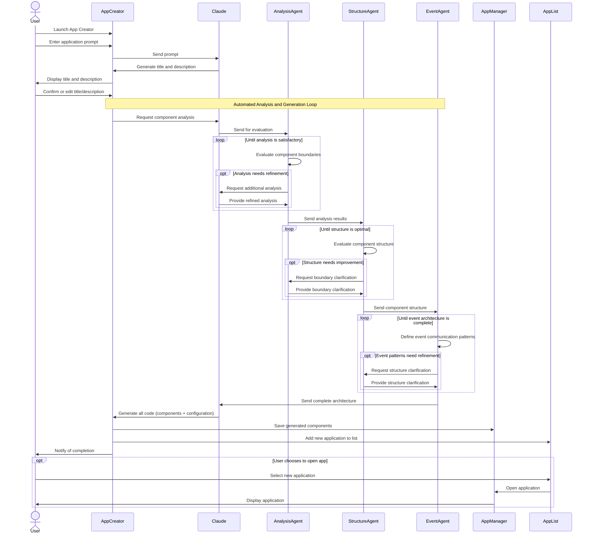

# App Creator Module

## Overview

The App Creator module is responsible for generating web components based on user prompts. It provides a guided interface for users to describe the application they want to create and uses Claude to generate the necessary code.

## Features

- Natural language prompt interface
- Step-by-step creation process
- Preview of generated code
- Integration with Claude API

## Architecture

The App Creator module is implemented as a separate window that can be launched from:
- The main window's "Create" button
- The "+" button in the widget drawer of the App Manager

### Components

```
┌─────────────────────────────────────────────────────────┐
│                     App Creator                         │
│                                                         │
│  ┌─────────────┐    ┌─────────────────────┐            │
│  │             │    │                     │            │
│  │  Step One   │───▶│      Step Two       │            │
│  │  (Prompt)   │    │  (Title/Description)│            │
│  │             │    │                     │            │
│  └─────────────┘    └─────────┬───────────┘            │
│                               │                        │
│                               ▼                        │
│                     ┌─────────────────────┐            │
│                     │                     │            │
│                     │    Step Three       │            │
│                     │   (Component        │            │
│                     │    Analysis)        │            │
│                     │                     │            │
│                     └─────────┬───────────┘            │
│                               │                        │
│                               ▼                        │
│                     ┌─────────────────────┐            │
│                     │                     │            │
│                     │     Step Four       │            │
│                     │    (Component       │            │
│                     │     Structure)      │            │
│                     │                     │            │
│                     └─────────┬───────────┘            │
│                               │                        │
│                               ▼                        │
│                     ┌─────────────────────┐            │
│                     │                     │            │
│                     │     Step Five       │            │
│                     │      (Event         │            │
│                     │   Communication)    │            │
│                     │                     │            │
│                     └─────────┬───────────┘            │
│                               │                        │
│                               ▼                        │
│                     ┌─────────────────────┐            │
│                     │                     │            │
│                     │     Step Six        │            │
│                     │    (Generation)     │            │
│                     │                     │            │
│                     └─────────────────────┘            │
│                                                         │
└─────────────────────────────────────────────────────────┘
```

### Step One: Prompt

The first step allows the user to enter a natural language description of the application they want to create. This description is used to generate a title and description for the application.

### Step Two: Title/Description

The second step displays the generated title and description, allowing the user to edit them if needed. Once confirmed, these are used to analyze the component structure.

### Step Three: Component Analysis

The third step automatically analyzes the application requirements to identify logical UI and functional boundaries:
- Determines the core functionality needed in the application
- Identifies potential reusable patterns and components
- Analyzes similar existing components for inspiration
- Identifies logical UI and functional boundaries for component separation
- Uses an analysis agent to evaluate and refine the component boundaries
- Iterates until the analysis is satisfactory

### Step Four: Component Structure

The fourth step automatically determines the optimal structure of webcomponents:
- Determines how many webcomponents are needed
- Defines the responsibility of each component
- Plans how these components will be instantiated into LahatCells
- Ensures each component is:
  - Completely independent and unaware of Lahat
  - Self-contained with clear boundaries
  - Focused on a single responsibility
- Uses a structure agent to evaluate and refine the component structure
- Can request clarification from the analysis agent if needed
- Iterates until the structure is optimal

### Step Five: Event Communication

The fifth step automatically defines how components will communicate via events:
- Analyzes each component to identify all CustomEvents it will emit
- Creates an event manifest for each component listing:
  - Event names
  - Event data structures
  - Event bubbling properties
- Configures LahatCells to intercept the specific events from each component
- Documents how these events will be consumed by other components via the event bus
- Ensures components emit properly bubbling events (using `bubbles: true, composed: true`)
- Can request clarification from the structure agent if needed
- Iterates until the event architecture is complete

### Step Six: Generation

The sixth step shows the generation process and the resulting code for each webcomponent:
- Generates the code for each webcomponent based on the approved structure
- Generates configuration for LahatCells to properly intercept events
- Shows the generation process and resulting code
- Saves the components for use in the App Manager

## Integration with Claude

The App Creator uses the Claude API to:
1. Generate a title and description based on the user's prompt
2. Analyze requirements and identify logical component boundaries
3. Propose optimal component structure and relationships
4. Define event communication patterns between components
5. Generate the application code for each webcomponent based on the approved architecture

## Data Flow

1. User enters a prompt in Step One
2. Claude generates a title and description
3. User confirms or edits the title and description in Step Two
4. The system enters an automated analysis and generation loop:
   - Claude analyzes the requirements and identifies logical component boundaries
   - An analysis agent evaluates and refines the component boundaries
   - A structure agent determines the optimal component structure
   - The structure agent may request clarification from the analysis agent
   - An event agent defines the event communication patterns
   - The event agent may request clarification from the structure agent
   - Claude generates the application code based on the complete architecture
5. The application is saved and appears in the App List
6. User is notified of completion

### App Generation Sequence Diagram



## Implementation Details

### Directory Structure

```
src/
└── app-creator/
    ├── components/
    │   ├── app-creation-step.js
    │   ├── app-creation-step-one.js
    │   ├── app-creation-step-two.js
    │   ├── app-creation-step-three.js
    │   ├── app-creation-step-four.js
    │   ├── app-creation-step-five.js
    │   ├── app-creation-step-six.js
    │   ├── component-analysis-preview.js
    │   ├── component-structure-preview.js
    │   ├── event-communication-preview.js
    │   ├── generation-preview.js
    │   └── generation-status.js
    ├── services/
    │   ├── claude-service.js
    │   ├── component-analysis-service.js
    │   ├── component-structure-service.js
    │   ├── event-analysis-service.js
    │   └── app-generation-service.js
    ├── utils/
    │   ├── prompt-utils.js
    │   ├── component-utils.js
    │   └── event-utils.js
    ├── app-creator.html
    └── app-creator.js
```

### Key Classes

- **AppCreationStep**: Base class for all steps
- **AppCreationStepOne**: Handles the prompt input
- **AppCreationStepTwo**: Handles the title and description
- **AppCreationStepThree**: Handles the automated component analysis process
- **AppCreationStepFour**: Handles the automated component structure definition
- **AppCreationStepFive**: Handles the automated event communication definition
- **AppCreationStepSix**: Handles the generation process
- **AnalysisAgent**: Evaluates and refines component boundaries
- **StructureAgent**: Evaluates and refines component structures
- **EventAgent**: Defines and refines event communication patterns
- **GenerationPreview**: Displays the generated code
- **GenerationStatus**: Shows the status of the generation process
- **ClaudeService**: Handles communication with the Claude API
- **ComponentAnalysisService**: Analyzes requirements to identify logical component boundaries
- **ComponentStructureService**: Determines optimal component structure
- **EventAnalysisService**: Analyzes components to identify events and create event manifests
- **AppGenerationService**: Manages the app generation process
- **ComponentUtils**: Utility functions for component decomposition
- **EventUtils**: Utility functions for event handling and configuration
- **FeedbackLoopManager**: Manages the iterative feedback loops between agents

## Communication Architecture

The App Creator module has a single communication layer for internal component communication:

### Module Communication

- Uses module-specific internal event handling for component communication
- Manages the step-based workflow and UI updates
- Implements direct method calls for parent-child component communication
- Focuses on generating webcomponents that follow the front-end event bus pattern, where:
  - WebComponents emit CustomEvents that bubble up
  - LahatCells intercept these events and proxy them to the front-end event bus
  - WebComponents remain unaware of the event bus or other components

### Event Interception Mechanism

The App Creator generates webcomponents with accompanying metadata for efficient event interception:

1. **Event Metadata Generation**: When generating webcomponents, the LLM also creates a `meta.json` file containing event information:
   ```json
   {
     "componentName": "data-table-component",
     "version": "1.0.0",
     "events": [
       {
         "name": "data-updated",
         "bubbles": true,
         "composed": true,
         "detail": {
           "type": "object",
           "properties": {
             "rows": { "type": "array" },
             "timestamp": { "type": "string" }
           }
         }
       },
       {
         "name": "selection-changed",
         "bubbles": true,
         "composed": true,
         "detail": {
           "type": "object",
           "properties": {
             "selectedIds": { "type": "array" }
           }
         }
       }
     ]
   }
   ```

2. **Efficient LahatCell Configuration**: LahatCells use this metadata to configure event interception without needing to analyze the component code:
   ```javascript
   // LahatCell reads the meta.json file
   const metadata = await fetch(`/components/${componentName}/meta.json`).then(r => r.json());
   
   // Configure event interception based on metadata
   lahatCell.configureEventInterception(metadata.events.map(e => e.name));
   ```

3. **Dynamic Event Listeners**: LahatCells use this configuration to set up appropriate event listeners

4. **Event Proxying**: Intercepted events are proxied to the front-end event bus

5. **Documentation Generation**: The metadata also serves as documentation for component users, showing what events they can listen for

## Security Considerations

- Generated webcomponents are validated before being saved
- WebComponents are designed to be secure, self-contained units
- The Claude API key is securely stored and never exposed to the client
- Generated code follows best practices for web component security

## Generated WebComponent Architecture

The App Creator generates webcomponents that follow these principles:

1. **Independence**: Each webcomponent is completely independent and unaware of Lahat
2. **Event-Based Communication**: Components emit standard DOM events (CustomEvents) that bubble up
3. **No Direct Dependencies**: Components have no direct knowledge of or dependencies on other components
4. **Reusability**: Components are designed to be reusable in different contexts via the widget drawer
5. **Self-Contained UI**: Each component handles its own UI rendering and internal state
6. **Explicit Event Interface**: Each component has a well-defined event interface documented in its metadata
7. **Self-Describing**: Components include metadata files (meta.json) that describe their events and properties

This architecture ensures that the generated webcomponents can be:
- Instantiated into LahatCells in the App Manager
- Recomposed into new applications via the widget drawer
- Maintained and updated independently
- Properly integrated with the event bus through LahatCell event interception
- Efficiently configured without runtime analysis
