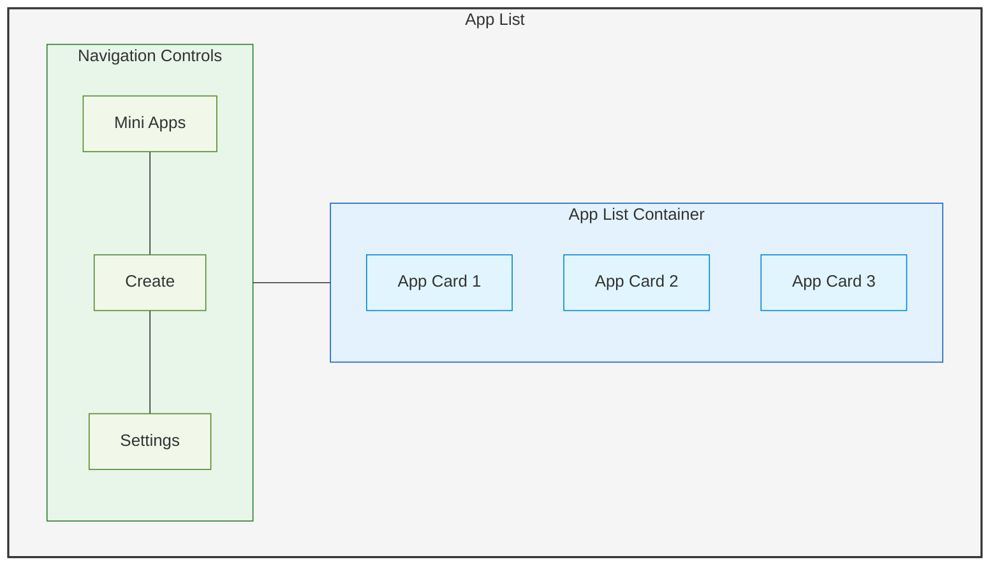

# App List Module

## Overview

The App List module serves as the main entry point to the Lahat application. It displays a list of available mini apps and provides navigation controls to access other parts of the application.

## Features

- Display a list of available mini apps
- Navigation controls (Mini Apps, Create, Settings)
- App selection and launching
- App filtering and sorting

## Architecture

The App List module is implemented as the main view of the application and provides access to other modules.

### Components



### Navigation Controls

The navigation controls allow users to:
- View the list of mini apps (default view)
- Create a new app by launching the App Creator
- Access application settings

### App List Container

The App List Container displays a list of available mini apps. Each app is represented by an App Card that shows:
- App title
- App description
- App icon (if available)
- Last modified date

## User Interactions

1. **Viewing Apps**: Users can scroll through the list of available apps
2. **Selecting an App**: Clicking on an app card launches the app in the App Manager
3. **Creating a New App**: Clicking the "Create" button launches the App Creator
4. **Accessing Settings**: Clicking the "Settings" button opens the settings view

## Implementation Details

### Directory Structure

```
src/
└── app-list/
    ├── components/
    │   ├── app-list-container.js
    │   ├── app-card.js
    │   └── navigation-controls.js
    ├── services/
    │   └── app-list-service.js
    ├── utils/
    │   ├── app-filter.js
    │   └── app-sort.js
    ├── app-list.html
    └── app-list.js
```

### Key Classes

- **AppListContainer**: Main container for the app list
- **AppCard**: Represents a single app in the list
- **NavigationControls**: Handles navigation between different views
- **AppListService**: Manages the list of available apps
- **AppFilter**: Provides filtering capabilities for the app list
- **AppSort**: Provides sorting capabilities for the app list

## Communication Architecture

The App List module has two distinct communication layers:

### Inter-Module Communication

The App List module communicates with other modules through:

- **IPC**: Uses Electron's contextBridge for communication with other modules
- **Preload Scripts**: Securely exposes APIs to the renderer process

### Intra-Module Communication

For communication between components within the App List module:

- **Module-Specific Event System**: Internal event handling for component communication
- **Direct Method Calls**: For parent-child component communication

### Events

The App List module publishes the following events:
- `app-selected`: When a user selects an app from the list
- `create-app-requested`: When a user clicks the "Create" button
- `settings-requested`: When a user clicks the "Settings" button

The App List module subscribes to the following events:
- `app-created`: When a new app is created by the App Creator
- `app-updated`: When an existing app is updated
- `app-deleted`: When an app is deleted

## Migration from v1

The App List module is based on the functionality in `v1/components/ui/containers/app-list.js`. The migration involves:

1. Refactoring the existing code into a standalone module
2. Enhancing the UI with improved navigation controls
3. Adding filtering and sorting capabilities
4. Implementing communication with other modules through IPC using Electron's contextBridge

## Security Considerations

- The App List module only displays metadata about apps and does not execute any app code
- App selection is handled through secure event communication
- App data is validated before being displayed
