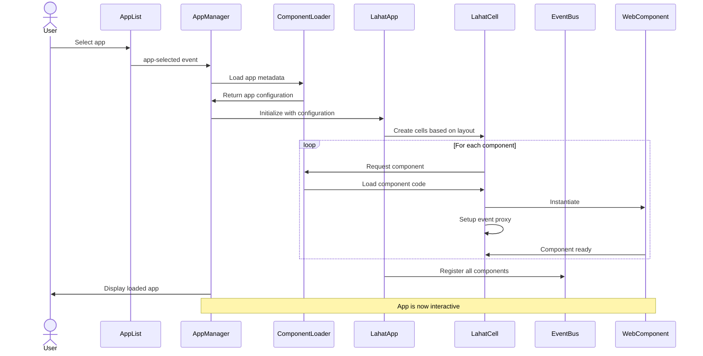
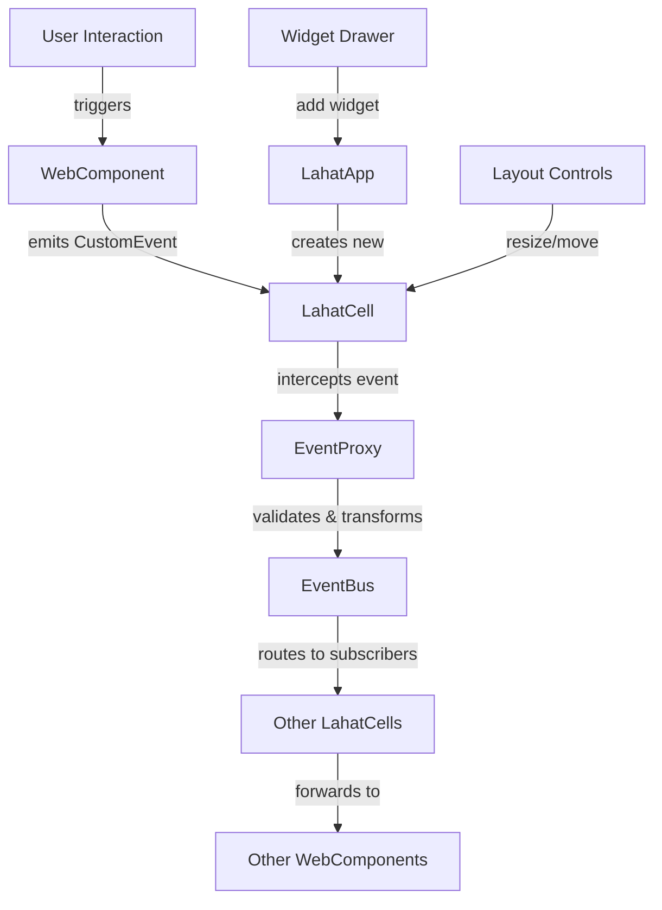
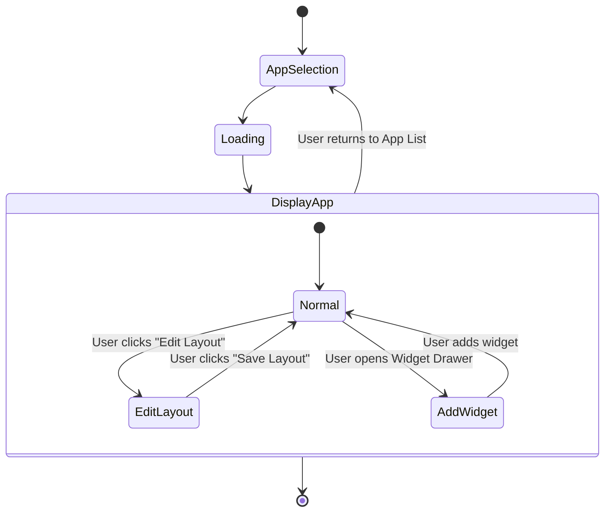

# App Manager Module - Comprehensive Documentation

## Overview

The App Manager module is responsible for loading, displaying, and managing the web components generated by the App Creator. It provides a container environment where these components can run safely and communicate with each other through a controlled event system.

This document provides a comprehensive overview of the App Manager module, including its architecture, component display capabilities, storage structure, CORS solutions, and implementation details.

## Architecture

The App Manager module is implemented as a view that is displayed when a user selects an app from the App List. It consists of several key components:

### Components

```
┌─────────────────────────────────────────────┐
│               App Manager                   │
│                                             │
│  ┌─────────────────────────────────────────┐│
│  │              EventBus                   ││
│  └─────────────────────────────────────────┘│
│                                             │
│  ┌─────────────────────────────────────────┐│
│  │             LahatApp                    ││
│  │                                         ││
│  │  ┌───────────────┐  ┌───────────────┐   ││
│  │  │  LahatCell 1  │  │  LahatCell 2  │   ││
│  │  │               │  │               │   ││
│  │  │ ┌───────────┐ │  │ ┌───────────┐ │   ││
│  │  │ │CustomEvent│ │  │ │CustomEvent│ │   ││
│  │  │ └───────────┘ │  │ └───────────┘ │   ││
│  │  │               │  │               │   ││
│  │  │ ┌───────────┐ │  │ ┌───────────┐ │   ││
│  │  │ │ WebComp   │ │  │ │ WebComp   │ │   ││
│  │  │ └───────────┘ │  │ └───────────┘ │   ││
│  │  └───────────────┘  └───────────────┘   ││
│  │                                         ││
│  └─────────────────────────────────────────┘│
│                                             │
│  ┌─────────────────────────────────────────┐│
│  │            Widget Drawer                ││
│  │                                         ││
│  │  ┌─────────┐ ┌─────────┐ ┌─────────┐    ││
│  │  │Widget 1 │ │Widget 2 │ │Widget 3 │ +  ││
│  │  └─────────┘ └─────────┘ └─────────┘    ││
│  └─────────────────────────────────────────┘│
│                                             │
└─────────────────────────────────────────────┘
```

### LahatApp

The LahatApp is the main container component that manages the layout and lifecycle of LahatCells. It is responsible for:

- Creating and destroying LahatCells
- Managing the layout of cells (tiling, resizing, etc.)
- Routing events between cells through the EventBus

### LahatCell

LahatCells are container components that host the generated web components. Each LahatCell:

- Provides a secure sandbox for the contained component
- Manages the lifecycle of the component (creation, initialization, destruction)
- Contains a CustomEvent handler that acts as an event proxy
- Communicates with other cells through the EventBus

LahatCells can contain either:
- A single WebComponent (leaf node)
- Multiple LahatCells (container node)

This recursive structure allows for complex nested layouts with arbitrary depth.

```
LahatApp
  └── LahatCell
       └── Either:
            ├── WebComponent (leaf node)
            └── Multiple LahatCells (container node)
                 └── Each can contain a WebComponent or more LahatCells
```

### Module-Specific EventBus

The App Manager module has its own internal EventBus that allows components within the module to communicate without direct dependencies. It:

- Implements a publish-subscribe pattern
- Routes events between components within the App Manager module
- Provides security by controlling which events can be sent and received
- Is completely independent from other modules' event systems

### Widget Drawer

The Widget Drawer displays available widgets that can be added to the current app. It:

- Shows a list of available widgets
- Allows users to add widgets to the app
- Provides a "+" button to create new widgets through the App Creator

## Storage Structure

Components and apps are stored in a clear, folder-based structure:

```
/components/
  ├── component-name-1/
  │   ├── index.js        # Self-contained component with inline assets
  │   └── meta.json       # Simple metadata file
  ├── component-name-2/
  │   ├── index.js
  │   └── meta.json
  └── ...

/apps/
  ├── app-name-1/
  │   └── app.yaml        # App configuration in YAML format
  ├── app-name-2/
  │   └── app.yaml
  └── ...
```

### Component JS File

Each component is completely self-contained in a single JS file:
- All styles included in the Shadow DOM
- SVG images inlined directly in the code
- No external dependencies

```javascript
// components/component-name-1/index.js
export class ComponentName1 extends HTMLElement {
  constructor() {
    super();
    this.attachShadow({ mode: 'open' });
    
    // Render with inline SVG
    this.render();
  }
  
  render() {
    this.shadowRoot.innerHTML = `
      <style>
        :host { display: block; }
        .container { padding: 16px; }
        /* More styles... */
      </style>
      
      <div class="container">
        <h2>Component Title</h2>
        
        <!-- Inline SVG -->
        <svg width="24" height="24" viewBox="0 0 24 24">
          <path d="M12 2L1 21h22L12 2z" fill="currentColor"/>
        </svg>
        
        <div class="content">
          <!-- Component content -->
        </div>
      </div>
    `;
    
    // Set up event listeners
    this.setupEventListeners();
  }
  
  // Rest of component implementation...
}

// Register the component
customElements.define('component-name-1', ComponentName1);
```

### Component Metadata

The metadata file contains essential information about the component:

```json
{
  "componentName": "component-name-1",
  "version": "1.0.0",
  "description": "A simple component that does X",
  "events": [
    {
      "name": "data-updated",
      "bubbles": true,
      "composed": true,
      "detail": {
        "rows": "number",
        "timestamp": "string"
      }
    },
    {
      "name": "selection-changed",
      "bubbles": true,
      "composed": true,
      "detail": {
        "selectedIds": "array"
      }
    }
  ],
  "attributes": [
    {
      "name": "columns",
      "type": "json",
      "description": "Column configuration for the table",
      "default": "[]"
    },
    {
      "name": "sortable",
      "type": "boolean",
      "description": "Whether the table can be sorted",
      "default": "true"
    }
  ],
  "methods": [
    {
      "name": "setData",
      "description": "Set the data for the table",
      "parameters": [
        {
          "name": "data",
          "type": "array",
          "description": "Array of data objects"
        }
      ]
    }
  ]
}
```

### App Configuration (YAML)

The app YAML file defines the app structure, layout, and component relationships:

```yaml
# App metadata
appName: Customer Dashboard
version: 1.0.0
description: A dashboard for customer data analysis

# App layout
layout:
  type: responsive-grid
  columns: 12
  rowHeight: 50
  gap: 16
  breakpoints:
    - width: 768
      columns: 6
    - width: 480
      columns: 2

# App cells (components)
cells:
  - id: cell-1
    componentName: customer-stats-component
    position:
      x: 0
      y: 0
    size:
      width: 6
      height: 4
    
  - id: cell-2
    componentName: data-table-component
    position:
      x: 6
      y: 0
    size:
      width: 6
      height: 8
    
  - id: cell-3
    componentName: chart-component
    position:
      x: 0
      y: 4
    size:
      width: 6
      height: 4

# Event connections
connections:
  - sourceCell: cell-2
    sourceEvent: selection-changed
    targetCell: cell-3
    action: updateData
    mapping:
      selectedIds: customerId

# App theme
theme:
  primaryColor: "#4285f4"
  secondaryColor: "#34a853"
  backgroundColor: "#f5f5f5"
  textColor: "#333333"
  fontFamily: "Roboto, sans-serif"

# App settings
settings:
  autoRefresh: true
  refreshInterval: 300
  defaultView: table
```

## Responsive Layout System

The App Manager implements a responsive layout system that:

1. Uses CSS Grid for automatic layout
2. Automatically adjusts based on screen size
3. Allows components to reflow on smaller screens
4. Maintains component relationships and hierarchy

```css
.lahat-app {
  display: grid;
  grid-template-columns: repeat(auto-fill, minmax(300px, 1fr));
  grid-auto-rows: minmax(200px, auto);
  gap: 16px;
  padding: 16px;
}

.lahat-cell.small {
  grid-column: span 1;
}

.lahat-cell.medium {
  grid-column: span 2;
}

.lahat-cell.large {
  grid-column: span 3;
}

/* Responsive breakpoints */
@media (max-width: 768px) {
  .lahat-app {
    grid-template-columns: repeat(auto-fill, minmax(250px, 1fr));
  }
  
  .lahat-cell.medium,
  .lahat-cell.large {
    grid-column: span 1;
  }
}

@media (max-width: 480px) {
  .lahat-app {
    grid-template-columns: 1fr;
  }
  
  .lahat-cell {
    grid-column: span 1;
  }
}
```

This responsive approach provides a more modern, user-friendly experience while simplifying the implementation compared to a complex manual layout system. It aligns well with current web design best practices and ensures the application works well across all devices.

## CORS Solution

The App Manager implements a comprehensive solution to eliminate CORS issues that were present in v1:

### Local Component Loading

Components are loaded from the local file system, eliminating cross-origin issues:

```javascript
// Load component using dynamic import
const module = await import(`/components/${componentName}/index.js`);
```

### Same-Origin Execution

All components are served from the same origin as the Lahat app, eliminating CORS restrictions.

### Metadata-Based Event Interception

LahatCells use component metadata to configure event interception:

```javascript
// Load component metadata
const metadata = await fetch(`/components/${componentName}/meta.json`).then(r => r.json());

// Configure event interception based on metadata
this.configureEventInterception(metadata.events.map(e => e.name));
```

## Security Approach

Instead of using CSP hashes, the App Manager implements a simplified security approach:

1. **Basic CSP**: Implement a basic CSP that restricts resources to same-origin
2. **Load-Time Verification**: Verify components when they're loaded
3. **Metadata-Based Permissions**: Use component metadata to define capabilities

```javascript
// src/app-manager/services/security-service.js
export class SecurityService {
  setupCSP() {
    // Define a basic CSP that restricts to same-origin
    const csp = {
      'default-src': ["'self'"],
      'script-src': ["'self'"],
      'style-src': ["'self'", "'unsafe-inline'"],  // Allow inline styles for Shadow DOM
      'connect-src': ["'self'"],
      'img-src': ["'self'", "data:"],
      'font-src': ["'self'"],
      'object-src': ["'none'"],
      'base-uri': ["'self'"],
      'form-action': ["'self'"],
      'frame-ancestors': ["'self'"]
    };
    
    // Apply the CSP
    this.applyCSP(csp);
  }
  
  async verifyComponent(componentName, componentCode, metadata) {
    // Check for dangerous patterns
    if (!this.checkForDangerousPatterns(componentCode)) {
      console.error(`Component ${componentName} contains dangerous code patterns`);
      return false;
    }
    
    // Verify metadata is valid
    if (!this.verifyMetadata(metadata)) {
      console.error(`Component ${componentName} has invalid metadata`);
      return false;
    }
    
    return true;
  }
  
  checkForDangerousPatterns(code) {
    const dangerousPatterns = [
      /eval\s*\(/g,
      /Function\s*\(/g,
      /document\.write/g
      // More patterns...
    ];
    
    for (const pattern of dangerousPatterns) {
      if (pattern.test(code)) {
        return false;
      }
    }
    
    return true;
  }
}
```

## Component Loading Process

The App Manager loads components using a straightforward process:



## LahatCell Implementation

The LahatCell component is responsible for:

1. Loading and containing web components
2. Managing component lifecycle
3. Intercepting events from components
4. Providing a secure execution environment

```javascript
// src/app-manager/components/lahat-cell.js
export class LahatCell extends HTMLElement {
  constructor() {
    super();
    // ... initialization
  }
  
  async loadComponent(componentName) {
    try {
      // Load the component module
      const module = await import(`/components/${componentName}/index.js`);
      
      // Get the component class
      const ComponentClass = module.default || Object.values(module)[0];
      
      // Register the custom element if needed
      if (!customElements.get(componentName) && ComponentClass) {
        customElements.define(componentName, ComponentClass);
      }
      
      // Create an instance of the component
      const component = document.createElement(componentName);
      
      // Add the component to the cell
      this.appendChild(component);
      
      // Set up event interception
      await this.setupEventInterception(component, componentName);
      
      return component;
    } catch (error) {
      console.error(`Error loading component ${componentName}:`, error);
      this.showErrorState(`Failed to load component: ${componentName}`);
      throw error;
    }
  }
  
  async setupEventInterception(component, componentName) {
    // Load component metadata
    const metadata = await fetch(`/components/${componentName}/meta.json`).then(r => r.json());
    
    if (metadata && metadata.events) {
      // Configure event interception based on metadata
      this.configureEventInterception(metadata.events.map(e => e.name));
    }
  }
  
  configureEventInterception(eventNames) {
    // Add event listeners for each event name
    eventNames.forEach(eventName => {
      this.addEventListener(eventName, this.handleComponentEvent.bind(this));
    });
  }
  
  handleComponentEvent(event) {
    // Only handle events that bubble and have the composed flag set
    if (!event.bubbles || !event.composed) {
      return;
    }
    
    // Create event data
    const eventData = {
      sourceCell: this,
      eventName: event.type,
      detail: event.detail || {}
    };
    
    // Dispatch a cell event that will be handled by the EventBus
    this.dispatchEvent(new CustomEvent('cell-event', {
      bubbles: true,
      composed: true,
      detail: eventData
    }));
  }
}
```

## App Loading Process

The App Manager loads apps using a straightforward process:

```javascript
// src/app-manager/app-manager.js
async loadApp(appId) {
  try {
    // Get app configuration from YAML
    const appConfig = await this.appLoader.loadAppConfig(appId);
    
    if (!appConfig) {
      throw new Error(`App not found: ${appId}`);
    }
    
    // Clear existing content
    this.lahatApp.clear();
    
    // Configure the layout
    this.lahatApp.configureLayout(appConfig.layout);
    
    // Load each cell (component)
    for (const cellConfig of appConfig.cells) {
      await this.loadCell(cellConfig);
    }
    
    // Set up event connections
    if (appConfig.connections) {
      this.setupEventConnections(appConfig.connections);
    }
    
    // Apply app settings
    if (appConfig.settings) {
      this.applyAppSettings(appConfig.settings);
    }
    
    // Notify that the app is loaded
    this.eventBus.publish('app-loaded', { appId, appName: appConfig.appName });
    
    return true;
  } catch (error) {
    console.error(`Error loading app ${appId}:`, error);
    return false;
  }
}
```

## Event Handling Architecture

The App Manager implements a sophisticated event handling architecture:



## App Manager Workflow

The complete workflow for the App Manager:



## Implementation Details

### Directory Structure

```
src/
└── app-manager/
    ├── components/
    │   ├── lahat-app.js
    │   ├── lahat-cell.js
    │   ├── event-bus.js
    │   ├── custom-event-proxy.js
    │   ├── widget-drawer/
    │   │   ├── widget-drawer.js
    │   │   ├── widget-category.js
    │   │   ├── widget-card.js
    │   │   └── widget-search.js
    │   └── layout/
    │       ├── responsive-layout.js
    │       └── drag-drop-manager.js
    ├── services/
    │   ├── component-loader.js
    │   ├── layout-persistence.js
    │   ├── widget-registry.js
    │   ├── app-state-manager.js
    │   └── security-service.js
    ├── utils/
    │   ├── event-utils.js
    │   ├── responsive-utils.js
    │   ├── security-utils.js
    │   └── widget-utils.js
    ├── app-manager.html
    └── app-manager.js
```

### Key Classes

- **LahatApp**: Main container for the app
- **LahatCell**: Container for individual web components
- **EventBus**: Central communication mechanism
- **CustomEventProxy**: Handles event proxying between components
- **WidgetDrawer**: Displays available widgets
- **ResponsiveLayout**: Manages the responsive grid system
- **DragDropManager**: Handles drag-and-drop functionality
- **ComponentLoader**: Loads web components into LahatCells
- **LayoutPersistence**: Manages saving and loading layouts
- **WidgetRegistry**: Manages available widgets
- **AppStateManager**: Manages application state
- **SecurityService**: Handles security verification and CSP

## User Interaction Flows

### Loading and Displaying an App

1. User selects an app from the App List
2. App Manager receives the app-selected event
3. ComponentLoader loads the app metadata and configuration
4. LahatApp initializes with the configuration
5. LayoutManager creates the layout based on saved configuration
6. LahatCells are created according to the layout
7. ComponentLoader loads each component into its LahatCell
8. EventBus registers all components for event communication
9. App is displayed to the user and becomes interactive

### Adding a Widget to the App

1. User opens the Widget Drawer
2. User browses or searches for a widget
3. User drags a widget from the drawer to the app
4. LahatApp creates a new LahatCell at the drop location
5. ComponentLoader loads the widget into the LahatCell
6. EventBus registers the new component
7. Widget is displayed and becomes interactive

### Customizing the Layout

1. User enters layout edit mode
2. User resizes, moves, or removes cells
3. LayoutManager updates the layout in real-time
4. User saves the layout
5. LayoutPersistence saves the layout configuration
6. App returns to normal mode with the new layout

### Creating a New Widget

1. User clicks the "+" button in the Widget Drawer
2. App Manager sends a create-widget-requested event
3. App Creator is launched
4. User creates a new widget in the App Creator
5. App Creator sends a widget-created event
6. Widget Registry adds the new widget
7. Widget appears in the Widget Drawer

## Communication Architecture

The App Manager module has two distinct communication layers:

1. **Inter-Module Communication**:
   - Uses Electron's contextBridge for IPC between modules
   - Communicates with the main process and other renderer processes

2. **Intra-Module Communication**:
   - Uses the EventBus for communication between components within the module
   - Facilitates communication between LahatCells and their contained web components

### Events

The App Manager module publishes the following events:
- `app-loaded`: When an app is successfully loaded
- `widget-added`: When a widget is added to the app
- `widget-removed`: When a widget is removed from the app
- `create-widget-requested`: When a user clicks the "+" button in the Widget Drawer

The App Manager module subscribes to the following events:
- `app-selected`: When a user selects an app from the App List
- `widget-created`: When a new widget is created by the App Creator

## Security Considerations

- LahatCells provide a secure sandbox for running web components
- The EventBus controls which events can be sent and received
- Web components are loaded with strict Content Security Policy (CSP) settings
- Event proxies ensure that only permitted events are propagated
- Component verification happens at load time
- Metadata-based permissions define component capabilities

## Benefits of This Approach

1. **No CORS Issues**: All components are loaded from the same origin
2. **Simplified Security**: No need for complex CSP hashes
3. **Better Performance**: Local loading is faster than cross-origin requests
4. **Improved Reliability**: No dependency on external servers
5. **Enhanced Developer Experience**: Simpler debugging and testing
6. **Responsive Design**: Layout automatically adapts to different screen sizes
7. **Self-Contained Components**: Each component is fully self-contained
8. **Clear Organization**: Folder-based structure keeps related files together
9. **Simplified Metadata**: Only essential information is included in metadata

## Example Implementation

The examples directory contains reference implementations that demonstrate the App Manager's display capabilities:

1. **Data Table Component**: A self-contained web component with sorting, filtering, and selection
2. **Customer Dashboard App**: An app configuration that uses multiple components

These examples show how:
- Components are structured and stored
- Apps are configured in YAML
- Components communicate through events
- The responsive layout system works
- The App Manager loads and displays apps

## Conclusion

The App Manager module provides a robust solution for displaying apps to users in Lahat v2. By addressing CORS issues, implementing a responsive layout system, and simplifying the component architecture, it creates a more maintainable, performant, and user-friendly experience.

The folder-based storage structure, self-contained components, and YAML app configuration provide a clean, organized approach to managing apps and components. The metadata-driven event interception and simplified security approach enhance both security and developer experience.

This architecture aligns with modern web development practices and provides a solid foundation for the Lahat v2 platform.
