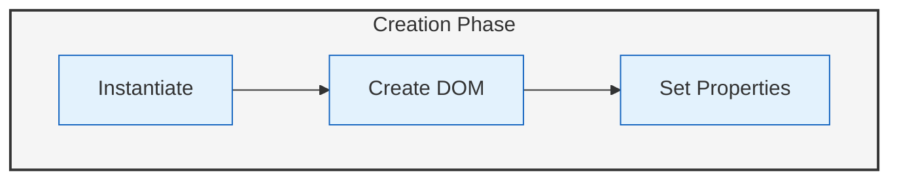
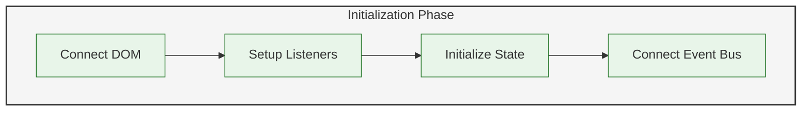
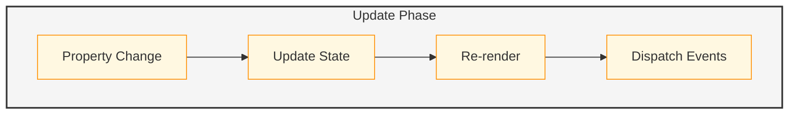
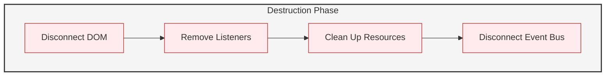

# Component Lifecycle

## Overview

The Component Lifecycle in Lahat v2 defines how components are created, initialized, updated, and destroyed within each module. Each module implements its own component lifecycle management with no shared code between modules. This approach reduces cognitive load and allows modules to evolve independently.

## Lifecycle Phases

### Creation

The creation phase is when a component is first created. This includes:

- Instantiating the component class
- Creating the DOM elements
- Setting up initial properties



### Initialization

The initialization phase is when a component is initialized and connected to the DOM. This includes:

- Connecting to the DOM
- Setting up event listeners
- Initializing state
- Connecting to the EventBus



### Update

The update phase is when a component's properties or state changes. This includes:

- Receiving property updates
- Updating internal state
- Re-rendering the component
- Dispatching events



### Destruction

The destruction phase is when a component is removed from the DOM and destroyed. This includes:

- Disconnecting from the DOM
- Removing event listeners
- Cleaning up resources
- Disconnecting from the EventBus



## LahatCell Lifecycle

LahatCells have a special lifecycle that includes managing the lifecycle of the contained web component:

### LahatCell Creation

1. LahatCell is instantiated
2. DOM elements are created
3. Initial properties are set

### LahatCell Initialization

1. LahatCell is connected to the DOM
2. Event listeners are set up
3. State is initialized
4. Connection to the EventBus is established

### Web Component Loading

1. Web component code is loaded
2. Web component is instantiated
3. Web component is connected to the LahatCell
4. CustomEvent proxy is set up

### Web Component Initialization

1. Web component is connected to the DOM
2. Web component event listeners are set up
3. Web component state is initialized
4. Web component is connected to the EventBus through the CustomEvent proxy

### LahatCell Update

1. LahatCell properties are updated
2. LahatCell state is updated
3. LahatCell is re-rendered
4. Events are dispatched

### Web Component Update

1. Web component properties are updated
2. Web component state is updated
3. Web component is re-rendered
4. Events are dispatched through the CustomEvent proxy

### Web Component Destruction

1. Web component is disconnected from the DOM
2. Web component event listeners are removed
3. Web component resources are cleaned up
4. Web component is disconnected from the EventBus

### LahatCell Destruction

1. LahatCell is disconnected from the DOM
2. LahatCell event listeners are removed
3. LahatCell resources are cleaned up
4. LahatCell is disconnected from the EventBus

## Implementation Details

### Directory Structure

Each module has its own implementation of component lifecycle management:

```
src/
├── app-list/
│   └── component-lifecycle/
│       ├── base-component.js
│       └── lifecycle-hooks.js
├── app-creator/
│   └── component-lifecycle/
│       ├── base-component.js
│       └── lifecycle-hooks.js
└── app-manager/
    └── component-lifecycle/
        ├── base-component.js
        ├── lahat-cell.js
        ├── web-component-loader.js
        └── lifecycle-hooks.js
```

### Key Classes

- **BaseComponent**: Base class for all components
- **LahatCell**: Container for web components
- **WebComponentLoader**: Loads web components into LahatCells
- **LifecycleHooks**: Defines lifecycle hooks for components
- **LifecycleUtils**: Utility functions for working with component lifecycles

## Migration from v1

Each module will implement its own component lifecycle management based on the functionality in `v1/components/core/base-component.js` and `v1/components/core/lahat-cell.js`. The migration involves:

1. Creating module-specific implementations of component lifecycle management
2. Enhancing the lifecycle hooks
3. Adding support for web component loading (in the App Manager module)
4. Implementing the CustomEvent proxy mechanism (in the App Manager module)
