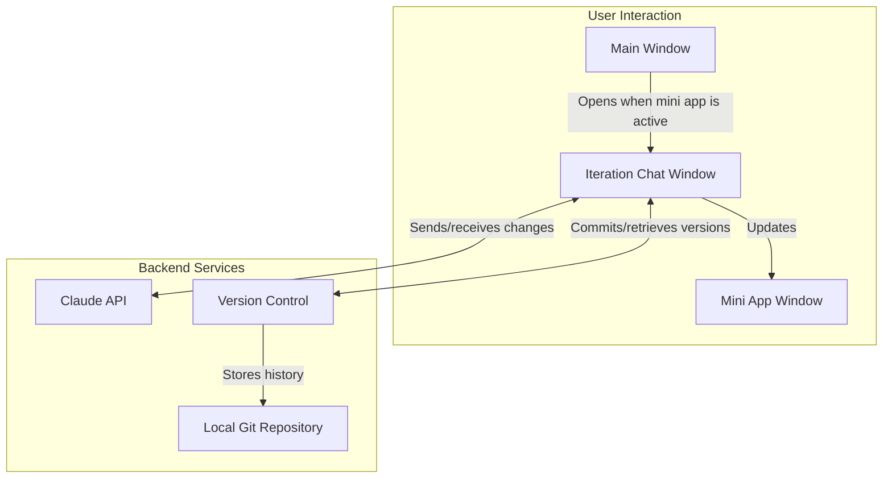

# Mini App Iteration Feature Implementation Plan

This document outlines the implementation plan for adding a chat interface that allows users to iterate on generated mini apps with version history tracking using isomorphic-git.

## 1. System Architecture



## 2. Key Components to Implement

### 2.1 New Window Type for Iteration

1. Add `APP_ITERATION` to the `WindowType` enum in `windowManager.js`
2. Add corresponding HTML file and renderer
3. Create CSS styling for the iteration interface

### 2.2 Menu Integration

1. Add a menu item that appears when a mini app is active
2. Connect the menu item to open the iteration window

### 2.3 Chat Interface

1. Implement a chat history panel
2. Add a message input area
3. Display Claude responses
4. Show the current mini app content (simplified or preview)

### 2.4 Version Control Integration

1. Add isomorphic-git as a dependency
2. Create a module for handling version control
3. Implement functions for committing changes and retrieving history
4. Create UI for browsing and restoring versions

### 2.5 API Integration

1. Extend existing Claude client to handle iteration requests
2. Implement HTML extraction from model responses
3. Create an update flow that applies changes to the mini app

## 3. Version Control Strategy

We will use an automatic commit strategy, creating a new version after every successful iteration:

1. **Commit Timing**: A new commit will be created automatically after each successful chat iteration where Claude generates updated HTML and it's applied to the mini app.

2. **Commit Message**: Each commit message will include a truncated version of the user's request that prompted the changes, making it easy to understand what changed in each version.

3. **Version Display**: The version history sidebar will show all commits, with the most recent at the top, displaying the commit message and timestamp.

4. **Rollback Capability**: Users can click on any version in the history to restore that version, with a confirmation dialog to prevent accidental rollbacks.

This approach ensures that users have a complete history of every iteration made to their mini app, making it easy to track changes and restore previous versions if needed.

## 4. Detailed Implementation Plan

### 4.1 File Structure

```
app-iteration.html              # New HTML file for the iteration window
styles/app-iteration.css        # CSS for the iteration window
renderers/app-iteration.js      # Renderer script for the iteration window
modules/utils/versionControl.js # Module for git integration
components/ui/modals/app-iteration-modal.js # Optional modal alternative
```

### 4.2 New Window Definition

```javascript
// Add to modules/windowManager/windowManager.js
export const WindowType = {
  MAIN: 'main',
  API_SETUP: 'api-setup',
  APP_CREATION: 'app-creation',
  MINI_APP: 'mini-app',
  APP_ITERATION: 'app-iteration' // New window type
};

// Add to WINDOW_HTML constant
const WINDOW_HTML = {
  [WindowType.MAIN]: 'main.html',
  [WindowType.API_SETUP]: 'api-setup.html',
  [WindowType.APP_CREATION]: 'app-creation.html',
  [WindowType.MINI_APP]: null, // Mini apps use dynamic content
  [WindowType.APP_ITERATION]: 'app-iteration.html' // New window HTML
};

// Add to WINDOW_PRELOAD constant
const WINDOW_PRELOAD = {
  [WindowType.MAIN]: 'preload.cjs',
  [WindowType.API_SETUP]: 'preload.cjs',
  [WindowType.APP_CREATION]: 'preload.cjs',
  [WindowType.MINI_APP]: 'miniAppPreload.cjs',
  [WindowType.APP_ITERATION]: 'preload.cjs' // Using the standard preload
};

// Add to DEFAULT_DIMENSIONS constant
const DEFAULT_DIMENSIONS = {
  [WindowType.MAIN]: { width: 1200, height: 800 },
  [WindowType.API_SETUP]: { width: 600, height: 300 },
  [WindowType.APP_CREATION]: { width: 800, height: 600 },
  [WindowType.MINI_APP]: { width: 800, height: 600 },
  [WindowType.APP_ITERATION]: { width: 900, height: 700 } // New window dimensions
};
```

### 4.3 New HTML File (app-iteration.html)

```html
<!DOCTYPE html>
<html>
<head>
  <meta charset="UTF-8">
  <title>Iterate on Mini App</title>
  <link rel="stylesheet" href="styles/fonts.css">
  <link rel="stylesheet" href="styles/app-iteration.css">
</head>
<body>
  <div class="header">
    <h2 id="app-name">Iterating on: <span></span></h2>
  </div>
  
  <div class="container">
    <div class="sidebar">
      <div class="version-history">
        <h3>Version History</h3>
        <div class="version-list" id="version-list">
          <!-- Version list will be populated dynamically -->
        </div>
      </div>
    </div>
    
    <div class="main-content">
      <div class="chat-container">
        <div class="chat-messages" id="chat-messages">
          <!-- Chat messages will be populated dynamically -->
          <div class="system-message">
            What changes would you like to make to this mini app?
          </div>
        </div>
        
        <div class="chat-input">
          <textarea id="message-input" placeholder="Describe how you'd like to modify the app..."></textarea>
          <button id="send-button">Send</button>
        </div>
      </div>
    </div>
  </div>

  <script type="module" src="renderers/app-iteration.js"></script>
</body>
</html>
```

### 4.4 CSS Styling (styles/app-iteration.css)

```css
:root {
  --primary-color: #4285f4;
  --secondary-color: #5f6368;
  --border-color: #e0e0e0;
  --background-color: #f8f9fa;
  --chat-bg: #ffffff;
  --user-message-bg: #e3f2fd;
  --system-message-bg: #f5f5f5;
  --border-radius: 8px;
}

body {
  font-family: 'Lora', serif;
  margin: 0;
  padding: 0;
  background-color: var(--background-color);
  color: var(--secondary-color);
  display: flex;
  flex-direction: column;
  height: 100vh;
  overflow: hidden;
}

.header {
  background-color: var(--primary-color);
  color: white;
  padding: 10px 20px;
  box-shadow: 0 2px 4px rgba(0, 0, 0, 0.1);
}

.header h2 {
  margin: 0;
  font-size: 18px;
  font-weight: 500;
}

.container {
  display: flex;
  flex: 1;
  overflow: hidden;
}

.sidebar {
  width: 260px;
  border-right: 1px solid var(--border-color);
  overflow-y: auto;
  padding: 20px;
}

.main-content {
  flex: 1;
  display: flex;
  flex-direction: column;
  overflow: hidden;
}

.version-history {
  margin-bottom: 20px;
}

.version-history h3 {
  margin-top: 0;
  font-size: 16px;
  font-weight: 500;
  color: var(--primary-color);
}

.version-list {
  overflow-y: auto;
  max-height: calc(100vh - 150px);
}

.version-item {
  padding: 10px;
  margin-bottom: 8px;
  border-radius: var(--border-radius);
  background-color: var(--chat-bg);
  cursor: pointer;
  transition: background-color 0.2s;
  border: 1px solid var(--border-color);
}

.version-item:hover {
  background-color: #f1f3f4;
}

.version-item.active {
  border-color: var(--primary-color);
  background-color: rgba(66, 133, 244, 0.1);
}

.version-message {
  font-size: 14px;
  margin-bottom: 5px;
}

.version-date {
  font-size: 12px;
  color: #9aa0a6;
}

.chat-container {
  display: flex;
  flex-direction: column;
  height: 100%;
  padding: 20px;
}

.chat-messages {
  flex: 1;
  overflow-y: auto;
  padding: 15px;
  background-color: var(--chat-bg);
  border-radius: var(--border-radius);
  box-shadow: 0 2px 4px rgba(0, 0, 0, 0.05);
  margin-bottom: 20px;
}

.message {
  margin-bottom: 15px;
  padding: 12px;
  border-radius: var(--border-radius);
  max-width: 80%;
}

.user-message {
  background-color: var(--user-message-bg);
  align-self: flex-end;
  margin-left: auto;
}

.ai-message {
  background-color: var(--system-message-bg);
  align-self: flex-start;
}

.system-message {
  background-color: var(--system-message-bg);
  padding: 12px;
  border-radius: var(--border-radius);
  margin-bottom: 15px;
  font-style: italic;
}

.chat-input {
  display: flex;
  gap: 10px;
}

#message-input {
  flex: 1;
  padding: 12px;
  border: 1px solid var(--border-color);
  border-radius: var(--border-radius);
  resize: none;
  min-height: 80px;
  font-family: inherit;
}

#send-button {
  padding: 0 20px;
  border: none;
  background-color: var(--primary-color);
  color: white;
  border-radius: var(--border-radius);
  cursor: pointer;
  font-weight: 500;
  transition: background-color 0.2s;
}

#send-button:hover {
  background-color: #3b78e7;
}
```

### 4.5 Renderer Script (renderers/app-iteration.js)

```javascript
// Import any required modules
import { formatDate } from '../components/core/utils.js';

// DOM elements
const appNameElement = document.querySelector('#app-name span');
const chatMessages = document.getElementById('chat-messages');
const messageInput = document.getElementById('message-input');
const sendButton = document.getElementById('send-button');
const versionList = document.getElementById('version-list');

// State variables
let appId = null;
let appName = null;
let appFilePath = null;
let currentHtml = null;
let isProcessing = false;

// Initialize the app
document.addEventListener('DOMContentLoaded', () => {
  // Get app details from query params or IPC
  window.electronAPI.getAppIterationData().then(data => {
    appId = data.appId;
    appName = data.appName;
    appFilePath = data.filePath;
    currentHtml = data.html;
    
    // Set app name in header
    appNameElement.textContent = appName;
    
    // Load version history
    loadVersionHistory();
  });
  
  // Set up event listeners
  setupEventListeners();
});

function setupEventListeners() {
  // Send button click
  sendButton.addEventListener('click', sendMessage);
  
  // Enter key to send
  messageInput.addEventListener('keydown', (event) => {
    if (event.key === 'Enter' && !event.shiftKey) {
      event.preventDefault();
      sendMessage();
    }
  });
  
  // Listen for version update events
  window.electronAPI.onVersionCreated((event, versionData) => {
    addVersionToList(versionData);
  });
  
  // Listen for iteration response events
  window.electronAPI.onIterationResponse((event, data) => {
    addAiMessage(data.message);
    isProcessing = false;
    
    if (data.success) {
      // Update UI to indicate changes were applied
      addSystemMessage('Changes applied successfully and saved as a new version');
    }
  });
}

async function sendMessage() {
  const message = messageInput.value.trim();
  if (!message || isProcessing) return;
  
  // Add user message to chat
  addUserMessage(message);
  
  // Clear input
  messageInput.value = '';
  
  // Set processing state
  isProcessing = true;
  
  // Add a thinking message
  const thinkingMessage = addSystemMessage('Applying changes...');
  
  try {
    // Send to main process for processing
    const result = await window.electronAPI.iterateOnMiniApp({
      appId,
      prompt: message
    });
    
    // Remove thinking message
    chatMessages.removeChild(thinkingMessage);
    
    if (!result.success) {
      addSystemMessage(`Error: ${result.error}`);
      isProcessing = false;
    }
  } catch (error) {
    // Remove thinking message
    chatMessages.removeChild(thinkingMessage);
    
    // Show error
    addSystemMessage(`Error: ${error.message}`);
    isProcessing = false;
  }
}

function addUserMessage(text) {
  const messageEl = document.createElement('div');
  messageEl.className = 'message user-message';
  messageEl.textContent = text;
  chatMessages.appendChild(messageEl);
  chatMessages.scrollTop = chatMessages.scrollHeight;
}

function addAiMessage(text) {
  const messageEl = document.createElement('div');
  messageEl.className = 'message ai-message';
  messageEl.textContent = text;
  chatMessages.appendChild(messageEl);
  chatMessages.scrollTop = chatMessages.scrollHeight;
}

function addSystemMessage(text) {
  const messageEl = document.createElement('div');
  messageEl.className = 'system-message';
  messageEl.textContent = text;
  chatMessages.appendChild(messageEl);
  chatMessages.scrollTop = chatMessages.scrollHeight;
  return messageEl;
}

async function loadVersionHistory() {
  try {
    const versions = await window.electronAPI.getVersionHistory({
      appId
    });
    
    if (versions.success) {
      // Clear current list
      versionList.innerHTML = '';
      
      // Add each version
      versions.commits.forEach(commit => {
        addVersionToList({
          id: commit.oid,
          message: commit.commit.message,
          date: new Date(commit.commit.author.timestamp * 1000)
        });
      });
    }
  } catch (error) {
    console.error('Error loading version history:', error);
  }
}

function addVersionToList(version) {
  const versionEl = document.createElement('div');
  versionEl.className = 'version-item';
  versionEl.dataset.id = version.id;
  
  const messageEl = document.createElement('div');
  messageEl.className = 'version-message';
  messageEl.textContent = version.message;
  
  const dateEl = document.createElement('div');
  dateEl.className = 'version-date';
  dateEl.textContent = formatDate(version.date);
  
  versionEl.appendChild(messageEl);
  versionEl.appendChild(dateEl);
  
  // Add click event to restore version
  versionEl.addEventListener('click', () => restoreVersion(version.id));
  
  // Add to list (at beginning)
  if (versionList.firstChild) {
    versionList.insertBefore(versionEl, versionList.firstChild);
  } else {
    versionList.appendChild(versionEl);
  }
}

async function restoreVersion(versionId) {
  try {
    // Confirm with user
    if (!confirm('Are you sure you want to restore this version? Any unsaved changes will be lost.')) {
      return;
    }
    
    // Add system message
    addSystemMessage('Restoring previous version...');
    
    // Call API to restore
    const result = await window.electronAPI.restoreVersion({
      appId,
      commitId: versionId
    });
    
    if (result.success) {
      addSystemMessage('Version restored successfully');
      
      // Update version list UI to show active version
      const versionItems = versionList.querySelectorAll('.version-item');
      versionItems.forEach(item => {
        item.classList.remove('active');
        if (item.dataset.id === versionId) {
          item.classList.add('active');
        }
      });
    } else {
      addSystemMessage(`Error restoring version: ${result.error}`);
    }
  } catch (error) {
    addSystemMessage(`Error: ${error.message}`);
  }
}
```

### 4.6 Version Control Module (modules/utils/versionControl.js)

```javascript
import { app } from 'electron';
import path from 'path';
import fs from 'fs/promises';
import * as git from 'isomorphic-git';
import http from 'isomorphic-git/http/node';
import logger from './logger.js';

// Define base path for storing git repositories
const gitBasePath = path.join(app.getPath('userData'), 'git-repos');

/**
 * Initialize or open a git repository for a mini app
 * @param {string} appId - The app ID
 * @param {string} filePath - Path to the app HTML file
 * @returns {Promise<Object>} - Result object with repo info
 */
export async function initRepo(appId, filePath) {
  try {
    // Create a dedicated directory for this app's repo
    const repoDir = path.join(gitBasePath, appId);
    
    // Ensure directories exist
    await fs.mkdir(repoDir, { recursive: true });
    
    // Copy the file to the repo directory if it's not already there
    const fileName = 'index.html';
    const repoFilePath = path.join(repoDir, fileName);
    
    const content = await fs.readFile(filePath, 'utf-8');
    await fs.writeFile(repoFilePath, content);
    
    // Initialize git repo if it doesn't exist
    try {
      await git.findRoot({ fs, filepath: repoDir });
    } catch (e) {
      // If findRoot throws, the repo doesn't exist yet
      await git.init({ fs, dir: repoDir });
      
      // Set up git config
      await git.setConfig({
        fs,
        dir: repoDir,
        path: 'user.name',
        value: 'Lahat App'
      });
      
      await git.setConfig({
        fs,
        dir: repoDir,
        path: 'user.email',
        value: 'app@lahat.local'
      });
      
      // Initial commit
      await git.add({ fs, dir: repoDir, filepath: fileName });
      await git.commit({
        fs,
        dir: repoDir,
        message: 'Initial version',
        author: {
          name: 'Lahat App',
          email: 'app@lahat.local'
        }
      });
    }
    
    return { 
      success: true, 
      repoDir,
      filePath: repoFilePath
    };
  } catch (error) {
    logger.error('Error initializing git repo', { error: error.message, appId }, 'versionControl');
    return {
      success: false,
      error: `Error initializing git repo: ${error.message}`
    };
  }
}

/**
 * Create a new commit for a change
 * @param {string} appId - The app ID
 * @param {string} content - New content to commit
 * @param {string} message - Commit message
 * @returns {Promise<Object>} - Result object with commit info
 */
export async function commitChange(appId, content, message) {
  try {
    const repoDir = path.join(gitBasePath, appId);
    const filePath = path.join(repoDir, 'index.html');
    
    // Write the new content
    await fs.writeFile(filePath, content);
    
    // Add and commit
    await git.add({ fs, dir: repoDir, filepath: 'index.html' });
    const commitResult = await git.commit({
      fs,
      dir: repoDir,
      message,
      author: {
        name: 'Lahat App',
        email: 'app@lahat.local'
      }
    });
    
    return { 
      success: true, 
      commitId: commitResult, 
      message,
      date: new Date()
    };
  } catch (error) {
    logger.error('Error committing change', { error: error.message, appId }, 'versionControl');
    return {
      success: false,
      error: `Error committing change: ${error.message}`
    };
  }
}

/**
 * Get commit history for an app
 * @param {string} appId - The app ID
 * @returns {Promise<Object>} - Result object with commits
 */
export async function getCommitHistory(appId) {
  try {
    const repoDir = path.join(gitBasePath, appId);
    
    // Get log
    const commits = await git.log({
      fs,
      dir: repoDir,
      depth: 50 // Limit to recent commits
    });
    
    return { 
      success: true, 
      commits
    };
  } catch (error) {
    logger.error('Error getting commit history', { error: error.message, appId }, 'versionControl');
    return {
      success: false,
      error: `Error getting commit history: ${error.message}`,
      commits: []
    };
  }
}

/**
 * Restore a specific version
 * @param {string} appId - The app ID
 * @param {string} commitId - The commit ID to restore
 * @param {string} originalFilePath - The original app file path to update
 * @returns {Promise<Object>} - Result object with content
 */
export async function restoreVersion(appId, commitId, originalFilePath) {
  try {
    const repoDir = path.join(gitBasePath, appId);
    const repoFilePath = path.join(repoDir, 'index.html');
    
    // Checkout file at commit
    await git.checkout({
      fs,
      dir: repoDir,
      ref: commitId,
      force: true,
      filepaths: ['index.html']
    });
    
    // Read the content
    const content = await fs.readFile(repoFilePath, 'utf-8');
    
    // Also update the original file
    if (originalFilePath) {
      await fs.writeFile(originalFilePath, content);
    }
    
    return { 
      success: true, 
      content,
      commitId
    };
  } catch (error) {
    logger.error('Error restoring version', { error: error.message, appId, commitId }, 'versionControl');
    return {
      success: false,
      error: `Error restoring version: ${error.message}`
    };
  }
}
```

### 4.7 IPC Handlers (in modules/ipc/miniAppHandlers.js)

```javascript
// Add these new IPC handlers to miniAppHandlers.js

/**
 * Open the iteration window for a mini app
 * @param {Object} event - IPC event
 * @param {Object} params - Parameters with appId, filePath, and name
 * @returns {Promise<Object>} - Result object with window ID
 */
async function handleOpenIterationWindow(event, { appId, filePath, name }) {
  try {
    console.log('Opening iteration window for:', { appId, filePath, name });
    
    // Initialize git repo for version control
    const repoResult = await versionControl.initRepo(appId, filePath);
    if (!repoResult.success) {
      return repoResult;
    }
    
    // Read the current HTML
    const readResult = await fileOperations.readFile(filePath);
    if (!readResult.success) {
      return readResult;
    }
    
    // Create window
    const win = windowManager.createWindow(WindowType.APP_ITERATION, { 
      title: `Iterate on ${name}`,
      width: 900,
      height: 700
    });
    
    // Once window is ready, send app data
    win.webContents.once('did-finish-load', () => {
      win.webContents.send('init-app-iteration', {
        appId,
        appName: name,
        filePath,
        html: readResult.content
      });
    });
    
    return { 
      success: true, 
      windowId: win.id
    };
  } catch (error) {
    console.error('Error opening iteration window:', error);
    return {
      success: false,
      error: error.message
    };
  }
}

/**
 * Handle iterating on a mini app with a prompt
 * @param {Object} event - IPC event
 * @param {Object} params - Parameters with appId and prompt
 * @returns {Promise<Object>} - Result object with commit info
 */
async function handleIterateOnMiniApp(event, { appId, prompt }) {
  try {
    const claudeClient = apiHandlers.getClaudeClient();
    if (!claudeClient) {
      return {
        success: false,
        error: 'Claude API key not set. Please set your API key in settings.'
      };
    }
    
    // Get the mini app
    const app = miniAppManager.getMiniApp(appId);
    if (!app) {
      return {
        success: false,
        error: 'App not found'
      };
    }
    
    // Read current content
    const readResult = await fileOperations.readFile(app.filePath);
    if (!readResult.success) {
      return readResult;
    }
    
    // Create specialized prompt for iteration
    const iterationPrompt = `
      I have a mini app with the following HTML content. Please update it according to the user's request.
      
      CURRENT HTML:
      \`\`\`html
      ${readResult.content}
      \`\`\`
      
      USER REQUEST: ${prompt}
      
      Your response should include:
      1. A brief explanation of the changes you made (1-2 sentences)
      2. The complete updated HTML code
      
      Provide the complete HTML code, including any unchanged parts.
    `;
    
    // Stream response status to the sender
    event.sender.send('iteration-status', {
      status: 'processing',
      message: 'Processing your request...'
    });
    
    // Send to Claude and get response
    const response = await claudeClient.generateText(iterationPrompt);
    
    // Extract explanation and HTML
    const { explanation, html } = extractFromResponse(response);
    
    // Update the app
    const updateResult = await miniAppManager.updateMiniApp(
      appId,
      html,
      app.filePath
    );
    
    if (!updateResult.success) {
      event.sender.send('iteration-status', {
        status: 'error',
        message: updateResult.error
      });
      return updateResult;
    }
    
    // Create a version commit
    const commitResult = await versionControl.commitChange(
      appId, 
      html, 
      `Iteration: ${prompt.substring(0, 40)}${prompt.length > 40 ? '...' : ''}`
    );
    
    // Send success status and response
    event.sender.send('iteration-response', {
      success: true,
      message: explanation,
      commitId: commitResult.commitId
    });
    
    return { 
      success: true, 
      commitId: commitResult.commitId,
      message: explanation
    };
  } catch (error) {
    console.error('Error iterating on mini app:', error);
    
    event.sender.send('iteration-status', {
      status: 'error',
      message: `Error: ${error.message}`
    });
    
    return {
      success: false,
      error: error.message
    };
  }
}

/**
 * Get version history for a mini app
 * @param {Object} event - IPC event
 * @param {Object} params - Parameters with appId
 * @returns {Promise<Object>} - Result object with commits
 */
async function handleGetVersionHistory(event, { appId }) {
  try {
    return await versionControl.getCommitHistory(appId);
  } catch (error) {
    console.error('Error getting version history:', error);
    return {
      success: false,
      error: error.message,
      commits: []
    };
  }
}

/**
 * Restore a specific version of a mini app
 * @param {Object} event - IPC event
 * @param {Object} params - Parameters with appId and commitId
 * @returns {Promise<Object>} - Result object with success flag
 */
async function handleRestoreVersion(event, { appId, commitId }) {
  try {
    // Get the mini app
    const app = miniAppManager.getMiniApp(appId);
    if (!app) {
      return {
        success: false,
        error: 'App not found'
      };
    }
    
    // Restore the version
    const restoreResult = await versionControl.restoreVersion(
      appId,
      commitId,
      app.filePath
    );
    
    if (!restoreResult.success) {
      return restoreResult;
    }
    
    // Update the mini app window
    const updateResult = await miniAppManager.updateMiniApp(
      appId,
      restoreResult.content,
      app.filePath
    );
    
    return updateResult;
  } catch (error) {
    console.error('Error restoring version:', error);
    return {
      success: false,
      error: error.message
    };
  }
}

// Helper function to extract HTML and explanation from Claude response
function extractFromResponse(response) {
  // Extract HTML between code blocks
  const htmlMatch = response.match(/```html\s*([\s\S]*?)\s*```/) || 
                    response.match(/<html[\s\S]*<\/html>/);
  
  let html = '';
  if (htmlMatch && htmlMatch[1]) {
    html = htmlMatch[1].trim();
  } else {
    // If no clear HTML markers, look for anything that looks like HTML
    const possibleHtml = response.match(/<(!DOCTYPE|html|body|head)[\s\S]*$/);
    if (possibleHtml) {
      html = possibleHtml[0];
    } else {
      // If still no HTML found, use entire response
      html = response;
    }
  }
  
  // Extract explanation (first few lines before any code block)
  let explanation = response.split('```')[0].trim();
  
  // If explanation is too long, trim it
  if (explanation.length > 200) {
    explanation = explanation.substring(0, 197) + '...';
  }
  
  return { html, explanation };
}

// Register new IPC handlers
export function registerHandlers() {
  // Existing handlers...
  
  // New handlers for iteration
  ipcMain.handle('open-iteration-window', handleOpenIterationWindow);
  ipcMain.handle('iterate-on-mini-app', handleIterateOnMiniApp);
  ipcMain.handle('get-version-history', handleGetVersionHistory);
  ipcMain.handle('restore-version', handleRestoreVersion);
}
```

### 4.8 Preload Script Updates (preload.cjs)

```javascript
// Add to preload.cjs

// Iteration window API
contextBridge.exposeInMainWorld('electronAPI', {
  // ...existing APIs
  
  // New APIs for iteration
  getAppIterationData: () => ipcRenderer.invoke('get-app-iteration-data'),
  iterateOnMiniApp: (params) => ipcRenderer.invoke('iterate-on-mini-app', params),
  getVersionHistory: (params) => ipcRenderer.invoke('get-version-history', params),
  restoreVersion: (params) => ipcRenderer.invoke('restore-version', params),
  
  // Event listeners
  onIterationStatus: (callback) => ipcRenderer.on('iteration-status', callback),
  onIterationResponse: (callback) => ipcRenderer.on('iteration-response', callback),
  onVersionCreated: (callback) => ipcRenderer.on('version-created', callback),
  onInitAppIteration: (callback) => ipcRenderer.on('init-app-iteration', callback)
});
```

### 4.9 Menu Integration

```javascript
// Add to main.js or a dedicated menu module

function buildAppMenu() {
  const template = [
    // Existing menu items
    {
      label: 'File',
      submenu: [
        // Existing file menu items
      ]
    },
    {
      label: 'Edit',
      submenu: [
        // Existing edit menu items
      ]
    },
    {
      label: 'Mini App',
      submenu: [
        {
          label: 'Iterate with Chat',
          click: async () => {
            const activeApp = getActiveMiniApp();
            if (activeApp) {
              await handleOpenIterationWindow(null, {
                appId: activeApp.id,
                filePath: activeApp.filePath,
                name: activeApp.name
              });
            }
          },
          enabled: hasActiveMiniApp()
        },
        // Other mini app menu items
        { type: 'separator' },
        {
          label: 'Show Version History',
          click: async () => {
            const activeApp = getActiveMiniApp();
            if (activeApp) {
              const history = await versionControl.getCommitHistory(activeApp.id);
              // Show history in a modal or window
            }
          },
          enabled: hasActiveMiniApp()
        }
      ]
    },
    // Other menu categories
  ];
  
  const menu = Menu.buildFromTemplate(template);
  Menu.setApplicationMenu(menu);
}
```

### 4.10 Package.json Update

```json
{
  "dependencies": {
    // Existing dependencies
    "isomorphic-git": "^1.24.0"
  }
}
```

## 5. Implementation Steps

1. **Setup Phase**
   - Add isomorphic-git to package.json
   - Create new HTML, CSS, and JS files for the iteration window
   - Update WindowType in windowManager.js

2. **Version Control**
   - Implement the versionControl.js module 
   - Test basic commit and restore functionality

3. **IPC Handlers**
   - Add new IPC handlers to miniAppHandlers.js
   - Update preload.cjs to expose new APIs

4. **UI Implementation**
   - Implement the chat interface
   - Build the version history sidebar
   - Test message sending and receiving

5. **Menu Integration**
   - Add menu items in main.js
   - Connect menu actions to handlers

6. **Testing & Polishing**
   - Test the complete iteration flow
   - Add error handling and edge cases
   - Refine UI and interactions