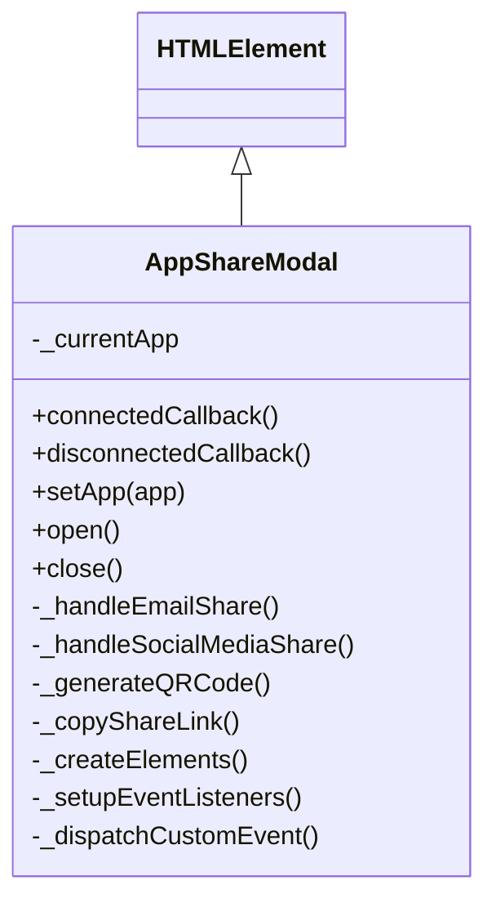

# Revised App Sharing Implementation Plan

Based on the requirement to make web components more modular and self-contained, I'll design the app sharing functionality using pure ES6 class-based web components that extend HTMLElement directly, with styles applied via style tags and methods implemented directly in each component.

## 1. Component Architecture

The revised component structure will:
- Extend HTMLElement directly (not BaseComponent)
- Use regular DOM (not Shadow DOM)
- Apply styles via style tags within the component
- Implement all methods within the component
- Be fully self-contained



## 2. Implementation Details

### New File: `components/ui/modals/app-share-modal.js`

```javascript
/**
 * AppShareModal component
 * A self-contained web component for sharing apps via email, social media, and QR codes
 */
class AppShareModal extends HTMLElement {
  constructor() {
    super();
    
    // Component state
    this._currentApp = null;
    this._elements = {};
    
    // Create component structure
    this._createElements();
    this._setupEventListeners();
  }
  
  /**
   * Lifecycle: Component connected to DOM
   */
  connectedCallback() {
    // Load QR code library if needed
    this._loadQRCodeLibrary();
    
    // Add to DOM if not already added
    if (!this.querySelector('.app-share-modal')) {
      this.appendChild(this._elements.container);
    }
  }
  
  /**
   * Lifecycle: Component disconnected from DOM
   */
  disconnectedCallback() {
    // Clean up any resources if needed
  }
  
  /**
   * Create all DOM elements for this component
   * @private
   */
  _createElements() {
    // Add styles
    const styleEl = document.createElement('style');
    styleEl.textContent = `
      .app-share-modal {
        display: none;
        position: fixed;
        top: 0;
        left: 0;
        width: 100%;
        height: 100%;
        background-color: rgba(0, 0, 0, 0.5);
        z-index: 1000;
        justify-content: center;
        align-items: center;
      }
      
      .app-share-modal.visible {
        display: flex;
      }
      
      .modal-content {
        background: white;
        border-radius: 8px;
        padding: 20px;
        max-width: 500px;
        width: 90%;
        max-height: 80vh;
        overflow-y: auto;
        box-shadow: 0 4px 20px rgba(0, 0, 0, 0.2);
      }
      
      .modal-header {
        display: flex;
        justify-content: space-between;
        align-items: center;
        margin-bottom: 15px;
      }
      
      .modal-title {
        font-size: 24px;
        font-weight: bold;
        margin: 0;
        color: #4285f4;
      }
      
      .close-button {
        background: none;
        border: none;
        font-size: 24px;
        cursor: pointer;
        color: #5f6368;
        padding: 0;
        line-height: 1;
      }
      
      .modal-body {
        margin-bottom: 20px;
      }
      
      .share-methods {
        display: grid;
        grid-template-columns: 1fr 1fr;
        gap: 15px;
        margin-bottom: 20px;
      }

      .share-method {
        display: flex;
        flex-direction: column;
        align-items: center;
        justify-content: center;
        padding: 15px;
        border-radius: 8px;
        cursor: pointer;
        transition: background-color 0.2s;
        background-color: #f1f3f4;
      }
      
      .share-method:hover {
        background-color: #e8eaed;
      }
      
      .share-method svg {
        width: 30px;
        height: 30px;
        margin-bottom: 10px;
      }
      
      .share-method-title {
        font-weight: 500;
        margin: 0;
        color: #5f6368;
      }

      .qr-code-container {
        display: flex;
        justify-content: center;
        margin: 20px 0;
      }
      
      .qr-code-container canvas {
        max-width: 200px;
        max-height: 200px;
      }
      
      .copy-link-container {
        display: flex;
        margin-top: 15px;
      }
      
      .copy-link-input {
        flex: 1;
        padding: 10px;
        border: 1px solid #ddd;
        border-radius: 8px 0 0 8px;
        font-size: 14px;
      }
      
      .copy-button {
        padding: 10px 15px;
        background-color: #4285f4;
        color: white;
        border: none;
        border-radius: 0 8px 8px 0;
        cursor: pointer;
        font-weight: 500;
      }
      
      .copy-button:hover {
        background-color: #3367d6;
      }
    `;
    
    // Create modal container
    const container = document.createElement('div');
    container.className = 'app-share-modal';
    
    // Create modal content
    container.innerHTML = `
      <div class="modal-content">
        <div class="modal-header">
          <h2 class="modal-title">Share App: <span id="share-app-name"></span></h2>
          <button class="close-button">&times;</button>
        </div>
        <div class="modal-body">
          <div class="share-methods">
            <div class="share-method" id="email-share">
              <svg xmlns="http://www.w3.org/2000/svg" viewBox="0 0 24 24" fill="#5f6368">
                <path d="M20 4H4c-1.1 0-1.99.9-1.99 2L2 18c0 1.1.9 2 2 2h16c1.1 0 2-.9 2-2V6c0-1.1-.9-2-2-2zm0 4l-8 5-8-5V6l8 5 8-5v2z"/>
              </svg>
              <p class="share-method-title">Email</p>
            </div>
            <div class="share-method" id="twitter-share">
              <svg xmlns="http://www.w3.org/2000/svg" viewBox="0 0 24 24" fill="#1DA1F2">
                <path d="M22.46 6c-.77.35-1.6.58-2.46.69.88-.53 1.56-1.37 1.88-2.38-.83.5-1.75.85-2.72 1.05C18.37 4.5 17.26 4 16 4c-2.35 0-4.27 1.92-4.27 4.29 0 .34.04.67.11.98C8.28 9.09 5.11 7.38 3 4.79c-.37.63-.58 1.37-.58 2.15 0 1.49.75 2.81 1.91 3.56-.71 0-1.37-.2-1.95-.5v.03c0 2.08 1.48 3.82 3.44 4.21a4.22 4.22 0 0 1-1.93.07 4.28 4.28 0 0 0 4 2.98 8.521 8.521 0 0 1-5.33 1.84c-.34 0-.68-.02-1.02-.06C3.44 20.29 5.7 21 8.12 21 16 21 20.33 14.46 20.33 8.79c0-.19 0-.37-.01-.56.84-.6 1.56-1.36 2.14-2.23z"/>
              </svg>
              <p class="share-method-title">Twitter</p>
            </div>
            <div class="share-method" id="facebook-share">
              <svg xmlns="http://www.w3.org/2000/svg" viewBox="0 0 24 24" fill="#4267B2">
                <path d="M22 12c0-5.52-4.48-10-10-10S2 6.48 2 12c0 4.84 3.44 8.87 8 9.8V15H8v-3h2V9.5C10 7.57 11.57 6 13.5 6H16v3h-2c-.55 0-1 .45-1 1v2h3v3h-3v6.95c5.05-.5 9-4.76 9-9.95z"/>
              </svg>
              <p class="share-method-title">Facebook</p>
            </div>
            <div class="share-method" id="linkedin-share">
              <svg xmlns="http://www.w3.org/2000/svg" viewBox="0 0 24 24" fill="#0077B5">
                <path d="M19 3a2 2 0 0 1 2 2v14a2 2 0 0 1-2 2H5a2 2 0 0 1-2-2V5a2 2 0 0 1 2-2h14m-.5 15.5v-5.3a3.26 3.26 0 0 0-3.26-3.26c-.85 0-1.84.52-2.32 1.3v-1.11h-2.79v8.37h2.79v-4.93c0-.77.62-1.4 1.39-1.4a1.4 1.4 0 0 1 1.4 1.4v4.93h2.79M6.88 8.56a1.68 1.68 0 0 0 1.68-1.68c0-.93-.75-1.69-1.68-1.69a1.69 1.69 0 0 0-1.69 1.69c0 .93.76 1.68 1.69 1.68m1.39 9.94v-8.37H5.5v8.37h2.77z"/>
              </svg>
              <p class="share-method-title">LinkedIn</p>
            </div>
          </div>
          
          <div class="qr-code-container">
            <canvas id="share-qr-code"></canvas>
          </div>
          
          <div class="copy-link-container">
            <input type="text" id="share-link" class="copy-link-input" readonly>
            <button id="copy-button" class="copy-button">Copy</button>
          </div>
        </div>
      </div>
    `;
    
    // Store elements for later access
    this._elements = {
      style: styleEl,
      container,
      appName: null,      // Will be set after appending to DOM
      qrCodeCanvas: null, // Will be set after appending to DOM
      shareLink: null     // Will be set after appending to DOM
    };
    
    // Append style to document head
    document.head.appendChild(styleEl);
  }
  
  /**
   * Setup event listeners for component
   * @private
   */
  _setupEventListeners() {
    // Use event delegation for modal events
    this._elements.container.addEventListener('click', (event) => {
      // Close when clicking outside modal content
      if (event.target === this._elements.container) {
        this.close();
      }
      
      // Close button
      if (event.target.classList.contains('close-button')) {
        this.close();
      }
      
      // Email share
      if (event.target.closest('#email-share')) {
        this._handleEmailShare();
      }
      
      // Twitter share
      if (event.target.closest('#twitter-share')) {
        this._handleSocialMediaShare('twitter');
      }
      
      // Facebook share
      if (event.target.closest('#facebook-share')) {
        this._handleSocialMediaShare('facebook');
      }
      
      // LinkedIn share
      if (event.target.closest('#linkedin-share')) {
        this._handleSocialMediaShare('linkedin');
      }
      
      // Copy button
      if (event.target.id === 'copy-button') {
        this._handleCopyLink();
      }
    });
  }
  
  /**
   * Load QR code library dynamically
   * @private
   */
  async _loadQRCodeLibrary() {
    try {
      // Check if QRCode is already loaded
      if (window.QRCode) return;
      
      // Create script element
      const script = document.createElement('script');
      script.src = 'https://cdn.jsdelivr.net/npm/qrcode@1.5.0/build/qrcode.min.js';
      script.async = true;
      
      // Await script loading
      await new Promise((resolve, reject) => {
        script.onload = resolve;
        script.onerror = reject;
        document.head.appendChild(script);
      });
      
      console.log('QR code library loaded successfully');
    } catch (error) {
      console.error('Failed to load QR code library:', error);
    }
  }
  
  /**
   * Set the app to share
   * @param {Object} app - App data object
   */
  setApp(app) {
    this._currentApp = app;
    
    // Initialize element references if not already done
    if (!this._elements.appName) {
      this._elements.appName = this.querySelector('#share-app-name');
      this._elements.qrCodeCanvas = this.querySelector('#share-qr-code');
      this._elements.shareLink = this.querySelector('#share-link');
    }
    
    // Update UI
    this._elements.appName.textContent = app.name;
    
    // Generate share link
    const shareLink = this._generateShareLink(app);
    this._elements.shareLink.value = shareLink;
    
    // Generate QR code if the library is loaded
    this._generateQRCode(shareLink);
  }
  
  /**
   * Generate a share link for the app
   * @param {Object} app - App data object
   * @returns {string} - Share link
   * @private
   */
  _generateShareLink(app) {
    // This is a placeholder. In a real implementation, this would generate a proper sharing URL
    // For example, it might link to a web page where others can download the app
    return `https://example.com/share/${app.id}`;
  }
  
  /**
   * Generate QR code for the current share link
   * @param {string} shareLink - The share link to encode
   * @private
   */
  _generateQRCode(shareLink) {
    if (!window.QRCode || !this._elements.qrCodeCanvas) return;
    
    try {
      // Clear previous QR code
      this._elements.qrCodeCanvas.innerHTML = '';
      
      // Generate new QR code
      new window.QRCode(this._elements.qrCodeCanvas, {
        text: shareLink,
        width: 200,
        height: 200,
        colorDark: '#000000',
        colorLight: '#ffffff',
        correctLevel: window.QRCode.CorrectLevel.H
      });
    } catch (error) {
      console.error('Error generating QR code:', error);
    }
  }
  
  /**
   * Open the modal
   */
  open() {
    this._elements.container.classList.add('visible');
    this._dispatchCustomEvent('modal-opened');
  }
  
  /**
   * Close the modal
   */
  close() {
    this._elements.container.classList.remove('visible');
    this._dispatchCustomEvent('modal-closed');
  }
  
  /**
   * Handle email sharing
   * @private
   */
  _handleEmailShare() {
    if (!this._currentApp) return;
    
    try {
      const subject = encodeURIComponent(`Check out this app: ${this._currentApp.name}`);
      const body = encodeURIComponent(`I wanted to share this app with you: ${this._currentApp.name}\n\n${this._elements.shareLink.value}`);
      
      // Create mailto link
      const mailtoLink = `mailto:?subject=${subject}&body=${body}`;
      
      // Open default email client
      window.open(mailtoLink);
    } catch (error) {
      console.error('Error sharing via email:', error);
      alert(`Failed to share via email: ${error.message}`);
    }
  }
  
  /**
   * Handle social media sharing
   * @param {string} platform - Social media platform (twitter, facebook, linkedin)
   * @private
   */
  _handleSocialMediaShare(platform) {
    if (!this._currentApp) return;
    
    try {
      const shareText = encodeURIComponent(`Check out this app: ${this._currentApp.name}`);
      const shareUrl = encodeURIComponent(this._elements.shareLink.value);
      
      let shareLink;
      
      switch (platform) {
        case 'twitter':
          shareLink = `https://twitter.com/intent/tweet?text=${shareText}&url=${shareUrl}`;
          break;
        case 'facebook':
          shareLink = `https://www.facebook.com/sharer/sharer.php?u=${shareUrl}`;
          break;
        case 'linkedin':
          shareLink = `https://www.linkedin.com/sharing/share-offsite/?url=${shareUrl}`;
          break;
        default:
          throw new Error(`Unsupported platform: ${platform}`);
      }
      
      // Open platform sharing dialog
      window.open(shareLink, '_blank', 'width=600,height=400');
    } catch (error) {
      console.error(`Error sharing via ${platform}:`, error);
      alert(`Failed to share via ${platform}: ${error.message}`);
    }
  }
  
  /**
   * Handle copying share link to clipboard
   * @private
   */
  _handleCopyLink() {
    if (!this._elements.shareLink.value) return;
    
    try {
      // Select the text
      this._elements.shareLink.select();
      this._elements.shareLink.setSelectionRange(0, 99999);
      
      // Copy to clipboard
      document.execCommand('copy');
      
      // Deselect
      this._elements.shareLink.blur();
      
      // Show success feedback
      const copyButton = this.querySelector('#copy-button');
      const originalText = copyButton.textContent;
      
      copyButton.textContent = 'Copied!';
      copyButton.style.backgroundColor = '#4caf50';
      
      // Reset button after 2 seconds
      setTimeout(() => {
        copyButton.textContent = originalText;
        copyButton.style.backgroundColor = '';
      }, 2000);
    } catch (error) {
      console.error('Error copying to clipboard:', error);
      alert(`Failed to copy: ${error.message}`);
    }
  }
  
  /**
   * Dispatch a custom event
   * @param {string} name - Event name
   * @param {Object} detail - Event detail
   * @private
   */
  _dispatchCustomEvent(name, detail = {}) {
    const event = new CustomEvent(name, {
      bubbles: true,
      composed: true,
      detail
    });
    this.dispatchEvent(event);
  }
}

// Register the custom element
customElements.define('app-share-modal', AppShareModal);
```

### 3. Update `main.html` to Add the Share Button and Modal

```html
<!-- App Details Modal -->
<div id="app-details-modal" class="modal hidden">
  <div class="modal-content">
    <div class="modal-header">
      <h2 id="modal-app-name">App Name</h2>
      <button id="close-modal-button">&times;</button>
    </div>
    <div class="modal-body">
      <div class="app-details">
        <p><strong>Created:</strong> <span id="modal-app-created"></span></p>
        <p><strong>Versions:</strong> <span id="modal-app-versions"></span></p>
      </div>
      <div class="app-actions">
        <button id="open-app-button">Open App</button>
        <button id="update-app-button">Update App</button>
        <button id="export-app-button">Export App</button>
        <button id="share-app-button">Share App</button>  <!-- Add this button -->
        <button id="delete-app-button" class="danger">Delete App</button>
      </div>
    </div>
  </div>
</div>

<!-- App Share Modal -->
<app-share-modal id="app-share-modal"></app-share-modal>
```

### 4. Update `renderers/main.js` to Handle the Share Button

```javascript
// DOM Elements
// Add this with the other modal elements
const shareAppButton = document.getElementById('share-app-button');
const appShareModal = document.getElementById('app-share-modal');

// Add this event listener with the other event listeners
shareAppButton.addEventListener('click', () => {
  // Set app data on the share modal
  appShareModal.setApp({
    id: currentAppId,
    name: currentAppName,
    filePath: currentAppFilePath
  });
  
  // Open the share modal
  appShareModal.open();
});

// Add event listener to close details modal when share is complete (optional)
appShareModal.addEventListener('modal-closed', () => {
  // If needed, close the details modal or perform other actions
  // appDetailsModal.classList.add('hidden');
});
```

## Technical Differences from the Original Approach

1. **No Inheritance**: The component extends HTMLElement directly instead of BaseComponent
2. **No Shadow DOM**: Uses regular DOM instead of Shadow DOM
3. **No :host/:slotted**: All CSS selectors target regular elements
4. **Self-contained**: All functionality is implemented directly in the component
5. **Element Creation**: Creates and manipulates DOM elements directly
6. **Event Handling**: Uses direct DOM event listeners
7. **Style Management**: Adds styles to document head

This approach makes each component truly self-contained, allowing for better modularity and easier maintenance.

## Implementation Steps

1. Create `app-share-modal.js` using the self-contained approach
2. Add the share button to `main.html`
3. Add necessary event handlers in `renderers/main.js`
4. Test and refine the implementation

## Considerations

1. **Styling Isolation**: Without Shadow DOM, styles aren't automatically isolated. To avoid conflicts, use unique class names or prefixes.
2. **Event Management**: Clean up event listeners in disconnectedCallback to prevent memory leaks.
3. **Element References**: Store and update DOM element references carefully to avoid null references.
4. **QR Code Library**: Load external libraries only when needed to improve performance.