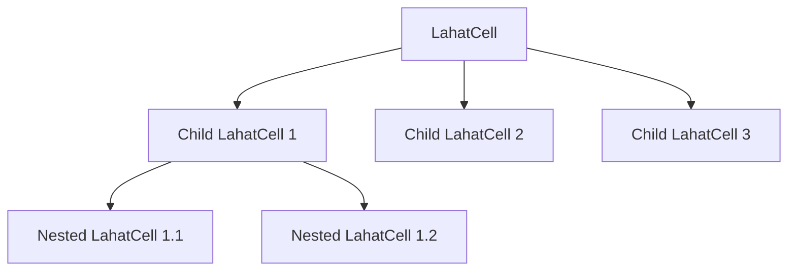

# LahatCell: Design & Implementation Reference

## Overview

LahatCell is a fundamental building block for creating modular, composable UI layouts. It's designed as a self-contained web component that can be nested recursively to create complex layouts while maintaining a clean, declarative structure. LahatCells are specifically designed to be "invisible containers" only, focusing purely on layout and structure without adding any visible aspects to the page apart from layout.



## Core Design Principles

1. **Invisible Container**: LahatCells serve purely as layout containers with no visible UI elements of their own
2. **Self-Contained**: Each LahatCell is a complete, standalone component with no external dependencies
3. **Recursive Composition**: Cells can contain any number of other cells to any depth
4. **Declarative Structure**: Uses slots for intuitive HTML-based composition
5. **Flexible Layouts**: Supports multiple layout patterns (flex row, flex column, grid)
6. **Event Propagation**: Hierarchical event system for communication between cells

## Implementation Architecture

### Component Structure

```
LahatCell
├── Shadow DOM
│   ├── <style> (internal styles)
│   ├── .lahat-cell (container)
│   │   ├── .cell-header (optional header with drag handle)
│   │   ├── .content (layout container with slot)
│   │   └── .resize-handle (for resizing)
│   └── <slot> (for child cells and content)
└── Light DOM
    └── Child LahatCells (slotted content)
```

### Key Technical Decisions

1. **Extending HTMLElement Directly**
   - Avoids inheritance complexity
   - Reduces dependency chain
   - Simplifies maintenance

2. **Shadow DOM with Slots**
   - Encapsulates internal structure and styles
   - Provides clean separation between component and content
   - Allows for declarative composition in HTML

3. **No :host Selectors**
   - All styles applied to internal elements
   - Avoids potential style conflicts
   - Maintains clean boundaries

4. **Event Bubbling System**
   - Events propagate up through the cell hierarchy
   - Maintains source tracking through bubbling chain
   - Supports both generic and specific event types

## Layout System

LahatCell supports three primary layout modes:

### 1. Flex Column (Default)
```html
<lahat-cell layout="flex-column">
  <!-- Children stack vertically -->
</lahat-cell>
```

### 2. Flex Row
```html
<lahat-cell layout="flex-row">
  <!-- Children arrange horizontally -->
</lahat-cell>
```

### 3. Grid
```html
<lahat-cell layout="grid">
  <!-- Children arrange in a grid -->
</lahat-cell>
```

Each layout mode supports additional configuration options:

```javascript
cell.setLayout('grid', {
  columns: 'repeat(3, 1fr)',
  rows: 'auto',
  gap: '10px',
  areas: '"header header header" "sidebar main main" "footer footer footer"'
});
```

## Event System

The event system is designed to facilitate communication between cells at different levels of the hierarchy:

1. **Event Bubbling**
   - Events bubble up from child cells to parent cells
   - Each cell in the chain can process the event
   - Original source is tracked throughout the chain

2. **Event Types**
   - **Lifecycle**: connected, disconnected
   - **Content**: children-changed
   - **Layout**: layout-changed
   - **Interaction**: drag-start/move/end, resize-start/move/end
   - **Custom**: Any user-defined event type

3. **Event Detail Structure**
   ```javascript
   {
     originalSource: HTMLElement,  // Original emitter
     immediateSource: HTMLElement, // Direct child that bubbled the event
     bubbledThrough: HTMLElement[], // Chain of cells the event passed through
     type: String,                 // Event type identifier
     data: Object                  // Event-specific data
   }
   ```

## API Reference

### Attributes

| Attribute | Description | Values |
|-----------|-------------|--------|
| `layout` | Sets the layout mode | `flex-row`, `flex-column`, `grid` |
| `grid-area` | Grid area name for grid layouts | Any valid grid-area name |
| `id` | Unique identifier | Auto-generated if not provided |
| `edit-mode` | Enables edit mode with visible controls | `true`, `false` |

### Methods

#### Layout Management

```javascript
// Set layout type with options
cell.setLayout(type, options);

// Examples
cell.setLayout('flex-row');
cell.setLayout('flex-column', { gap: '10px' });
cell.setLayout('grid', { 
  columns: 'repeat(3, 1fr)',
  rows: 'auto',
  gap: '10px'
});
```

#### Cell Management

```javascript
// Add a child cell
cell.addCell(childCell);

// Remove a child cell
cell.removeCell(childCell);
cell.removeCell('child-id');

// Get a child cell by ID
const child = cell.getCell('child-id');

// Get all direct child cells
const children = cell.getCells();

// Clear all child cells
cell.clearCells();
```

#### Event Handling

```javascript
// Publish an event
cell.publishEvent('custom-event', { key: 'value' });

// Subscribe to events of a specific type
const unsubscribe = cell.subscribe('custom-event', (detail) => {
  console.log(detail.data);
});

// Listen for all cell events
cell.addEventListener('cell-event', (event) => {
  console.log(event.detail);
});

// Listen for specific named events
cell.addEventListener('lahat-cell-layout-changed', (event) => {
  console.log(event.detail);
});
```

#### Styling and Editing

```javascript
// Set custom styles
cell.setStyles({
  backgroundColor: '#f0f0f0',
  padding: '10px',
  borderRadius: '8px'
});

// Enable edit mode to show header and resize handle
cell.setEditMode(true);

// Disable edit mode to hide UI controls
cell.setEditMode(false);
```

## Usage Patterns

### Basic Container

```html
<lahat-cell>
  <div>Simple content</div>
</lahat-cell>
```

### Nested Layout

```html
<lahat-cell layout="flex-column">
  <!-- Header -->
  <lahat-cell style="height: 60px;">
    <header>Page Header</header>
  </lahat-cell>
  
  <!-- Main content with sidebar -->
  <lahat-cell layout="flex-row" style="flex: 1;">
    <!-- Sidebar -->
    <lahat-cell style="width: 200px;">
      <nav>Navigation</nav>
    </lahat-cell>
    
    <!-- Main content -->
    <lahat-cell style="flex: 1;">
      <main>Main content area</main>
    </lahat-cell>
  </lahat-cell>
  
  <!-- Footer -->
  <lahat-cell style="height: 40px;">
    <footer>Page Footer</footer>
  </lahat-cell>
</lahat-cell>
```

### Grid Layout

```html
<lahat-cell layout="grid" style="height: 500px;">
  <lahat-cell grid-area="header">Header</lahat-cell>
  <lahat-cell grid-area="sidebar">Sidebar</lahat-cell>
  <lahat-cell grid-area="main">Main Content</lahat-cell>
  <lahat-cell grid-area="footer">Footer</lahat-cell>
</lahat-cell>

<style>
  lahat-cell[layout="grid"] {
    grid-template-areas: 
      "header header header"
      "sidebar main main"
      "footer footer footer";
    grid-template-columns: 200px 1fr 1fr;
    grid-template-rows: 60px 1fr 40px;
  }
</style>
```

### Dynamic Cell Creation

```javascript
function createDashboard() {
  // Create root cell
  const dashboard = document.createElement('lahat-cell');
  dashboard.id = 'dashboard';
  dashboard.setLayout('grid', {
    columns: 'repeat(4, 1fr)',
    rows: 'repeat(3, 200px)',
    gap: '15px'
  });
  
  // Add widget cells
  for (let i = 0; i < 8; i++) {
    const widget = document.createElement('lahat-cell');
    widget.id = `widget-${i}`;
    widget.innerHTML = `<div>Widget ${i}</div>`;
    dashboard.addCell(widget);
  }
  
  return dashboard;
}

// Add to page
document.body.appendChild(createDashboard());
```

### Event Communication

```javascript
// Set up event listeners
rootCell.addEventListener('cell-event', (e) => {
  if (e.detail.type === 'data-updated') {
    updateDashboard(e.detail.data);
  }
});

// Child cell publishes an event
childCell.publishEvent('data-updated', {
  source: 'api',
  timestamp: Date.now(),
  values: [1, 2, 3, 4]
});
```

## Implementation Considerations

1. **Performance**
   - Event delegation for efficient event handling
   - Minimal DOM operations during updates
   - Lazy initialization of features

2. **Accessibility**
   - Proper ARIA roles and attributes
   - Keyboard navigation support
   - Focus management

3. **Extensibility**
   - Clean API for extending functionality
   - Event-based communication for loose coupling
   - Composition over inheritance

## Best Practices

1. **Structure**
   - Use semantic HTML within cells
   - Keep nesting depth reasonable (avoid too many levels)
   - Use grid layout for complex arrangements

2. **Styling**
   - Remember that LahatCells are designed to be invisible containers
   - Only add visible styling when absolutely necessary
   - Use the setStyles method for dynamic styling
   - Leverage CSS variables for theming
   - Use edit mode only during development or when editing layouts

3. **Events**
   - Listen at the appropriate level in the hierarchy
   - Use specific event types when possible
   - Include relevant data in event payloads

4. **Performance**
   - Minimize DOM operations in event handlers
   - Use event delegation where appropriate
   - Consider debouncing for resize/drag events
