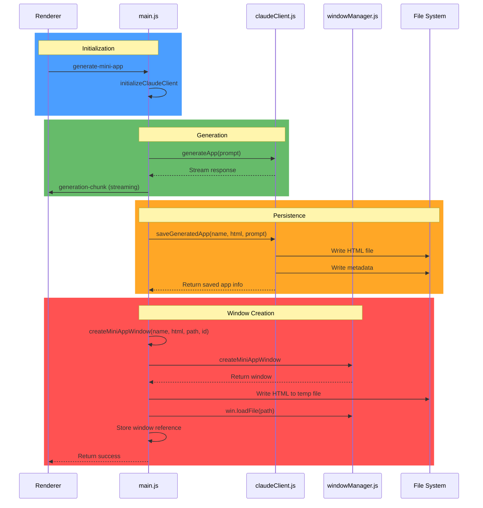
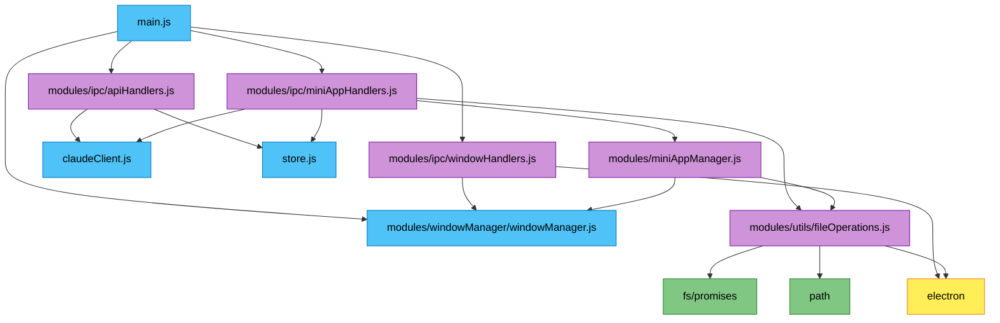
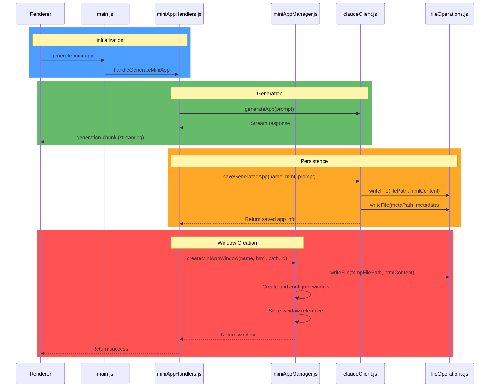
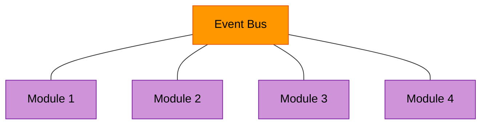
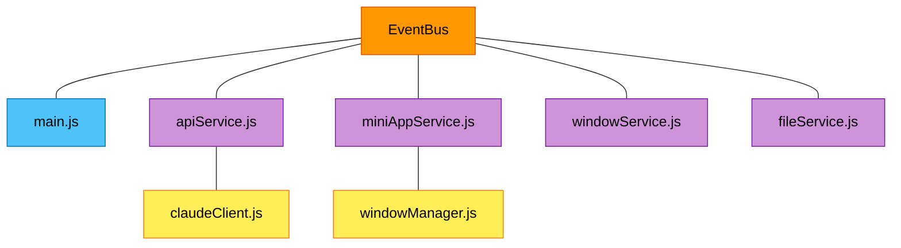
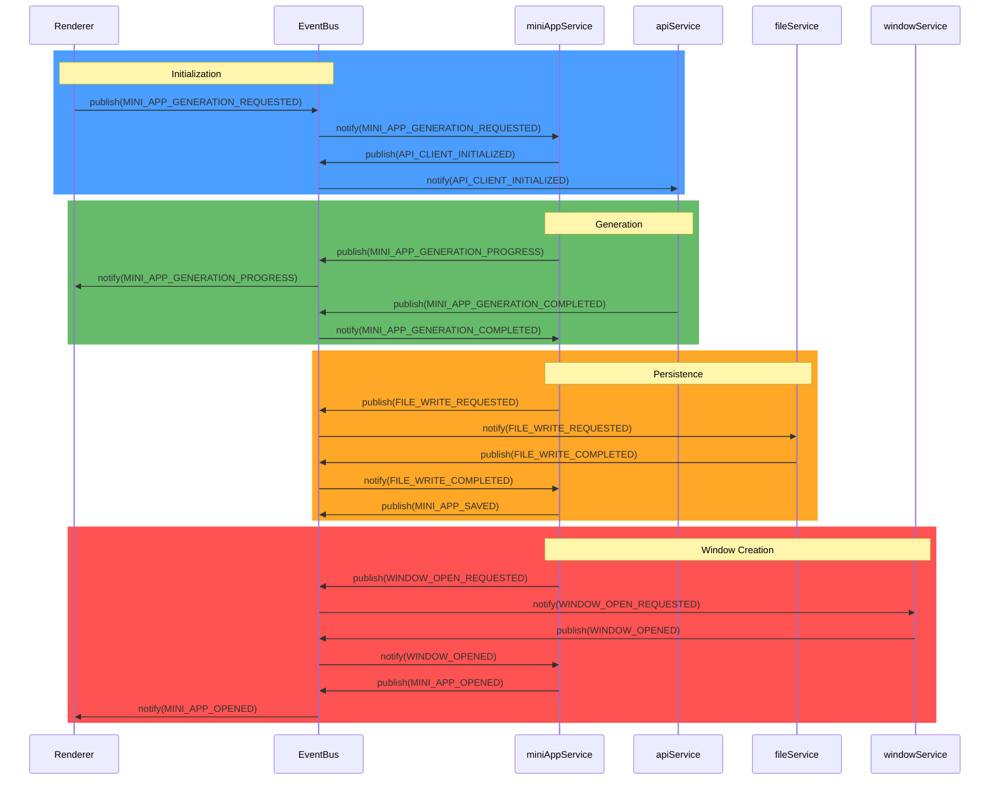

# Lahat Code Cleanup: main.js Refactoring Plan

## Overview and Guiding Principles

This document outlines the detailed plan for refactoring the `main.js` file in the Lahat application, addressing the recommendations in section 1.1 of the code cleanup document. The current `main.js` file (approximately 500 lines) handles too many responsibilities, making it difficult to maintain.

### Guiding Principles

- **KISS (Keep It Simple)**: Each module should have a single, well-defined responsibility
- **DRY (Don't Repeat Yourself)**: Extract common functionality into reusable utilities
- **YAGNI (You Aren't Gonna Need It)**: Focus on current requirements without over-engineering
- **Hierarchical Abstraction**: Organize code in logical layers with clear dependencies
- **Security First**: Maintain or improve security during refactoring

## Current State Analysis

### Dependency Map of Current Implementation

```mermaid
graph TD
    A[main.js] --> B[electron]
    A --> C[claudeClient.js]
    A --> D[store.js]
    A --> E[windowManager.js]
    A --> F[fs/promises]
    A --> G[path]
    
    C --> H[@anthropic-ai/sdk]
    C --> B
    C --> F
    C --> G
    
    E --> B
    E --> D
    E --> G
    
    classDef core fill:#4fc3f7,stroke:#0277bd,color:black
    classDef external fill:#ce93d8,stroke:#7b1fa2,color:black
    classDef utility fill:#81c784,stroke:#2e7d32,color:black
    
    class A core
    class B,H external
    class C,D,E core
    class F,G utility
```

### Current Responsibilities in main.js

1. **Application Lifecycle Management**
   - Initializing the Electron app
   - Handling app events (ready, window-all-closed, activate)

2. **Mini App Management**
   - Creating mini app windows
   - Tracking mini app windows
   - Opening, updating, and deleting mini apps

3. **Claude API Client Management**
   - Initializing the Claude client
   - Managing API key storage and retrieval

4. **IPC Communication**
   - Handling API-related IPC messages
   - Handling mini app-related IPC messages
   - Handling window management IPC messages
   - Handling inter-window communication

5. **File Operations**
   - Reading and writing HTML content
   - Managing temporary files
   - Exporting mini apps

### Current Mini App Creation Sequence



### Identified Issues

1. **High Coupling**: `main.js` is tightly coupled with multiple components
2. **Mixed Responsibilities**: The file handles too many different concerns
3. **Duplicated Logic**: Some operations like file handling are repeated
4. **Limited Testability**: The monolithic structure makes testing difficult
5. **Maintenance Challenges**: Changes to one area risk affecting others

## Proposed Architecture

### New Module Structure



### Module Responsibilities

1. **main.js** (Simplified)
   - Application lifecycle management
   - Module initialization and coordination
   - IPC handler registration

2. **modules/miniAppManager.js** (New)
   - Mini app window creation and management
   - Window tracking and lifecycle management
   - Mini app state management

3. **modules/ipc/apiHandlers.js** (New)
   - API key management
   - Claude client initialization
   - API-related IPC handlers

4. **modules/ipc/miniAppHandlers.js** (New)
   - Mini app generation handlers
   - Mini app management handlers
   - Coordination with Claude client and mini app manager

5. **modules/ipc/windowHandlers.js** (New)
   - Window management IPC handlers
   - Inter-window communication handlers
   - Window parameter management

6. **modules/utils/fileOperations.js** (New)
   - File reading and writing utilities
   - File export functionality
   - Error handling for file operations

### Refactored Mini App Creation Sequence



## Abstract Specifications

### miniAppManager.js

```
Module :: MiniAppManager
Properties:
  - Stateful(miniAppWindows: Map<string, MiniAppWindow>)
  - Isolated(windowCreation: Function)
  - Reusable(windowManagement: Functions)

Operations:
  - Create: (appName, htmlContent, filePath, conversationId) → BrowserWindow
  - Open: (appId, filePath, name) → Result<Success, Error>
  - Update: (appId, htmlContent, filePath) → Result<Success, Error>
  - Close: (appId) → Boolean
  - Get: (appId) → MiniAppWindow?
  - GetAll: () → Map<string, MiniAppWindow>

SecurityInvariants:
  ∀ app ∈ MiniAppWindows:
    - Sandboxed(app.window)
    - ContentIsolated(app.window)
    - PermissionConstrained(app.window)
```

### fileOperations.js

```
Module :: FileOperations
Properties:
  - Pure(fileOperations: Functions)
  - ErrorHandled(operations: Functions)
  - Asynchronous(operations: Functions)

Operations:
  - WriteFile: (filePath, content) → Promise<Result<Success, Error>>
  - ReadFile: (filePath) → Promise<Result<Content, Error>>
  - DeleteFile: (filePath) → Promise<Result<Success, Error>>
  - ExportFile: (sourceFilePath, defaultName) → Promise<Result<SavedPath, Error>>

ErrorHandling:
  - FileNotFound: Proper error message and recovery
  - PermissionDenied: Security-aware error handling
  - DiskFull: Resource constraint handling
```

### apiHandlers.js

```
Module :: ApiHandlers
Properties:
  - Stateful(claudeClient: ClaudeClient?)
  - Isolated(apiKeyManagement: Functions)

Operations:
  - InitializeClaudeClient: () → Boolean
  - HandleSetApiKey: (event, apiKey) → Promise<Result<Success, Error>>
  - HandleCheckApiKey: () → Promise<Result<ApiKeyStatus, Error>>
  - RegisterHandlers: (ipcMain) → void

SecurityInvariants:
  - SecureStorage(apiKey)
  - ValidatedInput(apiKey)
```

### miniAppHandlers.js

```
Module :: MiniAppHandlers
Properties:
  - Stateful(claudeClient: ClaudeClient?)
  - Coordinating(miniAppManager: MiniAppManager)

Operations:
  - HandleGenerateMiniApp: (event, params) → Promise<Result<AppInfo, Error>>
  - HandleListMiniApps: () → Promise<Result<AppList, Error>>
  - HandleOpenMiniApp: (event, params) → Promise<Result<Success, Error>>
  - HandleUpdateMiniApp: (event, params) → Promise<Result<AppInfo, Error>>
  - HandleDeleteMiniApp: (event, params) → Promise<Result<Success, Error>>
  - HandleExportMiniApp: (event, params) → Promise<Result<ExportInfo, Error>>
  - RegisterHandlers: (ipcMain) → void
```

### windowHandlers.js

```
Module :: WindowHandlers
Properties:
  - Stateful(windowParams: Map<number, Object>)
  - Coordinating(windowManager: WindowManager)

Operations:
  - HandleOpenWindow: (event, params) → Promise<Result<Success, Error>>
  - HandleCloseCurrentWindow: (event) → Result<Success, Error>
  - HandleGetWindowParams: (event) → Object
  - HandleNotifyAppUpdated: (event) → Result<Success, Error>
  - HandleNotifyApiKeyUpdated: (event) → Result<Success, Error>
  - RegisterHandlers: (ipcMain) → void
```

## Implementation Plan

### Step 1: Create Module Files

Create the following new files:
- `modules/miniAppManager.js`
- `modules/ipc/apiHandlers.js`
- `modules/ipc/miniAppHandlers.js`
- `modules/ipc/windowHandlers.js`
- `modules/utils/fileOperations.js`

### Step 2: Extract Mini App Management

1. Move the `miniAppWindows` Map from `main.js` to `miniAppManager.js`
2. Extract the `createMiniAppWindow` function to `miniAppManager.js`
3. Add additional mini app management functions to `miniAppManager.js`

### Step 3: Extract File Operations

1. Create utility functions in `fileOperations.js` for common file operations
2. Ensure proper error handling for all file operations
3. Add file export functionality

### Step 4: Extract IPC Handlers

1. Group IPC handlers by functionality
2. Move API-related handlers to `apiHandlers.js`
3. Move mini app-related handlers to `miniAppHandlers.js`
4. Move window-related handlers to `windowHandlers.js`
5. Create registration functions for each handler group

### Step 5: Refactor main.js

1. Update imports to use the new modules
2. Replace direct IPC handler registrations with module registrations
3. Initialize modules in the correct order
4. Maintain application lifecycle management

### Step 6: Testing

1. Test each module in isolation
2. Test the integration between modules
3. Verify all functionality works as expected
4. Check for any regressions

## Progress Tracking

```
Progress:
  ☐ Module: miniAppManager.js
    ☐ Extract createMiniAppWindow function
    ☐ Extract openMiniApp function
    ☐ Implement window tracking
    ☐ Add window lifecycle management
    
  ☐ Module: IPC Handlers
    ☐ Create apiHandlers.js
      ☐ Extract API key management
      ☐ Extract Claude client initialization
    ☐ Create miniAppHandlers.js
      ☐ Extract mini app generation handlers
      ☐ Extract mini app management handlers
    ☐ Create windowHandlers.js
      ☐ Extract window management handlers
      ☐ Extract inter-window communication
      
  ☐ Module: fileOperations.js
    ☐ Implement file reading/writing utilities
    ☐ Implement file export functionality
    ☐ Add error handling
    
  ☐ Refactor main.js
    ☐ Update imports
    ☐ Register IPC handlers
    ☐ Initialize modules
    ☐ Test application startup

Status:
  - Current Phase: Planning
  - Completion: 0%
  - Blocking Items: None
  - Last Updated: 2025-03-01
```

## Quality Assertions

The refactoring must satisfy the following criteria:

1. **Functional Equivalence**: All existing functionality must continue to work
2. **Reduced Complexity**: Each module should have a single responsibility
3. **Improved Maintainability**: Code should be easier to understand and modify
4. **Preserved Performance**: No significant performance degradation
5. **Enhanced Testability**: Modules should be testable in isolation

```prolog
valid_refactoring(System) :-
    maintains(functionality),
    reduces(complexity),
    improves(maintainability),
    preserves(performance),
    follows(kiss_principle),
    follows(dry_principle),
    follows(yagni_principle).
```

## Expected Benefits

1. **Improved Code Organization**: Clear separation of concerns
2. **Enhanced Maintainability**: Easier to understand and modify individual components
3. **Better Testability**: Modules can be tested in isolation
4. **Reduced Coupling**: Changes in one area are less likely to affect others
5. **Easier Future Development**: New features can be added more easily

## Alternative: Event-Driven Architecture

An alternative approach to the modular refactoring proposed above would be to implement an event-driven architecture. This approach would further decouple the components by removing direct dependencies between modules and instead having them communicate through events.

### Event-Driven Architecture Overview

In an event-driven architecture, components communicate by publishing events to an event bus and subscribing to events they're interested in. This creates a more loosely coupled system where components don't need to know about each other directly.



### Core Components

1. **Event Bus/Emitter**: A central mechanism for publishing and subscribing to events
2. **Event Publishers**: Components that emit events when something happens
3. **Event Subscribers**: Components that listen for and react to events
4. **Event Types**: Well-defined event types with standardized payloads

### Proposed Event-Driven Architecture

#### New Module Structure



#### Event Types

```javascript
// events/eventTypes.js
export const EventTypes = {
  // API Events
  API_KEY_SET: 'api:key:set',
  API_KEY_VALIDATED: 'api:key:validated',
  API_CLIENT_INITIALIZED: 'api:client:initialized',
  
  // Mini App Events
  MINI_APP_GENERATION_REQUESTED: 'miniapp:generation:requested',
  MINI_APP_GENERATION_PROGRESS: 'miniapp:generation:progress',
  MINI_APP_GENERATION_COMPLETED: 'miniapp:generation:completed',
  MINI_APP_SAVED: 'miniapp:saved',
  MINI_APP_OPEN_REQUESTED: 'miniapp:open:requested',
  MINI_APP_OPENED: 'miniapp:opened',
  MINI_APP_UPDATE_REQUESTED: 'miniapp:update:requested',
  MINI_APP_UPDATED: 'miniapp:updated',
  MINI_APP_DELETE_REQUESTED: 'miniapp:delete:requested',
  MINI_APP_DELETED: 'miniapp:deleted',
  MINI_APP_EXPORT_REQUESTED: 'miniapp:export:requested',
  MINI_APP_EXPORTED: 'miniapp:exported',
  
  // Window Events
  WINDOW_OPEN_REQUESTED: 'window:open:requested',
  WINDOW_OPENED: 'window:opened',
  WINDOW_CLOSE_REQUESTED: 'window:close:requested',
  WINDOW_CLOSED: 'window:closed',
  
  // File Events
  FILE_READ_REQUESTED: 'file:read:requested',
  FILE_READ_COMPLETED: 'file:read:completed',
  FILE_WRITE_REQUESTED: 'file:write:requested',
  FILE_WRITE_COMPLETED: 'file:write:completed',
  FILE_DELETE_REQUESTED: 'file:delete:requested',
  FILE_DELETE_COMPLETED: 'file:delete:completed',
  
  // Error Events
  ERROR_OCCURRED: 'error:occurred'
};
```

#### Event Bus Implementation

```javascript
// events/eventBus.js
class EventBus {
  constructor() {
    this.subscribers = new Map();
  }
  
  subscribe(eventType, callback) {
    if (!this.subscribers.has(eventType)) {
      this.subscribers.set(eventType, new Set());
    }
    
    const callbacks = this.subscribers.get(eventType);
    callbacks.add(callback);
    
    // Return unsubscribe function
    return () => {
      callbacks.delete(callback);
      if (callbacks.size === 0) {
        this.subscribers.delete(eventType);
      }
    };
  }
  
  publish(eventType, data) {
    console.log(`Event published: ${eventType}`, data);
    
    if (!this.subscribers.has(eventType)) {
      return;
    }
    
    const callbacks = this.subscribers.get(eventType);
    for (const callback of callbacks) {
      try {
        callback(data);
      } catch (error) {
        console.error(`Error in event handler for ${eventType}:`, error);
        this.publish(EventTypes.ERROR_OCCURRED, {
          source: eventType,
          error: error.message
        });
      }
    }
  }
}

export const eventBus = new EventBus();
```

#### Service Implementations

Each service would be responsible for handling specific functionality and would communicate with other services through events:

```javascript
// services/apiService.js
import { eventBus } from '../events/eventBus.js';
import { EventTypes } from '../events/eventTypes.js';
import ClaudeClient from '../claudeClient.js';
import store from '../store.js';

class ApiService {
  constructor() {
    this.claudeClient = null;
    this.registerEventHandlers();
  }
  
  registerEventHandlers() {
    eventBus.subscribe(EventTypes.API_KEY_SET, this.handleSetApiKey.bind(this));
    // Other event handlers...
  }
  
  handleSetApiKey({ apiKey }) {
    try {
      store.set('apiKey', apiKey);
      this.claudeClient = new ClaudeClient(apiKey);
      
      eventBus.publish(EventTypes.API_KEY_VALIDATED, { 
        success: true 
      });
      
      eventBus.publish(EventTypes.API_CLIENT_INITIALIZED, {
        success: true
      });
    } catch (error) {
      eventBus.publish(EventTypes.ERROR_OCCURRED, {
        source: 'apiService',
        operation: 'setApiKey',
        error: error.message
      });
    }
  }
  
  // Other methods...
}

export const apiService = new ApiService();
```

#### Mini App Creation Sequence (Event-Driven)



### Benefits of Event-Driven Architecture

1. **Loose Coupling**: Services don't need direct references to each other, only to the event bus
2. **Extensibility**: New functionality can be added by creating new subscribers without modifying existing code
3. **Testability**: Services can be tested in isolation by mocking the event bus
4. **Scalability**: Event processing can be made asynchronous for better performance
5. **Observability**: Events provide a natural audit trail of system activity

### Trade-offs and Considerations

1. **Complexity**: Event-driven systems can be more complex to understand and debug
2. **Indirection**: The flow of control is less obvious than with direct function calls
3. **Event Consistency**: Need to ensure event types and payloads are consistent
4. **Error Handling**: Errors in event handlers need careful management
5. **Race Conditions**: Potential for race conditions if events are processed out of order

### Implementation Approach

1. **Create Event Infrastructure**:
   - Implement the event bus
   - Define event types
   - Create utility functions for common event patterns

2. **Convert Services**:
   - Refactor each area of functionality into a service
   - Convert direct function calls to event publishing
   - Implement event subscribers for each service

3. **Update Main Process**:
   - Initialize the event bus
   - Start services
   - Set up IPC to renderer process using events

4. **Update Renderer Process**:
   - Create a renderer-side event system
   - Bridge main and renderer events through IPC

5. **Testing**:
   - Test each service in isolation
   - Test event flows end-to-end

### Comparison with Modular Approach

| Aspect | Modular Approach | Event-Driven Approach |
|--------|------------------|------------------------|
| Coupling | Modules directly reference each other | Modules only reference the event bus |
| Complexity | Simpler to understand and debug | More complex event flows |
| Extensibility | Requires modifying existing modules | Can add new subscribers without changing existing code |
| Performance | Direct function calls are faster | Event processing adds overhead but enables async processing |
| Error Handling | Straightforward try/catch | Requires careful event error management |
| Learning Curve | Familiar to most developers | May require team training |

### Recommendation

While the event-driven architecture offers significant benefits in terms of loose coupling and extensibility, it also introduces additional complexity. For the current refactoring effort, the modular approach may be more appropriate as an initial step, with the event-driven architecture as a potential future evolution.

A hybrid approach could also be considered, where certain high-level interactions use events while lower-level operations use direct function calls for simplicity and performance.

## Conclusion

This refactoring plan addresses the recommendations in section 1.1 of the code cleanup document by breaking down the monolithic `main.js` file into smaller, more focused modules. The proposed architecture follows software engineering best practices and the principles outlined in `secret_sauce.md`.

The implementation will be carried out in a step-by-step manner, with testing at each stage to ensure that functionality is preserved. The end result will be a more maintainable, testable, and extensible codebase.
