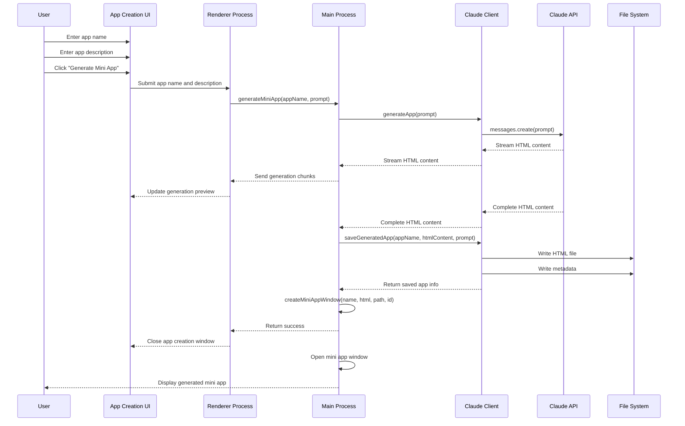
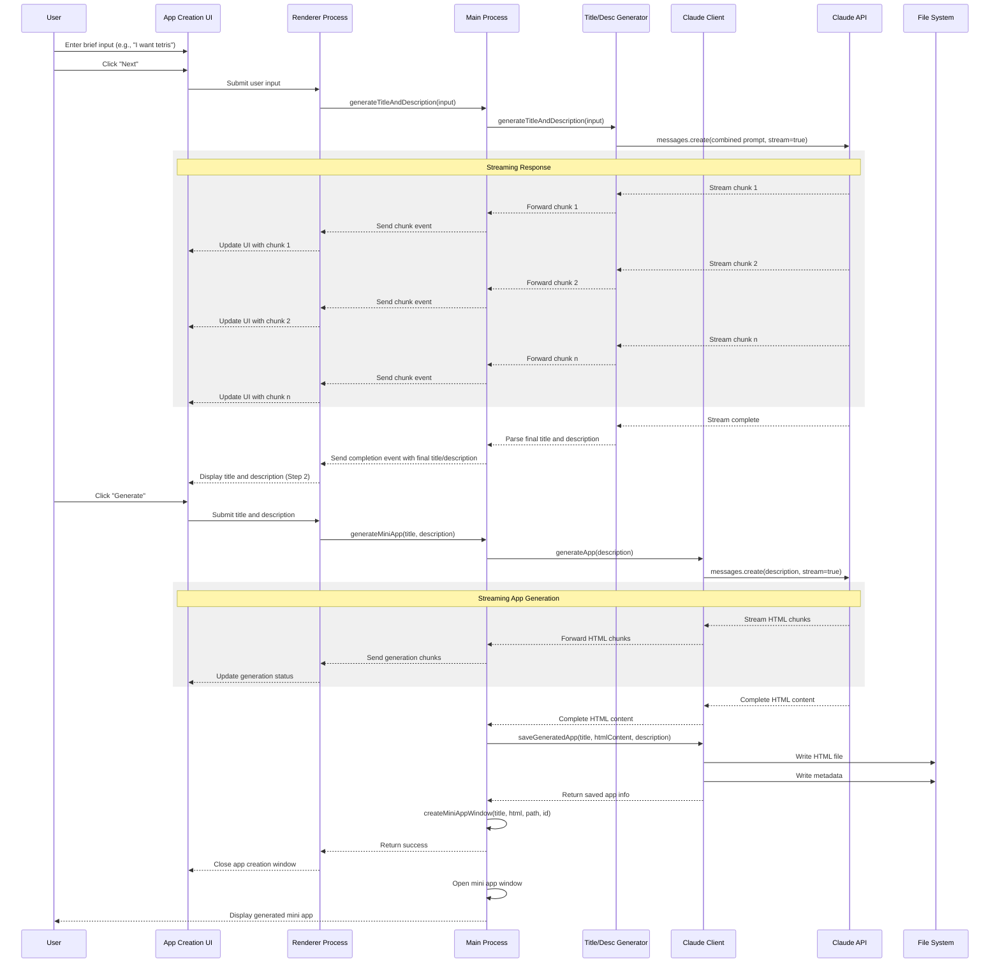

# Lahat Mini App Generation UI Redesign

This document outlines the implementation plan for redesigning the mini app generation flow in the Lahat application. The new design changes how we generate mini apps by having the LLM generate both the title and description rather than asking the user to provide them upfront.

## Overview

### Current Flow vs. New Flow

#### Current Flow:
1. User enters app name and description in the app creation form
2. App is generated using the provided name and description
3. App is saved and displayed

#### New Flow:
1. User enters a brief description of what they want (e.g., "I want Tetris")
2. LLM generates:
   - A detailed, expanded description using the provided prompt
   - A creative title derived from the description
3. App is generated using the LLM-created title and description
4. App is saved and displayed

## Sequence Diagrams

### Current Flow (Before)



### New Flow (After)



## Implementation Details

### New Files

- **Title/Description Generator**:
  - `modules/utils/titleDescriptionGenerator.js` - Utility for generating titles and descriptions

### Modified Files

- **HTML Files**:
  - `app-creation.html` - Updated UI with multi-step wizard interface

- **JavaScript Files**:
  - `renderers/app-creation.js` - Updated renderer logic for the new UI flow
  - `modules/ipc/miniAppHandlers.js` - Added handlers for title/description generation
  - `preload.cjs` - Added new IPC methods for title/description generation

- **CSS Files**:
  - `styles/app-creation.css` - Updated styles for the new UI

### UI Implementation

The new UI will follow a 2-step wizard pattern:

1. **Step 1: Initial Input**
   - Simple, clean interface with just:
     - "What would you like?" header
     - Text input field (e.g., "I want tetris")
     - "Next" button

2. **Step 2: Preview and Generate**
   - Header: "What would you like?"
   - Shows the user's original input
   - "We will build..." section
   - Generated title (prominently displayed, updates in real-time)
   - Generated description paragraph (updates in real-time)
   - "Generate" button to create the app

### Backend Implementation

1. **Title/Description Generator Module**
   - Implement `generateTitleAndDescription` function that takes user input and generates both title and description in a single call
   - Use streaming to provide real-time updates to the UI as the content is generated
   - Parse the streamed response to extract title and description

2. **IPC Handlers**
   - Add `handleGenerateTitleAndDescription` handler for generating both title and description
   - Implement streaming of generation chunks to the renderer process
   - Update existing `handleGenerateMiniApp` to work with the new flow

3. **Preload Script**
   - Add new IPC methods for title/description generation:
     - `generateTitleAndDescription`
     - `onTitleDescriptionChunk` event listener for streaming updates

## Technical Details

### Title/Description Generator Module

```javascript
// modules/utils/titleDescriptionGenerator.js
import Anthropic from '@anthropic-ai/sdk';

export async function generateTitleAndDescription(input, apiKey, onChunk) {
  const anthropic = new Anthropic({
    apiKey: apiKey
  });
  
  const prompt = `Based on the following user input, provide:
1. A concise, creative, and descriptive title (2-5 words)
2. An expanded description paragraph

For the description paragraph: Rephrase and expand the input into a single, self-contained paragraph that clearly defines the purpose and functionality of the mini-application. The response should be declarative, avoiding direct reference to the user and eliminating any additional explanations or commentary.

For example:
• Input: "I want Tetris."
  Title: "Block Cascade"
  Description: "A game application that replicates the classic mechanics of Tetris, where falling blocks must be arranged to form complete lines. The game features intuitive controls, real-time scoring, increasing difficulty levels, and smooth animations to enhance the gameplay experience."

• Input: "I need a spreadsheet."
  Title: "DataGrid Pro"
  Description: "A spreadsheet management tool that provides an efficient workspace for organizing and analyzing data, featuring customizable layouts, formula creation, and data visualization capabilities. It supports multiple file types, including Excel and CSV formats, with real-time updates and automatic data synchronization for seamless collaboration."

Format your response as:
TITLE: [your title here]
DESCRIPTION: [your description here]

User input: "${input}"`;

  // Call Claude API with streaming enabled
  const response = await anthropic.messages.create({
    model: 'claude-3-7-sonnet-20250219',
    max_tokens: 1000,
    messages: [
      { role: 'user', content: prompt }
    ],
    stream: true
  });

  let accumulatedContent = '';
  let title = '';
  let description = '';
  
  // Process the stream
  for await (const chunk of response) {
    if (chunk.type === 'content_block_delta' && chunk.delta.type === 'text_delta') {
      const text = chunk.delta.text || '';
      accumulatedContent += text;
      
      // Try to extract title and description as they come in
      const titleMatch = accumulatedContent.match(/TITLE:\s*(.*?)(?:\n|$)/i);
      const descriptionMatch = accumulatedContent.match(/DESCRIPTION:\s*(.*)/is);
      
      const currentTitle = titleMatch ? titleMatch[1].trim() : "";
      const currentDescription = descriptionMatch ? descriptionMatch[1].trim() : "";
      
      // Only call onChunk if we have new content
      if (currentTitle !== title || currentDescription !== description) {
        title = currentTitle;
        description = currentDescription;
        
        // Call the callback with the current state
        if (onChunk) {
          onChunk({
            title,
            description,
            done: false,
            content: text
          });
        }
      }
    }
  }
  
  // Final parsing to ensure we have the complete title and description
  const titleMatch = accumulatedContent.match(/TITLE:\s*(.*?)(?:\n|$)/i);
  const descriptionMatch = accumulatedContent.match(/DESCRIPTION:\s*(.*)/is);
  
  title = titleMatch ? titleMatch[1].trim() : "Mini App";
  description = descriptionMatch ? descriptionMatch[1].trim() : accumulatedContent;
  
  // Signal completion
  if (onChunk) {
    onChunk({
      title,
      description,
      done: true
    });
  }
  
  return {
    title,
    description
  };
}
```

### IPC Handlers

```javascript
// Add to modules/ipc/miniAppHandlers.js

/**
 * Handle generating title and description for a mini app
 * @param {Object} event - IPC event
 * @param {Object} params - Parameters for generating title and description
 * @returns {Promise<Object>} - Result object with title and description
 */
async function handleGenerateTitleAndDescription(event, { input }) {
  try {
    const claudeClient = apiHandlers.getClaudeClient();
    if (!claudeClient) {
      return {
        success: false,
        error: 'Claude API key not set. Please set your API key in settings.'
      };
    }
    
    // Start streaming status
    event.sender.send('generation-status', {
      status: 'generating',
      message: 'Generating title and description...'
    });
    
    // Generate title and description with streaming
    const result = await titleDescriptionGenerator.generateTitleAndDescription(
      input,
      claudeClient.apiKey,
      (chunk) => {
        // Send each chunk to the renderer
        event.sender.send('title-description-chunk', chunk);
      }
    );
    
    // Signal completion
    event.sender.send('generation-status', {
      status: 'complete',
      message: 'Title and description generated'
    });
    
    return { 
      success: true,
      title: result.title,
      description: result.description
    };
  } catch (error) {
    event.sender.send('generation-status', {
      status: 'error',
      message: `Error: ${error.message}`
    });
    
    return {
      success: false,
      error: error.message
    };
  }
}

// Add to registerHandlers function:
ipcMain.handle('generate-title-and-description', handleGenerateTitleAndDescription);
```

### Preload Script Updates

```javascript
// Add to preload.cjs electronAPI object
generateTitleAndDescription: async (params) => {
  try {
    return await ipcRenderer.invoke('generate-title-and-description', params);
  } catch (error) {
    console.error('Error generating title and description:', error);
    throw error;
  }
},
onTitleDescriptionChunk: (callback) => {
  ipcRenderer.on('title-description-chunk', (_event, chunk) => callback(chunk));
},
```

### HTML Structure

```html
<!-- app-creation.html -->
<div class="window">
  <div class="titlebar">Create a Mini App</div>
  <div class="content">
    <!-- Step 1: Initial Input -->
    <div id="step-1" class="step active">
      <h2>What would you like?</h2>
      <div class="input-group">
        <input type="text" id="user-input" placeholder="I want tetris" />
      </div>
      <div class="button-container">
        <button id="next-button" class="next-button">Next</button>
      </div>
    </div>

    <!-- Step 2: Preview and Generate -->
    <div id="step-2" class="step">
      <h2>What would you like?</h2>
      <div class="user-input-display">
        <span id="user-input-display"></span>
      </div>
      <div class="preview-section">
        <h3>We will build...</h3>
        <h4 id="generated-title"></h4>
        <p id="generated-description"></p>
      </div>
      <div class="button-container">
        <button id="generate-button" class="generate-button">Generate</button>
      </div>
    </div>

    <!-- Loading Indicator (shown during generation) -->
    <div id="generation-status" class="hidden">
      <div class="spinner"></div>
      <span id="generation-status-text">Generating...</span>
    </div>
  </div>
</div>
```

### JavaScript Implementation

```javascript
// renderers/app-creation.js
// DOM Elements
const step1 = document.getElementById('step-1');
const step2 = document.getElementById('step-2');
const userInput = document.getElementById('user-input');
const userInputDisplay = document.getElementById('user-input-display');
const generatedTitle = document.getElementById('generated-title');
const generatedDescription = document.getElementById('generated-description');
const nextButton = document.getElementById('next-button');
const generateButton = document.getElementById('generate-button');
const generationStatus = document.getElementById('generation-status');
const generationStatusText = document.getElementById('generation-status-text');
const titleDescriptionPreview = document.querySelector('.preview-section');

// State
let currentInput = '';
let currentTitle = '';
let currentDescription = '';

// Initialize the app
async function initializeApp() {
  // Check if API key is set
  const { hasApiKey } = await window.electronAPI.checkApiKey();
  
  if (!hasApiKey) {
    // Open API setup window if API key is not set
    window.electronAPI.openWindow('api-setup');
    
    // Close this window
    window.electronAPI.closeCurrentWindow();
    return;
  }
  
  // Set up event listener for title/description chunks
  window.electronAPI.onTitleDescriptionChunk((chunk) => {
    if (!chunk.done) {
      // Update the UI with the current state
      if (chunk.title) {
        generatedTitle.textContent = chunk.title;
      }
      
      if (chunk.description) {
        generatedDescription.textContent = chunk.description;
      }
      
      // Show the preview section if it's hidden
      if (titleDescriptionPreview.classList.contains('hidden')) {
        titleDescriptionPreview.classList.remove('hidden');
      }
    } else {
      // Store the final values
      currentTitle = chunk.title;
      currentDescription = chunk.description;
    }
  });
}

// Step 1: Handle user input and generate title/description
nextButton.addEventListener('click', async () => {
  currentInput = userInput.value.trim();
  
  if (!currentInput) {
    alert('Please enter what you would like to create.');
    return;
  }
  
  // Show loading indicator
  generationStatus.classList.remove('hidden');
  generationStatusText.textContent = 'Generating title and description...';
  
  // Reset the preview
  generatedTitle.textContent = '';
  generatedDescription.textContent = '';
  
  try {
    // Generate title and description
    const result = await window.electronAPI.generateTitleAndDescription({
      input: currentInput
    });
    
    if (result.success) {
      // The UI has already been updated via chunks
      // Just store the final values
      currentTitle = result.title;
      currentDescription = result.description;
      
      // Display the user input
      userInputDisplay.textContent = currentInput;
      
      // Hide step 1, show step 2
      step1.classList.remove('active');
      step2.classList.add('active');
    } else {
      alert(`Error generating title and description: ${result.error}`);
    }
  } catch (error) {
    alert(`Error: ${error.message}`);
  } finally {
    // Hide loading indicator
    generationStatus.classList.add('hidden');
  }
});

// Step 2: Generate the mini app
generateButton.addEventListener('click', async () => {
  // Show loading indicator
  generationStatus.classList.remove('hidden');
  generationStatusText.textContent = 'Generating mini app...';
  
  try {
    const result = await window.electronAPI.generateMiniApp({
      appName: currentTitle,
      prompt: currentDescription
    });
    
    if (result.success) {
      // Notify main window to refresh app list
      window.electronAPI.notifyAppUpdated();
      
      // Close this window after a short delay
      setTimeout(() => {
        window.electronAPI.closeCurrentWindow();
      }, 2000);
    } else {
      alert(`Error generating mini app: ${result.error}`);
    }
  } catch (error) {
    alert(`Error: ${error.message}`);
  } finally {
    // Hide loading indicator
    generationStatus.classList.add('hidden');
  }
});

// Initialize the app
initializeApp();
```

## Testing Plan

1. **Unit Testing**
   - Test the title/description generator functions with various inputs
   - Verify that the generated descriptions follow the prompt guidelines
   - Verify that the generated titles are appropriate and derived from the descriptions

2. **Integration Testing**
   - Test the IPC handlers with mock events
   - Verify that the handlers correctly interact with the Claude API
   - Test error handling for various scenarios

3. **UI Testing**
   - Test each step of the UI flow
   - Verify that the UI correctly displays the generated content
   - Test navigation between steps
   - Test error handling and loading states

4. **End-to-End Testing**
   - Test the complete flow from user input to app generation
   - Verify that the generated app uses the correct title and description
   - Test with various types of app requests

## Implementation Steps

1. Create the new `titleDescriptionGenerator.js` module
2. Update the `miniAppHandlers.js` file to add the new handlers
3. Update the `preload.cjs` file to expose the new IPC methods
4. Replace the content of `app-creation.html` with the new UI structure
5. Update the CSS in `styles/app-creation.css` with the new styles
6. Replace the content of `app-creation.js` with the new step-based logic
7. Test the new flow end-to-end

## Benefits

1. **Improved User Experience**
   - Users only need to provide a simple description of what they want
   - The system handles the complexity of generating a detailed description and title
   - Step-by-step flow with previews helps set expectations

2. **Better App Quality**
   - More consistent and detailed descriptions
   - Professional-sounding titles derived from the descriptions
   - Improved prompts for the Claude API

3. **Reduced Cognitive Load**
   - Users don't need to think of both a title and detailed description
   - The system guides users through the process with clear steps
   - Preview at each stage helps users understand what's happening

## Conclusion

This redesign of the mini app generation flow will significantly improve the user experience by simplifying the initial input process and leveraging the LLM to generate both the title and description. The multi-step wizard UI provides a clear, guided experience with previews at each stage, helping users understand what will be generated before committing to the final app creation.

The implementation follows a modular approach, with clear separation of concerns between the UI, IPC handlers, and the title/description generator module. This makes the code easier to maintain and extend in the future.
