# Lahat: Code Organization

<!-- SUMMARY -->
This document describes the modular code organization of Lahat, including the module structure, responsibilities, and relationships between components.
<!-- /SUMMARY -->

<!-- RELATED DOCUMENTS -->
related '../architecture/technical_architecture.md'
related '../architecture/window_sheets_architecture.md'
related '../changes/20250305-code-cleanup-and-maintainability-improvements.md'
<!-- /RELATED DOCUMENTS -->

## Module Structure

Lahat's codebase follows a modular organization pattern, with clear separation of concerns:

```mermaid
graph TD
    A[main.js] --> B[modules/ipc/index.js]
    A --> E[modules/windowManager/index.js]
    A --> U[modules/utils/index.js]
    A --> H[modules/miniAppManager.js]
    
    B --> B1[modules/ipc/apiHandlers.js]
    B --> B2[modules/ipc/miniAppHandlers.js]
    B --> B3[modules/ipc/windowHandlers.js]
    B --> B4[modules/ipc/ipcHandler.js]
    B --> B5[modules/ipc/ipcTypes.js]
    
    E --> E1[modules/windowManager/windowManager.js]
    E --> E2[modules/windowManager/windowManager-web-components.js]
    E --> E3[modules/windowManager/windowPool.js]
    
    U --> U1[modules/utils/errorHandler.js]
    U --> U2[modules/utils/fileOperations.js]
    U --> U3[modules/utils/stringUtils.js]
    U --> U4[modules/utils/dateUtils.js]
    U --> U5[modules/utils/domUtils.js]
    U --> U6[modules/utils/validationUtils.js]
    U --> U7[modules/utils/titleDescriptionGenerator.js]
    
    B1 --> F[claudeClient.js]
    B1 --> G[store.js]
    
    B2 --> H
    B2 --> U2
    B2 --> F
    B2 --> G
    
    B3 --> E1
    B3 --> J[electron]
    
    H --> E1
    H --> U2
    
    K[components/core/index.js] --> K1[components/core/base-component.js]
    K --> K2[components/core/component-registry.js]
    K --> K3[components/core/dynamic-loader.js]
    K --> K4[components/core/state-manager.js]
    K --> K5[components/core/utils.js]
    
    L[components/ui/index.js] --> L1[components/ui/cards]
    L --> L2[components/ui/containers]
    L --> L3[components/ui/modals]
    
    M[renderers/main.js] --> K
    M --> L
    
    N[renderers/api-setup.js] --> K
    
    O[renderers/app-creation.js] --> K
    
    P[renderers/main-web-components.js] --> K
    P --> L
```



## Module Responsibilities

### 1. main.js (Simplified)

The main entry point for the Electron application, responsible for:
- Application lifecycle management
- Module initialization and coordination
- IPC handler registration
- Window creation and management

```javascript
// Simplified main.js structure
import { app, BrowserWindow } from 'electron';
import path from 'path';
import { fileURLToPath } from 'url';
import store from './store.js';
import * as windowManager from './modules/windowManager/index.js';
import * as ipc from './modules/ipc/index.js';
import { ErrorHandler } from './modules/utils/errorHandler.js';

// Initialize the application
function initializeApp() {
  try {
    // Initialize window manager
    windowManager.initializeWindowManager();
    
    // Initialize IPC handlers
    ipc.initializeIpcHandlers();
    
    // Initialize Claude client
    ipc.apiHandlers.initializeClaudeClient();
    
    // Create main window when app is ready
    app.whenReady().then(() => {
      windowManager.createMainWindow();
    });
    
    // App lifecycle event handlers
    app.on('window-all-closed', () => {
      if (process.platform !== 'darwin') {
        app.quit();
      }
    });
    
    app.on('activate', () => {
      if (BrowserWindow.getAllWindows().length === 0) {
        windowManager.createMainWindow();
      }
    });
  } catch (error) {
    ErrorHandler.logError('initializeApp', error, ErrorHandler.ERROR_LEVELS.FATAL);
    console.error('Failed to initialize application:', error);
    app.quit();
  }
}

// Handle uncaught exceptions
process.on('uncaughtException', (error) => {
  ErrorHandler.logError('uncaughtException', error, ErrorHandler.ERROR_LEVELS.FATAL);
  console.error('Uncaught exception:', error);
});

// Handle unhandled promise rejections
process.on('unhandledRejection', (reason, promise) => {
  ErrorHandler.logError('unhandledRejection', reason, ErrorHandler.ERROR_LEVELS.ERROR);
  console.error('Unhandled promise rejection:', reason);
});

// Initialize the application
initializeApp();
```

### 2. modules/miniAppManager.js

Responsible for mini app window creation and management:
- Creating mini app windows
- Tracking window references
- Opening, updating, and deleting mini apps
- Managing mini app lifecycle

```javascript
// Key functions in miniAppManager.js
export async function createMiniAppWindow(appName, htmlContent, filePath, conversationId) {
  // Implementation...
}

export async function openMiniApp(appId, filePath, name) {
  // Implementation...
}

export function getMiniAppWindow(appId) {
  // Implementation...
}

export function closeMiniAppWindow(appId) {
  // Implementation...
}
```

### 3. modules/ipc/apiHandlers.js

Handles API-related IPC messages:
- API key management
- Claude client initialization
- API-related IPC handlers

```javascript
// Key functions in apiHandlers.js
export function initializeClaudeClient() {
  // Implementation...
}

export function registerHandlers(ipcMain) {
  ipcMain.handle('set-api-key', handleSetApiKey);
  ipcMain.handle('check-api-key', handleCheckApiKey);
  // Other API-related handlers...
}

async function handleSetApiKey(event, apiKey) {
  // Implementation...
}

async function handleCheckApiKey() {
  // Implementation...
}
```

### 4. modules/ipc/miniAppHandlers.js

Handles mini app-related IPC messages:
- Mini app generation
- Mini app management
- Mini app-related IPC handlers

```javascript
// Key functions in miniAppHandlers.js
export function registerHandlers(ipcMain) {
  ipcMain.handle('generate-mini-app', handleGenerateMiniApp);
  ipcMain.handle('generate-title-and-description', handleGenerateTitleAndDescription);
  ipcMain.handle('open-mini-app', handleOpenMiniApp);
  ipcMain.handle('update-mini-app', handleUpdateMiniApp);
  ipcMain.handle('delete-mini-app', handleDeleteMiniApp);
  // Other mini app-related handlers...
}

async function handleGenerateMiniApp(event, { appName, prompt }) {
  // Implementation...
}

async function handleGenerateTitleAndDescription(event, { input }) {
  // Implementation...
}
```

### 5. modules/ipc/windowHandlers.js

Handles window-related IPC messages:
- Window creation and management
- Window parameter management
- Inter-window communication

```javascript
// Key functions in windowHandlers.js
export function registerHandlers(ipcMain) {
  ipcMain.handle('open-window', handleOpenWindow);
  ipcMain.handle('close-current-window', handleCloseCurrentWindow);
  ipcMain.handle('get-window-params', handleGetWindowParams);
  ipcMain.handle('notify-app-updated', handleNotifyAppUpdated);
  // Other window-related handlers...
}

async function handleOpenWindow(event, { type, params }) {
  // Implementation...
}

async function handleCloseCurrentWindow(event) {
  // Implementation...
}
```

### 6. modules/windowManager/windowManager.js

Manages window creation and lifecycle:
- Creating windows with appropriate configuration
- Managing window state and parameters
- Handling window events

```javascript
// Key functions in windowManager.js
export function createWindow(type, options = {}) {
  // Implementation...
}

export function createMainWindow() {
  // Implementation...
}

export function createMiniAppWindow(name, htmlContent, filePath, conversationId) {
  // Implementation...
}

export function getWindowParams(windowId) {
  // Implementation...
}
```

### 7. modules/utils/fileOperations.js

Handles file system operations:
- Reading and writing files
- Creating temporary files
- Exporting mini apps

```javascript
// Key functions in fileOperations.js
export async function writeFile(filePath, content) {
  // Implementation...
}

export async function readFile(filePath) {
  // Implementation...
}

export async function createTempFile(content) {
  // Implementation...
}

export async function exportFile(sourceFilePath, defaultName) {
  // Implementation...
}
```

### 8. modules/utils/titleDescriptionGenerator.js

Handles title and description generation:
- Generating titles and descriptions using Claude
- Parsing and processing Claude's responses
- Streaming generation updates

```javascript
// Key functions in titleDescriptionGenerator.js
export async function generateTitleAndDescription(input, apiKey, onChunk) {
  // Implementation...
}
```

## Renderer Processes

The application includes several renderer processes for different window types:

### 1. renderers/main.js

Handles the main window UI:
- Displaying the app gallery
- Managing app selection and actions
- Handling API setup and app creation buttons

### 2. renderers/api-setup.js

Handles the API setup window UI:
- API key input and validation
- API key storage
- Status feedback

### 3. renderers/app-creation.js

Handles the app creation window UI:
- Multi-step app creation wizard
- Title and description generation
- App generation and preview

## Code Organization Benefits

The modular code organization provides several benefits:

1. **Separation of Concerns** - Each module has a clear, focused responsibility
2. **Reduced Coupling** - Modules interact through well-defined interfaces
3. **Improved Maintainability** - Changes to one module have minimal impact on others
4. **Enhanced Testability** - Modules can be tested in isolation
5. **Better Scalability** - New features can be added by creating new modules
6. **Clearer Code Navigation** - Developers can quickly find relevant code

## Coding Standards

The codebase follows these coding standards:

1. **ES Modules** - Using modern JavaScript module syntax
2. **Async/Await** - Using async/await for asynchronous operations
3. **Error Handling** - Comprehensive try/catch blocks for error handling
4. **Consistent Naming** - Clear, descriptive function and variable names
5. **JSDoc Comments** - Documentation for functions and complex code
6. **Functional Approach** - Pure functions where possible
7. **Explicit Dependencies** - Clear import statements showing dependencies

## New Components and Enhancements

The application has been enhanced with several new components and systems to improve maintainability, reliability, and performance:

### 1. Error Handler

The error handler provides centralized error handling and logging:

```javascript
// Key functions in errorHandler.js
export class ErrorHandler {
  static ERROR_LEVELS = {
    INFO: 'info',
    WARNING: 'warning',
    ERROR: 'error',
    FATAL: 'fatal'
  };
  
  static logError(context, error, level = ErrorHandler.ERROR_LEVELS.ERROR) {
    // Implementation...
  }
  
  static formatErrorForUI(error) {
    // Implementation...
  }
  
  static formatErrorForIPC(error, operation = '') {
    // Implementation...
  }
  
  static getUserFriendlyMessage(error) {
    // Implementation...
  }
}
```

### 2. Window Pool

The window pool improves performance by reusing windows:

```javascript
// Key functions in windowPool.js
export class WindowPool {
  constructor(maxPoolSize = 5) {
    this.pools = new Map();
    this.maxPoolSize = maxPoolSize;
  }
  
  getWindow(type) {
    // Implementation...
  }
  
  releaseWindow(type, window) {
    // Implementation...
  }
  
  createOrGetWindow(type, createFn) {
    // Implementation...
  }
  
  clear(type = null) {
    // Implementation...
  }
}
```

### 3. State Manager

The state manager provides a simple state management system:

```javascript
// Key functions in state-manager.js
export class StateManager {
  constructor(initialState = {}) {
    this.state = { ...initialState };
    this.listeners = new Map();
    this.nextListenerId = 1;
  }
  
  get(key = null) {
    // Implementation...
  }
  
  set(newState) {
    // Implementation...
  }
  
  subscribe(keys, callback) {
    // Implementation...
  }
}
```

### 4. Component System

The component system provides a foundation for building web components:

```javascript
// Key functions in base-component.js
export class BaseComponent extends HTMLElement {
  constructor() {
    super();
    this.attachShadow({ mode: 'open' });
    this._connected = false;
    this._initialized = false;
    this._eventListeners = new Map();
  }
  
  // Lifecycle hooks
  connectedCallback() {
    // Implementation...
  }
  
  disconnectedCallback() {
    // Implementation...
  }
  
  attributeChangedCallback(name, oldValue, newValue) {
    // Implementation...
  }
  
  // Event handling
  addEventListener(element, type, listener, options = {}) {
    // Implementation...
  }
  
  trackEventListener(element, type, listener, options = {}) {
    // Implementation...
  }
  
  // Rendering
  render(html, css) {
    // Implementation...
  }
}
```

### 5. IPC Handler

The IPC handler provides a standardized way to register and manage IPC handlers:

```javascript
// Key functions in ipcHandler.js
export class IpcHandler {
  constructor() {
    this.handlers = new Map();
  }
  
  register(channel, handler) {
    // Implementation...
  }
  
  unregister(channel) {
    // Implementation...
  }
  
  registerMultiple(handlers) {
    // Implementation...
  }
  
  getHandler(channel) {
    // Implementation...
  }
}
```

### 6. Utility Functions

The utility functions provide common functionality:

```javascript
// Example utility functions
// From stringUtils.js
export function truncateString(str, maxLength, suffix = '...') {
  // Implementation...
}

export function slugify(text) {
  // Implementation...
}

// From dateUtils.js
export function formatDate(date, format = 'M/D/YYYY h:mm A') {
  // Implementation...
}

export function getRelativeTimeString(date) {
  // Implementation...
}

// From validationUtils.js
export function isValidEmail(email) {
  // Implementation...
}

export function isNotEmpty(value) {
  // Implementation...
}
```

## Future Improvements

1. **Enhanced Modularity** - Further refine module boundaries
2. **Dependency Injection** - Implement dependency injection for better testability
3. **Event-Driven Architecture** - Move towards a more event-driven approach
4. **Automated Testing** - Add comprehensive unit and integration tests
5. **Code Splitting** - Optimize module loading for better performance
