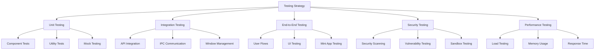

# Lahat: Testing Strategy

<!-- SUMMARY -->
This document outlines the testing strategy for Lahat, including testing approaches, tools, and best practices for ensuring application quality and reliability.
<!-- /SUMMARY -->

<!-- RELATED DOCUMENTS -->
related '../development/code_organization.md'
related '../architecture/technical_architecture.md'
related '../architecture/security.md'
<!-- /RELATED DOCUMENTS -->

## Testing Overview

A comprehensive testing strategy is essential for ensuring the quality, reliability, and security of the Lahat application. This document outlines the testing approaches, tools, and best practices that will be implemented to validate the application's functionality and performance.



## Testing Levels

### Unit Testing

Unit tests focus on testing individual components and functions in isolation to ensure they work as expected.

#### Key Areas for Unit Testing

1. **Utility Functions**
   - File operations
   - Data transformations
   - Helper functions
   - Error handling utilities

2. **Core Components**
   - Claude client methods
   - Window management functions
   - IPC handlers
   - Storage operations

3. **UI Components**
   - Input validation
   - UI state management
   - Event handlers
   - Rendering logic

#### Unit Testing Approach

```javascript
// Example unit test for a file operation utility
describe('fileOperations', () => {
  describe('writeFile', () => {
    it('should write content to a file successfully', async () => {
      // Setup
      const filePath = '/tmp/test-file.txt';
      const content = 'Test content';
      const fsWriteFileMock = jest.spyOn(fs, 'writeFile').mockResolvedValue(undefined);
      
      // Execute
      const result = await fileOperations.writeFile(filePath, content);
      
      // Verify
      expect(result.success).toBe(true);
      expect(fsWriteFileMock).toHaveBeenCalledWith(filePath, content);
      
      // Cleanup
      fsWriteFileMock.mockRestore();
    });
    
    it('should handle errors when writing to a file', async () => {
      // Setup
      const filePath = '/tmp/test-file.txt';
      const content = 'Test content';
      const error = new Error('Write error');
      const fsWriteFileMock = jest.spyOn(fs, 'writeFile').mockRejectedValue(error);
      
      // Execute
      const result = await fileOperations.writeFile(filePath, content);
      
      // Verify
      expect(result.success).toBe(false);
      expect(result.error).toBe('Write error');
      
      // Cleanup
      fsWriteFileMock.mockRestore();
    });
  });
});
```

### Integration Testing

Integration tests verify that different components work together correctly, focusing on the interactions between modules.

#### Key Areas for Integration Testing

1. **Claude API Integration**
   - API key validation
   - Prompt submission
   - Response handling
   - Streaming response processing

2. **IPC Communication**
   - Main to renderer process communication
   - Renderer to main process communication
   - Event handling and propagation
   - Error handling across processes

3. **Window Management**
   - Window creation and configuration
   - Window lifecycle management
   - Inter-window communication
   - Window state persistence

#### Integration Testing Approach

```javascript
// Example integration test for Claude API integration
describe('Claude API Integration', () => {
  let claudeClient;
  
  beforeEach(() => {
    // Setup Claude client with mock API key
    claudeClient = new ClaudeClient('test-api-key');
    
    // Mock Anthropic SDK
    jest.spyOn(claudeClient.anthropic.messages, 'create').mockImplementation(async ({ messages, stream }) => {
      if (stream) {
        // Return mock stream
        return mockStreamGenerator();
      } else {
        // Return mock response
        return {
          content: [{ type: 'text', text: '<html>Mock response</html>' }]
        };
      }
    });
  });
  
  afterEach(() => {
    jest.restoreAllMocks();
  });
  
  it('should generate app content from prompt', async () => {
    // Execute
    const response = await claudeClient.generateApp('Create a simple calculator app');
    
    // Collect stream results
    let content = '';
    for await (const chunk of response) {
      if (chunk.type === 'content_block_delta' && chunk.delta.type === 'text_delta') {
        content += chunk.delta.text || '';
      }
    }
    
    // Verify
    expect(content).toContain('<html>');
    expect(claudeClient.anthropic.messages.create).toHaveBeenCalledWith(
      expect.objectContaining({
        messages: expect.arrayContaining([
          expect.objectContaining({
            role: 'user',
            content: 'Create a simple calculator app'
          })
        ])
      })
    );
  });
});
```

### End-to-End Testing

End-to-end tests validate complete user flows and scenarios, ensuring that the application works correctly from a user's perspective.

#### Key Areas for End-to-End Testing

1. **User Flows**
   - API key setup
   - App creation process
   - App management (open, update, delete)
   - App export and sharing

2. **UI Testing**
   - Form submissions
   - Modal interactions
   - Navigation between screens
   - Error handling and feedback

3. **Mini App Testing**
   - Mini app window creation
   - Mini app functionality
   - Mini app security boundaries
   - Mini app performance

#### End-to-End Testing Approach

```javascript
// Example end-to-end test for app creation flow
describe('App Creation Flow', () => {
  let app;
  
  beforeEach(async () => {
    // Launch the application
    app = await electronApp.launch();
    
    // Set up API key (assuming it's already configured)
    await app.evaluate(({ electronAPI }) => {
      localStorage.setItem('hasSetupApiKey', 'true');
    });
    
    // Navigate to app creation
    await app.click('#create-app-button');
  });
  
  afterEach(async () => {
    // Close the application
    await app.close();
  });
  
  it('should create a mini app successfully', async () => {
    // Enter app details
    await app.fill('#app-name-input', 'Test Calculator');
    await app.fill('#app-description-input', 'A simple calculator app with basic operations');
    
    // Mock Claude API response
    await app.evaluate(() => {
      window.mockClaudeResponse = '<html>Mock calculator app</html>';
    });
    
    // Click generate button
    await app.click('#generate-button');
    
    // Wait for generation to complete
    await app.waitForSelector('.generation-complete');
    
    // Verify mini app window was created
    const windows = await app.windows();
    expect(windows.length).toBe(2); // Main window + mini app window
    
    // Verify mini app content
    const miniAppWindow = windows[1];
    const content = await miniAppWindow.content();
    expect(content).toContain('Mock calculator app');
  });
});
```

### Security Testing

Security tests focus on identifying and addressing potential security vulnerabilities in the application.

#### Key Areas for Security Testing

1. **Input Validation**
   - API key validation
   - Prompt input sanitization
   - File path validation
   - IPC message validation

2. **Sandboxing**
   - Mini app isolation
   - Resource access restrictions
   - Context isolation
   - Content Security Policy enforcement

3. **API Security**
   - Secure API key storage
   - Secure API communication
   - Error handling without information leakage
   - Rate limiting and throttling

#### Security Testing Approach

```javascript
// Example security test for mini app sandboxing
describe('Mini App Sandboxing', () => {
  let miniAppWindow;
  
  beforeEach(async () => {
    // Create a mini app window with potentially malicious content
    const maliciousContent = `
      <!DOCTYPE html>
      <html>
      <head><title>Test</title></head>
      <body>
        <script>
          // Attempt to access Node.js APIs
          try {
            const nodeAccess = typeof require === 'function';
            document.body.innerHTML = 'Node access: ' + nodeAccess;
          } catch (e) {
            document.body.innerHTML = 'Node access blocked: ' + e.message;
          }
          
          // Attempt to access Electron APIs
          try {
            const electronAccess = typeof electron !== 'undefined';
            document.body.innerHTML += '<br>Electron access: ' + electronAccess;
          } catch (e) {
            document.body.innerHTML += '<br>Electron access blocked: ' + e.message;
          }
        </script>
      </body>
      </html>
    `;
    
    miniAppWindow = await createMiniAppWindow('Security Test', maliciousContent);
  });
  
  afterEach(async () => {
    // Close the mini app window
    await miniAppWindow.close();
  });
  
  it('should prevent access to Node.js APIs', async () => {
    // Get the content of the mini app window
    const content = await miniAppWindow.webContents.executeJavaScript(
      `document.body.innerHTML`
    );
    
    // Verify that Node.js access is blocked
    expect(content).toContain('Node access blocked');
  });
  
  it('should prevent access to Electron APIs', async () => {
    // Get the content of the mini app window
    const content = await miniAppWindow.webContents.executeJavaScript(
      `document.body.innerHTML`
    );
    
    // Verify that Electron access is blocked
    expect(content).toContain('Electron access blocked');
  });
});
```

### Performance Testing

Performance tests evaluate the application's resource usage, response times, and overall efficiency.

#### Key Areas for Performance Testing

1. **Response Time**
   - App generation time
   - Window creation time
   - UI responsiveness
   - API response time

2. **Memory Usage**
   - Memory consumption during app generation
   - Memory leaks in long-running sessions
   - Memory usage with multiple mini apps
   - Resource cleanup after window closure

3. **CPU Usage**
   - CPU usage during app generation
   - Background process efficiency
   - Rendering performance
   - Event handling efficiency

#### Performance Testing Approach

```javascript
// Example performance test for memory usage
describe('Memory Usage', () => {
  it('should not leak memory when creating and closing mini apps', async () => {
    // Record initial memory usage
    const initialMemory = process.memoryUsage();
    
    // Create and close multiple mini apps
    for (let i = 0; i < 10; i++) {
      // Create mini app
      const miniAppWindow = await createMiniAppWindow(`Test App ${i}`, '<html><body>Test</body></html>');
      
      // Wait for window to load
      await new Promise(resolve => setTimeout(resolve, 500));
      
      // Close mini app
      await miniAppWindow.close();
      
      // Wait for cleanup
      await new Promise(resolve => setTimeout(resolve, 500));
    }
    
    // Force garbage collection if possible
    if (global.gc) {
      global.gc();
    }
    
    // Record final memory usage
    const finalMemory = process.memoryUsage();
    
    // Verify that memory usage hasn't increased significantly
    // Allow for some increase, but not more than 10%
    expect(finalMemory.heapUsed).toBeLessThan(initialMemory.heapUsed * 1.1);
  });
});
```

## Testing Tools and Framework

### Unit and Integration Testing

- **Jest**: Primary testing framework for unit and integration tests
- **Sinon**: For creating spies, stubs, and mocks
- **Chai**: For assertions with a more expressive syntax
- **Proxyquire**: For mocking module dependencies

### End-to-End Testing

- **Spectron**: For testing Electron applications
- **Playwright**: For UI testing and automation
- **Mocha**: For organizing end-to-end test suites
- **Electron Test Utils**: For interacting with Electron-specific features

### Security Testing

- **OWASP ZAP**: For security scanning
- **Snyk**: For dependency vulnerability scanning
- **ESLint Security Plugin**: For static security analysis
- **Content Security Policy Evaluator**: For CSP validation

### Performance Testing

- **Electron DevTools Extensions**: For profiling and monitoring
- **Node.js Performance Hooks**: For measuring execution time
- **Lighthouse**: For measuring UI performance
- **Chrome DevTools Protocol**: For detailed performance analysis

## Test Environment Setup

### Local Development Environment

```javascript
// jest.config.js
module.exports = {
  testEnvironment: 'node',
  setupFilesAfterEnv: ['./jest.setup.js'],
  testMatch: ['**/__tests__/**/*.js', '**/?(*.)+(spec|test).js'],
  collectCoverage: true,
  collectCoverageFrom: [
    'src/**/*.js',
    '!src/node_modules/**',
    '!**/node_modules/**'
  ],
  coverageReporters: ['text', 'lcov'],
  coverageThreshold: {
    global: {
      statements: 80,
      branches: 70,
      functions: 80,
      lines: 80
    }
  }
};

// jest.setup.js
jest.setTimeout(10000); // 10 seconds

// Set up environment variables
process.env.NODE_ENV = 'test';
process.env.ELECTRON_IS_DEV = '0';

// Mock Electron
jest.mock('electron', () => ({
  app: {
    getPath: jest.fn().mockImplementation((name) => {
      if (name === 'userData') return '/tmp/test-user-data';
      if (name === 'temp') return '/tmp';
      return '/tmp';
    }),
    on: jest.fn(),
    whenReady: jest.fn().mockResolvedValue(undefined)
  },
  BrowserWindow: jest.fn().mockImplementation(() => ({
    loadFile: jest.fn().mockResolvedValue(undefined),
    loadURL: jest.fn().mockResolvedValue(undefined),
    webContents: {
      openDevTools: jest.fn(),
      on: jest.fn()
    },
    on: jest.fn(),
    show: jest.fn(),
    focus: jest.fn(),
    moveTop: jest.fn(),
    close: jest.fn()
  })),
  ipcMain: {
    handle: jest.fn(),
    on: jest.fn()
  },
  ipcRenderer: {
    invoke: jest.fn(),
    on: jest.fn(),
    send: jest.fn()
  },
  contextBridge: {
    exposeInMainWorld: jest.fn()
  }
}));
```

### Continuous Integration Environment

```yaml
# .github/workflows/test.yml
name: Test

on:
  push:
    branches: [ main ]
  pull_request:
    branches: [ main ]

jobs:
  test:
    runs-on: ${{ matrix.os }}
    strategy:
      matrix:
        os: [ubuntu-latest, windows-latest, macos-latest]
        node-version: [16.x]

    steps:
    - uses: actions/checkout@v2
    
    - name: Use Node.js ${{ matrix.node-version }}
      uses: actions/setup-node@v2
      with:
        node-version: ${{ matrix.node-version }}
        cache: 'npm'
    
    - name: Install dependencies
      run: npm ci
    
    - name: Run linter
      run: npm run lint
    
    - name: Run unit tests
      run: npm run test:unit
    
    - name: Run integration tests
      run: npm run test:integration
    
    - name: Run E2E tests
      run: npm run test:e2e
    
    - name: Upload coverage to Codecov
      uses: codecov/codecov-action@v2
```

## Test Data Management

### Mock Data

- **API Responses**: Mock Claude API responses for different prompts
- **File System**: Mock file system for testing file operations
- **User Input**: Mock user input for testing form validation
- **Window State**: Mock window state for testing window management

### Test Fixtures

- **HTML Templates**: Sample HTML templates for testing mini app generation
- **API Keys**: Test API keys for testing authentication
- **App Metadata**: Sample app metadata for testing app management
- **User Preferences**: Sample user preferences for testing settings

## Testing Best Practices

### Code Coverage

- Aim for at least 80% code coverage for critical modules
- Focus on testing complex logic and error handling
- Use coverage reports to identify untested code paths
- Don't chase 100% coverage at the expense of meaningful tests

### Test Organization

- Group tests by module and functionality
- Use descriptive test names that explain the expected behavior
- Follow the Arrange-Act-Assert pattern for test structure
- Keep tests independent and isolated from each other

### Mocking and Stubbing

- Mock external dependencies to isolate the code being tested
- Use stubs to provide controlled responses for testing specific scenarios
- Avoid excessive mocking that makes tests brittle
- Reset mocks and stubs after each test to prevent test pollution

### Continuous Integration

- Run tests automatically on every pull request
- Block merges if tests fail
- Run tests on multiple platforms (Windows, macOS, Linux)
- Generate and publish test coverage reports

## Test Automation Strategy

### Automated Test Execution

- Run unit and integration tests on every commit
- Run end-to-end tests on pull requests and before releases
- Run security and performance tests on a scheduled basis
- Generate test reports for review and analysis

### Test-Driven Development

- Write tests before implementing new features
- Use tests to define the expected behavior
- Refactor code with confidence using tests as a safety net
- Continuously improve test coverage and quality

### Regression Testing

- Maintain a suite of regression tests for critical functionality
- Run regression tests before releases
- Automate regression testing as much as possible
- Track and analyze test results over time

## Conclusion

A comprehensive testing strategy is essential for ensuring the quality, reliability, and security of the Lahat application. By implementing the testing approaches outlined in this document, we can:

1. **Ensure Functionality**: Verify that the application works as expected
2. **Prevent Regressions**: Catch issues before they affect users
3. **Improve Security**: Identify and address security vulnerabilities
4. **Optimize Performance**: Ensure the application is responsive and efficient
5. **Enable Refactoring**: Make changes with confidence

The testing strategy will evolve as the application grows and new features are added, but the core principles of thorough testing at all levels will remain constant.
