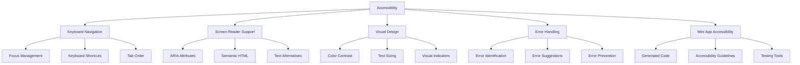

# Lahat: Accessibility

<!-- SUMMARY -->
This document outlines the accessibility considerations, standards, and implementation strategies for ensuring Lahat is usable by people with diverse abilities.
<!-- /SUMMARY -->

<!-- RELATED DOCUMENTS -->
related '../user_experience/user_experience.md'
related '../user_experience/app_creation_flow.md'
related '../development/testing_strategy.md'
<!-- /RELATED DOCUMENTS -->

## Accessibility Overview

Ensuring that Lahat is accessible to users with diverse abilities is a core commitment of the project. This document outlines the accessibility standards, implementation strategies, and testing methodologies that will be used to create an inclusive user experience.



## Accessibility Standards

Lahat aims to conform to the following accessibility standards:

1. **Web Content Accessibility Guidelines (WCAG) 2.1 Level AA**
   - Perceivable: Information and user interface components must be presentable to users in ways they can perceive
   - Operable: User interface components and navigation must be operable
   - Understandable: Information and the operation of the user interface must be understandable
   - Robust: Content must be robust enough to be interpreted by a wide variety of user agents

2. **Electron Accessibility Guidelines**
   - Follow Electron's accessibility documentation and best practices
   - Implement proper keyboard navigation and focus management
   - Ensure compatibility with screen readers and assistive technologies

3. **Platform-Specific Guidelines**
   - macOS: Follow Apple's accessibility guidelines
   - Windows: Follow Microsoft's accessibility guidelines
   - Linux: Follow GNOME/KDE accessibility guidelines as appropriate

## Key Accessibility Features

### Keyboard Navigation

Ensuring that all functionality is accessible via keyboard is essential for users who cannot use a mouse or other pointing device.

#### Focus Management

```javascript
// Example focus management implementation
function setupFocusManagement() {
  // Track the currently focused element
  let currentFocus = null;
  
  // Listen for focus events
  document.addEventListener('focus', (event) => {
    currentFocus = event.target;
    
    // Add a visible focus indicator
    if (currentFocus.classList) {
      currentFocus.classList.add('focus-visible');
    }
  }, true);
  
  // Listen for blur events
  document.addEventListener('blur', (event) => {
    // Remove the visible focus indicator
    if (event.target.classList) {
      event.target.classList.remove('focus-visible');
    }
  }, true);
  
  // Restore focus when a modal is closed
  function restoreFocus() {
    if (currentFocus && document.contains(currentFocus)) {
      currentFocus.focus();
    } else {
      // Focus on the first focusable element if the previous element is no longer available
      const firstFocusable = document.querySelector('button, [href], input, select, textarea, [tabindex]:not([tabindex="-1"])');
      if (firstFocusable) {
        firstFocusable.focus();
      }
    }
  }
  
  // Example usage: restore focus when a modal is closed
  document.querySelectorAll('.modal-close-button').forEach(button => {
    button.addEventListener('click', () => {
      const modal = button.closest('.modal');
      modal.classList.add('hidden');
      restoreFocus();
    });
  });
}
```

#### Keyboard Shortcuts

```javascript
// Example keyboard shortcuts implementation
function setupKeyboardShortcuts() {
  document.addEventListener('keydown', (event) => {
    // Check if the user is typing in an input field
    const isTyping = ['INPUT', 'TEXTAREA', 'SELECT'].includes(document.activeElement.tagName);
    
    // Only handle shortcuts when not typing
    if (!isTyping) {
      // Ctrl+N: Create new app
      if (event.ctrlKey && event.key === 'n') {
        event.preventDefault();
        document.getElementById('create-app-button').click();
      }
      
      // Ctrl+O: Open selected app
      if (event.ctrlKey && event.key === 'o') {
        event.preventDefault();
        const selectedApp = document.querySelector('.app-card.selected');
        if (selectedApp) {
          selectedApp.querySelector('.open-app-button').click();
        }
      }
      
      // Ctrl+S: Save/export app
      if (event.ctrlKey && event.key === 's') {
        event.preventDefault();
        const selectedApp = document.querySelector('.app-card.selected');
        if (selectedApp) {
          selectedApp.querySelector('.export-app-button').click();
        }
      }
      
      // Escape: Close modal
      if (event.key === 'Escape') {
        const visibleModal = document.querySelector('.modal:not(.hidden)');
        if (visibleModal) {
          visibleModal.querySelector('.modal-close-button').click();
        }
      }
    }
  });
  
  // Add keyboard shortcut hints to tooltips
  document.getElementById('create-app-button').setAttribute('title', 'Create New App (Ctrl+N)');
}
```

#### Tab Order

```html
<!-- Example HTML with proper tab order -->
<div class="app-creation-form">
  <h2 id="form-title">Create a Mini App</h2>
  
  <div class="form-group">
    <label for="app-name">App Name</label>
    <input type="text" id="app-name" tabindex="1" aria-required="true">
  </div>
  
  <div class="form-group">
    <label for="app-description">Description</label>
    <textarea id="app-description" tabindex="2" aria-required="true"></textarea>
  </div>
  
  <div class="button-group">
    <button type="button" id="cancel-button" tabindex="4">Cancel</button>
    <button type="button" id="generate-button" tabindex="3">Generate App</button>
  </div>
</div>
```

### Screen Reader Support

Ensuring that all content and functionality is accessible to screen reader users is essential for users with visual impairments.

#### ARIA Attributes

```html
<!-- Example HTML with ARIA attributes -->
<div class="app-gallery" role="region" aria-labelledby="gallery-title">
  <h2 id="gallery-title">Your Mini Apps</h2>
  
  <div class="app-filters" role="group" aria-labelledby="filter-title">
    <span id="filter-title" class="visually-hidden">Filter Options</span>
    <button aria-pressed="true" class="filter-button active">All</button>
    <button aria-pressed="false" class="filter-button">Recent</button>
    <button aria-pressed="false" class="filter-button">Favorites</button>
  </div>
  
  <div class="app-list" role="list" aria-label="Mini Apps">
    <div class="app-card" role="listitem">
      <h3 id="app-1-title">Calculator</h3>
      <div class="app-actions">
        <button aria-label="Open Calculator" aria-describedby="app-1-title">Open</button>
        <button aria-label="Edit Calculator" aria-describedby="app-1-title">Edit</button>
        <button aria-label="Delete Calculator" aria-describedby="app-1-title">Delete</button>
      </div>
    </div>
    <!-- More app cards... -->
  </div>
  
  <div aria-live="polite" class="status-message" role="status"></div>
</div>
```

#### Semantic HTML

```html
<!-- Example of semantic HTML -->
<header>
  <h1>Lahat</h1>
  <nav>
    <ul>
      <li><a href="#gallery">App Gallery</a></li>
      <li><a href="#create">Create App</a></li>
      <li><a href="#settings">Settings</a></li>
    </ul>
  </nav>
</header>

<main>
  <section id="gallery" aria-labelledby="gallery-heading">
    <h2 id="gallery-heading">Your Mini Apps</h2>
    <!-- App gallery content -->
  </section>
</main>

<footer>
  <p>&copy; 2025 Lahat</p>
</footer>
```

#### Text Alternatives

```html
<!-- Example of text alternatives -->
<button class="create-app-button">
  <svg aria-hidden="true" focusable="false" class="icon">
    <use xlink:href="#icon-plus"></use>
  </svg>
  <span>Create New App</span>
</button>


<div class="loading-indicator" aria-hidden="true">
  <div class="spinner"></div>
</div>
<span class="visually-hidden" role="status">Loading your app, please wait...</span>
```

### Visual Design

Ensuring that the visual design is accessible to users with visual impairments, color blindness, or other visual disabilities.

#### Color Contrast

```css
/* Example CSS with proper color contrast */
:root {
  /* Primary colors with proper contrast ratios */
  --primary-color: #0056b3; /* Passes AA against white */
  --primary-text: #ffffff;
  
  /* Secondary colors */
  --secondary-color: #6c757d; /* Passes AA against white */
  --secondary-text: #ffffff;
  
  /* Alert colors */
  --error-color: #dc3545; /* Passes AA against white */
  --error-text: #ffffff;
  --success-color: #28a745; /* Passes AA against white */
  --success-text: #ffffff;
  --warning-color: #ffc107; /* Fails AA against white, use dark text */
  --warning-text: #212529;
  
  /* Background and text colors */
  --background-color: #ffffff;
  --text-color: #212529; /* Passes AAA against white */
  --light-text: #6c757d; /* Passes AA against white */
}

/* Ensure links are distinguishable */
a {
  color: var(--primary-color);
  text-decoration: underline;
}

/* Focus indicators */
:focus {
  outline: 3px solid var(--primary-color);
  outline-offset: 2px;
}

/* High contrast mode support */
@media (forced-colors: active) {
  :focus {
    outline: 3px solid CanvasText;
  }
  
  .button {
    border: 1px solid CanvasText;
  }
}
```

#### Text Sizing

```css
/* Example CSS with proper text sizing */
:root {
  /* Base font size (user can override) */
  font-size: 16px;
}

/* Use relative units for text */
body {
  font-size: 1rem;
  line-height: 1.5;
}

h1 {
  font-size: 2rem;
  margin-bottom: 1rem;
}

h2 {
  font-size: 1.5rem;
  margin-bottom: 0.75rem;
}

/* Ensure text can be resized */
.container {
  max-width: 1200px;
  width: 90%;
  margin: 0 auto;
}

/* Responsive text for small screens */
@media (max-width: 768px) {
  h1 {
    font-size: 1.75rem;
  }
  
  h2 {
    font-size: 1.25rem;
  }
}
```

#### Visual Indicators

```css
/* Example CSS with proper visual indicators */
/* Focus indicators */
.focus-visible {
  outline: 3px solid #0056b3;
  outline-offset: 2px;
}

/* State indicators */
.button {
  background-color: #0056b3;
  color: white;
  padding: 0.5rem 1rem;
  border: none;
  border-radius: 4px;
}

.button:hover {
  background-color: #004494;
  text-decoration: underline;
}

.button:active {
  background-color: #003166;
}

.button.disabled {
  background-color: #6c757d;
  cursor: not-allowed;
  opacity: 0.65;
}

/* Error states */
.input-error {
  border-color: #dc3545;
}

.error-message {
  color: #dc3545;
  font-weight: bold;
  display: flex;
  align-items: center;
}

.error-message::before {
  content: "⚠️";
  margin-right: 0.5rem;
}
```

### Error Handling

Ensuring that errors are clearly identified, explained, and can be resolved by all users.

#### Error Identification

```html
<!-- Example HTML with proper error identification -->
<div class="form-group">
  <label for="api-key">API Key</label>
  <input type="text" id="api-key" aria-describedby="api-key-error" aria-invalid="true" class="input-error">
  <div id="api-key-error" class="error-message" role="alert">
    API key is required. Please enter a valid API key.
  </div>
</div>
```

#### Error Suggestions

```javascript
// Example error suggestions implementation
function validateApiKey(apiKey) {
  if (!apiKey) {
    return {
      valid: false,
      error: 'API key is required. Please enter a valid API key.',
      suggestion: 'You can find your API key in the Claude dashboard.'
    };
  }
  
  if (apiKey.length < 32) {
    return {
      valid: false,
      error: 'API key is too short. API keys are typically at least 32 characters long.',
      suggestion: 'Check that you\'ve copied the entire API key from the Claude dashboard.'
    };
  }
  
  if (!/^sk-/.test(apiKey)) {
    return {
      valid: false,
      error: 'API key format is invalid. API keys typically start with "sk-".',
      suggestion: 'Make sure you\'re using a Claude API key, not another service\'s key.'
    };
  }
  
  return {
    valid: true
  };
}

function showApiKeyError(result) {
  const errorElement = document.getElementById('api-key-error');
  const suggestionElement = document.getElementById('api-key-suggestion');
  
  if (!result.valid) {
    // Show error message
    errorElement.textContent = result.error;
    errorElement.classList.remove('hidden');
    
    // Show suggestion if available
    if (result.suggestion) {
      suggestionElement.textContent = result.suggestion;
      suggestionElement.classList.remove('hidden');
    } else {
      suggestionElement.classList.add('hidden');
    }
    
    // Mark input as invalid
    document.getElementById('api-key').setAttribute('aria-invalid', 'true');
    document.getElementById('api-key').classList.add('input-error');
    
    // Focus on the input
    document.getElementById('api-key').focus();
  } else {
    // Hide error and suggestion
    errorElement.classList.add('hidden');
    suggestionElement.classList.add('hidden');
    
    // Mark input as valid
    document.getElementById('api-key').setAttribute('aria-invalid', 'false');
    document.getElementById('api-key').classList.remove('input-error');
  }
}
```

#### Error Prevention

```javascript
// Example error prevention implementation
function setupErrorPrevention() {
  // Prevent accidental deletion
  document.querySelectorAll('.delete-app-button').forEach(button => {
    button.addEventListener('click', (event) => {
      event.preventDefault();
      
      const appName = button.getAttribute('data-app-name');
      
      // Show confirmation dialog
      const confirmed = confirm(`Are you sure you want to delete "${appName}"? This action cannot be undone.`);
      
      if (confirmed) {
        // Proceed with deletion
        deleteApp(button.getAttribute('data-app-id'));
      }
    });
  });
  
  // Form validation before submission
  document.getElementById('app-creation-form').addEventListener('submit', (event) => {
    event.preventDefault();
    
    const appName = document.getElementById('app-name').value.trim();
    const appDescription = document.getElementById('app-description').value.trim();
    
    let isValid = true;
    
    // Validate app name
    if (!appName) {
      document.getElementById('app-name-error').textContent = 'App name is required.';
      document.getElementById('app-name-error').classList.remove('hidden');
      document.getElementById('app-name').setAttribute('aria-invalid', 'true');
      isValid = false;
    } else {
      document.getElementById('app-name-error').classList.add('hidden');
      document.getElementById('app-name').setAttribute('aria-invalid', 'false');
    }
    
    // Validate app description
    if (!appDescription) {
      document.getElementById('app-description-error').textContent = 'App description is required.';
      document.getElementById('app-description-error').classList.remove('hidden');
      document.getElementById('app-description').setAttribute('aria-invalid', 'true');
      isValid = false;
    } else {
      document.getElementById('app-description-error').classList.add('hidden');
      document.getElementById('app-description').setAttribute('aria-invalid', 'false');
    }
    
    if (isValid) {
      // Submit the form
      generateApp(appName, appDescription);
    }
  });
}
```

### Mini App Accessibility

Ensuring that generated mini apps are accessible to all users.

#### Generated Code

```javascript
// Example system prompt addition for accessibility
this.systemPrompt += `
ACCESSIBILITY REQUIREMENTS:
1. Ensure all interactive elements are keyboard accessible with proper focus states.
2. Use semantic HTML elements (e.g., <button>, <nav>, <header>, <main>, <footer>).
3. Include proper ARIA attributes where needed (e.g., aria-label, aria-expanded, aria-hidden).
4. Maintain color contrast ratios of at least 4.5:1 for normal text and 3:1 for large text.
5. Provide text alternatives for non-text content (e.g., alt attributes for images).
6. Ensure form elements have associated labels.
7. Use proper heading hierarchy (h1-h6) to structure content.
8. Ensure error messages are clear and accessible to screen readers.
9. Make sure focus order is logical and follows the visual layout.
10. Provide sufficient color and visual cues that don't rely solely on color.
`;
```

#### Accessibility Guidelines

```javascript
// Example accessibility guidelines for mini app generation
const accessibilityGuidelines = {
  semantic: [
    'Use semantic HTML elements like <header>, <nav>, <main>, <section>, <article>, <footer>',
    'Use <button> for clickable controls, not <div> or <span>',
    'Use <a> for navigation links, not <div> or <span>',
    'Use proper heading hierarchy (h1-h6) to structure content',
    'Use <label> elements for form controls'
  ],
  aria: [
    'Add aria-label to elements without visible text',
    'Use aria-expanded for expandable elements',
    'Use aria-hidden="true" for decorative elements',
    'Use aria-live regions for dynamic content',
    'Use role attributes appropriately'
  ],
  keyboard: [
    'Ensure all interactive elements are keyboard accessible',
    'Provide visible focus indicators',
    'Maintain a logical tab order',
    'Implement keyboard shortcuts for common actions',
    'Ensure custom controls can be operated with keyboard'
  ],
  visual: [
    'Maintain color contrast ratios of at least 4.5:1 for normal text',
    'Don\'t rely solely on color to convey information',
    'Ensure text can be resized up to 200% without loss of content',
    'Provide sufficient spacing between elements',
    'Use consistent visual design for similar elements'
  ]
};

// Add accessibility guidelines to the prompt
function addAccessibilityGuidelinesToPrompt(prompt, guidelines) {
  let accessibilityPrompt = '\n\nACCESSIBILITY GUIDELINES:\n';
  
  for (const [category, items] of Object.entries(guidelines)) {
    accessibilityPrompt += `\n${category.toUpperCase()}:\n`;
    items.forEach(item => {
      accessibilityPrompt += `- ${item}\n`;
    });
  }
  
  return prompt + accessibilityPrompt;
}
```

#### Testing Tools

```javascript
// Example accessibility testing for generated mini apps
async function testMiniAppAccessibility(htmlContent) {
  // Create a temporary iframe to load the mini app
  const iframe = document.createElement('iframe');
  iframe.style.display = 'none';
  document.body.appendChild(iframe);
  
  // Write the HTML content to the iframe
  iframe.contentDocument.write(htmlContent);
  iframe.contentDocument.close();
  
  // Wait for the iframe to load
  await new Promise(resolve => {
    iframe.onload = resolve;
  });
  
  // Run accessibility tests
  const axeCore = await import('axe-core');
  const results = await axeCore.run(iframe.contentDocument);
  
  // Clean up
  document.body.removeChild(iframe);
  
  // Return the results
  return {
    violations: results.violations,
    passes: results.passes,
    incomplete: results.incomplete,
    inapplicable: results.inapplicable
  };
}

// Example usage
async function checkAndImproveAccessibility(htmlContent) {
  const results = await testMiniAppAccessibility(htmlContent);
  
  if (results.violations.length > 0) {
    console.log(`Found ${results.violations.length} accessibility violations`);
    
    // Generate suggestions for fixing violations
    const suggestions = results.violations.map(violation => {
      return {
        id: violation.id,
        impact: violation.impact,
        description: violation.help,
        elements: violation.nodes.map(node => node.html),
        suggestions: violation.nodes.map(node => node.failureSummary)
      };
    });
    
    // Use Claude to fix the violations
    const fixedHtml = await fixAccessibilityViolations(htmlContent, suggestions);
    return fixedHtml;
  }
  
  return htmlContent;
}
```

## Implementation Strategy

### Phase 1: Foundation

1. **Establish Accessibility Guidelines**
   - Document accessibility requirements for the application
   - Create accessibility checklists for developers
   - Integrate accessibility into the development workflow

2. **Implement Basic Accessibility Features**
   - Ensure keyboard navigation for all interactive elements
   - Add proper focus management
   - Use semantic HTML throughout the application
   - Implement ARIA attributes where needed

3. **Set Up Accessibility Testing**
   - Integrate automated accessibility testing tools
   - Create test cases for common accessibility issues
   - Establish a process for manual accessibility testing

### Phase 2: Enhancement

1. **Improve Screen Reader Support**
   - Add more descriptive ARIA labels
   - Ensure proper heading structure
   - Implement live regions for dynamic content
   - Test with multiple screen readers

2. **Enhance Keyboard Navigation**
   - Add keyboard shortcuts for common actions
   - Improve focus indicators
   - Implement skip links for navigation
   - Ensure proper tab order

3. **Optimize Visual Design**
   - Improve color contrast
   - Add visual indicators for states
   - Ensure text is resizable
   - Support high contrast mode

### Phase 3: Advanced Features

1. **Implement Accessibility Preferences**
   - Add user preferences for accessibility features
   - Allow customization of keyboard shortcuts
   - Provide options for text size and contrast
   - Support system accessibility settings

2. **Enhance Mini App Accessibility**
   - Improve accessibility of generated mini apps
   - Add accessibility validation for generated code
   - Provide accessibility suggestions for mini apps
   - Create accessible templates for common app types

3. **Conduct User Testing**
   - Test with users who have disabilities
   - Gather feedback on accessibility features
   - Identify areas for improvement
   - Implement changes based on user feedback

## Testing and Validation

### Automated Testing

```javascript
// Example automated accessibility testing
describe('Accessibility', () => {
  it('should have no accessibility violations', async () => {
    // Load the application
    await page.goto('http://localhost:3000');
    
    // Run axe-core
    const violations = await page.evaluate(() => {
      return new Promise(resolve => {
        axe.run(document, { runOnly: ['wcag2a', 'wcag2aa'] }, (err, results) => {
          resolve(err || results.violations);
        });
      });
    });
    
    // Output violations for debugging
    if (violations.length > 0) {
      console.log('Accessibility violations:', JSON.stringify(violations, null, 2));
    }
    
    // Expect no violations
    expect(violations.length).toBe(0);
  });
  
  it('should be navigable by keyboard', async () => {
    // Load the application
    await page.goto('http://localhost:3000');
    
    // Press Tab to focus on the first element
    await page.keyboard.press('Tab');
    
    // Get the focused element
    const focusedElement = await page.evaluate(() => {
      const el = document.activeElement;
      return {
        tagName: el.tagName,
        id: el.id,
        className: el.className,
        textContent: el.textContent
      };
    });
    
    // Expect the first focusable element to be focused
    expect(focusedElement.tagName).not.toBe('BODY');
    
    // Tab through all focusable elements
    const focusableElements = await page.evaluate(() => {
      const elements = Array.from(document.querySelectorAll(
        'a, button, input, select, textarea, [tabindex]:not([tabindex="-1"])'
      ));
      return elements.map(el => ({
        tagName: el.tagName,
        id: el.id,
        className: el.className,
        textContent: el.textContent
      }));
    });
    
    // Press Tab for each focusable element
    for (let i = 0; i < focusableElements.length; i++) {
      await page.keyboard.press('Tab');
      
      // Get the currently focused element
      const currentFocused = await page.evaluate(() => {
        const el = document.activeElement;
        return {
          tagName: el.tagName,
          id: el.id,
          className: el.className,
          textContent: el.textContent
        };
      });
      
      // Expect a different element to be focused each time
      expect(currentFocused.tagName).not.toBe('BODY');
    }
  });
});
```

### Manual Testing

1. **Keyboard Navigation Testing**
   - Test all functionality using only the keyboard
   - Verify that focus is visible at all times
   - Check that tab order is logical
   - Test keyboard shortcuts

2. **Screen Reader Testing**
   - Test with multiple screen readers (NVDA, JAWS, VoiceOver)
   - Verify that all content is announced correctly
   - Check that dynamic content updates are announced
   - Test form validation and error messages

3. **Visual Testing**
   - Test with different text sizes
   - Verify color contrast meets WCAG requirements
   - Test with high contrast mode
   - Check that the application is usable at different zoom levels

4. **Cognitive Testing**
   - Verify that instructions are clear and concise
   - Check that error messages are helpful
   - Test that the application is predictable and consistent
   - Ensure that time-dependent features can be adjusted or disabled

## Conclusion

Accessibility is a core commitment of the Lahat project. By implementing the strategies outlined in this document, we can ensure that Lahat is usable by people with diverse abilities. This includes:

1. **Keyboard Navigation**: Ensuring that all functionality is accessible via keyboard
2. **Screen Reader Support**: Making all content and functionality accessible to screen reader users
3. **Visual Design**: Creating a visual design that is accessible to users with visual impairments
4. **Error Handling**: Ensuring that errors are clearly identified, explained, and can be resolved by all users
5. **Mini App Accessibility**: Ensuring that generated mini apps are accessible to all users

By prioritizing accessibility from the beginning of the development process, we can create an application that is inclusive and usable by everyone.
