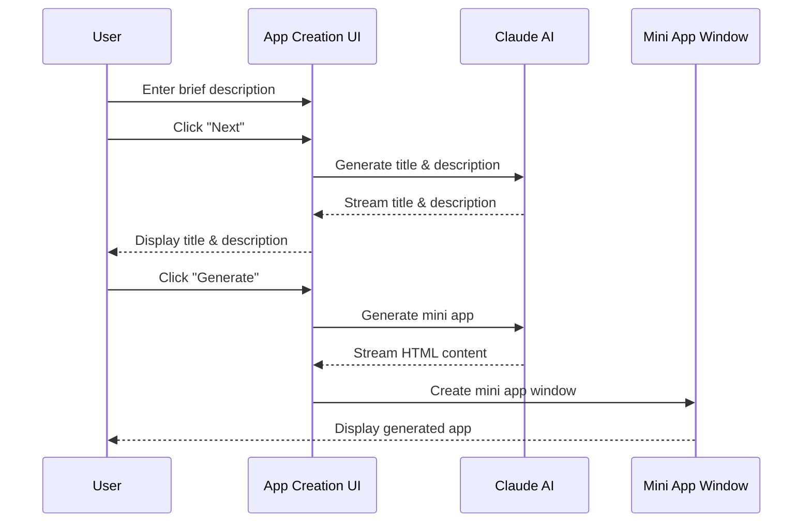

# Lahat: App Creation Flow

<!-- SUMMARY -->
This document details the app creation flow in Lahat, including the 2-step wizard process, UI components, and user interactions for generating mini applications.
<!-- /SUMMARY -->

<!-- RELATED DOCUMENTS -->
related '../architecture/mini_app_generation_sequence.md'
related '../development/prompt_engineering.md'
related '../user_experience/user_experience.md'
<!-- /RELATED DOCUMENTS -->

## Overview

The app creation process in Lahat follows a 2-step wizard pattern that leverages Claude AI to generate both the title and detailed description based on a simple user input, followed by the generation of the complete mini application.

## User Flow



## Step 1: Initial Input

In this step, the user provides a brief description of what they want to create:


### UI Components
- Header: "What would you like?"
- Text input field for the user's description (e.g., "I want tetris")
- "Next" button to proceed to Step 2

### User Interactions
1. User enters a brief description of the desired app
2. User clicks the "Next" button
3. The system shows a loading indicator while generating the title and description
4. The UI transitions to Step 2 when generation is complete

### Implementation Details
```javascript
// From renderers/app-creation.js
nextButton.addEventListener('click', async () => {
  currentInput = userInput.value.trim();
  
  if (!currentInput) {
    alert('Please enter what you would like to create.');
    return;
  }
  
  // Hide the button container
  const buttonContainer = step1.querySelector('.button-container');
  buttonContainer.classList.add('hidden');
  
  // Show loading indicator
  generationStatus.classList.remove('hidden');
  generationStatusText.textContent = 'Generating title and description...';
  
  try {
    // Generate title and description
    const result = await window.electronAPI.generateTitleAndDescription({
      input: currentInput
    });
    
    if (result.success) {
      // The UI has already been updated via chunks
      // Just store the final values
      currentTitle = result.title;
      currentDescription = result.description;
      
      // Display the user input
      userInputDisplay.textContent = currentInput;
      
      // Hide step 1, show step 2
      step1.classList.remove('active');
      step2.classList.add('active');
    } else {
      alert(`Error generating title and description: ${result.error}`);
      // Show the button container again if there was an error
      buttonContainer.classList.remove('hidden');
    }
  } catch (error) {
    alert(`Error: ${error.message}`);
    // Show the button container again if there was an error
    buttonContainer.classList.remove('hidden');
  } finally {
    // Hide loading indicator
    generationStatus.classList.add('hidden');
  }
});
```

## Step 2: Preview and Generate

In this step, the user reviews the generated title and description and initiates the app generation:


### UI Components
- Header: "What would you like?"
- Display of the user's original input
- "We will build..." section
- Generated title (prominently displayed)
- Generated description paragraph
- "Generate" button to create the app

### User Interactions
1. User reviews the generated title and description
2. User clicks the "Generate" button
3. The system shows a loading indicator while generating the app
4. The app creation window closes when generation is complete
5. The generated mini app opens in a new window

### Implementation Details
```javascript
// From renderers/app-creation.js
generateButton.addEventListener('click', async () => {
  // Hide the button container
  const buttonContainer = document.querySelector('.button-container');
  buttonContainer.classList.add('hidden');
  
  // Hide the title/description preview section
  titleDescriptionPreview.classList.add('hidden');
  
  // Show loading indicator
  generationStatus.classList.remove('hidden');
  generationStatusText.textContent = 'Generating mini app...';
  
  try {
    const result = await window.electronAPI.generateMiniApp({
      appName: currentTitle,
      prompt: currentDescription
    });
    
    if (result.success) {
      // Notify main window to refresh app list
      window.electronAPI.notifyAppUpdated();
      
      // Close this window after a short delay
      setTimeout(() => {
        window.electronAPI.closeCurrentWindow();
      }, 2000);
    } else {
      alert(`Error generating mini app: ${result.error}`);
      // Show the button container again if there was an error
      buttonContainer.classList.remove('hidden');
      // Show the title/description preview section again
      titleDescriptionPreview.classList.remove('hidden');
    }
  } catch (error) {
    alert(`Error: ${error.message}`);
    // Show the button container again if there was an error
    buttonContainer.classList.remove('hidden');
    // Show the title/description preview section again
    titleDescriptionPreview.classList.remove('hidden');
  } finally {
    // Hide loading indicator
    generationStatus.classList.add('hidden');
  }
});
```

## Title and Description Generation

The title and description are generated using Claude AI based on the user's input:

### Generation Process
1. User input is sent to the `titleDescriptionGenerator.js` module
2. The module constructs a prompt for Claude that requests:
   - A concise, creative title (2-5 words)
   - An expanded description paragraph
3. Claude generates the title and description
4. The response is streamed back to the UI in real-time
5. The UI updates as chunks of the response are received

### Prompt Engineering
The prompt used for title and description generation is carefully crafted to produce high-quality results:

```javascript
// From modules/utils/titleDescriptionGenerator.js
const prompt = `Based on the following user input, provide:
1. A concise, creative, and descriptive title (2-5 words)
2. An expanded description paragraph

For the description paragraph: Rephrase and expand the input into a single, self-contained paragraph that clearly defines the purpose and functionality of the mini-application. The response should be declarative, avoiding direct reference to the user and eliminating any additional explanations or commentary.

For example:
• Input: "I want Tetris."
  Title: "Block Cascade"
  Description: "A game application that replicates the classic mechanics of Tetris, where falling blocks must be arranged to form complete lines. The game features intuitive controls, real-time scoring, increasing difficulty levels, and smooth animations to enhance the gameplay experience."

Format your response as:
TITLE: [your title here]
DESCRIPTION: [your description here]

User input: "${input}"`;
```

## Mini App Generation

After the user confirms the title and description, the mini app is generated:

### Generation Process
1. The title and description are sent to the Claude API
2. Claude generates a complete HTML/CSS/JavaScript application
3. The response is streamed back to the UI
4. The generated code is saved to a file
5. A new window is created to display the mini app

### Window Creation
The mini app is displayed in a new window with appropriate security settings:

```javascript
// From modules/miniAppManager.js
export async function createMiniAppWindow(appName, htmlContent, filePath, conversationId) {
  try {
    // Create a temporary file for the HTML content if no filePath is provided
    let tempFilePath = filePath;
    if (!tempFilePath) {
      const tempResult = await fileOperations.createTempFile(htmlContent);
      if (!tempResult.success) {
        return { 
          success: false, 
          error: tempResult.error 
        };
      }
      tempFilePath = tempResult.filePath;
    } else {
      // If filePath is provided, ensure the HTML content is written to it
      const writeResult = await fileOperations.writeFile(tempFilePath, htmlContent);
      if (!writeResult.success) {
        return { 
          success: false, 
          error: writeResult.error 
        };
      }
    }
    
    // Create the window using the window manager
    const win = windowManager.createMiniAppWindow(appName, htmlContent, filePath, conversationId);
    
    // Load the file into the window
    win.loadFile(tempFilePath);
    
    // Store the window reference
    if (conversationId) {
      miniAppWindows.set(conversationId, {
        window: win,
        filePath: tempFilePath,
        name: appName
      });
    }
    
    return { 
      success: true, 
      filePath: tempFilePath,
      windowId: win.id
    };
  } catch (error) {
    return { 
      success: false, 
      error: `Failed to create mini app window: ${error.message}` 
    };
  }
}
```

## Error Handling

The app creation flow includes comprehensive error handling:

1. **Input Validation**
   - Empty input is prevented with an alert
   - Input is sanitized before sending to Claude

2. **Generation Errors**
   - API errors are caught and displayed to the user
   - The UI returns to the appropriate state on error
   - Button containers are shown again to allow retry

3. **Window Creation Errors**
   - Errors during window creation are caught and reported
   - Temporary files are cleaned up on error
   - User is notified of the specific error

## UI Design Principles

The app creation UI follows these design principles:

1. **Progressive Disclosure**
   - Information is revealed in a logical sequence
   - Complex details are hidden until needed
   - Focus is maintained on the current step

2. **Real-Time Feedback**
   - Loading indicators show when operations are in progress
   - Streaming updates show generation progress
   - Error messages provide clear information

3. **Clear Navigation**
   - Step indicators show progress through the workflow
   - Buttons are clearly labeled with their actions
   - Error states provide recovery options

4. **Visual Hierarchy**
   - Important elements (like the title) are visually prominent
   - Related elements are grouped together
   - Whitespace is used to separate different sections

## Recent Improvements

Recent improvements to the app creation flow include:

1. **UI Bug Fixes**
   - Fixed issue with "Next" button not being hidden during generation
   - Improved loading indicator visibility during transitions
   - Fixed overlap between title/description preview and generation status

2. **Enhanced Error Recovery**
   - Added proper UI state restoration on error
   - Improved error messages for better user understanding
   - Added button container visibility toggling for clearer state

3. **Visual Feedback Enhancements**
   - Added transition animations between steps
   - Improved loading indicator positioning
   - Enhanced contrast for better readability

## Future Enhancements

Planned enhancements to the app creation flow include:

1. **Template Selection**
   - Add ability to select from predefined templates
   - Provide examples for common app types
   - Allow saving custom templates

2. **Advanced Options**
   - Add advanced options for experienced users
   - Provide customization of generation parameters
   - Allow manual editing of the generated title and description

3. **Preview Improvements**
   - Add live preview of the app during generation
   - Provide syntax highlighting for code preview
   - Allow interactive testing before finalizing
