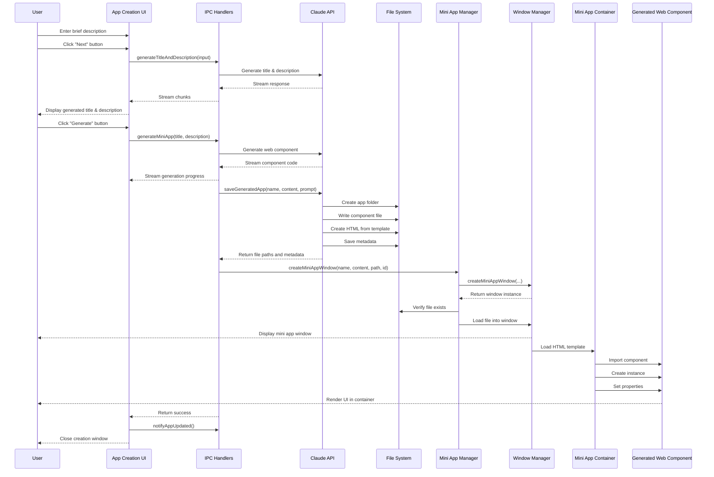

# Mini Application Creation Flow

This document provides a comprehensive overview of the mini application creation process in Lahat, including the technical flow, key components, and implementation details.

## Introduction

Lahat's mini application system allows users to create self-contained web component applications through a simple, guided process. The system leverages Claude AI to generate both the application metadata (title and description) and the complete application code based on a brief user description.

The mini application system uses web components, providing several advantages:
- **Modularity**: Each mini app is a self-contained component
- **Encapsulation**: Shadow DOM provides style and DOM isolation
- **Standardization**: Based on web standards for better maintainability
- **Consistency**: Uniform container and behavior across all mini apps

## Sequence Diagram

The following sequence diagram illustrates the complete mini application creation flow, from initial user input to the display of the generated application:



## Key Components

### App Creation UI
The user interface that guides users through the mini app creation process. It consists of a two-step wizard:
1. **Step 1**: User enters a brief description of the desired app
2. **Step 2**: User reviews the generated title and description before initiating app generation

### IPC Handlers
Manages communication between the renderer process (UI) and the main process. Key handlers include:
- `generateTitleAndDescription`: Generates a title and description based on user input
- `generateMiniApp`: Generates the complete mini app based on the title and description
- `openMiniApp`: Opens an existing mini app
- `updateMiniApp`: Updates an existing mini app with new content

### Claude Client
Interfaces with the Claude API to generate content. Key methods include:
- `generateApp`: Sends a prompt to Claude and receives the generated component code
- `saveGeneratedApp`: Saves the generated app to the file system
- `updateGeneratedApp`: Updates an existing app with new content

### Mini App Manager
Manages the creation and lifecycle of mini app windows. Key functions include:
- `createMiniAppWindow`: Creates a new window for a mini app
- `openMiniApp`: Opens an existing mini app
- `updateMiniApp`: Updates an existing mini app
- `closeMiniApp`: Closes a mini app window

### Mini App Container
A web component that serves as a container for mini apps. It provides:
- A standardized environment for mini apps
- Methods for loading and unloading components
- Error handling and lifecycle management

### Generated Web Component
The actual mini app code generated by Claude. Each mini app is a web component that:
- Extends HTMLElement
- Uses Shadow DOM for encapsulation
- Contains all necessary HTML, CSS, and JavaScript

## Technical Implementation Details

### Claude API Integration

The system uses the Anthropic Claude API to generate both the title/description and the complete mini app component. The process involves:

1. **System Prompt**: A carefully crafted system prompt guides Claude to generate a self-contained web component:
   ```javascript
   this.systemPrompt = `You are an expert web developer specializing in creating self-contained web components using JavaScript. When given a description of an application, you will generate a complete, functional web component implementation.

   IMPORTANT GUIDELINES:
   1. Your response must be a SINGLE JavaScript file that defines a web component class extending HTMLElement.
   2. The web component must use Shadow DOM for encapsulation.
   3. All CSS must be included within the component using a <style> tag in the shadow DOM.
   4. All functionality must be self-contained within the component class.
   5. The component must be fully functional without any external dependencies or network requests.
   6. Use modern JavaScript (ES6+) and CSS features.
   7. Ensure the UI is clean, intuitive, and responsive.
   8. Include appropriate error handling and user feedback.
   9. Add comments to explain complex logic or functionality.
   10. The component will be loaded in a container that already has a draggable region at the top, so you don't need to add one.`;
   ```

2. **Streaming Responses**: The system uses Claude's streaming API to provide real-time feedback during generation:
   ```javascript
   for await (const streamEvent of response) {
     if (streamEvent.type === 'content_block_delta' && streamEvent.delta.type === 'text_delta') {
       htmlContent += streamEvent.delta.text || '';
       event.sender.send('generation-chunk', {
         content: streamEvent.delta.text || '',
         done: false
       });
     }
   }
   ```

### Web Component Creation and Loading

The mini app is generated as a web component and loaded into a container:

1. **Component Generation**: Claude generates a JavaScript class that extends HTMLElement
2. **File Creation**: The system saves the component to a JavaScript file
3. **HTML Template**: A standard HTML template is used to load the component:
   ```html
   <!DOCTYPE html>
   <html lang="en">
   <head>
     <meta charset="UTF-8">
     <title>Mini App</title>
     <!-- Security and styling -->
   </head>
   <body>
     <div class="drag-region"></div>
     <mini-app-container id="app-container"></mini-app-container>
     
     <script type="module">
       import { MiniAppContainer } from '../components/mini-app/mini-app-container.js';
       import { MINI_APP_COMPONENT } from './MINI_APP_PATH';
       
       document.addEventListener('DOMContentLoaded', () => {
         const container = document.getElementById('app-container');
         container.loadComponent(MINI_APP_COMPONENT);
       });
     </script>
   </body>
   </html>
   ```

4. **Component Loading**: The MiniAppContainer loads the component:
   ```javascript
   loadComponent(ComponentClass, props = {}) {
     // Store reference to the component class
     this._loadedComponent = ComponentClass;
     
     // Get the content container
     const contentContainer = this.$('.mini-app-content');
     
     // Clear any existing content
     contentContainer.innerHTML = '';
     
     try {
       // Register the component if it's not already registered
       const tagName = this._getTagNameFromClass(ComponentClass);
       
       if (!customElements.get(tagName)) {
         customElements.define(tagName, ComponentClass);
       }
       
       // Create an instance of the component
       const instance = document.createElement(tagName);
       this._componentInstance = instance;
       
       // Set props if provided
       Object.entries(props).forEach(([key, value]) => {
         if (typeof instance.setProp === 'function') {
           instance.setProp(key, value);
         } else {
           // Fallback for non-BaseComponent components
           instance[key] = value;
         }
       });
       
       // Add the component to the container
       contentContainer.appendChild(instance);
       
       return instance;
     } catch (error) {
       console.error('Error loading component:', error);
       this.handleError(error);
       return null;
     }
   }
   ```

### File System Operations

The system performs several file system operations during the mini app creation process:

1. **App Storage Directory**: Mini apps are stored in a dedicated directory:
   ```javascript
   this.appStoragePath = path.join(app.getPath('userData'), 'generated-apps');
   ```

2. **Folder Structure**: Each mini app has its own folder with the following structure:
   ```
   app_name_timestamp/
   ├── index.html              // Main HTML file
   ├── metadata.json           // App metadata
   ├── components/             // Component directory
   │   └── app-component.js    // Generated component
   └── assets/                 // Assets directory
   ```

3. **Versioning**: When updating a mini app, a new version is created:
   ```javascript
   // Create a new version
   const timestamp = Date.now();
   const versionNumber = metadata.versions.length + 1;
   
   // Create version-specific filenames
   const versionHtmlFilename = `v${versionNumber}.html`;
   const versionComponentFilename = `${safeAppName}-component-v${versionNumber}.js`;
   ```

## Error Handling and Edge Cases

The mini app creation system includes comprehensive error handling:

### Input Validation
- Empty input is prevented with validation checks
- Input is sanitized before sending to Claude

### API Error Handling
- Errors from the Claude API are caught and reported to the user
- Network issues are handled gracefully with appropriate error messages

### File System Error Handling
- File read/write errors are caught and reported
- Missing files or directories are handled with appropriate fallbacks

### Component Loading Errors
- Errors during component loading are caught by the MiniAppContainer
- The container provides error feedback to the user

### Recovery Mechanisms
- The UI returns to the appropriate state on error
- Temporary files are cleaned up on error
- Users can retry failed operations

## Performance Considerations

### Streaming Response Handling
The system uses streaming responses from Claude to provide real-time feedback:
- Progress is shown to the user as content is generated
- The UI updates incrementally as chunks are received
- This creates a more responsive user experience

### Optimizations
- Component registration is only performed if the component is not already registered
- Files are only read when necessary
- Windows are reused when possible

## Security Considerations

### Content Security Policy
The mini app HTML template includes a strict Content Security Policy:
```html
<meta http-equiv="Content-Security-Policy" 
      content="default-src 'self';
               script-src 'self';
               style-src 'self' 'unsafe-inline';
               connect-src 'self';
               img-src 'self';
               font-src 'self';
               object-src 'none';
               base-uri 'none';
               form-action 'none';">
```

This policy:
- Restricts script sources to the same origin
- Allows inline styles (necessary for Shadow DOM)
- Prevents loading resources from external sources
- Disables potentially dangerous features

### Isolation
Mini apps are isolated from the main application and from each other through:
- Shadow DOM encapsulation
- Separate window contexts
- Strict CSP policies

## Future Enhancements

### Component Library
Create a library of common components that mini apps can use:
- UI components (buttons, inputs, etc.)
- Utility components (data visualization, etc.)
- Layout components

### State Management
Add a standardized state management system:
- Persistent storage for mini apps
- State synchronization between mini apps
- Undo/redo functionality

### Communication API
Allow mini apps to communicate with each other and with the main application:
- Event-based communication
- Shared data stores
- Service discovery

### Enhanced Templates
Provide more sophisticated templates for common app types:
- Games
- Productivity tools
- Data visualization
- Educational tools

### Accessibility Improvements
Ensure all mini apps are accessible by default:
- ARIA attributes
- Keyboard navigation
- Screen reader support
- High contrast modes
